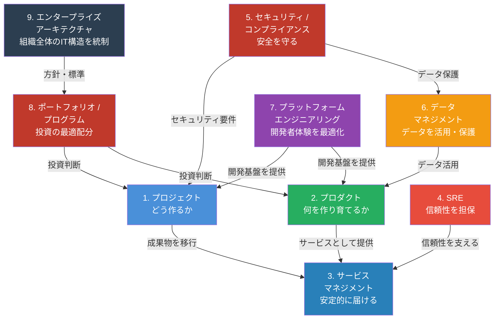

# ソフトウェア・システム・サービスに関わる管理

> ソフトウェア・システム・サービスの管理を **9つの視点** から包括的に整理したナレッジベース

| #   | 視点                                 | 中心的な問い                                  | 代表的フレームワーク        | ファイル                                                           | 状態     |
| --- | ------------------------------------ | --------------------------------------------- | --------------------------- | ------------------------------------------------------------------ | -------- |
| 1   | **プロジェクト**                     | どうやって作るか？                            | PMBOK, PRINCE2              | [project-process-map.md](./project-process-map.md)                 | 作成済み |
| 2   | **プロダクト**                       | 何を作り、どう育てるか？                      | Lean, Inspired (Cagan)      | [product-lifecycle-map.md](./product-lifecycle-map.md)             | 作成済み |
| 3   | **サービスマネジメント**             | どう安定的にサービスを届け続けるか？          | ITIL 4, ITSM                | [service-management-map.md](./service-management-map.md)           | 作成済み |
| 4   | **SRE / 信頼性エンジニアリング**     | どうシステムの信頼性を担保するか？            | Google SRE, SLI/SLO/SLA     | [sre-reliability-map.md](./sre-reliability-map.md)                 | 作成済み |
| 5   | **セキュリティ / コンプライアンス**  | どう安全を守り、法規制に準拠するか？          | ISMS (ISO27001), NIST, SOC2 | [security-compliance-map.md](./security-compliance-map.md)         | 作成済み |
| 6   | **データマネジメント**               | データをどう管理・活用・保護するか？          | DMBOK, データガバナンス     | [data-management-map.md](./data-management-map.md)                 | 作成済み |
| 7   | **プラットフォームエンジニアリング** | 開発者体験をどう最適化するか？                | Team Topologies, IDP        | [platform-engineering-map.md](./platform-engineering-map.md)       | 作成済み |
| 8   | **ポートフォリオ / プログラム**      | 複数プロダクト/プロジェクトをどう統括するか？ | SAFe, PfM, PgM              | [portfolio-program-map.md](./portfolio-program-map.md)             | 作成済み |
| 9   | **エンタープライズアーキテクチャ**   | 組織全体のIT構造をどう統制するか？            | TOGAF, Zachman              | [enterprise-architecture-map.md](./enterprise-architecture-map.md) | 作成済み |

## 9つの視点の関係性

## 各ドキュメントの構成

各マップは以下の統一構造で記述されています：

- **全体フロー**（Mermaid図）— 工程の流れと関係性を一目で把握
- **他視点との比較** — この視点の特徴を明確にする対比表
- **工程ごとのセクション** — 各工程について以下を記述：
  - 目的
  - タスク一覧（テーブル形式）
  - リソース一覧（人・物・金のカテゴリ）
  - 成果物一覧（必須/任意の区分付き）
- **横断的な視点** — 他の8つの視点との連携ポイント
