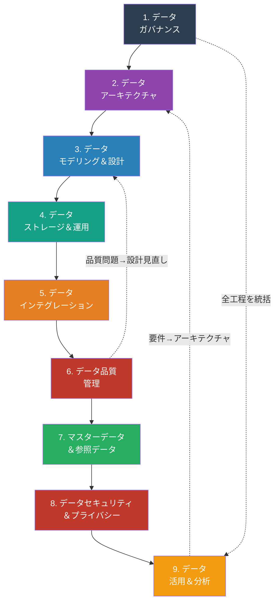
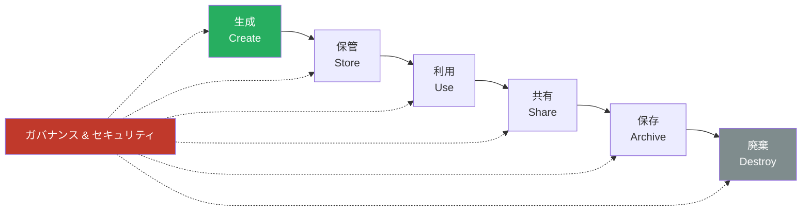
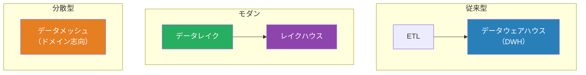
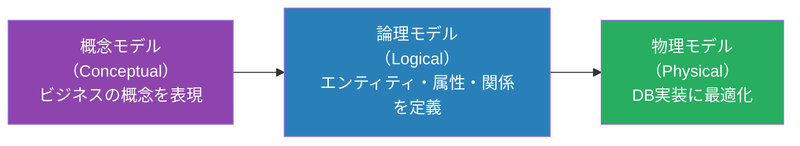
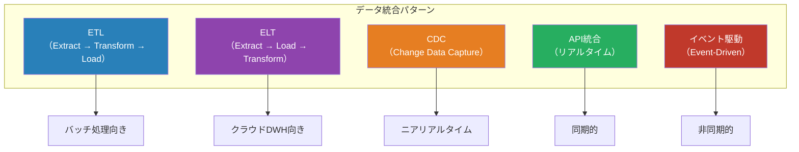
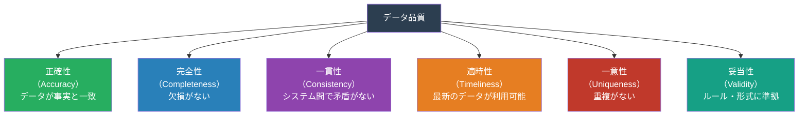
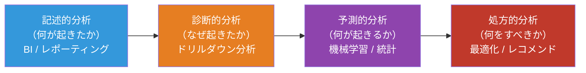
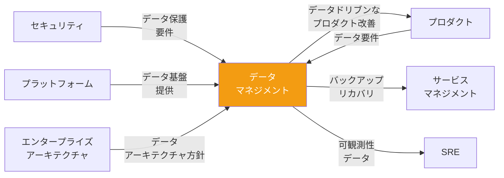

# データマネジメントマップ — 「データをどう管理・活用・保護するか」

> データは組織の重要資産。**データの品質・可用性・安全性を担保**しながら、
> ビジネス価値を最大化するための工程・タスク・リソースを、DMBOK（Data Management Body of Knowledge）をベースに網羅的に整理したもの

## 他の視点との根本的な違い

| 観点     | プロジェクト | プロダクト   | セキュリティ | データマネジメント                 |
| -------- | ------------ | ------------ | ------------ | ---------------------------------- |
| ゴール   | 成果物を納品 | 価値を届ける | リスクを制御 | データの価値を最大化しつつ保護する |
| 対象     | プロジェクト | プロダクト   | 脅威と脆弱性 | データのライフサイクル全体         |
| 成功指標 | QCD          | アウトカム   | リスク低減率 | データ品質・活用度・準拠率         |
| 中心人物 | PM           | PdM          | CISO         | CDO / データスチュワード           |

## DMBOK データマネジメント全体像

## データライフサイクル

## 1. データガバナンス

### 目的

データに関する意思決定の権限と責任を明確にし、データが組織全体で**一貫性をもって管理される体制**を構築する。

### タスク一覧

| #   | タスク                     | 説明                                           |
| --- | -------------------------- | ---------------------------------------------- |
| 1   | データガバナンス方針策定   | データ管理の基本方針・原則の文書化             |
| 2   | データオーナーシップ定義   | 各データドメインのオーナー（Data Owner）の任命 |
| 3   | データスチュワード任命     | 日常的なデータ品質管理の担当者配置             |
| 4   | データ標準策定             | 命名規則、コード体系、分類体系の統一           |
| 5   | データカタログ構築         | メタデータの集約管理、データの発見可能性向上   |
| 6   | データリネージ管理         | データの出所・変換過程・利用先の追跡           |
| 7   | データガバナンス委員会運営 | 組織横断的なデータ方針の決定機関               |
| 8   | データ関連KPI設定          | データ品質・活用度の測定指標                   |

### リソース

| カテゴリ | リソース                | 備考                                     |
| -------- | ----------------------- | ---------------------------------------- |
| **人**   | CDO（最高データ責任者） | データ戦略の最終責任者                   |
| **人**   | データスチュワード      | 各領域のデータ品質管理                   |
| **人**   | データオーナー          | ビジネス側のデータ責任者                 |
| **物**   | データカタログツール    | Atlan, Alation, DataHub, OpenMetadata 等 |
| **物**   | データリネージツール    | Apache Atlas, dbt lineage 等             |
| **物**   | メタデータ管理          | データカタログに統合                     |
| **金**   | ガバナンスツール費      | カタログ・リネージツール等               |

### 成果物

| 成果物                         | 形式             | 必須/任意 |
| ------------------------------ | ---------------- | --------- |
| データガバナンス方針           | ドキュメント     | 必須      |
| データオーナーシップマトリクス | スプレッドシート | 必須      |
| データ標準・命名規則           | ドキュメント     | 必須      |
| データカタログ                 | ツール / Wiki    | 必須      |
| データリネージ図               | 図表             | 必須      |

## 2. データアーキテクチャ

### 目的

組織全体のデータの構造・フロー・統合方式を設計し、データ活用の**技術的基盤**を整える。

### データアーキテクチャパターン

### タスク一覧

| #   | タスク                       | 説明                                                   |
| --- | ---------------------------- | ------------------------------------------------------ |
| 1   | データアーキテクチャ戦略策定 | DWH / データレイク / レイクハウス / メッシュの選定     |
| 2   | データフロー設計             | データの流れ（Source→Ingestion→Transform→Serve）の設計 |
| 3   | データプラットフォーム選定   | クラウドDWH（BigQuery, Snowflake, Redshift等）の選定   |
| 4   | データモデリング方針策定     | 正規化/非正規化、Star Schema、Data Vault等の方針       |
| 5   | リアルタイム / バッチの設計  | ストリーミング処理とバッチ処理の使い分け               |
| 6   | データインフラのIaC化        | データ基盤のコード管理                                 |

### リソース

| カテゴリ | リソース           | 備考                             |
| -------- | ------------------ | -------------------------------- |
| **人**   | データアーキテクト | データ基盤全体の設計             |
| **人**   | データエンジニア   | データパイプラインの構築         |
| **物**   | クラウドDWH        | BigQuery, Snowflake, Redshift 等 |
| **物**   | データレイク       | S3, GCS, ADLS 等                 |
| **物**   | ストリーミング基盤 | Kafka, Kinesis, Pub/Sub 等       |
| **金**   | データ基盤費用     | ストレージ・コンピュート費用     |

### 成果物

| 成果物                 | 形式         | 必須/任意 |
| ---------------------- | ------------ | --------- |
| データアーキテクチャ図 | 図表         | 必須      |
| データフロー図         | 図表         | 必須      |
| プラットフォーム選定書 | ドキュメント | 必須      |
| データモデリング方針   | ドキュメント | 必須      |

## 3. データモデリング＆設計

### 目的

ビジネスの要件を反映した**論理的・物理的なデータ構造**を設計する。

### モデリングの3段階

### タスク一覧

| #   | タスク                 | 説明                                                 |
| --- | ---------------------- | ---------------------------------------------------- |
| 1   | 概念データモデル作成   | ビジネスエンティティとその関係をハイレベルで表現     |
| 2   | 論理データモデル作成   | エンティティ・属性・リレーションシップの詳細定義     |
| 3   | 物理データモデル作成   | テーブル・カラム・インデックス・パーティションの設計 |
| 4   | 正規化 / 非正規化判断  | パフォーマンスと保守性のトレードオフ                 |
| 5   | データ辞書作成         | 各項目の定義・型・制約・ビジネスルールの文書化       |
| 6   | スキーマバージョン管理 | マイグレーション戦略の設計                           |

### リソース

| カテゴリ | リソース               | 備考                                 |
| -------- | ---------------------- | ------------------------------------ |
| **人**   | データモデラー         | モデリングの専門家                   |
| **人**   | DBA                    | 物理設計の最適化                     |
| **人**   | ビジネスアナリスト     | ビジネス要件の提供                   |
| **物**   | モデリングツール       | ER/Studio, dbdiagram.io, ERDPlus 等  |
| **物**   | マイグレーションツール | Flyway, Liquibase, Prisma Migrate 等 |

### 成果物

| 成果物               | 形式                    | 必須/任意 |
| -------------------- | ----------------------- | --------- |
| 概念データモデル     | ER図                    | 必須      |
| 論理データモデル     | ER図                    | 必須      |
| 物理データモデル     | DDL / ER図              | 必須      |
| データ辞書           | スプレッドシート / Wiki | 必須      |
| マイグレーション計画 | ドキュメント / コード   | 必須      |

## 4. データストレージ＆運用

### 目的

データを**安全・高性能・コスト効率よく**保管し、運用する。

### タスク一覧

| #   | タスク                     | 説明                                                     |
| --- | -------------------------- | -------------------------------------------------------- |
| 1   | データベース選定           | RDBMS / NoSQL / NewSQL / 時系列DB等の選定                |
| 2   | ストレージ設計             | パーティショニング・シャーディング・レプリケーション戦略 |
| 3   | バックアップ＆リカバリ設計 | RPO/RTOに基づくバックアップ戦略                          |
| 4   | パフォーマンスチューニング | クエリ最適化・インデックス戦略・キャッシング             |
| 5   | データ保持ポリシー策定     | データのライフサイクル管理（Hot/Warm/Cold/Archive）      |
| 6   | データベース監視           | パフォーマンスメトリクス・アラートの設定                 |
| 7   | 容量計画                   | データ増加予測に基づくストレージ計画                     |

### リソース

| カテゴリ | リソース               | 備考                                     |
| -------- | ---------------------- | ---------------------------------------- |
| **人**   | DBA                    | データベース運用管理                     |
| **人**   | データエンジニア       | パイプライン・ストレージ管理             |
| **物**   | RDBMS                  | PostgreSQL, MySQL, Oracle, SQL Server 等 |
| **物**   | NoSQL                  | MongoDB, DynamoDB, Cassandra 等          |
| **物**   | クラウドストレージ     | S3, GCS, Azure Blob 等                   |
| **金**   | データベースライセンス | 商用DB利用時                             |
| **金**   | ストレージ費用         | データ量に比例                           |

### 成果物

| 成果物                     | 形式             | 必須/任意 |
| -------------------------- | ---------------- | --------- |
| DB選定書                   | ドキュメント     | 必須      |
| バックアップ計画書         | ドキュメント     | 必須      |
| データ保持ポリシー         | ドキュメント     | 必須      |
| パフォーマンスベースライン | レポート         | 必須      |
| 容量計画書                 | スプレッドシート | 必須      |

## 5. データインテグレーション＆相互運用性

### 目的

異なるシステム間でデータを**正確・適時に連携**し、データの一貫性を確保する。

### データ統合パターン

### タスク一覧

| #   | タスク                      | 説明                                       |
| --- | --------------------------- | ------------------------------------------ |
| 1   | データソースの特定・接続    | 全データソースの洗い出しと接続方式の設計   |
| 2   | ETL / ELT パイプライン構築  | データの抽出・変換・ロードの自動化         |
| 3   | CDC導入                     | データベース変更のリアルタイムキャプチャ   |
| 4   | API統合設計                 | RESTful / GraphQL によるデータ連携         |
| 5   | データ変換ロジック実装      | マッピング・クレンジング・エンリッチメント |
| 6   | パイプライン監視            | データフローの健全性監視・アラート         |
| 7   | データ契約（Data Contract） | システム間のデータ品質・スキーマの合意     |

### リソース

| カテゴリ | リソース                       | 備考                               |
| -------- | ------------------------------ | ---------------------------------- |
| **人**   | データエンジニア               | パイプラインの設計・構築           |
| **人**   | インテグレーションアーキテクト | 統合方式の設計                     |
| **物**   | ETL / ELT ツール               | dbt, Airflow, Fivetran, Airbyte 等 |
| **物**   | CDC ツール                     | Debezium, AWS DMS 等               |
| **物**   | メッセージブローカー           | Kafka, RabbitMQ, Pub/Sub 等        |
| **金**   | ツールライセンス費             | 商用ETLツール等                    |

### 成果物

| 成果物                         | 形式                            | 必須/任意 |
| ------------------------------ | ------------------------------- | --------- |
| データ統合アーキテクチャ図     | 図表                            | 必須      |
| パイプライン定義（DAG等）      | コード                          | 必須      |
| データマッピング仕様書         | スプレッドシート / ドキュメント | 必須      |
| データ契約（Data Contract）    | YAML / ドキュメント             | 推奨      |
| パイプライン監視ダッシュボード | ダッシュボード                  | 必須      |

## 6. データ品質管理

### 目的

データが**正確・完全・一貫性があり・適時**であることを保証する。

### データ品質の6つの次元

### タスク一覧

| #   | タスク                   | 説明                                             |
| --- | ------------------------ | ------------------------------------------------ |
| 1   | データ品質ルール定義     | ビジネスルールに基づくバリデーションルールの策定 |
| 2   | データプロファイリング   | データの統計的分析による品質状況の把握           |
| 3   | データ品質測定           | 各品質次元のスコアリング                         |
| 4   | データクレンジング       | 不正・不完全データの修正・補完                   |
| 5   | データ品質監視           | 継続的な品質チェックの自動化                     |
| 6   | データ品質ダッシュボード | 品質スコアの可視化                               |
| 7   | 根本原因分析             | 品質問題の発生源の特定・対策                     |

### リソース

| カテゴリ | リソース                     | 備考                                   |
| -------- | ---------------------------- | -------------------------------------- |
| **人**   | データスチュワード           | データ品質の日常管理                   |
| **人**   | データエンジニア             | 品質チェックの実装                     |
| **物**   | データ品質ツール             | Great Expectations, Soda, dbt tests 等 |
| **物**   | データプロファイリングツール | ydata-profiling, dbt 等                |
| **金**   | 品質ツール費                 | 商用ツール利用時                       |

### 成果物

| 成果物                   | 形式                  | 必須/任意 |
| ------------------------ | --------------------- | --------- |
| データ品質ルール定義書   | ドキュメント / コード | 必須      |
| データ品質レポート       | レポート（定期）      | 必須      |
| データ品質ダッシュボード | ダッシュボード        | 必須      |
| クレンジング手順書       | ドキュメント          | 必須      |

## 7. マスターデータ＆参照データ管理

### 目的

組織全体で**共通的に使うデータ**（顧客マスタ、商品マスタ等）の一元管理と品質を確保する。

### タスク一覧

| #   | タスク                 | 説明                                                            |
| --- | ---------------------- | --------------------------------------------------------------- |
| 1   | マスターデータの特定   | 組織のマスターデータエンティティの洗い出し                      |
| 2   | ゴールデンレコード設計 | 信頼できる唯一のデータソース（Single Source of Truth）の定義    |
| 3   | MDMアーキテクチャ選定  | Registry / Consolidation / Coexistence / Centralized 方式の選定 |
| 4   | マスターデータ統合     | 重複排除・名寄せ（Entity Resolution）                           |
| 5   | 参照データ管理         | コードテーブル、分類体系の一元管理                              |
| 6   | マスターデータ配信     | 各システムへのマスターデータの同期                              |

### リソース

| カテゴリ | リソース           | 備考                                 |
| -------- | ------------------ | ------------------------------------ |
| **人**   | MDM管理者          | マスターデータの統括                 |
| **人**   | データスチュワード | ドメインごとのデータ品質管理         |
| **物**   | MDMツール          | Informatica MDM, Reltio, Talend 等   |
| **物**   | 名寄せツール       | Dedupe, Entity Resolution ライブラリ |

### 成果物

| 成果物                  | 形式                        | 必須/任意 |
| ----------------------- | --------------------------- | --------- |
| マスターデータ一覧      | スプレッドシート / カタログ | 必須      |
| MDMアーキテクチャ設計書 | ドキュメント / 図表         | 必須      |
| ゴールデンレコード定義  | ドキュメント                | 必須      |
| 参照データ管理台帳      | スプレッドシート            | 必須      |

## 8. データセキュリティ＆プライバシー

### 目的

データを**不正アクセス・漏洩・改ざんから保護**し、プライバシー規制に準拠する。

### タスク一覧

| #   | タスク                           | 説明                                           |
| --- | -------------------------------- | ---------------------------------------------- |
| 1   | データ分類                       | 機密度（Confidential/Internal/Public等）の分類 |
| 2   | アクセス制御設計                 | RBAC / ABAC / 行レベル・列レベルセキュリティ   |
| 3   | データ暗号化                     | at-rest / in-transit の暗号化実装              |
| 4   | データマスキング                 | テスト環境・分析環境での個人情報マスキング     |
| 5   | 匿名化 / 仮名化                  | プライバシー保護のためのデータ変換             |
| 6   | プライバシー影響評価（PIA/DPIA） | 新システム導入時のプライバシーリスク評価       |
| 7   | データ主体の権利対応             | アクセス権・削除権・ポータビリティ等への対応   |
| 8   | 監査ログ管理                     | データアクセスの追跡・記録                     |

### リソース

| カテゴリ | リソース                     | 備考                                         |
| -------- | ---------------------------- | -------------------------------------------- |
| **人**   | DPO（データ保護責任者）      | プライバシー保護の責任者                     |
| **人**   | データセキュリティエンジニア | 技術的保護策の実装                           |
| **物**   | データマスキングツール       | Delphix, Informatica Dynamic Data Masking 等 |
| **物**   | DLP（データ損失防止）ツール  | Microsoft Purview, Symantec DLP 等           |
| **金**   | プライバシーツール費         | 商用ツール利用時                             |

### 成果物

| 成果物                     | 形式             | 必須/任意                |
| -------------------------- | ---------------- | ------------------------ |
| データ分類ポリシー         | ドキュメント     | 必須                     |
| アクセス制御マトリクス     | スプレッドシート | 必須                     |
| PIA / DPIA レポート        | レポート         | 必須（個人データ処理時） |
| データ処理活動記録（ROPA） | スプレッドシート | 必須（GDPR対象時）       |
| 暗号化方針                 | ドキュメント     | 必須                     |

## 9. データ活用＆分析

### 目的

データを**ビジネスの意思決定と価値創造**に活用する。データドリブンな組織を実現する。

### データ活用の成熟度

### タスク一覧

| #   | タスク                   | 説明                                            |
| --- | ------------------------ | ----------------------------------------------- |
| 1   | BIダッシュボード構築     | ビジネスKPIの可視化・セルフサービスBI           |
| 2   | アドホック分析環境整備   | データアナリストが自由に分析できる環境          |
| 3   | データサイエンス基盤構築 | MLモデルの学習・デプロイ環境                    |
| 4   | データリテラシー向上     | 組織全体のデータ活用スキル向上                  |
| 5   | データプロダクト開発     | データを使った価値提供（API, ダッシュボード等） |
| 6   | A/Bテスト基盤構築        | データに基づく意思決定のための実験基盤          |
| 7   | MLOps体制構築            | 機械学習モデルのライフサイクル管理              |

### リソース

| カテゴリ | リソース               | 備考                                   |
| -------- | ---------------------- | -------------------------------------- |
| **人**   | データアナリスト       | BI・アドホック分析                     |
| **人**   | データサイエンティスト | ML・統計分析                           |
| **人**   | MLエンジニア           | MLモデルの本番運用                     |
| **物**   | BIツール               | Looker, Tableau, Metabase, Superset 等 |
| **物**   | ノートブック環境       | Jupyter, Databricks Notebooks 等       |
| **物**   | MLプラットフォーム     | MLflow, SageMaker, Vertex AI 等        |
| **金**   | BIツールライセンス     | ユーザー数に比例                       |
| **金**   | ML基盤費用             | GPU等のコンピュート費用                |

### 成果物

| 成果物                 | 形式                    | 必須/任意 |
| ---------------------- | ----------------------- | --------- |
| BIダッシュボード       | ダッシュボード          | 必須      |
| 分析レポート           | レポート                | 必須      |
| MLモデル               | コード / モデルファイル | 任意      |
| データプロダクト仕様書 | ドキュメント            | 任意      |
| A/Bテスト結果          | レポート                | 任意      |

## 横断的な視点 — 他視点との関係

### 重要な連携ポイント

| 連携先               | データマネジメントとの関係                             |
| -------------------- | ------------------------------------------------------ |
| プロダクト           | データ活用によるプロダクト改善。分析基盤の提供         |
| サービスマネジメント | データのバックアップ・リカバリ運用                     |
| SRE                  | メトリクス・ログ・トレースの管理。可観測性データの品質 |
| セキュリティ         | データ分類・暗号化・アクセス制御。プライバシー保護     |
| プラットフォーム     | データ基盤（DWH、レイク、パイプライン）の提供          |
| EA                   | 全体データアーキテクチャの方針・標準化                 |
