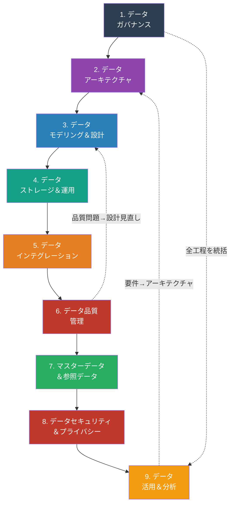
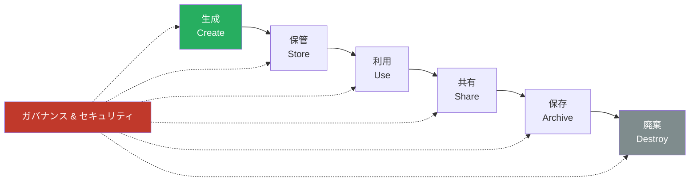
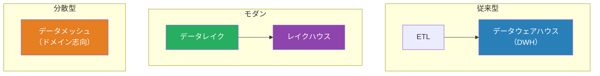
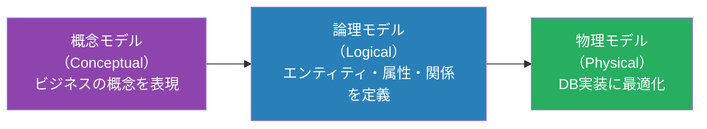
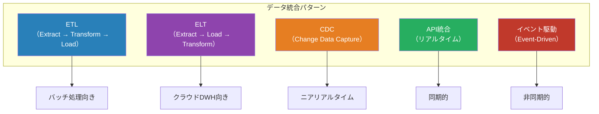
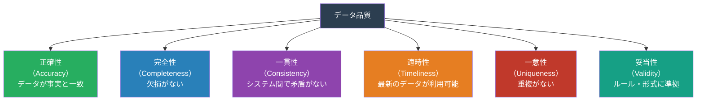
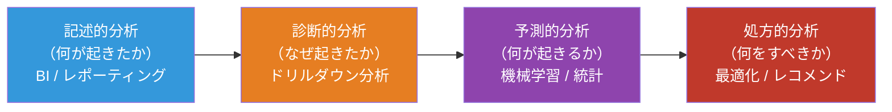
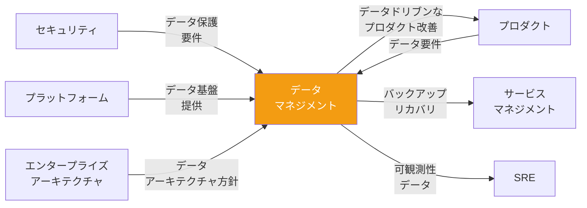

# データマネジメントマップ — 「データをどう管理・活用・保護するか」

> データは組織の重要資産。**データの品質・可用性・安全性を担保**しながら、
> ビジネス価値を最大化するための工程・タスク・リソースを、DMBOK（Data Management Body of Knowledge）をベースに網羅的に整理したもの

### ドキュメントの読み方

このドキュメントは、データマネジメントの全体像を9つの領域に分けて、それぞれの目的・タスク・リソース・成果物を示しています。各セクションは独立していますが、実装時には複数の領域を並行して進めることになります。自組織の状況に合わせて、優先度の高い領域から段階的に取り組むことを推奨します。また、下部の「横断的な視点」では、他の経営関数（プロダクト、セキュリティ、プラットフォーム等）との連携を示していますので、あわせて参考にしてください。

## 他の視点との根本的な違い

| 観点     | プロジェクト | プロダクト   | セキュリティ | データマネジメント                 |
| -------- | ------------ | ------------ | ------------ | ---------------------------------- |
| ゴール   | 成果物を納品 | 価値を届ける | リスクを制御 | データの価値を最大化しつつ保護する |
| 対象     | プロジェクト | プロダクト   | 脅威と脆弱性 | データのライフサイクル全体         |
| 成功指標 | QCD          | アウトカム   | リスク低減率 | データ品質・活用度・準拠率         |
| 中心人物 | PM           | PdM          | CISO         | CDO / データスチュワード           |

## DMBOK データマネジメント全体像

次の図は、データマネジメント活動を9つの領域に分類し、その実施順序と相互関係を示しています。基本的には1→9の順序で進みますが、データ品質問題が見つかれば設計に立ち戻り、分析で新たなデータ要件が出れば基盤の改善を行うなど、実際には複数の領域が相互に影響し合う循環的なプロセスになります。

## データライフサイクル

上の図は、データの「生成から廃棄」までのライフサイクルを表しています。データ品質・セキュリティ・コンプライアンスの要件は、この全ての段階に適用される必要があります。つまり、生成時点での品質ルール定義から廃棄時の確実な削除まで、ライフサイクル全体を通じてガバナンスを貫徹することが重要です。

## 1. データガバナンス

### 目的

データに関する意思決定の権限と責任を明確にし、データが組織全体で**一貫性をもって管理される体制**を構築する。

ガバナンスは、後続する8つの領域（アーキテクチャ、設計、品質等）が効率よく機能するための土台となります。「誰がデータの責任を持つのか」「どんなルールで管理するのか」が定まっていなければ、個別のプロジェクトごとにばらばらな対応が行われ、全社的なデータ活用は実現できません。最初に全体の方針と体制を整備することで、以降の各領域がより円滑に進められます。

### タスク一覧

ガバナンスのタスクは「組織横断的な体制・ポリシー構築」に特化しており、他フェーズより政治的・合意形成スキルが求められます。データオーナーシップの定義、カタログ・リネージの整備を通じて、以降の全工程が準拠すべき「羅針盤」を引きます。

| #   | タスク                     | 説明                                           |
| --- | -------------------------- | ---------------------------------------------- |
| 1   | データガバナンス方針策定   | データ管理の基本方針・原則の文書化             |
| 2   | データオーナーシップ定義   | 各データドメインのオーナー（Data Owner）の任命 |
| 3   | データスチュワード任命     | 日常的なデータ品質管理の担当者配置             |
| 4   | データ標準策定             | 命名規則、コード体系、分類体系の統一           |
| 5   | データカタログ構築         | メタデータの集約管理、データの発見可能性向上   |
| 6   | データリネージ管理         | データの出所・変換過程・利用先の追跡           |
| 7   | データガバナンス委員会運営 | 組織横断的なデータ方針の決定機関               |
| 8   | データ関連KPI設定          | データ品質・活用度の測定指標                   |

### リソース

初期段階ではCDOやデータスチュワードなど、人的リソースの比重が高く、組織横断的なコミュニケーション能力が重要です。後続フェーズでは技術スキルの割合が増しますが、ガバナンス段階では「体制構築」「ルール策定」に注力する必要があります。

| カテゴリ | リソース                | 備考                                     |
| -------- | ----------------------- | ---------------------------------------- |
| **人**   | CDO（最高データ責任者） | データ戦略の最終責任者                   |
| **人**   | データスチュワード      | 各領域のデータ品質管理                   |
| **人**   | データオーナー          | ビジネス側のデータ責任者                 |
| **物**   | データカタログツール    | Atlan, Alation, DataHub, OpenMetadata 等 |
| **物**   | データリネージツール    | Apache Atlas, dbt lineage 等             |
| **物**   | メタデータ管理          | データカタログに統合                     |
| **金**   | ガバナンスツール費      | カタログ・リネージツール等               |

### 成果物

ここで整備された方針・マトリクス・カタログは、全員が参照すべき「シングルソースオブトゥルース」となり、アーキテクチャ設計や品質管理の意思決定の根拠となります。特にデータカタログはメタデータの中心地となり、以降の各フェーズで継続的に更新・参照されます。

| 成果物                         | 形式             | 必須/任意 |
| ------------------------------ | ---------------- | --------- |
| データガバナンス方針           | ドキュメント     | 必須      |
| データオーナーシップマトリクス | スプレッドシート | 必須      |
| データ標準・命名規則           | ドキュメント     | 必須      |
| データカタログ                 | ツール / Wiki    | 必須      |
| データリネージ図               | 図表             | 必須      |

## 2. データアーキテクチャ

### 目的

組織全体のデータの構造・フロー・統合方式を設計し、データ活用の**技術的基盤**を整える。

ガバナンスで定めた方針と要件を実現するためには、それに適した技術基盤が必要です。従来型のデータウェアハウスか、最新のクラウドネイティブなレイクハウスか、あるいはドメイン駆動のメッシュアーキテクチャか——選択はビジネス要件、データ特性、組織の成熟度によって異なります。本セクションで組織に最適なアーキテクチャを定義することで、以降の実装がぶれずに進められます。

### データアーキテクチャパターン

次の図は、データ基盤の主要なアーキテクチャパターンを示しています。各パターンにはそれぞれ得意・不得意があり、組織の規模、データの多様性、リアルタイム性の要求によって最適な選択肢は異なります。

### タスク一覧

アーキテクチャ設計は「長期的な技術戦略」と「実装可能性」のバランスを取る特殊なスキルが必要で、クラウド・オンプレ選択、DWH・レイク・メッシュの判断といった、後続フェーズを大きく左右する決定が行われます。ガバナンスの方針を技術基盤として具現化する橋渡し役です。

| #   | タスク                       | 説明                                                   |
| --- | ---------------------------- | ------------------------------------------------------ |
| 1   | データアーキテクチャ戦略策定 | DWH / データレイク / レイクハウス / メッシュの選定     |
| 2   | データフロー設計             | データの流れ（Source→Ingestion→Transform→Serve）の設計 |
| 3   | データプラットフォーム選定   | クラウドDWH（BigQuery, Snowflake, Redshift等）の選定   |
| 4   | データモデリング方針策定     | 正規化/非正規化、Star Schema、Data Vault等の方針       |
| 5   | リアルタイム / バッチの設計  | ストリーミング処理とバッチ処理の使い分け               |
| 6   | データインフラのIaC化        | データ基盤のコード管理                                 |

### リソース

アーキテクチャ段階では高度な技術判断を行うため、データアーキテクトや外部コンサルタントのような戦略的人材が中心になります。ガバナンスの「ポリシー策定」から一転して、技術スキルと経験に基づく判断ウェイトが大幅に増します。

| カテゴリ | リソース           | 備考                             |
| -------- | ------------------ | -------------------------------- |
| **人**   | データアーキテクト | データ基盤全体の設計             |
| **人**   | データエンジニア   | データパイプラインの構築         |
| **物**   | クラウドDWH        | BigQuery, Snowflake, Redshift 等 |
| **物**   | データレイク       | S3, GCS, ADLS 等                 |
| **物**   | ストリーミング基盤 | Kafka, Kinesis, Pub/Sub 等       |
| **金**   | データ基盤費用     | ストレージ・コンピュート費用     |

### 成果物

ここで作成されたアーキテクチャ図・フロー設計は、次のモデリング・設計フェーズの上位要件となり、実装チームがシステムを構築する際の「物理的な制約条件」を定めます。後続フェーズの各ステップ（データベース選定、ETL設計等）はすべてこの基本設計に準拠します。

| 成果物                 | 形式         | 必須/任意 |
| ---------------------- | ------------ | --------- |
| データアーキテクチャ図 | 図表         | 必須      |
| データフロー図         | 図表         | 必須      |
| プラットフォーム選定書 | ドキュメント | 必須      |
| データモデリング方針   | ドキュメント | 必須      |

## 3. データモデリング＆設計

### 目的

ビジネスの要件を反映した**論理的・物理的なデータ構造**を設計する。

アーキテクチャが「どのような基盤を使うか」という方向性を定めるのに対し、モデリング&設計は「その基盤上にどのようなテーブル・エンティティを作るか」という詳細を決定します。ここでの設計品質は、後続する全ての工程（統合、品質管理、分析）に大きな影響を与えます。ビジネスロジックを正確に反映し、かつ保守・拡張しやすいモデルを設計することが重要です。

### モデリングの3段階

上の図は、データモデルの設計が3つの段階を経ることを示しています。概念モデルではビジネス用語で要件を整理し、論理モデルで実装に近い形に構造化し、物理モデルでパフォーマンスやストレージを最適化します。各段階を丁寧に進めることで、要件の漏れを防ぎ、実装後の手戻りを減らせます。

### タスク一覧

モデリング&設計は「ビジネス要件をデータ構造に翻訳」する最初の具体的な実装段階で、ビジネスアナリスト・データモデラー・DBAの協業が必須です。概念→論理→物理の3段階を丁寧に進めることで、後の品質問題や設計変更を大幅に削減できます。

| #   | タスク                 | 説明                                                 |
| --- | ---------------------- | ---------------------------------------------------- |
| 1   | 概念データモデル作成   | ビジネスエンティティとその関係をハイレベルで表現     |
| 2   | 論理データモデル作成   | エンティティ・属性・リレーションシップの詳細定義     |
| 3   | 物理データモデル作成   | テーブル・カラム・インデックス・パーティションの設計 |
| 4   | 正規化 / 非正規化判断  | パフォーマンスと保守性のトレードオフ                 |
| 5   | データ辞書作成         | 各項目の定義・型・制約・ビジネスルールの文書化       |
| 6   | スキーマバージョン管理 | マイグレーション戦略の設計                           |

### リソース

このフェーズではデータモデラーとDBAの専門知識が中心となり、ビジネス側の要件定義者（BA）との協業も重要です。アーキテクチャ段階から人員構成が大きく変わり、「詳細設計」に特化した専門スキルが求められるようになります。

| カテゴリ | リソース               | 備考                                 |
| -------- | ---------------------- | ------------------------------------ |
| **人**   | データモデラー         | モデリングの専門家                   |
| **人**   | DBA                    | 物理設計の最適化                     |
| **人**   | ビジネスアナリスト     | ビジネス要件の提供                   |
| **物**   | モデリングツール       | ER/Studio, dbdiagram.io, ERDPlus 等  |
| **物**   | マイグレーションツール | Flyway, Liquibase, Prisma Migrate 等 |

### 成果物

ER図とデータ辞書は、ストレージ・運用チームがDDLを実装するための基本ドキュメントであり、かつ分析チームがテーブル構造を理解するための教科書となります。特にデータ辞書は品質管理段階での「正規化ルール」定義の出発点となります。

| 成果物               | 形式                    | 必須/任意 |
| -------------------- | ----------------------- | --------- |
| 概念データモデル     | ER図                    | 必須      |
| 論理データモデル     | ER図                    | 必須      |
| 物理データモデル     | DDL / ER図              | 必須      |
| データ辞書           | スプレッドシート / Wiki | 必須      |
| マイグレーション計画 | ドキュメント / コード   | 必須      |

## 4. データストレージ＆運用

### 目的

データを**安全・高性能・コスト効率よく**保管し、運用する。

モデルの設計が完了したら、その実装をシステムに適切に保管し、運用するフェーズに入ります。ここでは単に「データを入れる場所を用意する」のではなく、バックアップ戦略、パフォーマンス最適化、容量計画、監視といった運用面まで含めた総合的な設計が必要です。特にクラウドの従量課金モデルでは、構成次第でコストが大きく変動するため、初期段階での設計が重要になります。

### タスク一覧

ストレージ＆運用は「非機能要件」（パフォーマンス、可用性、コスト、セキュリティ）に特化した領域で、DBAとデータエンジニアの実装スキルが中心となります。モデリングで定義されたスキーマを物理的に実装し、日々の運用安定性を確保する責務があります。

| #   | タスク                     | 説明                                                     |
| --- | -------------------------- | -------------------------------------------------------- |
| 1   | データベース選定           | RDBMS / NoSQL / NewSQL / 時系列DB等の選定                |
| 2   | ストレージ設計             | パーティショニング・シャーディング・レプリケーション戦略 |
| 3   | バックアップ＆リカバリ設計 | RPO/RTOに基づくバックアップ戦略                          |
| 4   | パフォーマンスチューニング | クエリ最適化・インデックス戦略・キャッシング             |
| 5   | データ保持ポリシー策定     | データのライフサイクル管理（Hot/Warm/Cold/Archive）      |
| 6   | データベース監視           | パフォーマンスメトリクス・アラートの設定                 |
| 7   | 容量計画                   | データ増加予測に基づくストレージ計画                     |

### リソース

DBAが主導的役割を果たし、インフラ・運用チームとの協力も密になります。モデリング段階より実装・運用スキルの比重が高まり、24時間運用監視体制の構築やコスト管理（クラウド従量課金）といった実務的課題への対応が重要になります。

| カテゴリ | リソース               | 備考                                     |
| -------- | ---------------------- | ---------------------------------------- |
| **人**   | DBA                    | データベース運用管理                     |
| **人**   | データエンジニア       | パイプライン・ストレージ管理             |
| **物**   | RDBMS                  | PostgreSQL, MySQL, Oracle, SQL Server 等 |
| **物**   | NoSQL                  | MongoDB, DynamoDB, Cassandra 等          |
| **物**   | クラウドストレージ     | S3, GCS, Azure Blob 等                   |
| **金**   | データベースライセンス | 商用DB利用時                             |
| **金**   | ストレージ費用         | データ量に比例                           |

### 成果物

これらの成果物は、インテグレーション（データ投入）チームと品質管理チームが仕事を始める際の「基盤」となります。特にバックアップ計画書とパフォーマンスベースラインは、後続フェーズでの問題発生時に「正常な状態」を判定するための重要な基準値となります。

| 成果物                     | 形式             | 必須/任意 |
| -------------------------- | ---------------- | --------- |
| DB選定書                   | ドキュメント     | 必須      |
| バックアップ計画書         | ドキュメント     | 必須      |
| データ保持ポリシー         | ドキュメント     | 必須      |
| パフォーマンスベースライン | レポート         | 必須      |
| 容量計画書                 | スプレッドシート | 必須      |

## 5. データインテグレーション＆相互運用性

### 目的

異なるシステム間でデータを**正確・適時に連携**し、データの一貫性を確保する。

現代の企業では、ERP、CRM、BI、顧客データプラットフォームなど、複数のシステムが並行稼働しており、これらの間で正確にデータを連携させることは業務の基盤となります。本セクションでは、単発的なETLバッチ処理から、リアルタイムのイベント駆動まで、様々なデータ統合パターンを組み合わせ、トータルなデータフロー戦略を構築します。

### データ統合パターン

上の図は、データ統合の主要なパターンを示しています。従来のETLはバッチ処理が中心でしたが、クラウドDWHの登場でELTへの移行が進み、さらにリアルタイムデータが求められるようになったことで、CDC やイベント駆動アーキテクチャが併用されるようになりました。各パターンは特性が異なるため、ビジネス要件に応じて最適なものを選択または組み合わせることが重要です。

### タスク一覧

インテグレーションはETL/ELT、CDC、イベント駆動など複数のパターンを組み合わせ、全社的なデータフローを実現する領域で、データエンジニアとインテグレーションアーキテクトの高度な実装スキルが必須です。データ品質管理の起点となるため、「源流での品質」を確保することが重要です。

| #   | タスク                      | 説明                                       |
| --- | --------------------------- | ------------------------------------------ |
| 1   | データソースの特定・接続    | 全データソースの洗い出しと接続方式の設計   |
| 2   | ETL / ELT パイプライン構築  | データの抽出・変換・ロードの自動化         |
| 3   | CDC導入                     | データベース変更のリアルタイムキャプチャ   |
| 4   | API統合設計                 | RESTful / GraphQL によるデータ連携         |
| 5   | データ変換ロジック実装      | マッピング・クレンジング・エンリッチメント |
| 6   | パイプライン監視            | データフローの健全性監視・アラート         |
| 7   | データ契約（Data Contract） | システム間のデータ品質・スキーマの合意     |

### リソース

このフェーズは実装（パイプライン構築）の密度が高く、データエンジニアが主要な役割を担います。また、分析チームが信頼できるデータを入手できるかどうかは、ここのパイプライン品質に左右される為、品質管理チームとの密な連携も重要になります。

| カテゴリ | リソース                       | 備考                               |
| -------- | ------------------------------ | ---------------------------------- |
| **人**   | データエンジニア               | パイプラインの設計・構築           |
| **人**   | インテグレーションアーキテクト | 統合方式の設計                     |
| **物**   | ETL / ELT ツール               | dbt, Airflow, Fivetran, Airbyte 等 |
| **物**   | CDC ツール                     | Debezium, AWS DMS 等               |
| **物**   | メッセージブローカー           | Kafka, RabbitMQ, Pub/Sub 等        |
| **金**   | ツールライセンス費             | 商用ETLツール等                    |

### 成果物

パイプライン定義やダッシュボードは、品質管理チーム（次フェーズ）が監視ルール・アラート設定の基準となり、マスターデータ・セキュリティチームがデータ契約や暗号化要件を適用する際の基礎情報となります。パイプライン監視ダッシュボードは「運用の目」として常時稼働します。

| 成果物                         | 形式                            | 必須/任意 |
| ------------------------------ | ------------------------------- | --------- |
| データ統合アーキテクチャ図     | 図表                            | 必須      |
| パイプライン定義（DAG等）      | コード                          | 必須      |
| データマッピング仕様書         | スプレッドシート / ドキュメント | 必須      |
| データ契約（Data Contract）    | YAML / ドキュメント             | 推奨      |
| パイプライン監視ダッシュボード | ダッシュボード                  | 必須      |

## 6. データ品質管理

### 目的

データが**正確・完全・一貫性があり・適時**であることを保証する。

ガバナンスで方針を定め、アーキテクチャで基盤を整備し、統合でデータを流し込んでも、品質が低ければその後の分析や意思決定は信頼できません。本セクションでは、品質の定義から測定、問題検出、改善まで、データ品質を継続的に管理するための体系を構築します。特に、品質問題が見つかったときに、単に修正するだけでなく「なぜそのような問題が生じたのか」を設計段階に遡って解析し、根本原因を排除することが重要です。

### データ品質の6つの次元

上の図は、データ品質を6つの次元で評価する枠組みを示しています。これらの次元は独立しておらず、例えば「データが不完全（欠損）」な状態では「一貫性」も低下する傾向があります。組織によって優先度は異なり、金融機関は「正確性」と「一意性」を最重視し、リアルタイムデータを扱うシステムは「適時性」を重視するなど、ビジネス文脈に応じたルール設定が必要です。

### タスク一覧

品質管理はインテグレーションで流入したデータの「正確性・完全性・一貫性・適時性」を継続的に監視・改善する領域で、品質ルール定義（ビジネス側の要件）とデータエンジニア（実装）の協業が必須です。品質問題が見つかった際に、単に修正するだけでなく「なぜ発生したか」を遡って設計改善につなげるPDCAが重要です。

| #   | タスク                   | 説明                                             |
| --- | ------------------------ | ------------------------------------------------ |
| 1   | データ品質ルール定義     | ビジネスルールに基づくバリデーションルールの策定 |
| 2   | データプロファイリング   | データの統計的分析による品質状況の把握           |
| 3   | データ品質測定           | 各品質次元のスコアリング                         |
| 4   | データクレンジング       | 不正・不完全データの修正・補完                   |
| 5   | データ品質監視           | 継続的な品質チェックの自動化                     |
| 6   | データ品質ダッシュボード | 品質スコアの可視化                               |
| 7   | 根本原因分析             | 品質問題の発生源の特定・対策                     |

### リソース

品質管理フェーズでは、データスチュワード（日常管理）とデータエンジニア（自動化実装）の二層体制が必要です。また前フェーズ（インテグレーション）よりも、マスターデータ管理やセキュリティチームとの協業ウェイトが高まり、組織横断的な品質基準の合意形成スキルが求められます。

| カテゴリ | リソース                     | 備考                                   |
| -------- | ---------------------------- | -------------------------------------- |
| **人**   | データスチュワード           | データ品質の日常管理                   |
| **人**   | データエンジニア             | 品質チェックの実装                     |
| **物**   | データ品質ツール             | Great Expectations, Soda, dbt tests 等 |
| **物**   | データプロファイリングツール | ydata-profiling, dbt 等                |
| **金**   | 品質ツール費                 | 商用ツール利用時                       |

### 成果物

品質ルール定義書とダッシュボードは、マスターデータ管理チームが「ゴールデンレコード」の信頼性を判定する際の基準となり、分析・活用チームが「このデータは信頼できるか」を判断するための参照資料となります。品質レポートは経営層への報告資料としても機能します。

| 成果物                   | 形式                  | 必須/任意 |
| ------------------------ | --------------------- | --------- |
| データ品質ルール定義書   | ドキュメント / コード | 必須      |
| データ品質レポート       | レポート（定期）      | 必須      |
| データ品質ダッシュボード | ダッシュボード        | 必須      |
| クレンジング手順書       | ドキュメント          | 必須      |

## 7. マスターデータ＆参照データ管理

### 目的

組織全体で**共通的に使うデータ**（顧客マスタ、商品マスタ等）の一元管理と品質を確保する。

ガバナンスでデータオーナーシップを定め、品質管理の体系を整備した後の実行層が、本セクションのマスターデータ管理（MDM）です。営業システムのA社と会計システムのB社が実は同じ顧客なのに別レコードとして扱われている、といった事態を防ぎ、「信頼できる唯一の情報源（Single Source of Truth）」を各部門に提供することが目的です。これにより、全社的なデータ一貫性を実現し、分析や意思決定の信頼性が大幅に向上します。

### タスク一覧

マスターデータ管理（MDM）は、品質管理で整備されたルール・監視体制を基に、「信頼できる唯一の情報源（Single Source of Truth）」を組織全体で共有する領域です。重複排除・名寄せといった高度なデータマッチングスキルと、ビジネス側のマスターデータオーナーシップの協力が必須です。

| #   | タスク                 | 説明                                                            |
| --- | ---------------------- | --------------------------------------------------------------- |
| 1   | マスターデータの特定   | 組織のマスターデータエンティティの洗い出し                      |
| 2   | ゴールデンレコード設計 | 信頼できる唯一のデータソース（Single Source of Truth）の定義    |
| 3   | MDMアーキテクチャ選定  | Registry / Consolidation / Coexistence / Centralized 方式の選定 |
| 4   | マスターデータ統合     | 重複排除・名寄せ（Entity Resolution）                           |
| 5   | 参照データ管理         | コードテーブル、分類体系の一元管理                              |
| 6   | マスターデータ配信     | 各システムへのマスターデータの同期                              |

### リソース

MDM管理者とデータスチュワードが主導し、品質管理フェーズとセキュリティチームの協力が増します。また「名寄せ」という複雑なデータマッチング処理を実装するため、専門的なMDMツールやEntity Resolutionライブラリへの投資も重要になります。

| カテゴリ | リソース           | 備考                                 |
| -------- | ------------------ | ------------------------------------ |
| **人**   | MDM管理者          | マスターデータの統括                 |
| **人**   | データスチュワード | ドメインごとのデータ品質管理         |
| **物**   | MDMツール          | Informatica MDM, Reltio, Talend 等   |
| **物**   | 名寄せツール       | Dedupe, Entity Resolution ライブラリ |

### 成果物

ここで整備されたマスターデータは、営業・会計・運用などあらゆるビジネスシステムの「信頼できる参照データ」となり、セキュリティチームがアクセス制御を設定する対象となります。参照データ管理台帳は、データ活用チームが「どのコードテーブルを使うべきか」を判定する際の唯一の参照資料となります。

| 成果物                  | 形式                        | 必須/任意 |
| ----------------------- | --------------------------- | --------- |
| マスターデータ一覧      | スプレッドシート / カタログ | 必須      |
| MDMアーキテクチャ設計書 | ドキュメント / 図表         | 必須      |
| ゴールデンレコード定義  | ドキュメント                | 必須      |
| 参照データ管理台帳      | スプレッドシート            | 必須      |

## 8. データセキュリティ＆プライバシー

### 目的

データを**不正アクセス・漏洩・改ざんから保護**し、プライバシー規制に準拠する。

データを活用して価値を生み出す一方で、その保護と統制は同等以上に重要です。GDPR、個人情報保護法、業界規制など、規制環境が厳しくなっている中で、組織は「どのデータを誰が、どのような目的でアクセスできるのか」を厳密に制御する必要があります。また、テスト環境での個人情報の露出、クラウドストレージのミス設定による漏洩など、技術的なリスクも日々増加しています。本セクションは、組織の事業継続と信頼維持のための重要な防線です。

### タスク一覧

セキュリティ&プライバシーは、GDPR・個人情報保護法・業界規制への準拠が求められる重要領域で、DPO（データ保護責任者）の統括とセキュリティエンジニアの実装スキルが必須です。単なる「技術的保護」だけでなく、「データ主体の権利対応」（削除権、ポータビリティ等）という新たなビジネスプロセスが必要になります。

| #   | タスク                           | 説明                                           |
| --- | -------------------------------- | ---------------------------------------------- |
| 1   | データ分類                       | 機密度（Confidential/Internal/Public等）の分類 |
| 2   | アクセス制御設計                 | RBAC / ABAC / 行レベル・列レベルセキュリティ   |
| 3   | データ暗号化                     | at-rest / in-transit の暗号化実装              |
| 4   | データマスキング                 | テスト環境・分析環境での個人情報マスキング     |
| 5   | 匿名化 / 仮名化                  | プライバシー保護のためのデータ変換             |
| 6   | プライバシー影響評価（PIA/DPIA） | 新システム導入時のプライバシーリスク評価       |
| 7   | データ主体の権利対応             | アクセス権・削除権・ポータビリティ等への対応   |
| 8   | 監査ログ管理                     | データアクセスの追跡・記録                     |

### リソース

このフェーズではDPO（法務・コンプライアンス視点）とセキュリティエンジニア（技術実装）の協力が必須で、単なる「システム管理」を超えた「組織的な規制対応」が求められます。また、マスターデータ・品質管理フェーズ以上に、「誰がアクセスできるか」「どのデータが個人情報か」といった意思決定の頻度が高くなります。

| カテゴリ | リソース                     | 備考                                         |
| -------- | ---------------------------- | -------------------------------------------- |
| **人**   | DPO（データ保護責任者）      | プライバシー保護の責任者                     |
| **人**   | データセキュリティエンジニア | 技術的保護策の実装                           |
| **物**   | データマスキングツール       | Delphix, Informatica Dynamic Data Masking 等 |
| **物**   | DLP（データ損失防止）ツール  | Microsoft Purview, Symantec DLP 等           |
| **金**   | プライバシーツール費         | 商用ツール利用時                             |

### 成果物

データ分類ポリシーとアクセス制御マトリクスは、データ活用チームが「このデータは分析に使用してよいか」を判定する際の基準となり、インテグレーションチームがマスキング・暗号化を実装する指標となります。PIA/DPIAレポートは、新規システム導入時に経営層の意思決定を支援する重要な資料です。

| 成果物                     | 形式             | 必須/任意                |
| -------------------------- | ---------------- | ------------------------ |
| データ分類ポリシー         | ドキュメント     | 必須                     |
| アクセス制御マトリクス     | スプレッドシート | 必須                     |
| PIA / DPIA レポート        | レポート         | 必須（個人データ処理時） |
| データ処理活動記録（ROPA） | スプレッドシート | 必須（GDPR対象時）       |
| 暗号化方針                 | ドキュメント     | 必須                     |

## 9. データ活用＆分析

### 目的

データを**ビジネスの意思決定と価値創造**に活用する。データドリブンな組織を実現する。

ここまでの1〜8のセクションは、すべてこのセクションを実現するための準備です。データガバナンスで体制を整え、基盤を構築し、品質を保証してこそ、初めて「信頼できるデータに基づく判断」「データドリブンな経営」が可能になります。本セクションでは、記述的分析から診断的、予測的、処方的へと段階的に高度な分析へ進み、最終的には組織全体がデータから学び、改善し続ける文化を醸成することが目標です。

### データ活用の成熟度

上の図は、データ分析の成熟度を表しています。多くの組織は現在地（記述的分析による現状把握）から出発しますが、段階的に診断→予測→処方へ進むことで、単なる「過去の報告」から「将来への指針」へと発展させられます。ただし、各段階には異なるスキルセット、ツール、データ品質要件が必要であり、「いきなり高度な機械学習を導入する」よりも、足元の記述的分析を確実に実行することから始めるべきです。

### タスク一覧

データ活用は前フェーズ（1～8）で整備された「信頼できるデータ基盤」を前提として成立する領域で、データアナリスト・データサイエンティスト・MLエンジニアの分析スキルが中心となります。記述的→診断的→予測的→処方的へと成熟度を段階的に上げることで、組織全体がデータドリブンな意思決定文化へ移行していきます。

| #   | タスク                   | 説明                                            |
| --- | ------------------------ | ----------------------------------------------- |
| 1   | BIダッシュボード構築     | ビジネスKPIの可視化・セルフサービスBI           |
| 2   | アドホック分析環境整備   | データアナリストが自由に分析できる環境          |
| 3   | データサイエンス基盤構築 | MLモデルの学習・デプロイ環境                    |
| 4   | データリテラシー向上     | 組織全体のデータ活用スキル向上                  |
| 5   | データプロダクト開発     | データを使った価値提供（API, ダッシュボード等） |
| 6   | A/Bテスト基盤構築        | データに基づく意思決定のための実験基盤          |
| 7   | MLOps体制構築            | 機械学習モデルのライフサイクル管理              |

### リソース

最終フェーズではデータアナリスト（BIと記述的分析）、データサイエンティスト（予測・統計）、MLエンジニア（本番運用）という多様なスキルセットが必要になります。また、前フェーズ（インテグレーション・品質・セキュリティ）との依存度は逆転し、「信頼できるデータをいかに活用するか」という価値創造側にリソースの比重が移ります。

| カテゴリ | リソース               | 備考                                   |
| -------- | ---------------------- | -------------------------------------- |
| **人**   | データアナリスト       | BI・アドホック分析                     |
| **人**   | データサイエンティスト | ML・統計分析                           |
| **人**   | MLエンジニア           | MLモデルの本番運用                     |
| **物**   | BIツール               | Looker, Tableau, Metabase, Superset 等 |
| **物**   | ノートブック環境       | Jupyter, Databricks Notebooks 等       |
| **物**   | MLプラットフォーム     | MLflow, SageMaker, Vertex AI 等        |
| **金**   | BIツールライセンス     | ユーザー数に比例                       |
| **金**   | ML基盤費用             | GPU等のコンピュート費用                |

### 成果物

ここで生成されるダッシュボードとレポートは、経営層から実行層まで「データドリブンな意思決定」を支援する最終的なアウトプットです。MLモデルやデータプロダクトは、ビジネスの「予測力」「最適化力」を直接的に強化します。これらの成果物が使われるほど、前フェーズで整備した基盤の価値が実現されます。

| 成果物                 | 形式                    | 必須/任意 |
| ---------------------- | ----------------------- | --------- |
| BIダッシュボード       | ダッシュボード          | 必須      |
| 分析レポート           | レポート                | 必須      |
| MLモデル               | コード / モデルファイル | 任意      |
| データプロダクト仕様書 | ドキュメント            | 任意      |
| A/Bテスト結果          | レポート                | 任意      |

## 横断的な視点 — 他視点との関係

データマネジメントは単独で成立するのではなく、組織の様々な機能と緊密に連携しています。上の図は、データマネジメント（中央のオレンジ色）と、プロダクト、セキュリティ、プラットフォーム、SRE、EA等の関係を示しています。例えば、プロダクトチームがより良いUXを実現するために必要なデータ、セキュリティチームが要求するデータ分類・暗号化の方針、プラットフォームチームが提供するインフラなど、複数の視点から要件が集約され、それが統合されたデータマネジメント戦略となります。

### 重要な連携ポイント

| 連携先               | データマネジメントとの関係                             |
| -------------------- | ------------------------------------------------------ |
| プロダクト           | データ活用によるプロダクト改善。分析基盤の提供         |
| サービスマネジメント | データのバックアップ・リカバリ運用                     |
| SRE                  | メトリクス・ログ・トレースの管理。可観測性データの品質 |
| セキュリティ         | データ分類・暗号化・アクセス制御。プライバシー保護     |
| プラットフォーム     | データ基盤（DWH、レイク、パイプライン）の提供          |
| EA                   | 全体データアーキテクチャの方針・標準化                 |
