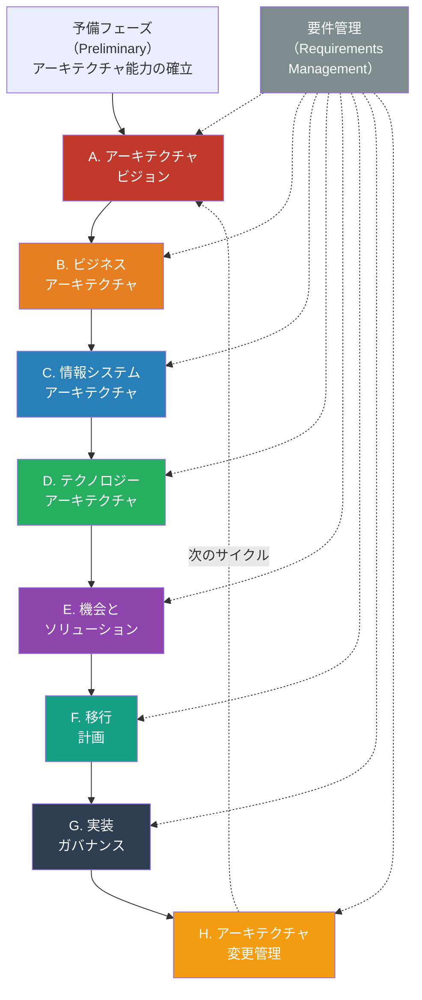
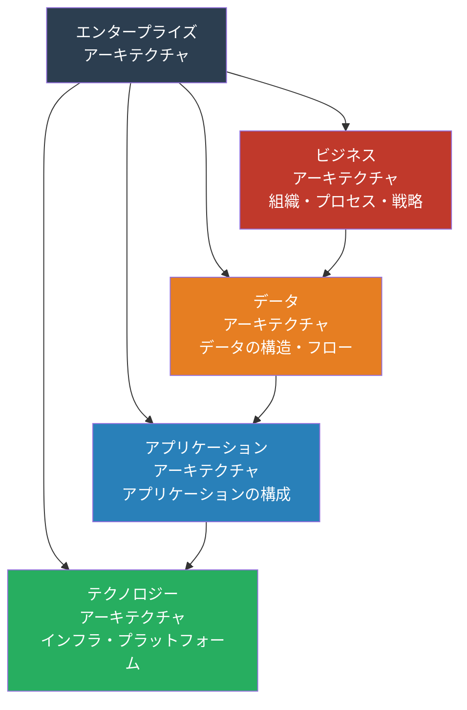
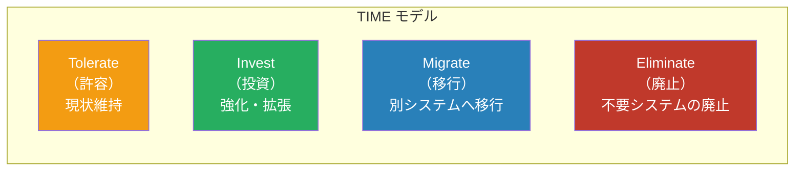
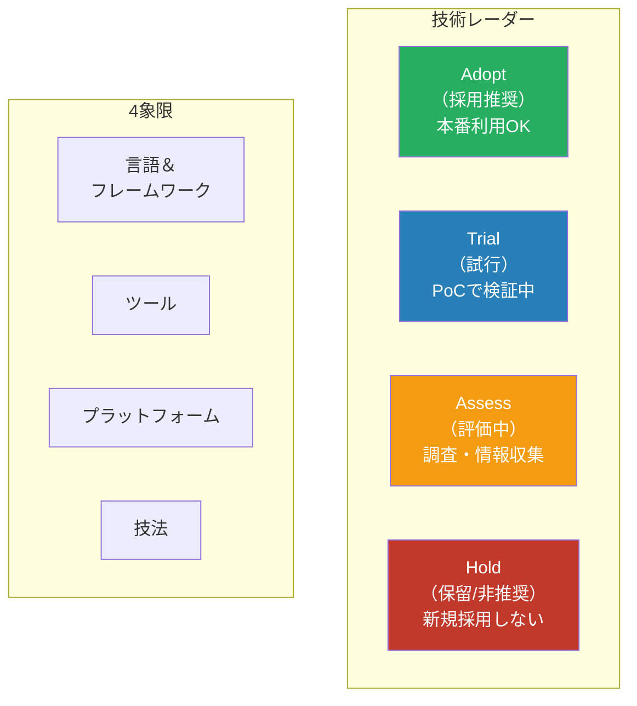
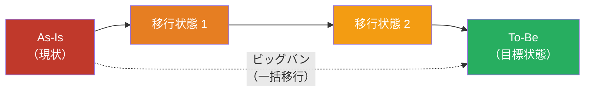
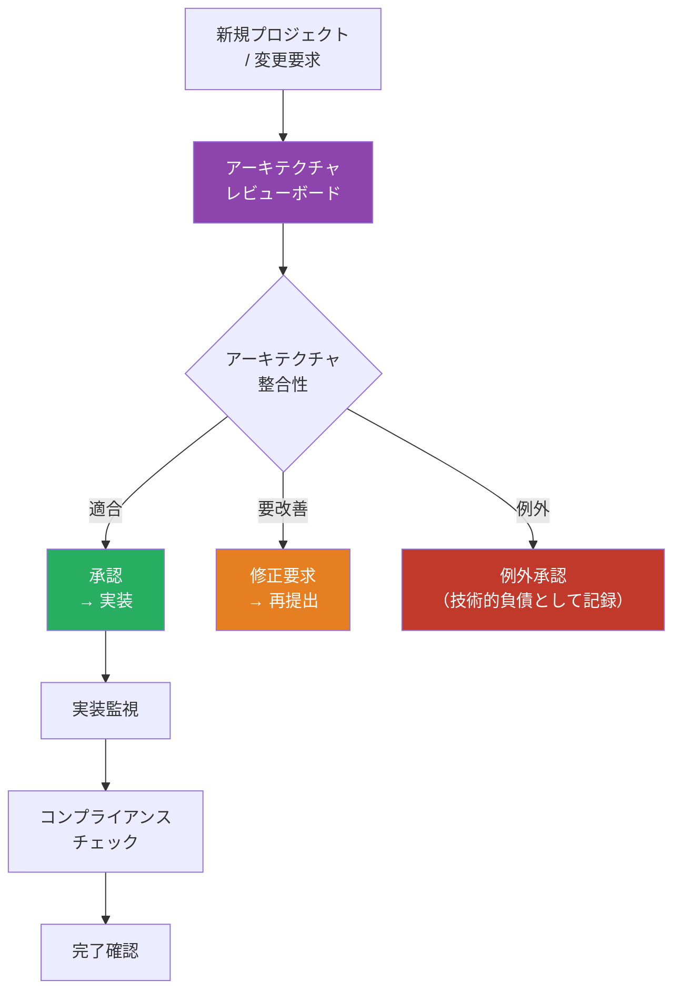
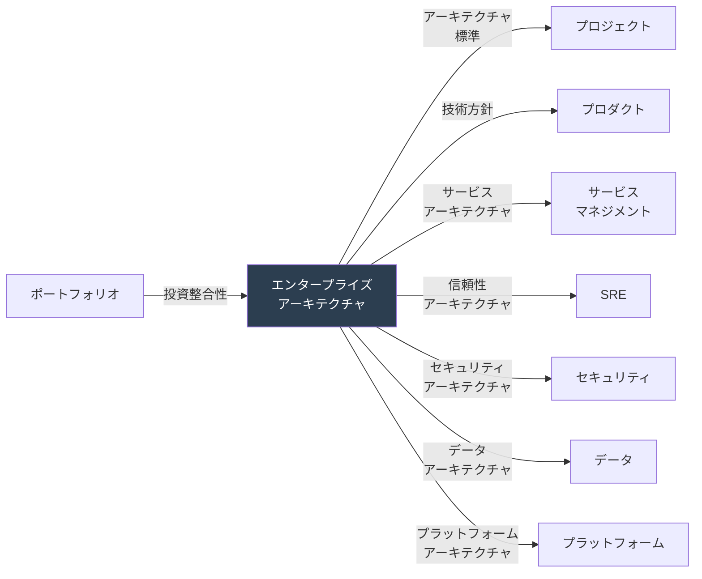

# エンタープライズアーキテクチャマップ — 「組織全体のIT構造をどう統制するか」

> 個別最適ではなく**全体最適**。組織のビジネス戦略とIT資産の間に整合性を持たせ、
> 変化に適応できるIT構造を設計・統制するための
> 工程・タスク・リソースを、TOGAF / Zachman をベースに網羅的に整理したもの

本ドキュメントは、エンタープライズアーキテクチャ（EA）の全体像を、フェーズ順（TOGAF ADM）に沿って解説します。各フェーズで「何を成し遂げるのか」「どのようなタスク・リソース・成果物が必要か」を体系的に整理しており、組織がEAを導入・推進する際の実践的なロードマップとして活用できます。また、Zachmanフレームワークとの対比や、他の経営視点（プロジェクト、プロダクト、ポートフォリオ）との違いを理解することで、EAが組織内でどのような立場を占めるかも明確になります。

## 他の視点との根本的な違い

エンタープライズアーキテクチャが独自の価値を持つ理由は、プロジェクト・プロダクト・ポートフォリオといった既存の管理視点と本質的に異なる視角を提供するからです。以下の表は、それぞれの視点がどのような対象・時間軸・目標を持つかを対比させたものです。

| 観点     | プロジェクト | プロダクト       | ポートフォリオ | エンタープライズアーキテクチャ |
| -------- | ------------ | ---------------- | -------------- | ------------------------------ |
| スコープ | 個別のPJ     | 個別のプロダクト | 投資の集合体   | 組織全体のIT構造               |
| 時間軸   | 有期         | プロダクト寿命   | 投資サイクル   | 3〜5年のロードマップ           |
| ゴール   | 成果物納品   | ユーザー価値     | 投資最適化     | ビジネスとITの整合性           |
| 中心人物 | PM           | PdM              | PfM            | エンタープライズアーキテクト   |
| 成功指標 | QCD          | アウトカム       | ROI            | 標準準拠率・技術的負債削減     |

## TOGAF ADM（Architecture Development Method）全体像

TOGAF ADM（アーキテクチャ開発方法論）は、エンタープライズアーキテクチャを段階的に開発するための標準的なフレームワークです。予備フェーズから始まり、ビジョン設定、ビジネス・情報システム・技術の各アーキテクチャ設計、実装・変更管理まで、8つのフェーズと要件管理を並行して実施する循環型プロセスです。下図は各フェーズの流れと相互関係を示しており、単線的な進捗ではなく「次のサイクル」として継続的に改善することが特徴です。

## EA の4つのアーキテクチャドメイン

エンタープライズアーキテクチャは、単一の「IT設計」ではなく、4つの異なるドメインから構成されます。ビジネスアーキテクチャが「何をするのか」という組織の戦略と機能を定義し、その後データ・アプリケーション・テクノロジーアーキテクチャが「それをいかに実現するのか」を段階的に詳細化していく関係にあります。この階層的な依存関係を理解することで、設計の一貫性が保たれます。

## 1. アーキテクチャ能力の確立（予備フェーズ）

### 目的

EA活動を行うための**組織的な能力と体制**を確立する。

このフェーズは、後続のすべてのフェーズの土台となります。単に「アーキテクチャの方針を決める」だけでなく、それを継続的に推進・監督できる組織、プロセス、ツール基盤を整備することが重要です。CIO/CTO の強力なスポンサーシップと、チーフアーキテクトを中心とした専任チームの設立なしに、EA活動は組織に浸透しません。

### タスク一覧

以下のタスクを通じて、EA推進の基盤を整備します。

| #   | タスク                       | 説明                                                       |
| --- | ---------------------------- | ---------------------------------------------------------- |
| 1   | EA方針・原則の策定           | アーキテクチャの基本方針（例：クラウドファースト）を文書化 |
| 2   | EA組織の設計                 | アーキテクチャチーム、アーキテクチャレビューボードの設立   |
| 3   | EAフレームワーク選定         | TOGAF / Zachman / 独自フレームワークの選定・カスタマイズ   |
| 4   | アーキテクチャリポジトリ構築 | アーキテクチャ成果物の一元管理基盤                         |
| 5   | EAガバナンスプロセス設計     | アーキテクチャレビュー・承認プロセスの設計                 |
| 6   | 技術レーダー初版作成         | Adopt / Trial / Assess / Hold の初期分類                   |
| 7   | EA成熟度評価                 | 現状のEA成熟度レベルの評価                                 |

### リソース

| カテゴリ | リソース                     | 備考                                          |
| -------- | ---------------------------- | --------------------------------------------- |
| **人**   | チーフアーキテクト           | EA全体の責任者                                |
| **人**   | エンタープライズアーキテクト | 各ドメインの設計                              |
| **人**   | CIO / CTO                    | EA活動のスポンサー                            |
| **物**   | EAツール                     | LeanIX, Ardoq, Mega HOPEX 等                  |
| **物**   | 技術レーダーツール           | Thoughtworks Tech Radar, Backstage Tech Radar |
| **金**   | EAツールライセンス           | EAリポジトリ・可視化ツール                    |
| **金**   | コンサルティング費           | EA導入コンサルティング                        |

### 成果物

| 成果物                     | 形式          | 必須/任意 |
| -------------------------- | ------------- | --------- |
| EA方針・原則書             | ドキュメント  | 必須      |
| EA組織図                   | 図表          | 必須      |
| EAガバナンスフレームワーク | ドキュメント  | 必須      |
| 技術レーダー               | 図表 / ツール | 必須      |
| EA成熟度評価レポート       | レポート      | 任意      |

## 2. アーキテクチャビジョン（フェーズA）

### 目的

ビジネスの目標とアーキテクチャの方向性を**一致**させ、EA活動のスコープと期待される成果を明確にする。

このフェーズは、経営層とIT部門の対話を最も重視します。経営戦略がどのように変わりつつあるのか、その実現に必要なIT投資の方向性は何か、それを3〜5年で実現するロードマップはどうあるべきか——これらを共有ビジョンとして確立することが、後続フェーズのすべての判断基準となります。言い換えれば、ここでの「ズレ」があれば、以降のどれだけ精密な設計も組織の経営目標を外すことになります。

### タスク一覧

以下のステップを通じて、経営・IT・ステークホルダーの三者の認識を合致させます。

| #   | タスク                              | 説明                                             |
| --- | ----------------------------------- | ------------------------------------------------ |
| 1   | ビジネス戦略の理解                  | 経営層との対話による戦略の把握                   |
| 2   | アーキテクチャビジョン策定          | 目指すべきアーキテクチャの姿を描く               |
| 3   | ステークホルダーマッピング          | 関係者の洗い出し・関心事の整理                   |
| 4   | ビジネスシナリオ分析                | アーキテクチャで解決すべきビジネスシナリオの特定 |
| 5   | Statement of Architecture Work 作成 | EA活動のスコープ・スケジュール・体制の合意       |
| 6   | 高レベルギャップ分析                | 現状（As-Is）と目標（To-Be）の概略的差異         |

### 成果物

| 成果物                             | 形式         | 必須/任意 |
| ---------------------------------- | ------------ | --------- |
| アーキテクチャビジョンドキュメント | ドキュメント | 必須      |
| ステークホルダーマップ             | 図表         | 必須      |
| Statement of Architecture Work     | ドキュメント | 必須      |
| ビジネスシナリオ                   | ドキュメント | 必須      |

## 3. ビジネスアーキテクチャ（フェーズB）

### 目的

組織の**ビジネスプロセス・組織構造・ビジネス機能**を可視化し、IT変革の基盤となるビジネス面の設計を行う。

フェーズAで確定したビジョンを実現するには、組織のビジネスの全体像を「プロセス」「機能」「組織」の観点から整理し直す必要があります。このフェーズでは、往々にして「現状と目標のギャップが想像より大きい」ことが明らかになります。それは失敗ではなく、本来のEAの価値です。IT導入の前に、ビジネス側での変革の必要性を認識することで、ITとビジネスの変革を同期させることができます。

### タスク一覧

ビジネスアーキテクチャを構築するために、以下のモデル化タスクを並行して進めます。

| #   | タスク                                   | 説明                                           |
| --- | ---------------------------------------- | ---------------------------------------------- |
| 1   | ビジネス機能マップ（Capability Map）作成 | 組織が持つビジネス機能の体系的整理             |
| 2   | ビジネスプロセスモデリング               | As-Is / To-Be のビジネスプロセス設計（BPMN等） |
| 3   | バリューストリームマッピング             | 顧客への価値提供の流れの可視化                 |
| 4   | 組織構造分析                             | ビジネス機能と組織の対応関係                   |
| 5   | ビジネス/IT アラインメント分析           | ビジネス戦略とIT投資の整合性確認               |
| 6   | ギャップ分析（ビジネス）                 | 現状と目標のギャップ、必要な変革の特定         |

### 成果物

| 成果物                                  | 形式         | 必須/任意 |
| --------------------------------------- | ------------ | --------- |
| ビジネス機能マップ                      | 図表         | 必須      |
| ビジネスプロセスモデル（As-Is / To-Be） | BPMN図       | 必須      |
| バリューストリームマップ                | 図表         | 推奨      |
| ビジネスギャップ分析レポート            | ドキュメント | 必須      |

## 4. 情報システムアーキテクチャ（フェーズC）

### 目的

**アプリケーション**と**データ**の両面から情報システムの全体像を設計する。

このフェーズから、「IT側の視点」が前面に出始めます。ビジネスアーキテクチャで定義した機能・プロセスを実現するために、どのようなアプリケーション群が必要か、それらの間でどのようにデータが流れるのか、どのようなデータスキームを採用するのか——これらの決定が、後続するテクノロジーアーキテクチャの選定に直結します。

### 4a. データアーキテクチャ

データアーキテクチャでは、組織全体で扱うデータの構造・管理方針・品質基準を統一します。個別システムごとのデータ設計から、組織横断的なマスタデータ管理・データガバナンスへの転換が求められます。

| #   | タスク                    | 説明                                         |
| --- | ------------------------- | -------------------------------------------- |
| 1   | 概念データモデル作成      | 組織全体のデータエンティティの関係図         |
| 2   | データフロー図（DFD）作成 | システム間のデータの流れの可視化             |
| 3   | データ標準の策定          | 命名規則、データ辞書、マスタデータ方針       |
| 4   | データ管理方針策定        | データガバナンス、品質、ライフサイクルの方針 |

### 4b. アプリケーションアーキテクチャ

アプリケーションアーキテクチャでは、組織が保有する全アプリケーション（SaaS、オンプレミス、開発中を含む）を棚卸しし、それらを「投資対象か廃止対象か」に分類します。また、マイクロサービス・モノリス・API経由の連携といった実装パターンを組織レベルで統一することで、新規開発の効率化と保守性の向上を同時に実現します。

| #   | タスク                         | 説明                                       |
| --- | ------------------------------ | ------------------------------------------ |
| 1   | アプリケーションポートフォリオ | 全アプリケーションの棚卸し・分類           |
| 2   | アプリケーション連携図         | システム間のインテグレーションの可視化     |
| 3   | アプリケーション合理化計画     | 重複排除、レガシー統合・廃止の計画         |
| 4   | アーキテクチャパターン策定     | マイクロサービス / モノリス / BFF 等の方針 |
| 5   | API戦略策定                    | APIファースト、API管理の方針               |

### アプリケーションポートフォリオマネジメント

アプリケーション合理化の意思決定を体系的に行うため、「TIME モデル」を用います。各アプリケーションの業務への貢献度と技術的状態に基づいて、「許容」「投資」「移行」「廃止」のいずれかに分類し、3〜5年のロードマップを描きます。

### 成果物

| 成果物                         | 形式                      | 必須/任意 |
| ------------------------------ | ------------------------- | --------- |
| 概念データモデル               | ER図                      | 必須      |
| データフロー図                 | DFD / 図表                | 必須      |
| アプリケーションポートフォリオ | スプレッドシート / ツール | 必須      |
| アプリケーション連携図         | 図表                      | 必須      |
| アプリケーション合理化計画     | ドキュメント              | 必須      |
| API戦略ドキュメント            | ドキュメント              | 推奨      |

## 5. テクノロジーアーキテクチャ（フェーズD）

### 目的

ビジネス・データ・アプリケーションを支える**技術基盤**（インフラ、プラットフォーム、ネットワーク）を設計する。

テクノロジーアーキテクチャは、前フェーズで確定したアプリケーション・データ要件を実装するための「具体的なハードウェア・ソフトウェア・ネットワーク」を提示します。クラウド移行、セキュリティ標準、技術スタックの統一といった決定を行い、これを「技術レーダー」という継続的な評価フレームワークで維持していくことが肝要です。

### タスク一覧

テクノロジー観点での全体設計と標準化を進めます。

| #   | タスク                         | 説明                                                      |
| --- | ------------------------------ | --------------------------------------------------------- |
| 1   | インフラストラクチャ設計       | クラウド / オンプレミス / ハイブリッドの構成              |
| 2   | ネットワークアーキテクチャ設計 | WAN / LAN / SD-WAN の設計                                 |
| 3   | クラウド戦略策定               | マルチクラウド / シングルクラウド、クラウドネイティブ戦略 |
| 4   | 技術標準の策定                 | 言語・フレームワーク・ツールの標準化                      |
| 5   | 技術レーダー更新               | 定期的な技術トレンドの評価・分類                          |
| 6   | セキュリティアーキテクチャ統合 | ゼロトラスト、多層防御の設計                              |
| 7   | ギャップ分析（テクノロジー）   | 現状インフラと目標アーキテクチャの差異                    |

### 技術レーダーの構造

技術レーダーは、言語・フレームワーク・ツール・プラットフォーム・技法を「4象限」に分け、各技術の成熟度・信頼度に基づいて「Adopt（採用推奨）」から「Hold（非推奨）」の段階に分類します。これにより、新規プロジェクトが技術選定を行う際の意思決定基準が明確になり、組織全体での技術スタックのばらつきを削減できます。

### 成果物

| 成果物                           | 形式                | 必須/任意 |
| -------------------------------- | ------------------- | --------- |
| テクノロジーアーキテクチャ設計書 | ドキュメント / 図表 | 必須      |
| クラウド戦略ドキュメント         | ドキュメント        | 必須      |
| 技術標準書                       | ドキュメント        | 必須      |
| 技術レーダー（更新版）           | 図表 / ツール       | 必須      |
| インフラ構成図                   | 図表                | 必須      |
| ギャップ分析レポート             | ドキュメント        | 必須      |

## 6. 機会とソリューション＆移行計画（フェーズE/F）

### 目的

As-IsからTo-Beへの**移行戦略を策定**し、段階的な実行計画を立てる。

ここまでのフェーズで描き上げた「理想的なアーキテクチャ（To-Be）」と「現在の状態（As-Is）」の間には、往々として大きなギャップがあります。このフェーズでは、そのギャップを埋めるための「移行パス」を具体的に設計します。一気に移行するのか、段階的に進めるのか、既存システムの活用か置き換えか——こうした戦略的判断が、後続する実装フェーズの成否を左右します。

### 移行アプローチ

移行には「一括移行（ビッグバン）」と「段階的移行」の2つの主要パターンがあります。多くの場合、段階的移行（Strangler Fig パターン）によるリスク低減が推奨されます。下図は、複数の中間状態を経由しながらTo-Beに到達するイメージです。

### タスク一覧

移行戦略をロードマップまで具体化するため、以下のステップを踏みます。

| #   | タスク                   | 説明                                                   |
| --- | ------------------------ | ------------------------------------------------------ |
| 1   | ソリューション候補の特定 | Build / Buy / Reuseの検討                              |
| 2   | 移行戦略の策定           | 段階的移行（Strangler Fig）/ ビッグバン / パラレルラン |
| 3   | ワークパッケージ定義     | 移行を実現するためのプロジェクト群の定義               |
| 4   | 移行ロードマップ作成     | 年次/四半期単位の移行計画                              |
| 5   | 依存関係分析             | ワークパッケージ間の依存関係の整理                     |
| 6   | リスク評価               | 移行に伴うリスクの評価と軽減策                         |
| 7   | コスト見積り             | 移行全体のコスト（人件費+ツール+インフラ+移行コスト）  |

### 成果物

| 成果物                     | 形式                          | 必須/任意 |
| -------------------------- | ----------------------------- | --------- |
| ソリューション評価レポート | ドキュメント                  | 必須      |
| 移行戦略ドキュメント       | ドキュメント                  | 必須      |
| 移行ロードマップ           | ガントチャート / ドキュメント | 必須      |
| コスト見積り               | スプレッドシート              | 必須      |
| リスク台帳                 | スプレッドシート              | 必須      |

## 7. 実装ガバナンス＆変更管理（フェーズG/H）

### 目的

アーキテクチャの決定が実装に正しく反映されるよう**監督**し、変化に適応してアーキテクチャを進化させる。

このフェーズは、EA活動が「一度限りの計画」で終わるのではなく、「継続的な統制と改善」へと転換する重要な分岐点です。「アーキテクチャレビューボード」という意思決定機関を設置し、すべての新規プロジェクト・システム変更が組織のアーキテクチャ標準に整合しているかを審査します。同時に、予想通りにいかなかった決定は「技術的負債」として記録し、事後的に改善する仕組みも用意します。

### アーキテクチャガバナンスの仕組み

以下は、アーキテクチャレビューボードの承認フロー、および実装後の監視・コンプライアンス確認までのプロセスを示しています。新規プロジェクトやシステム変更のたびにこのサイクルが回り、組織のアーキテクチャ方針が確実に遵守される状態を目指します。

### タスク一覧

ガバナンス体制を確立し、継続的にアーキテクチャを監視・改善するための施策を展開します。

| #   | タスク                        | 説明                                           |
| --- | ----------------------------- | ---------------------------------------------- |
| 1   | アーキテクチャレビュー        | 新規PJ / 変更のアーキテクチャ適合性確認        |
| 2   | 技術的負債管理                | 技術的負債の記録・優先順位付け・計画的返済     |
| 3   | アーキテクチャ決定記録（ADR） | 重要なアーキテクチャ決定とその背景の文書化     |
| 4   | 標準準拠率の測定              | 各PJのアーキテクチャ標準への準拠度モニタリング |
| 5   | 例外管理                      | 標準からの逸脱の承認・追跡・解消               |
| 6   | アーキテクチャ変更管理        | 環境変化に応じたアーキテクチャの更新           |
| 7   | ナレッジ共有                  | アーキテクチャの理解促進・教育                 |

### ADR（Architecture Decision Record）の構造

アーキテクチャ決定を「記録」することは、組織の知見を蓄積し、将来の類似判断を高速化するための重要な実践です。ADR（アーキテクチャ決定記録）は、単に「何を選んだか」だけでなく「なぜ選んだのか」「どのような代替案を検討したのか」「これによってどのような影響が生まれたのか」を記述します。これにより、時間が経過して判断の背景が忘れられてしまうのを防ぎ、新しいチームメンバーの学習を加速させることができます。

| セクション       | 内容                                          |
| ---------------- | --------------------------------------------- |
| **タイトル**     | 決定の概要（例：APIゲートウェイにKongを採用） |
| **日付**         | 決定日                                        |
| **ステータス**   | Proposed / Accepted / Deprecated / Superseded |
| **コンテキスト** | なぜこの決定が必要になったか                  |
| **選択肢**       | 検討した選択肢の一覧                          |
| **決定**         | 何を選んだか、なぜ選んだか                    |
| **結果**         | この決定による影響（良い点・悪い点）          |

### リソース

| カテゴリ | リソース                     | 備考                                |
| -------- | ---------------------------- | ----------------------------------- |
| **人**   | アーキテクチャレビューボード | レビュー・承認の意思決定機関        |
| **人**   | ソリューションアーキテクト   | 個別PJのアーキテクチャ設計          |
| **物**   | ADRリポジトリ                | Git / Confluence / Backstage        |
| **物**   | 技術的負債追跡               | チケットシステム / スプレッドシート |

### 成果物

| 成果物                     | 形式                        | 必須/任意 |
| -------------------------- | --------------------------- | --------- |
| アーキテクチャレビュー記録 | ドキュメント                | 必須      |
| ADR集                      | Markdown / Wiki             | 必須      |
| 技術的負債台帳             | スプレッドシート / チケット | 必須      |
| 標準準拠率レポート         | レポート                    | 必須      |
| 例外管理台帳               | スプレッドシート            | 必須      |

## Zachman Framework（補足）

TOGAF ADM は「段階的プロセス」として EA を推進する方法論であるのに対し、Zachman Framework は「分類体系」を提供します。6 つの観点（What/How/Where/Who/When/Why）と 5 つの抽象度（経営者〜実装者）を掛け合わせた 30 マスの表を用いて、EA の全体像を「網羅的に」整理します。TOGAF と Zachman は互いに補完関係にあり、TOGAF で「順序立てて設計」し、Zachman で「漏れがないか確認」するという使い方が実践的です。以下は Zachman 表の概略です。

|                            | What（データ）   | How（機能）            | Where（ネットワーク） | Who（人）                | When（時間）         | Why（動機）    |
| -------------------------- | ---------------- | ---------------------- | --------------------- | ------------------------ | -------------------- | -------------- |
| **Scope（経営者）**        | データ一覧       | プロセス一覧           | 拠点一覧              | 組織一覧                 | イベント一覧         | 戦略一覧       |
| **Business（業務責任者）** | 概念データモデル | ビジネスプロセスモデル | ビジネスネットワーク  | 組織図                   | マスタースケジュール | ビジネスプラン |
| **System（設計者）**       | 論理データモデル | システム機能設計       | 分散システム設計      | ユーザーインターフェース | 処理構造             | ビジネスルール |
| **Technology（構築者）**   | 物理データモデル | プログラム設計         | 技術アーキテクチャ    | セキュリティ設計         | 制御構造             | ルール設計     |
| **Detail（実装者）**       | データ定義       | コード                 | ネットワーク設定      | 権限設定                 | タイミング設定       | ルール実装     |

## 横断的な視点 — 他視点との関係

エンタープライズアーキテクチャは、単独で機能するものではなく、プロジェクト・プロダクト・サービスマネジメント・SRE・セキュリティ・データマネジメント・プラットフォーム・ポートフォリオといった他の管理視点と緊密に連携します。以下の図は、EA が各領域に対して「標準」「方針」「アーキテクチャ」を提供し、逆に各領域からの知見・ニーズが EA へフィードバックされる関係を示しています。

### 重要な連携ポイント

EA が組織内で実質的な価値を生み出すには、以下の各領域との連携が不可欠です。各領域との関係性を理解することで、EA の「標準」が単なる制約条件ではなく、ビジネス価値を生み出すための基盤となることが実感できます。

| 連携先               | EAとの関係                                                 |
| -------------------- | ---------------------------------------------------------- |
| プロジェクト         | プロジェクトのアーキテクチャレビュー・承認。標準準拠の確認 |
| プロダクト           | プロダクトの技術選定がEA方針に沿っているかの確認           |
| サービスマネジメント | サービスアーキテクチャの全体設計。CMDB との連携            |
| SRE                  | 信頼性に関するアーキテクチャ方針。非機能要件の標準化       |
| セキュリティ         | セキュリティアーキテクチャの全体設計。ゼロトラスト方針     |
| データマネジメント   | データアーキテクチャの全体方針。データガバナンスとの連携   |
| プラットフォーム     | プラットフォームのアーキテクチャ設計。技術標準の提供       |
| ポートフォリオ       | 投資判断のアーキテクチャ整合性確認                         |

## EA アンチパターン

多くの組織が EA 導入に失敗する原因は、技術的な不備ではなく「EA をどう組織に根づかせるか」という運用面の課題にあります。以下は、EA 活動が陥りやすい「アンチパターン」と、それを回避するための対策です。これらを意識することで、EA が「机上の空論」に終わらない、生きた統制基盤になります。

| アンチパターン                | 説明                                 | 対策                                             |
| ----------------------------- | ------------------------------------ | ------------------------------------------------ |
| Ivory Tower Architecture      | 現場から遊離した机上のアーキテクチャ | 開発チームとの密接な協業、ADRの活用              |
| Architecture Astronaut        | 過度に抽象的で実装に落ちない設計     | 具体的なゴールデンパス、テンプレートの提供       |
| Paper Architecture            | 文書はあるが誰も参照しない           | 生きたドキュメント（Code as Architecture）の推進 |
| Big Bang Transformation       | 一度に全てを変えようとする           | 段階的移行（Strangler Fig Pattern）の採用        |
| Standards Without Enforcement | 標準はあるが遵守されない             | 自動化されたガバナンス（Policy as Code）         |
