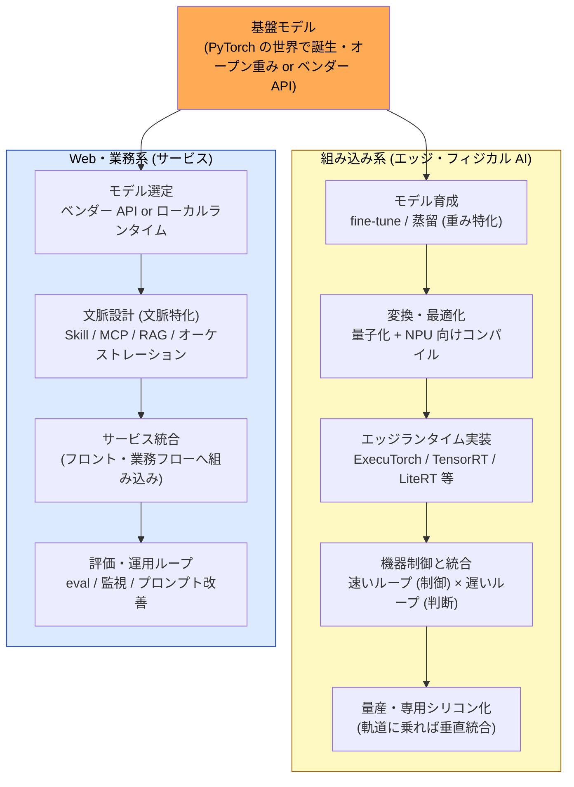

# LLM を使った製品作り — 組み込み系と Web・業務系の違い

> 「AI をどう製品に関与させるか」は、**立場 (役割・ドメイン) が活用法を決める** ── その最初の具体例

## この章で何ができるようになるか

- 自分の **立場 (ドメイン)** によって、LLM 活用の工程・成果物・判断点がどう変わるかを 1 枚で掴める
- 「AI をどう製品に関与させるか」を、職能や管理視点ごとに振り分けて議論できるようになる

## 一言でいうと

違いの本質は **「境界をまたいで渡される成果物」** が何か。組み込み系では **重みファイル (製品の部品)**、Web・業務系では **API エンドポイント (ただのバックエンドサービス)**。この一点から、工程・ランタイム・職能・スケール戦略のすべてが分岐する。

## 全体フロー

どちらも上流は同じ ── 基盤モデルは PyTorch (+ transformers) の世界で生まれる。分岐はその後。

## 両者の比較

| 観点 | 組み込み系 | Web・業務系 |
| --- | --- | --- |
| **境界の成果物** | 重みファイル (**製品の部品**) | API エンドポイント (**バックエンドサービス**) |
| **モデルへの関与** | 既製重みを fine-tune / 蒸留して**育てる** (重み特化が主) | 既製をそのまま**消費**し、文脈で武装 (文脈特化が主) |
| **変換・最適化工程** | **必須** ── ターゲット NPU ごとにベンダーツールチェーンで再コンパイル (クロスコンパイルに近い) | ほぼ不要 ── ランタイム側が吸収 |
| **ランタイム** | ExecuTorch / TensorRT / LiteRT / llama.cpp 等 (ハードに縛られる) | クラウド API / vLLM / Ollama (HTTP の向こう側) |
| **レイテンシ要件** | 二層 ── 制御は数百 Hz (重みに焼く)、判断は数 Hz (LLM + ツール) | 人間の体感 (秒オーダー) で足りる |
| **ハード制約** | NPU・消費電力・BOM 単価が設計を支配 | ほぼ無し |
| **更新手段** | OTA / 製品リビジョン (重い) | デプロイ / プロンプト・ツール差し替え (即時) |
| **失敗時のリスク** | 物理的事故・リコール (機能安全の世界) | 誤回答・業務影響 (修正は速い) |
| **主な職能** | ML エンジニア + 組み込みエンジニア | **AI エンジニア** (モデルは訓練しない、上に製品を作る) |
| **スケール時の進化** | 専用ボード / ASIC 化 (**垂直統合へ**) | スケールアウト / マルチベンダー化 (**水平分散へ**) |

### 専門化ルートとの対応

- 組み込み系の主戦場 = **重み特化 (訓練で焼き込む)** ── 制御ポリシーや VLA はツール呼び出しでは代替できない
- Web・業務系の主戦場 = **文脈特化 (Skill / MCP / RAG)** ── 最新情報・業務データ・操作はツールで取りに行く
- どちらも「レイテンシ要件と更新頻度が、重みか文脈かの選択を強制する」という同じ原理の上にいる

## 横断的な視点 (管理 9 視点との接続)

「AI をどう関与させるか」という問いは、立場によって **負荷のかかる管理視点が変わる**。

| 管理視点 | 組み込み系での効き方 | Web・業務系での効き方 |
| --- | --- | --- |
| [2. プロダクト](./product-lifecycle-map.md) | モデル性能が製品仕様そのもの | AI 機能は数ある機能の一つ |
| [3. サービスマネジメント](./service-management-map.md) | OTA 配信・リビジョン管理 | LLM 障害時の degradation 設計 |
| [4. SRE / 信頼性](./sre-reliability-map.md) | **機能安全** (事故・リコール) に接続 | eval・ハルシネーション監視に接続 |
| [5. セキュリティ](./security-compliance-map.md) | サプライチェーン (重みの出自) | プロンプトインジェクション・データ漏洩 |
| [6. データマネジメント](./data-management-map.md) | 訓練データの権利・トレーサビリティ | eval データ・会話ログの管理 |
| [7. プラットフォーム](./platform-engineering-map.md) | ベンダーツールチェーンの内製度 | LLM ゲートウェイ (LiteLLM 等) を開発基盤に組み込む |
| [8. ポートフォリオ](./portfolio-program-map.md) | **専用シリコン投資の判断** (BOM × 数量) | ベンダーロックイン回避・乗り換え戦略 |

共通する最重要の問いは一つ:

> **どこを内製し、どこをベンダーに預けるか。** その判断 (選定眼) は、代替案を自分の手で触った人間にしか持てない。

## 関連

- 管理 9 視点の全体像: [README](./README.md)
- Skill / MCP / Memory 等のシステム部品の配置 (Step 1: 概念): [ai-agent-architecture](https://shuji-bonji.github.io/ai-agent-architecture/ja/)
- LLM 本体の構造的制約 (Step 2: 原理): [understanding-llm-through-claude-code](https://shuji-bonji.github.io/understanding-llm-through-claude-code/ja/)
