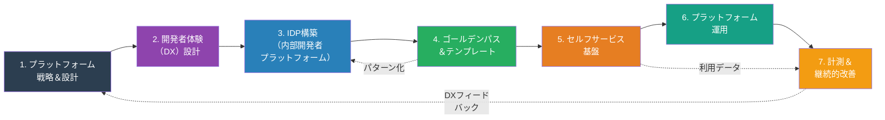
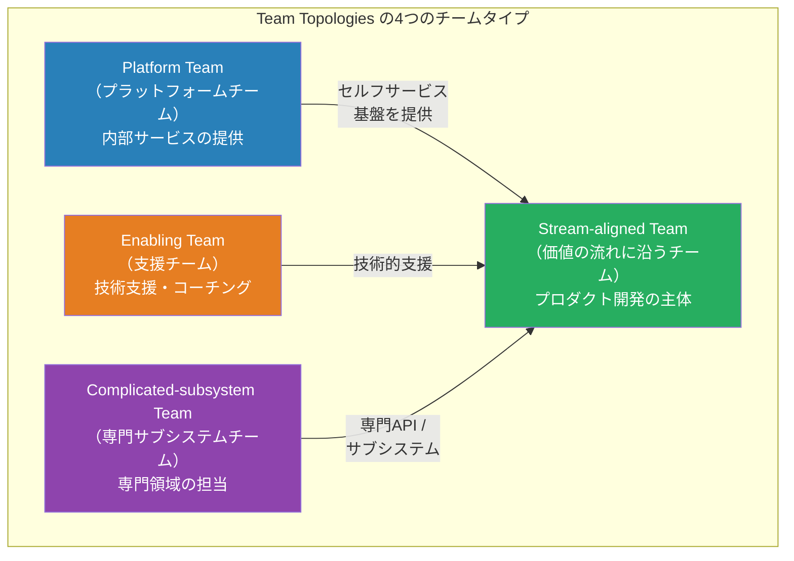
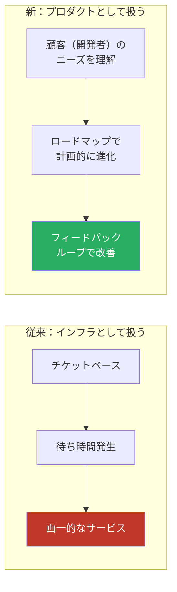
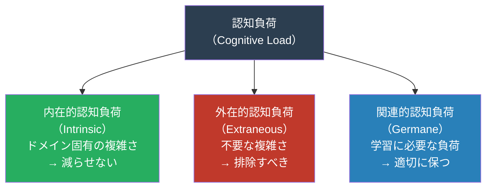
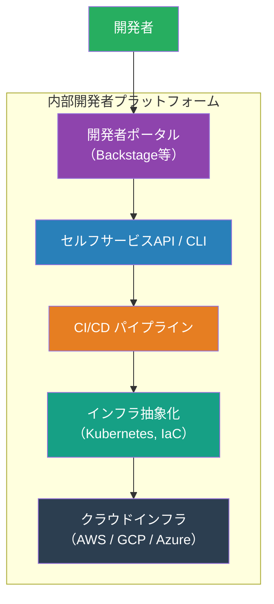
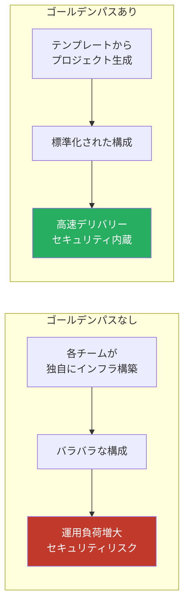
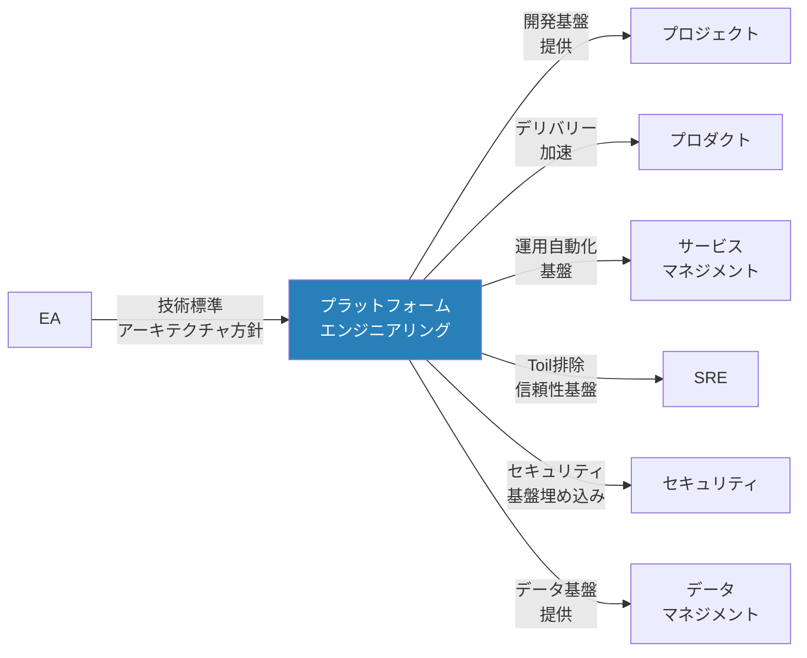

# プラットフォームエンジニアリングマップ — 「開発者体験をどう最適化するか」

> 開発チームが**自律的に、高速に、安全に**ソフトウェアをデリバリーできるように、
> 内部開発者プラットフォーム（IDP）を設計・構築・運用するための
> 工程・タスク・リソースを網羅的に整理したもの

本ドキュメントは、プラットフォームエンジニアリングの全体像を7つの工程に分解し、各工程において実施すべきタスク・準備すべきリソース・期待される成果物を体系的に示したものです。上から順に段階的に進める必要はなく、組織の状況に応じて並行的に進めたり、既に実施されている施策から必要な部分を選択したりできます。各セクションの図表と合わせて読むことで、プラットフォームの全体構想から運用・改善まで、一貫したアプローチを理解できるよう構成されています。

## 他の視点との根本的な違い

以下の表は、SRE・DevOps・プラットフォームエンジニアリングの関心と手法がいかに異なるかを示しています。プラットフォームエンジニアリングの特徴は、内部開発者を顧客とし、開発者体験の最適化を究極の目標としている点です。

| 観点       | SRE                  | DevOps             | プラットフォームエンジニアリング   |
| ---------- | -------------------- | ------------------ | ---------------------------------- |
| 主な関心   | システムの信頼性     | 開発と運用の融合   | 開発者体験（DX）の最適化           |
| アプローチ | SLO/エラーバジェット | 文化・自動化・計測 | プロダクトとしてのプラットフォーム |
| 提供対象   | サービス利用者       | 組織全体           | 内部開発者（顧客）                 |
| 成功指標   | SLI/SLO達成率        | DORA メトリクス    | 開発者満足度・セルフサービス率     |
| 中心人物   | SRE                  | DevOpsエンジニア   | プラットフォームエンジニア         |

## プラットフォームエンジニアリング全体像

以下の流れは、プラットフォーム構想から実装・運用・改善までの統合的なプロセスを示しています。各段階は相互に関連し、特に「計測＆継続的改善」からのフィードバックが戦略の修正や新機能の検討につながります。左から右への主要フローと、右から左への改善ループが同時に機能することで、プラットフォームは継続的に進化します。

## Team Topologies とプラットフォームの位置づけ

組織構造とプラットフォームエンジニアリングは密接に関連しています。以下の図は、Team Topologiesフレームワークにおいてプラットフォームチームがどのような役割を果たし、他のチームタイプとどう協働するかを示しています。Stream-aligned Team（プロダクト開発チーム）の生産性を最大化することがプラットフォームチームの使命です。

### インタラクションモード

プラットフォームチームと開発チームの関係は、常に同じ形式ではなく、段階や文脈に応じて3つのモードが使い分けられます。基本はセルフサービスを指向しながら、必要に応じて密接な協業や支援を行うことで、開発チームの効率性を最大化します。

| モード             | 説明                                  | プラットフォームチームの例                  |
| ------------------ | ------------------------------------- | ------------------------------------------- |
| **X-as-a-Service** | APIやポータル経由でセルフサービス提供 | CI/CDパイプライン、インフラプロビジョニング |
| **Collaboration**  | 一時的な密接な協業                    | 新プラットフォーム機能の共同開発            |
| **Facilitating**   | 技術支援・コーチング                  | 新ツールの導入支援、ベストプラクティス共有  |

## 1. プラットフォーム戦略＆設計

### 目的

プラットフォームの**ビジョン・スコープ・成功指標**を定め、「プラットフォームをプロダクトとして扱う」戦略を策定する。この工程は全体の基盤となるため、経営層と開発チームの合意形成が重要です。策定されたビジョンと指標は、以降のすべての実装判断の羅針盤となります。

### 「プラットフォームをプロダクトとして扱う」とは

従来のインフラストラクチャは個別のリクエストに応じて構築される受動的な存在でしたが、プロダクトとしてのプラットフォームは、顧客である開発者のニーズを主体的に理解し、計画的に進化する能動的な存在です。下の図は、この思考の転換がもたらす効果を視覚化しています。

### タスク一覧

このフェーズのタスクは、戦略策定と組織体制の整備に特有であり、経営層・開発リーダーとの合意形成が他のフェーズにはない重要性を持ちます。ビジョンの共有とKPI設定を通じて、その後のすべての実装判断の羅針盤となる基盤を構築します。

以下のタスクを通じて、プラットフォーム構想の明確化から実行体制の構築まで、戦略的な基礎を整えます。

| #   | タスク                           | 説明                                               |
| --- | -------------------------------- | -------------------------------------------------- |
| 1   | プラットフォームビジョン策定     | なぜプラットフォームが必要か、どんな世界を目指すか |
| 2   | ユーザー（開発者）リサーチ       | 開発者の課題・ニーズ・ペインポイントの調査         |
| 3   | プラットフォームスコープ定義     | 何を提供し、何を提供しないかの境界線               |
| 4   | 成功指標（KPI）設定              | 開発者満足度、セルフサービス率、リードタイム短縮等 |
| 5   | プラットフォームロードマップ策定 | 段階的な機能拡充計画                               |
| 6   | チーム編成                       | プラットフォームチームの構成・スキルセット定義     |
| 7   | Build vs Buy 判断                | 自社開発 vs OSS vs 商用製品の選定                  |

### リソース

本フェーズでは、経営判断と顧客理解に携わる人材が中心となります。後続フェーズでは技術エンジニアの比重が高まるため、ここでのPM・リサーチ人材の配置は極めて重要です。

| カテゴリ | リソース                               | 備考                               |
| -------- | -------------------------------------- | ---------------------------------- |
| **人**   | プラットフォームプロダクトマネージャー | プラットフォームの方向性・優先順位 |
| **人**   | プラットフォームエンジニア             | 基盤の設計・構築                   |
| **人**   | DevEx（開発者体験）スペシャリスト      | DX設計・計測                       |
| **物**   | ユーザーリサーチツール                 | アンケート、インタビューツール     |
| **物**   | ロードマップツール                     | ProductBoard, Linear 等            |
| **金**   | チーム人件費                           | 専任チームの維持費用               |
| **金**   | ツール・インフラ費                     | プラットフォーム構築の基盤費用     |

### 成果物

このフェーズの成果物は、全開発者と経営層が共有すべきドキュメントです。ビジョン・ペルソナ・KPIはプラットフォーム施策の評価基準となり、ロードマップは継続的改善ループへの入口です。

| 成果物                               | 形式         | 必須/任意 |
| ------------------------------------ | ------------ | --------- |
| プラットフォームビジョンドキュメント | ドキュメント | 必須      |
| 開発者ペルソナ                       | ドキュメント | 必須      |
| プラットフォームスコープ定義書       | ドキュメント | 必須      |
| プラットフォームロードマップ         | ロードマップ | 必須      |
| KPI定義                              | ドキュメント | 必須      |

## 2. 開発者体験（DX）設計

### 目的

開発者が**認知負荷を最小化**して、本来の仕事（ビジネスロジックの実装）に集中できるようにする。プラットフォーム戦略が「何を作るか」を決めるのに対し、DX設計は「いかに使いやすく、学習コストが低いものにするか」という実装視点をもたらします。これは開発者の生産性向上と満足度向上の鍵となります。

### 認知負荷の3類型

認知心理学の概念である「認知負荷理論」は、開発者体験の最適化において中心的な役割を果たします。以下の図は、開発者が直面する負荷を3つに分類し、どの負荷を最小化し、どの負荷を適切に保つべきかを示しています。

### タスク一覧

このフェーズは、ユーザー中心設計（UCD）と認知心理学を組み込む点で特有です。単なる機能追加ではなく、開発者の精神的認知負荷を削減し、学習曲線を最小化するための設計思想が求められます。

開発者の実際の痛点を調査し、それを解決するための具体的な施策をロードマップ化します。

| #   | タスク                       | 説明                                              |
| --- | ---------------------------- | ------------------------------------------------- |
| 1   | 開発者ジャーニーマッピング   | オンボーディング→開発→テスト→デプロイの全体フロー |
| 2   | 開発者ペインポイント特定     | アンケート・インタビュー・観察による課題抽出      |
| 3   | ローカル開発環境の標準化     | Dev Container、Nix等による再現可能な環境          |
| 4   | ドキュメンテーション設計     | API仕様、チュートリアル、How-toガイド             |
| 5   | オンボーディング最適化       | 新メンバーが初日に本番デプロイできる体制          |
| 6   | 開発者向けCLI / ポータル構築 | 日常タスクの簡素化ツール                          |

### リソース

戦略フェーズとは異なり、DevEx設計フェーズではライター・デザイナーといったドキュメンテーション・UX領域の人材が主役となります。後のエンジニアリングフェーズへ向け、仕様を明確化するための投資が重要です。

| カテゴリ | リソース                   | 備考                                      |
| -------- | -------------------------- | ----------------------------------------- |
| **人**   | DevExデザイナー            | 開発者体験の設計                          |
| **人**   | テクニカルライター         | ドキュメント作成                          |
| **物**   | Dev Container / Codespaces | クラウド開発環境                          |
| **物**   | ドキュメントサイト         | Docusaurus, MkDocs, Backstage TechDocs 等 |
| **金**   | 開発環境費                 | クラウド開発環境のコスト                  |

### 成果物

このフェーズの成果物は、プラットフォームエンジニアがアーキテクチャ設計する際の参照仕様となります。ジャーニーマップと改善ロードマップは、後の実装優先順位の根拠として機能します。

| 成果物                       | 形式                | 必須/任意 |
| ---------------------------- | ------------------- | --------- |
| 開発者ジャーニーマップ       | 図表                | 必須      |
| DX改善ロードマップ           | ドキュメント        | 必須      |
| 開発環境セットアップガイド   | ドキュメント        | 必須      |
| 開発者オンボーディングガイド | Wiki                | 必須      |
| 開発者ポータル               | Webアプリケーション | 推奨      |

## 3. IDP（内部開発者プラットフォーム）構築

### 目的

開発者が必要なインフラ・ツール・サービスを**セルフサービスで利用できる統合プラットフォーム**を構築する。IDP構築は戦略とDX設計の間を繋ぐ実装フェーズであり、これまでの検討を実際のシステムへと具体化します。異なるツール・レイヤーを統合し、一貫性のある体験を提供することが重要です。

### IDPのレイヤー構成

IDP は複数のレイヤーから成る積み重ねられた構造です。上のレイヤーほど開発者に近く、下のレイヤーはより基盤的なインフラを管理します。各レイヤーの責務を明確にすることで、関心の分離と保守性が確保されます。

### タスク一覧

このフェーズは本格的な技術実装がメインとなり、インフラエンジニア・Kubernetesスペシャリスト・DevOpsエンジニアといった専門スキルが必須です。複数レイヤーの統合と一貫性を保つ設計力が、後続フェーズの成功を左右します。

IDPの全レイヤーを構築するために、ポータルから基盤インフラまで、段階的に実装していくタスクを列挙しています。

| #   | タスク                    | 説明                                                    |
| --- | ------------------------- | ------------------------------------------------------- |
| 1   | IDP アーキテクチャ設計    | レイヤー構成・コンポーネントの設計                      |
| 2   | 開発者ポータル構築        | Backstage / Port / Cortex 等の導入・カスタマイズ        |
| 3   | サービスカタログ構築      | 組織内のサービス・API・チームの一覧管理                 |
| 4   | インフラ抽象化            | Kubernetes + Helm/Kustomize、Terraform モジュール       |
| 5   | 共通CI/CDパイプライン構築 | 再利用可能なパイプラインテンプレート                    |
| 6   | シークレット管理基盤      | Vault等によるシークレットの一元管理                     |
| 7   | 可観測性基盤構築          | メトリクス・ログ・トレースの共通基盤                    |
| 8   | 環境管理                  | Dev / Staging / Production 環境の管理・プロビジョニング |

### リソース

前フェーズのドキュメント中心から、ここではインフラエンジニア・SREが主役に転換します。複数の専門領域（Kubernetes、IaC、GitOps、セキュリティ）にまたがるため、チームの技術深度とコスト投資が大きく増加するフェーズです。

| カテゴリ | リソース                   | 備考                                  |
| -------- | -------------------------- | ------------------------------------- |
| **人**   | プラットフォームエンジニア | IDP構築の主担当                       |
| **人**   | SRE                        | 信頼性要件の反映                      |
| **物**   | 開発者ポータル             | Backstage, Port, Cortex 等            |
| **物**   | Kubernetes                 | EKS, GKE, AKS 等                      |
| **物**   | IaC                        | Terraform, Pulumi, Crossplane 等      |
| **物**   | GitOps                     | ArgoCD, Flux 等                       |
| **金**   | インフラ費用               | Kubernetes クラスタ、クラウドリソース |
| **金**   | ツールライセンス           | 商用プラットフォームツール            |

### 成果物

このフェーズの成果物は、開発チームが日々利用する基盤となります。ポータル、パイプラインテンプレート、インフラモジュールはそれぞれ次フェーズの「ゴールデンパス」化の源泉となり、セルフサービス基盤へ引き継がれます。

| 成果物                       | 形式                | 必須/任意 |
| ---------------------------- | ------------------- | --------- |
| IDPアーキテクチャ設計書      | ドキュメント / 図表 | 必須      |
| 開発者ポータル               | Webアプリケーション | 必須      |
| サービスカタログ             | ポータル内          | 必須      |
| 共通パイプラインテンプレート | コード              | 必須      |
| インフラモジュール           | IaCコード           | 必須      |

## 4. ゴールデンパス＆テンプレート

### 目的

**推奨される開発パターン（ゴールデンパス）** を提供し、開発者が最も効率的にサービスを構築できるようにする。強制ではなく、魅力的な「舗装された道」です。ゴールデンパスは、セキュリティ・信頼性・デプロイの容易性といったベストプラクティスをテンプレートに組み込み、開発者が無意識のうちに高品質なものを作れる環境を実現します。

### ゴールデンパスの概念

以下の比較図は、ゴールデンパスがある場合とない場合で、組織全体の開発品質・セキュリティ・運用効率がいかに異なるかを示しています。テンプレートの存在が単なる利便性ではなく、組織全体のリスク軽減と効率化に直結することが分かります。

### タスク一覧

このフェーズは、IDP基盤を「魅力的で再利用可能」な形に標準化・パッケージ化することに特有です。セキュリティポリシーやベストプラクティスをテンプレートに組み込むことで、開発者が無意識のうちに高品質を実現する環境を作ります。

アプリケーション・インフラ・CI/CDのそれぞれについて、組織の標準となるテンプレートを整備し、継続的に保守・進化させます。

| #   | タスク                           | 説明                                       |
| --- | -------------------------------- | ------------------------------------------ |
| 1   | アプリケーションテンプレート作成 | 言語/フレームワーク別のスターターキット    |
| 2   | インフラテンプレート作成         | Terraform / Helm チャートのテンプレート    |
| 3   | CI/CDテンプレート作成            | 再利用可能なパイプライン定義               |
| 4   | 可観測性テンプレート             | ダッシュボード・アラートのテンプレート     |
| 5   | セキュリティポリシーの埋め込み   | Policy as Code（OPA, Kyverno等）           |
| 6   | ドキュメンテーションテンプレート | ADR、README、API仕様のテンプレート         |
| 7   | テンプレートの継続的メンテナンス | セキュリティパッチ・バージョンアップの反映 |

### リソース

IDP構築フェーズのインフラ投資から、ここではテンプレート開発・セキュリティポリシー統合へと人材配置が変わります。セキュリティエンジニアの組み込みと継続的メンテナンス体制が、テンプレートの長期的な価値を決定します。

| カテゴリ | リソース                   | 備考                                               |
| -------- | -------------------------- | -------------------------------------------------- |
| **人**   | プラットフォームエンジニア | テンプレートの開発・保守                           |
| **人**   | セキュリティエンジニア     | ポリシーの埋め込み                                 |
| **物**   | テンプレートエンジン       | Cookiecutter, Yeoman, Backstage Software Templates |
| **物**   | Policy Engine              | OPA/Gatekeeper, Kyverno 等                         |

### 成果物

このフェーズの成果物は、すべての開発チームが「新規プロジェクト立ち上げ時」に最初に接触するものです。テンプレートの採用率やセキュリティ遵守率は、後の計測フェーズで重要なKPIとなります。

| 成果物                           | 形式         | 必須/任意 |
| -------------------------------- | ------------ | --------- |
| アプリケーションテンプレート一式 | コード       | 必須      |
| インフラテンプレート一式         | IaCコード    | 必須      |
| CI/CDパイプラインテンプレート    | コード       | 必須      |
| テンプレート利用ガイド           | ドキュメント | 必須      |
| ポリシー定義（Policy as Code）   | コード       | 必須      |

## 5. セルフサービス基盤

### 目的

開発者がチケットや依頼なしに、**自分自身で**インフラ・サービスのプロビジョニング・管理を行えるようにする。セルフサービスの実現は、開発チームの自律性を高め、プラットフォームチームのボトルネックを排除し、全体の生産性を大幅に向上させます。同時に「ガードレール」を組み込むことで、セキュリティやコストの管理を失わないことが重要です。

### タスク一覧

このフェーズの特徴は「ガードレール」の設計です。セルフサービス化は利便性と自律性を高める一方、コスト超過やセキュリティ逸脱のリスクを生みます。ポリシーエンジンを組み込むことで、チームが制限ではなく「安全な自由」を体験できる仕組みを構築します。

セルフサービスの提供を段階的に拡大し、段々と手作業を削減していくためのタスクを示します。

| #   | タスク                             | 説明                                       |
| --- | ---------------------------------- | ------------------------------------------ |
| 1   | セルフサービスポータル構築         | GUIベースのリソースプロビジョニング        |
| 2   | CLI / API 提供                     | プログラマティックなリソース操作           |
| 3   | 環境プロビジョニング自動化         | Dev / Staging / Production 環境の自動構築  |
| 4   | DB作成の自動化                     | データベースインスタンスのセルフサービス化 |
| 5   | シークレット管理のセルフサービス化 | 開発者が自身でシークレットを管理           |
| 6   | ガードレールの実装                 | コスト上限、セキュリティポリシーの自動適用 |
| 7   | アクセス管理のセルフサービス化     | 権限リクエスト・承認フローの自動化         |

### リソース

IDP構築フェーズのインフラ費用中心から、ここではセルフサービスUIとポリシーエンジンの継続運用費がメインとなります。ガードレール運用の複雑性から、セキュリティエンジニアとの継続的なコラボレーションが必須です。

| カテゴリ | リソース                   | 備考                                     |
| -------- | -------------------------- | ---------------------------------------- |
| **人**   | プラットフォームエンジニア | セルフサービス機能の開発                 |
| **物**   | Backstage / 開発者ポータル | セルフサービスUI                         |
| **物**   | Crossplane / Terraform     | インフラのセルフサービスプロビジョニング |
| **物**   | GitOps（ArgoCD / Flux）    | 宣言的なリソース管理                     |
| **金**   | インフラ費用               | セルフサービスで作られるリソースのコスト |

### 成果物

このフェーズの成果物は、開発者が「チケットなしで」タスクを完結できるようにするための直接的なインターフェースです。セルフサービス率は計測フェーズの重要なメトリクスとなり、プラットフォーム投資の効果を最も可視化しやすい領域です。

| 成果物                   | 形式                | 必須/任意 |
| ------------------------ | ------------------- | --------- |
| セルフサービスポータル   | Webアプリケーション | 必須      |
| セルフサービスAPI / CLI  | コード              | 必須      |
| ガードレールポリシー     | Policy as Code      | 必須      |
| セルフサービス利用ガイド | ドキュメント        | 必須      |

## 6. プラットフォーム運用

### 目的

プラットフォーム自体を安定的に運用し、内部顧客（開発者）に**信頼性の高いサービス**を提供し続ける。ここまでの工程で構築されたプラットフォームは生きた有機体であり、継続的なサポートなしには価値を発揮できません。SRE的アプローチを導入し、SLO達成、インシデント対応、セキュリティ更新を組織的に実行することが不可欠です。

### タスク一覧

このフェーズは、これまでの「構築」から「継続的サービス提供」への転換を示します。SRE的な監視・インシデント対応・キャパシティ管理に加え、セキュリティパッチ・バージョンアップという継続的な更新義務が発生します。開発チームへのプラットフォームサービスの信頼性が、ビジネス価値の根幹となります。

プラットフォームの信頼性・安全性・効率性を維持・向上させるための運用タスクを列挙しています。

| #   | タスク                      | 説明                                      |
| --- | --------------------------- | ----------------------------------------- |
| 1   | プラットフォームSLI/SLO設定 | プラットフォーム自体の信頼性目標          |
| 2   | プラットフォーム監視        | CI/CD、Kubernetes、開発者ポータル等の監視 |
| 3   | インシデント対応            | プラットフォーム障害時の対応              |
| 4   | キャパシティ管理            | Kubernetesクラスタ等のスケーリング        |
| 5   | セキュリティパッチ管理      | プラットフォームコンポーネントの更新      |
| 6   | バージョンアップ管理        | Kubernetes、ツール群のバージョン管理      |
| 7   | コスト最適化                | プラットフォームの運用コスト管理          |
| 8   | サポート / ヘルプデスク     | 開発者からの問い合わせ対応                |

### リソース

構築フェーズから運用フェーズへの転換により、リソース配置が大きく変わります。SRE・サポートエンジニアの継続的配置が必須となり、「構築人材の削減」と「運用人材の増加」のトレードオフが生じます。これは長期的なプラットフォーム価値の維持を図るためのコスト投資です。

| カテゴリ | リソース                 | 備考                            |
| -------- | ------------------------ | ------------------------------- |
| **人**   | プラットフォームSRE      | プラットフォームの信頼性管理    |
| **人**   | プラットフォームサポート | 開発者サポート                  |
| **物**   | 監視基盤                 | Grafana, Prometheus, Datadog 等 |
| **物**   | アラートツール           | PagerDuty, OpsGenie 等          |
| **金**   | プラットフォーム運用費   | インフラ＋人件費                |

### 成果物

このフェーズの成果物は、プラットフォームの「内部SLO」と「開発者への公開情報」に二分されます。ダッシュボードと運用手順書は内部チーム向け、SLO定義はステークホルダー向けの透明性確保ツールとなります。

| 成果物                         | 形式             | 必須/任意 |
| ------------------------------ | ---------------- | --------- |
| プラットフォームSLO定義        | ドキュメント     | 必須      |
| プラットフォームダッシュボード | ダッシュボード   | 必須      |
| プラットフォーム運用手順書     | Wiki             | 必須      |
| コスト最適化レポート           | レポート（月次） | 必須      |

## 7. 計測＆継続的改善

### 目的

プラットフォームの**成果を定量的に計測**し、開発者体験を継続的に改善する。すべての施策の効果は計測によってのみ実証され、改善方向は根拠に基づいて決定されます。この工程は全体の流れを閉じるループを形成し、全体図の「計測＆継続的改善」から「戦略＆設計」への矢印につながります。

### プラットフォームの計測指標

以下の表は、プラットフォームの成功を多角的に評価するための指標を示しています。これらの指標を定期的に追跡することで、プラットフォームの現在地を正確に把握し、次のステップを科学的に決定できます。

| カテゴリ             | 指標                 | 説明                                         |
| -------------------- | -------------------- | -------------------------------------------- |
| **開発者生産性**     | DORA 4 Key Metrics   | デプロイ頻度、リードタイム、変更失敗率、MTTR |
| **開発者満足度**     | DX Survey Score      | 定期的な開発者満足度調査                     |
| **セルフサービス**   | セルフサービス率     | チケットなしで完結した作業の割合             |
| **オンボーディング** | Time to First Deploy | 入社→初回本番デプロイまでの時間              |
| **採用率**           | テンプレート利用率   | ゴールデンパスの採用率                       |
| **コスト**           | コスト効率           | プラットフォーム投資対効果                   |

### タスク一覧

このフェーズの特有性は、「戦略＆設計」へのフィードバックループを閉じることです。定量的な計測を通じ、初期仮説が正しかったか、改善の優先順位をどう決定するかを、根拠に基づいて判断します。データドリブンな意思決定文化がプラットフォームの継続的進化を支えます。

計測・分析・共有を通じて、プラットフォームを継続的に改善し、その価値を組織全体に浸透させます。

| #   | タスク                             | 説明                                     |
| --- | ---------------------------------- | ---------------------------------------- |
| 1   | 開発者満足度調査                   | 定期的なアンケート・NPS計測              |
| 2   | DORA メトリクス計測                | CI/CDパイプラインからの自動収集          |
| 3   | セルフサービス率計測               | チケット数の推移と自動化率               |
| 4   | コスト対効果分析                   | プラットフォーム投資のROI算出            |
| 5   | 改善施策の優先順位付け             | インパクト × 工数のマトリクスによる判断  |
| 6   | プラットフォームレトロスペクティブ | チーム内の振り返りと改善                 |
| 7   | 事例共有 / 成功事例発信            | プラットフォーム活用の好事例を組織に展開 |

### 成果物

このフェーズの成果物は、プラットフォーム施策の「成功実証」と「次の方向性決定」のための証拠となります。DORA メトリクスと開発者満足度調査は、経営層への投資価値報告書としても機能し、継続的な予算承認の根拠となります。

| 成果物                       | 形式               | 必須/任意 |
| ---------------------------- | ------------------ | --------- |
| 開発者満足度レポート         | レポート（四半期） | 必須      |
| DORAメトリクスダッシュボード | ダッシュボード     | 必須      |
| プラットフォームROIレポート  | レポート           | 推奨      |
| 改善バックログ               | チケットシステム   | 必須      |

## 横断的な視点 — 他視点との関係

プラットフォームエンジニアリングは独立して存在するのではなく、組織内の複数のステークホルダーと相互作用しながら価値を発揮します。以下の図と表は、プラットフォーム機能がプロジェクト・プロダクト・運用・セキュリティなど、様々な領域にどのように貢献するかを示しており、プラットフォーム投資の波及効果を理解する上で重要です。

### 重要な連携ポイント

以下の表は、各ステークホルダーとの協働を具体化するために、プラットフォームチームが何に配慮すべきか、どのような成果物を提供すべきかを示しています。

| 連携先               | プラットフォームエンジニアリングとの関係             |
| -------------------- | ---------------------------------------------------- |
| プロジェクト         | プロジェクト開始時のインフラ・ツール基盤の迅速な提供 |
| プロダクト           | デリバリー速度の向上。開発チームの生産性最大化       |
| サービスマネジメント | 運用の自動化・セルフサービス化。チケット削減         |
| SRE                  | 可観測性基盤、CI/CDの信頼性。Toil排除の協働          |
| セキュリティ         | Policy as Codeの実装。セキュリティのシフトレフト     |
| データマネジメント   | データパイプライン基盤、分析環境の提供               |
| EA                   | 技術標準への準拠。アーキテクチャ決定との整合性       |
