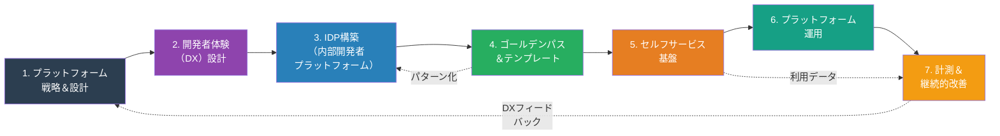
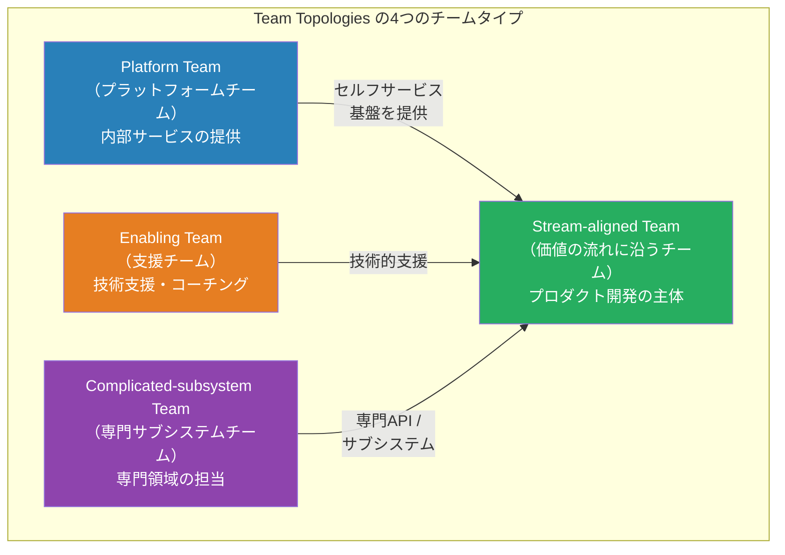
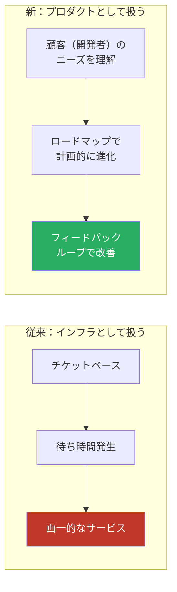
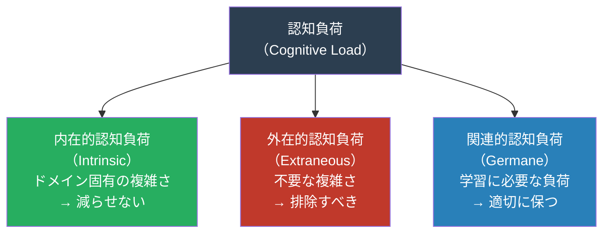
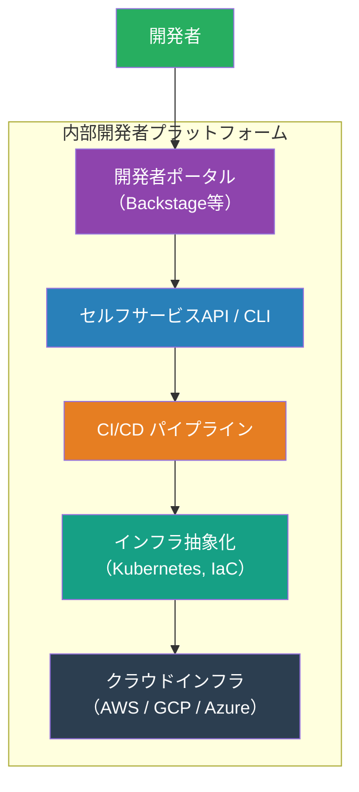
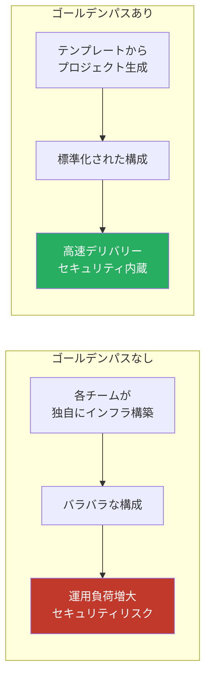
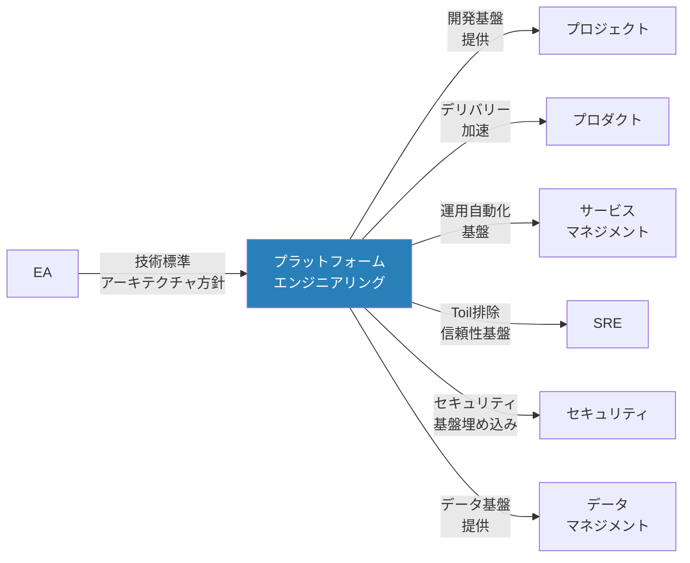

# プラットフォームエンジニアリングマップ — 「開発者体験をどう最適化するか」

> 開発チームが**自律的に、高速に、安全に**ソフトウェアをデリバリーできるように、
> 内部開発者プラットフォーム（IDP）を設計・構築・運用するための
> 工程・タスク・リソースを網羅的に整理したもの

## 他の視点との根本的な違い

| 観点 | SRE | DevOps | プラットフォームエンジニアリング |
|------|-----|--------|-------------------------------|
| 主な関心 | システムの信頼性 | 開発と運用の融合 | 開発者体験（DX）の最適化 |
| アプローチ | SLO/エラーバジェット | 文化・自動化・計測 | プロダクトとしてのプラットフォーム |
| 提供対象 | サービス利用者 | 組織全体 | 内部開発者（顧客） |
| 成功指標 | SLI/SLO達成率 | DORA メトリクス | 開発者満足度・セルフサービス率 |
| 中心人物 | SRE | DevOpsエンジニア | プラットフォームエンジニア |

## プラットフォームエンジニアリング全体像

## Team Topologies とプラットフォームの位置づけ

### インタラクションモード

| モード | 説明 | プラットフォームチームの例 |
|--------|------|--------------------------|
| **X-as-a-Service** | APIやポータル経由でセルフサービス提供 | CI/CDパイプライン、インフラプロビジョニング |
| **Collaboration** | 一時的な密接な協業 | 新プラットフォーム機能の共同開発 |
| **Facilitating** | 技術支援・コーチング | 新ツールの導入支援、ベストプラクティス共有 |

## 1. プラットフォーム戦略＆設計

### 目的

プラットフォームの**ビジョン・スコープ・成功指標**を定め、「プラットフォームをプロダクトとして扱う」戦略を策定する。

### 「プラットフォームをプロダクトとして扱う」とは

### タスク一覧

| # | タスク | 説明 |
|---|--------|------|
| 1 | プラットフォームビジョン策定 | なぜプラットフォームが必要か、どんな世界を目指すか |
| 2 | ユーザー（開発者）リサーチ | 開発者の課題・ニーズ・ペインポイントの調査 |
| 3 | プラットフォームスコープ定義 | 何を提供し、何を提供しないかの境界線 |
| 4 | 成功指標（KPI）設定 | 開発者満足度、セルフサービス率、リードタイム短縮等 |
| 5 | プラットフォームロードマップ策定 | 段階的な機能拡充計画 |
| 6 | チーム編成 | プラットフォームチームの構成・スキルセット定義 |
| 7 | Build vs Buy 判断 | 自社開発 vs OSS vs 商用製品の選定 |

### リソース

| カテゴリ | リソース | 備考 |
|----------|----------|------|
| **人** | プラットフォームプロダクトマネージャー | プラットフォームの方向性・優先順位 |
| **人** | プラットフォームエンジニア | 基盤の設計・構築 |
| **人** | DevEx（開発者体験）スペシャリスト | DX設計・計測 |
| **物** | ユーザーリサーチツール | アンケート、インタビューツール |
| **物** | ロードマップツール | ProductBoard, Linear 等 |
| **金** | チーム人件費 | 専任チームの維持費用 |
| **金** | ツール・インフラ費 | プラットフォーム構築の基盤費用 |

### 成果物

| 成果物 | 形式 | 必須/任意 |
|--------|------|-----------|
| プラットフォームビジョンドキュメント | ドキュメント | 必須 |
| 開発者ペルソナ | ドキュメント | 必須 |
| プラットフォームスコープ定義書 | ドキュメント | 必須 |
| プラットフォームロードマップ | ロードマップ | 必須 |
| KPI定義 | ドキュメント | 必須 |

## 2. 開発者体験（DX）設計

### 目的

開発者が**認知負荷を最小化**して、本来の仕事（ビジネスロジックの実装）に集中できるようにする。

### 認知負荷の3類型

### タスク一覧

| # | タスク | 説明 |
|---|--------|------|
| 1 | 開発者ジャーニーマッピング | オンボーディング→開発→テスト→デプロイの全体フロー |
| 2 | 開発者ペインポイント特定 | アンケート・インタビュー・観察による課題抽出 |
| 3 | ローカル開発環境の標準化 | Dev Container、Nix等による再現可能な環境 |
| 4 | ドキュメンテーション設計 | API仕様、チュートリアル、How-toガイド |
| 5 | オンボーディング最適化 | 新メンバーが初日に本番デプロイできる体制 |
| 6 | 開発者向けCLI / ポータル構築 | 日常タスクの簡素化ツール |

### リソース

| カテゴリ | リソース | 備考 |
|----------|----------|------|
| **人** | DevExデザイナー | 開発者体験の設計 |
| **人** | テクニカルライター | ドキュメント作成 |
| **物** | Dev Container / Codespaces | クラウド開発環境 |
| **物** | ドキュメントサイト | Docusaurus, MkDocs, Backstage TechDocs 等 |
| **金** | 開発環境費 | クラウド開発環境のコスト |

### 成果物

| 成果物 | 形式 | 必須/任意 |
|--------|------|-----------|
| 開発者ジャーニーマップ | 図表 | 必須 |
| DX改善ロードマップ | ドキュメント | 必須 |
| 開発環境セットアップガイド | ドキュメント | 必須 |
| 開発者オンボーディングガイド | Wiki | 必須 |
| 開発者ポータル | Webアプリケーション | 推奨 |

## 3. IDP（内部開発者プラットフォーム）構築

### 目的

開発者が必要なインフラ・ツール・サービスを**セルフサービスで利用できる統合プラットフォーム**を構築する。

### IDPのレイヤー構成

### タスク一覧

| # | タスク | 説明 |
|---|--------|------|
| 1 | IDP アーキテクチャ設計 | レイヤー構成・コンポーネントの設計 |
| 2 | 開発者ポータル構築 | Backstage / Port / Cortex 等の導入・カスタマイズ |
| 3 | サービスカタログ構築 | 組織内のサービス・API・チームの一覧管理 |
| 4 | インフラ抽象化 | Kubernetes + Helm/Kustomize、Terraform モジュール |
| 5 | 共通CI/CDパイプライン構築 | 再利用可能なパイプラインテンプレート |
| 6 | シークレット管理基盤 | Vault等によるシークレットの一元管理 |
| 7 | 可観測性基盤構築 | メトリクス・ログ・トレースの共通基盤 |
| 8 | 環境管理 | Dev / Staging / Production 環境の管理・プロビジョニング |

### リソース

| カテゴリ | リソース | 備考 |
|----------|----------|------|
| **人** | プラットフォームエンジニア | IDP構築の主担当 |
| **人** | SRE | 信頼性要件の反映 |
| **物** | 開発者ポータル | Backstage, Port, Cortex 等 |
| **物** | Kubernetes | EKS, GKE, AKS 等 |
| **物** | IaC | Terraform, Pulumi, Crossplane 等 |
| **物** | GitOps | ArgoCD, Flux 等 |
| **金** | インフラ費用 | Kubernetes クラスタ、クラウドリソース |
| **金** | ツールライセンス | 商用プラットフォームツール |

### 成果物

| 成果物 | 形式 | 必須/任意 |
|--------|------|-----------|
| IDPアーキテクチャ設計書 | ドキュメント / 図表 | 必須 |
| 開発者ポータル | Webアプリケーション | 必須 |
| サービスカタログ | ポータル内 | 必須 |
| 共通パイプラインテンプレート | コード | 必須 |
| インフラモジュール | IaCコード | 必須 |

## 4. ゴールデンパス＆テンプレート

### 目的

**推奨される開発パターン（ゴールデンパス）** を提供し、開発者が最も効率的にサービスを構築できるようにする。強制ではなく、魅力的な「舗装された道」。

### ゴールデンパスの概念

### タスク一覧

| # | タスク | 説明 |
|---|--------|------|
| 1 | アプリケーションテンプレート作成 | 言語/フレームワーク別のスターターキット |
| 2 | インフラテンプレート作成 | Terraform / Helm チャートのテンプレート |
| 3 | CI/CDテンプレート作成 | 再利用可能なパイプライン定義 |
| 4 | 可観測性テンプレート | ダッシュボード・アラートのテンプレート |
| 5 | セキュリティポリシーの埋め込み | Policy as Code（OPA, Kyverno等） |
| 6 | ドキュメンテーションテンプレート | ADR、README、API仕様のテンプレート |
| 7 | テンプレートの継続的メンテナンス | セキュリティパッチ・バージョンアップの反映 |

### リソース

| カテゴリ | リソース | 備考 |
|----------|----------|------|
| **人** | プラットフォームエンジニア | テンプレートの開発・保守 |
| **人** | セキュリティエンジニア | ポリシーの埋め込み |
| **物** | テンプレートエンジン | Cookiecutter, Yeoman, Backstage Software Templates |
| **物** | Policy Engine | OPA/Gatekeeper, Kyverno 等 |

### 成果物

| 成果物 | 形式 | 必須/任意 |
|--------|------|-----------|
| アプリケーションテンプレート一式 | コード | 必須 |
| インフラテンプレート一式 | IaCコード | 必須 |
| CI/CDパイプラインテンプレート | コード | 必須 |
| テンプレート利用ガイド | ドキュメント | 必須 |
| ポリシー定義（Policy as Code） | コード | 必須 |

## 5. セルフサービス基盤

### 目的

開発者がチケットや依頼なしに、**自分自身で**インフラ・サービスのプロビジョニング・管理を行えるようにする。

### タスク一覧

| # | タスク | 説明 |
|---|--------|------|
| 1 | セルフサービスポータル構築 | GUIベースのリソースプロビジョニング |
| 2 | CLI / API 提供 | プログラマティックなリソース操作 |
| 3 | 環境プロビジョニング自動化 | Dev / Staging / Production 環境の自動構築 |
| 4 | DB作成の自動化 | データベースインスタンスのセルフサービス化 |
| 5 | シークレット管理のセルフサービス化 | 開発者が自身でシークレットを管理 |
| 6 | ガードレールの実装 | コスト上限、セキュリティポリシーの自動適用 |
| 7 | アクセス管理のセルフサービス化 | 権限リクエスト・承認フローの自動化 |

### リソース

| カテゴリ | リソース | 備考 |
|----------|----------|------|
| **人** | プラットフォームエンジニア | セルフサービス機能の開発 |
| **物** | Backstage / 開発者ポータル | セルフサービスUI |
| **物** | Crossplane / Terraform | インフラのセルフサービスプロビジョニング |
| **物** | GitOps（ArgoCD / Flux） | 宣言的なリソース管理 |
| **金** | インフラ費用 | セルフサービスで作られるリソースのコスト |

### 成果物

| 成果物 | 形式 | 必須/任意 |
|--------|------|-----------|
| セルフサービスポータル | Webアプリケーション | 必須 |
| セルフサービスAPI / CLI | コード | 必須 |
| ガードレールポリシー | Policy as Code | 必須 |
| セルフサービス利用ガイド | ドキュメント | 必須 |

## 6. プラットフォーム運用

### 目的

プラットフォーム自体を安定的に運用し、内部顧客（開発者）に**信頼性の高いサービス**を提供し続ける。

### タスク一覧

| # | タスク | 説明 |
|---|--------|------|
| 1 | プラットフォームSLI/SLO設定 | プラットフォーム自体の信頼性目標 |
| 2 | プラットフォーム監視 | CI/CD、Kubernetes、開発者ポータル等の監視 |
| 3 | インシデント対応 | プラットフォーム障害時の対応 |
| 4 | キャパシティ管理 | Kubernetesクラスタ等のスケーリング |
| 5 | セキュリティパッチ管理 | プラットフォームコンポーネントの更新 |
| 6 | バージョンアップ管理 | Kubernetes、ツール群のバージョン管理 |
| 7 | コスト最適化 | プラットフォームの運用コスト管理 |
| 8 | サポート / ヘルプデスク | 開発者からの問い合わせ対応 |

### リソース

| カテゴリ | リソース | 備考 |
|----------|----------|------|
| **人** | プラットフォームSRE | プラットフォームの信頼性管理 |
| **人** | プラットフォームサポート | 開発者サポート |
| **物** | 監視基盤 | Grafana, Prometheus, Datadog 等 |
| **物** | アラートツール | PagerDuty, OpsGenie 等 |
| **金** | プラットフォーム運用費 | インフラ＋人件費 |

### 成果物

| 成果物 | 形式 | 必須/任意 |
|--------|------|-----------|
| プラットフォームSLO定義 | ドキュメント | 必須 |
| プラットフォームダッシュボード | ダッシュボード | 必須 |
| プラットフォーム運用手順書 | Wiki | 必須 |
| コスト最適化レポート | レポート（月次） | 必須 |

## 7. 計測＆継続的改善

### 目的

プラットフォームの**成果を定量的に計測**し、開発者体験を継続的に改善する。

### プラットフォームの計測指標

| カテゴリ | 指標 | 説明 |
|----------|------|------|
| **開発者生産性** | DORA 4 Key Metrics | デプロイ頻度、リードタイム、変更失敗率、MTTR |
| **開発者満足度** | DX Survey Score | 定期的な開発者満足度調査 |
| **セルフサービス** | セルフサービス率 | チケットなしで完結した作業の割合 |
| **オンボーディング** | Time to First Deploy | 入社→初回本番デプロイまでの時間 |
| **採用率** | テンプレート利用率 | ゴールデンパスの採用率 |
| **コスト** | コスト効率 | プラットフォーム投資対効果 |

### タスク一覧

| # | タスク | 説明 |
|---|--------|------|
| 1 | 開発者満足度調査 | 定期的なアンケート・NPS計測 |
| 2 | DORA メトリクス計測 | CI/CDパイプラインからの自動収集 |
| 3 | セルフサービス率計測 | チケット数の推移と自動化率 |
| 4 | コスト対効果分析 | プラットフォーム投資のROI算出 |
| 5 | 改善施策の優先順位付け | インパクト × 工数のマトリクスによる判断 |
| 6 | プラットフォームレトロスペクティブ | チーム内の振り返りと改善 |
| 7 | 事例共有 / 成功事例発信 | プラットフォーム活用の好事例を組織に展開 |

### 成果物

| 成果物 | 形式 | 必須/任意 |
|--------|------|-----------|
| 開発者満足度レポート | レポート（四半期） | 必須 |
| DORAメトリクスダッシュボード | ダッシュボード | 必須 |
| プラットフォームROIレポート | レポート | 推奨 |
| 改善バックログ | チケットシステム | 必須 |

## 横断的な視点 — 他視点との関係

### 重要な連携ポイント

| 連携先 | プラットフォームエンジニアリングとの関係 |
|--------|----------------------------------------|
| プロジェクト | プロジェクト開始時のインフラ・ツール基盤の迅速な提供 |
| プロダクト | デリバリー速度の向上。開発チームの生産性最大化 |
| サービスマネジメント | 運用の自動化・セルフサービス化。チケット削減 |
| SRE | 可観測性基盤、CI/CDの信頼性。Toil排除の協働 |
| セキュリティ | Policy as Codeの実装。セキュリティのシフトレフト |
| データマネジメント | データパイプライン基盤、分析環境の提供 |
| EA | 技術標準への準拠。アーキテクチャ決定との整合性 |
