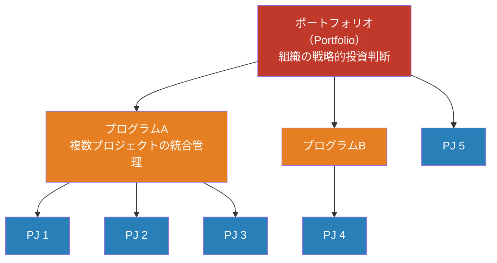
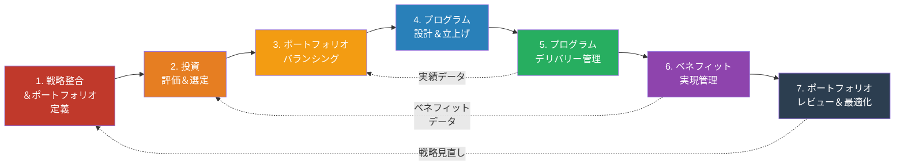
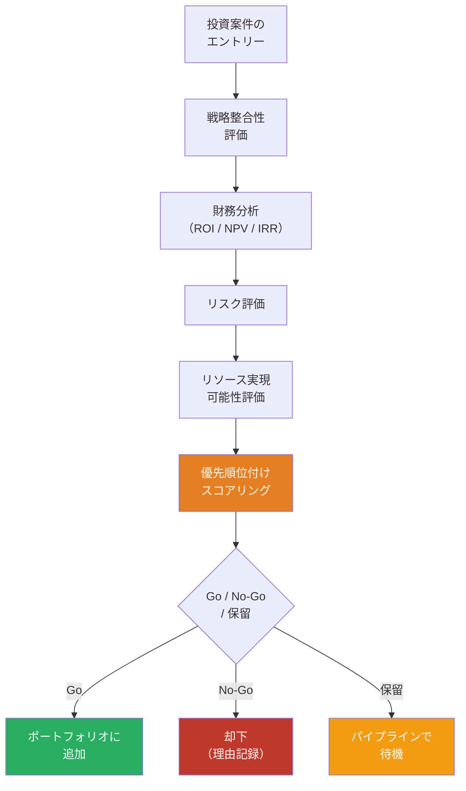
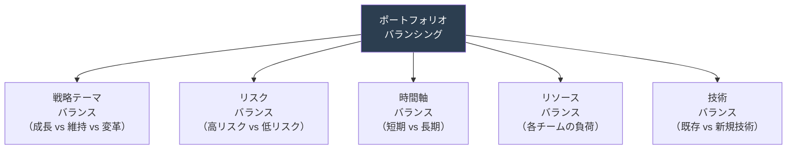
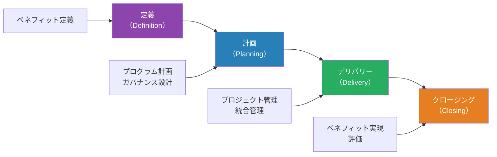
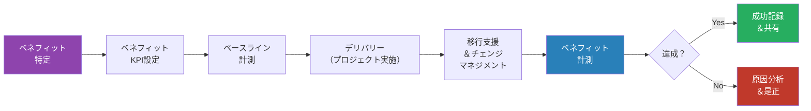
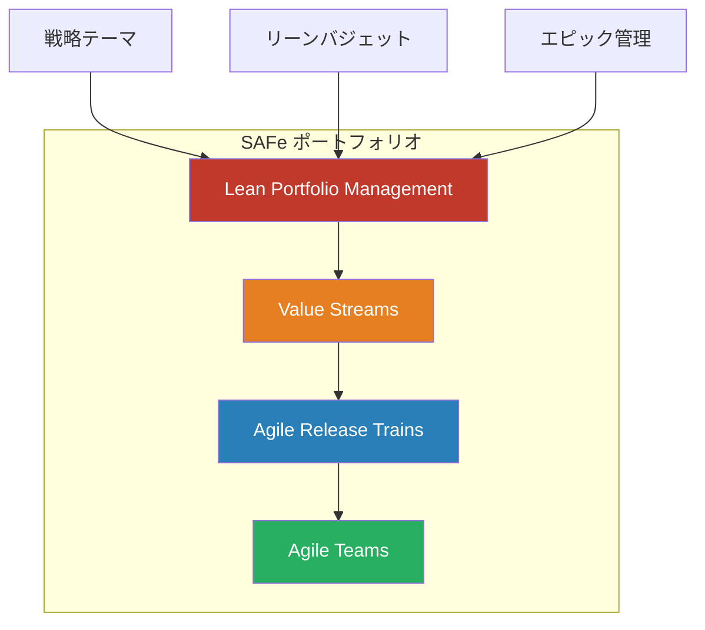
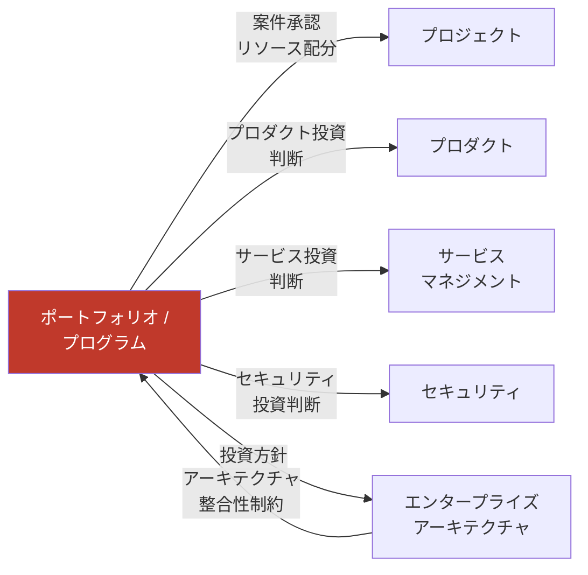

# ポートフォリオ / プログラムマップ — 「複数プロダクト/プロジェクトをどう統括するか」

> 単一プロジェクト・プロダクトではなく、**組織全体の投資・リソースを最適配分**し、
> 複数のプロジェクト/プロダクトを戦略的に統括するための
> 工程・タスク・リソースを網羅的に整理したもの

本ドキュメントは、ポートフォリオ・プログラム・プロジェクトの3層構造を理解しながら、戦略立案から投資判断、実行管理、ベネフィット実現に至る一連のプロセスを体系化しています。企業のCIO、ポートフォリオマネージャー、プログラムマネージャーが日々の意思決定やプロセス設計に参照できるリファレンスとして活用してください。各セクションは独立していますが、全体として循環的に結びついており、環境変化に応じたポートフォリオの最適化が継続的に行われることを前提としています。

## プロジェクト・プログラム・ポートフォリオの階層

上図は、組織の意思決定階層を示しています。ポートフォリオは経営戦略に基づいた「何に投資するか」の判断、プログラムは関連案件の「統合による最大効果」を実現する仕組み、プロジェクトは「具体的にどう作るか」の実行を担当します。各レベルで中心となる人物と責任が異なることに注意してください。

| レベル             | 定義                               | 問い                                       | 中心人物                          |
| ------------------ | ---------------------------------- | ------------------------------------------ | --------------------------------- |
| **ポートフォリオ** | 戦略目標達成のための投資の集合体   | 何に投資すべきか？                         | PfM（ポートフォリオマネージャー） |
| **プログラム**     | 関連するプロジェクトの統合管理     | 全体として最大のベネフィットをどう得るか？ | PgM（プログラムマネージャー）     |
| **プロジェクト**   | 固有の成果物を生み出す一時的な活動 | どう作るか？                               | PM（プロジェクトマネージャー）    |

## ポートフォリオ / プログラム管理 全体像

次図は、ポートフォリオ・プログラム管理の主要なステップを時系列で示しています。戦略整合から始まり、投資評価、実行、ベネフィット実現、最終的な最適化に至るまで、各段階が循環的に結びついていることがポイントです。実績データやベネフィット情報が前工程にフィードバックされることで、継続的な改善が実現されます。

## 1. 戦略整合＆ポートフォリオ定義

### 目的

組織の戦略目標とIT/デジタル投資を**整合**させ、ポートフォリオの方針・ガバナンスを確立する。

この工程は全体的な投資判断の「土台」となります。経営戦略が明確でなければ、その後の評価基準や優先順位付けが曖昧になり、結果として組織全体の力を活かせません。また、ポートフォリオガバナンスの整備により、後続の投資判断が一貫性を持つようになります。

### タスク一覧

本セクションのタスクは、組織の戦略を具体的な投資方針に翻訳し、意思決定体制を整備することに集中しています。このフェーズはポートフォリオ管理の「骨組み作り」であり、戦略翻訳能力とガバナンスデザイン能力が他フェーズより強く求められます。曖昧な戦略定義は後続のすべての評価基準を無効化するため、経営層とIT部門の協働による丁寧な対話が不可欠です。

| #   | タスク                       | 説明                                                         |
| --- | ---------------------------- | ------------------------------------------------------------ |
| 1   | 組織戦略の理解・翻訳         | 経営戦略をIT/デジタル戦略に翻訳                              |
| 2   | ポートフォリオ方針策定       | 投資の方針・基準・ガバナンスルール                           |
| 3   | 戦略テーマの設定             | 投資の方向性を示すテーマ（成長・効率化・コンプライアンス等） |
| 4   | ポートフォリオガバナンス設計 | 意思決定機関・プロセス・権限の設計                           |
| 5   | 投資カテゴリ定義             | Run（維持）/ Grow（成長）/ Transform（変革）等の分類         |
| 6   | ポートフォリオ委員会設立     | 定期的な投資判断を行う経営層の委員会                         |

### リソース

このフェーズはポートフォリオの「意思決定機関立ち上げ」に当たり、経営層の関与度が最も高いフェーズです。PfM・CIO・CFO・事業部門長が一堂に会してガバナンス体制を設計することで、後続フェーズでの投資判断が一貫性を持ちます。ツールよりも「誰が最終判断を担当するのか」「どの基準で承認するのか」という人的・組織的な枠組みづくりが優先されます。

| カテゴリ | リソース                                  | 備考                                    |
| -------- | ----------------------------------------- | --------------------------------------- |
| **人**   | ポートフォリオマネージャー（PfM）         | ポートフォリオ全体の管理                |
| **人**   | CIO / CTO                                 | 技術投資の最終意思決定                  |
| **人**   | CFO / 財務部門                            | 投資の財務的評価                        |
| **人**   | 事業部門長                                | ビジネスニーズの代表                    |
| **物**   | PPM（Project Portfolio Management）ツール | Planview, ServiceNow SPM, Jira Align 等 |
| **物**   | 戦略マッピングツール                      | Miro, Strategy Map 等                   |
| **金**   | IT投資予算                                | 組織全体のIT投資枠                      |

### 成果物

本フェーズの成果物は、後続のすべての投資判断基準となります。これらのドキュメントは経営陣の投資判断会議で参照され、「なぜこの案件を選ぶのか」という説得力を持たせる役割を果たします。また、組織内のすべてのプロジェクト提案者が「何を評価軸として申請すべきか」を理解するための指針となるため、明確で納得感の高い記述が求められます。

| 成果物                       | 形式         | 必須/任意 |
| ---------------------------- | ------------ | --------- |
| ポートフォリオ戦略書         | ドキュメント | 必須      |
| 投資ガバナンスフレームワーク | ドキュメント | 必須      |
| 戦略テーマ一覧               | ドキュメント | 必須      |
| 投資カテゴリ定義             | ドキュメント | 必須      |
| ポートフォリオ委員会規約     | ドキュメント | 必須      |

## 2. 投資評価＆選定

### 目的

新規投資案件を**公平・客観的に評価**し、限られた予算・リソースを最もインパクトのある案件に配分する。

この工程は、主観的な判断や政治的な圧力から組織を守り、科学的で再現可能な投資判断を実現するために不可欠です。複数の評価軸（戦略整合性、財務、リスク、リソース）を組み合わせることで、短期利益と長期戦略のバランスを取った意思決定が可能になります。

### 投資評価のフレームワーク

以下は、投資案件がどのようなプロセスを経て承認・却下・保留されるかを示しています。各段階での評価が透明性を持つことで、申請者にも経営陣にも説得力のある判断基準を提供できます。

本セクションのタスクは、案件を複数の視点から多角的に評価し、スコアリングによってランク付けすることに注力しています。

### タスク一覧

このフェーズの特有な課題は「定量（財務）と定性（戦略整合）のバランス」にあり、両者の加重平均をどう設計するかが実質的な投資判断に大きな影響を与えます。ビジネスアナリスト・ファイナンス・テクニカルアーキテクトが協働して、多元的で透明性の高いスコアリングモデルを構築することが求められます。

| #   | タスク                 | 説明                                         |
| --- | ---------------------- | -------------------------------------------- |
| 1   | ビジネスケース作成     | 投資の目的・期待効果・コスト・リスクの文書化 |
| 2   | 戦略整合性評価         | 組織戦略テーマとの一致度スコアリング         |
| 3   | 財務分析               | ROI、NPV、IRR、Payback Period の算出         |
| 4   | リスク評価             | 技術リスク・市場リスク・組織リスクの評価     |
| 5   | リソース実現可能性評価 | 人材・スキル・インフラの確保可能性           |
| 6   | 加重スコアリング       | 複数基準の加重平均によるランキング           |
| 7   | パイプライン管理       | 検討中案件のステータス管理                   |

### リソース

第1フェーズの「方針立案」から本フェーズへ移行すると、実務レベルの専門スキルの比重が急増します。CFOやCIOといった経営層ではなく、ビジネス・財務・技術の各領域の分析専門家が主役となります。PPMツールの導入も本フェーズ以降に本格化し、評価の自動化・可視化により多数案件の処理が可能になります。

| カテゴリ | リソース               | 備考                             |
| -------- | ---------------------- | -------------------------------- |
| **人**   | ビジネスアナリスト     | ビジネスケース作成支援           |
| **人**   | ファイナンスアナリスト | 財務分析                         |
| **人**   | テクニカルアーキテクト | 技術的実現可能性評価             |
| **物**   | スコアリングモデル     | スプレッドシート / PPMツール     |
| **物**   | PPMツール              | Planview, Clarity, Jira Align 等 |

### 成果物

本フェーズの成果物は、実行段階のプログラムマネージャーやプロジェクトマネージャーに引き継がれます。特にビジネスケースとスコアリング結果は、「なぜこのプロジェクトが選ばれたのか」という背景理解を与え、実行時のモチベーション向上と戦略整合性の維持に寄与します。投資パイプライン一覧は経営層の継続的な意思決定を支援する重要なダッシュボードとなります。

| 成果物               | 形式                              | 必須/任意      |
| -------------------- | --------------------------------- | -------------- |
| ビジネスケース       | ドキュメント                      | 必須（各案件） |
| 投資評価スコアカード | スプレッドシート                  | 必須           |
| 投資パイプライン一覧 | ダッシュボード / スプレッドシート | 必須           |
| Go/No-Go判定記録     | ドキュメント                      | 必須           |

## 3. ポートフォリオバランシング

### 目的

ポートフォリオ全体の**バランスを最適化**し、リスクの分散と戦略目標の達成を確保する。

各案件を個別に評価することと同様に重要なのが、ポートフォリオ全体のバランスです。短期収益案件ばかりでは長期戦略が実現できず、逆に高リスク案件の集中は経営を危機に陥れます。本工程では、複数の視点（戦略、リスク、時間軸、リソース、技術）を統合的に見ながら、ポートフォリオ全体の最適構成を実現します。

### バランシングの視点

以下は、ポートフォリオを評価する複数の観点を示しています。経営層の判断時には、これら5つの視点すべてが適切に考慮される必要があります。

本セクションのタスクは、ポートフォリオの可視化から始まり、複数の分析結果に基づいてリバランスを実行することに集中しています。

### タスク一覧

このフェーズは「個別案件の評価」から「全体最適化」への転換点であり、ポートフォリオマネージャーの判断力が最も問われます。複数視点（戦略・リスク・時間軸・リソース・技術）の分析から、矛盾する最適化要求（例：短期利益と長期投資）をバランスさせながら、実現可能かつ戦略的に有効なポートフォリオ構成を導き出す能力が他フェーズより強く求められます。

| #   | タスク                           | 説明                                               |
| --- | -------------------------------- | -------------------------------------------------- |
| 1   | ポートフォリオ可視化             | バブルチャート、ヒートマップ等による全体像の可視化 |
| 2   | 戦略テーマ配分分析               | 各テーマへの投資比率の確認・調整                   |
| 3   | リスクプロファイル分析           | ポートフォリオ全体のリスク分布の確認               |
| 4   | リソース配分最適化               | ボトルネックの特定・リソースの再配分               |
| 5   | 依存関係分析                     | プロジェクト間の依存関係の可視化・管理             |
| 6   | What-if分析                      | シナリオ別のポートフォリオ影響シミュレーション     |
| 7   | ポートフォリオ調整（リバランス） | 評価結果に基づく案件の追加・中止・延期             |

### 成果物

本フェーズの成果物はポートフォリオダッシュボードに集約され、経営層の定期レビュー（四半期ごと）や外部環境変化時の意思決定を支援します。バランシングレポートとリソース配分マトリクスは、プログラム設計フェーズへの「正式な投資指示書」として機能し、次フェーズのプログラムマネージャーがリソース調達や体制構築を開始する基準となります。

| 成果物                         | 形式             | 必須/任意 |
| ------------------------------ | ---------------- | --------- |
| ポートフォリオダッシュボード   | ダッシュボード   | 必須      |
| バランシングレポート（四半期） | レポート         | 必須      |
| リソース配分マトリクス         | スプレッドシート | 必須      |
| 依存関係マップ                 | 図表             | 必須      |

## 4. プログラム設計＆立上げ

### 目的

関連するプロジェクトを**プログラムとして統合**し、個別では得られない**シナジーとベネフィット**を実現する。

ここまでのプロセスで「何をやるか」が決定されました。本工程からは、その実現に向けた「どのように進めるか」の準備が始まります。プログラムの設計段階では、ベネフィットの具体化、組織体制、ガバナンス、リスク管理など、成功の基礎となる要素をすべて定義します。この段階での丁寧な設計が、後のデリバリー段階での混乱や失敗を大きく減らします。

### プログラムのライフサイクル

下図は、プログラムが定義から計画、デリバリー、クロージングに至るまでの全体像を示しています。各フェーズで並行して行われるべき活動（ベネフィット定義、ガバナンス設計、統合管理、ベネフィット実現評価）が重要です。

本セクションのタスクは、プログラムの基本的な枠組みを整備することに焦点を当てています。

### タスク一覧

このフェーズは「戦略」から「実行」への転換地点であり、プログラムマネージャーが中心となって「複数プロジェクトの統合」を具体化します。従来のプロジェクト管理とは異なり、プログラムレベルではベネフィット定義・組織設計・ステークホルダーマネジメントなど、戦略的・組織的なスキルがプロジェクト実行スキルと同等以上に求められる点が特有です。

| #   | タスク                   | 説明                                             |
| --- | ------------------------ | ------------------------------------------------ |
| 1   | プログラムチャーター作成 | プログラムの目的・スコープ・ベネフィットの定義   |
| 2   | ベネフィットマップ作成   | 期待されるベネフィットとその達成経路の明確化     |
| 3   | プログラム組織設計       | プログラムボード、PMO、各プロジェクトの関係      |
| 4   | プログラム計画策定       | 全体スケジュール、マイルストーン、依存関係の計画 |
| 5   | リスク管理計画           | プログラムレベルのリスク管理                     |
| 6   | コミュニケーション計画   | ステークホルダー間の情報共有計画                 |
| 7   | 品質管理計画             | プログラム全体の品質基準                         |

### リソース

本フェーズは「投資判断が確定」した後の本格的な組織体制構築の段階です。PgMやPMOといったガバナンス機能が本格稼働し、複数プロジェクト管理に必要な各機能（ビジネス、技術、運営）が揃うことが、後続のデリバリー成功の条件となります。特にビジネススポンサーの関与度が高まり、IT主導ではなく「ビジネス-IT協働」のモデルが実現される重要な時点です。

| カテゴリ | リソース                        | 備考                                    |
| -------- | ------------------------------- | --------------------------------------- |
| **人**   | プログラムマネージャー（PgM）   | プログラム全体の責任者                  |
| **人**   | PMO（プロジェクト管理オフィス） | 管理プロセスの標準化・支援              |
| **人**   | ビジネススポンサー              | ベネフィット実現の最終責任者            |
| **人**   | アーキテクト                    | 技術的整合性の確保                      |
| **物**   | PPMツール                       | Planview, Jira Align, ServiceNow SPM 等 |
| **物**   | コラボレーションツール          | Confluence, Teams, Slack 等             |
| **金**   | プログラム予算                  | 全プロジェクトの合計＋プログラム管理費  |

### 成果物

本フェーズの成果物は、次の実行フェーズへの「契約書」的役割を果たします。プログラムチャーターとベネフィットマップは、全ステークホルダーが「何を達成すべきか」を共通理解する基盤となり、プログラム計画書とリスク台帳は、実装時のリスク対応や課題解決の「正式な指針」として機能します。これらが曖昧なままデリバリーに進むと、後の混乱や失敗につながるため、実装前の丁寧な承認が不可欠です。

| 成果物                   | 形式             | 必須/任意 |
| ------------------------ | ---------------- | --------- |
| プログラムチャーター     | ドキュメント     | 必須      |
| ベネフィットマップ       | 図表             | 必須      |
| プログラム計画書         | ドキュメント     | 必須      |
| プログラム組織図         | 図表             | 必須      |
| リスク台帳（プログラム） | スプレッドシート | 必須      |
| コミュニケーション計画   | ドキュメント     | 必須      |

## 5. プログラムデリバリー管理

### 目的

プログラム内の複数プロジェクトを**統合的に管理**し、全体最適でのデリバリーを実現する。

設計フェーズで計画が確定した後、実際の実行管理が本工程の主眼です。複数プロジェクトが並行して動く中では、スケジュール依存性、リソース競合、リスクの波及効果など、個別プロジェクトマネジメントでは対応できない課題が生じます。プログラムレベルの統合管理により、個別最適ではなく全体最適でのデリバリーを確保します。

### タスク一覧

本セクションのタスクは、進行中のプロジェクト群を統合的に監視・調整することに集中しています。

このフェーズは複数プロジェクトの「全体最適」を実現するプログラムマネジメントの核であり、個別プロジェクト管理とは異なる統合的視点が求められます。スケジュール依存性、リソース競合、リスク波及などの「プロジェクト間の相互作用」を管理し、各プロジェクトが部分最適に陥らないように方向づけることが最大の特有課題です。また、経営層への定期報告によって戦略的な意思決定（追加投資、中止判断など）をサポートする役割も重要です。

| #   | タスク                       | 説明                                           |
| --- | ---------------------------- | ---------------------------------------------- |
| 1   | 統合スケジュール管理         | プロジェクト間の依存関係を含む全体スケジュール |
| 2   | 横断的リソース管理           | チーム間のリソース共有・調整                   |
| 3   | 統合リスク管理               | プロジェクト間のリスク影響の管理               |
| 4   | 統合変更管理                 | プログラムレベルの変更要求管理                 |
| 5   | 課題＆依存関係管理           | プロジェクト間のブロッカー解消                 |
| 6   | ステークホルダーマネジメント | 経営層・事業部門への定期報告                   |
| 7   | プログラムレベルの品質保証   | 各プロジェクト横断の品質監視                   |
| 8   | ベンダー管理                 | 外部委託先との契約・パフォーマンス管理         |

### リソース

本フェーズではPgMが主役となり、PMOが支援する「統合管理体制」が本格稼働します。設計フェーズで定義された体制が実際に機能するかが問われる段階です。各プロジェクトマネージャーとの定期的な調整会議、ステークホルダーへのレポーティングなど、「人と組織」のマネジメントの比重が実装スキルと同等かそれ以上に高まります。

| カテゴリ | リソース                 | 備考                           |
| -------- | ------------------------ | ------------------------------ |
| **人**   | PgM                      | 統合管理の主担当               |
| **人**   | PMO                      | レポーティング・プロセス支援   |
| **人**   | 各PJ の PM               | 個別プロジェクトの管理         |
| **物**   | 統合ダッシュボード       | PPMツール / 自作ダッシュボード |
| **物**   | コミュニケーションツール | Slack, Teams, メール等         |
| **金**   | PMO運営費                | PMOチームの人件費・ツール費    |

### 成果物

本フェーズの成果物は、主に「進捗監視」と「意思決定支援」という2つの役割を担います。プログラムステータスレポートと統合スケジュールは、次フェーズのベネフィット実現管理チームに引き継がれ、実際のビジネス効果測定の基礎データとなります。経営レポートは、リスク顕在化や投資の追加承認が必要な場合の意思決定を促進し、ポートフォリオレビューフェーズへのインプットとなります。

| 成果物                       | 形式                        | 必須/任意 |
| ---------------------------- | --------------------------- | --------- |
| プログラムステータスレポート | レポート（月次/隔週）       | 必須      |
| 統合スケジュール             | ガントチャート              | 必須      |
| 課題・リスク管理台帳         | スプレッドシート / チケット | 必須      |
| 経営レポート                 | プレゼンテーション          | 必須      |

## 6. ベネフィット実現管理

### 目的

投資の期待効果（ベネフィット）が**実際に実現されたか**を測定・追跡し、投資の正当性を証明する。

デリバリーが完了してもプログラムの責任は終わりません。期待されたベネフィットが実際に現れなければ、その投資は成功ではありません。本工程は、ビジネス側とITが協力して変革を推進し、成功を測定・証明するための仕組みです。ベネフィットが未達に終わった場合は、その原因を分析し、組織学習へと活かすことも重要な役割です。

### ベネフィット実現管理のフロー

下図は、ベネフィット実現の全体プロセスを示しています。投資前のベースライン計測から投資後の計測、達成度の判定、さらに未達時の是正まで、科学的で説得力のある仕組みが必要です。

本セクションのタスクは、ベネフィット定義から実装、測定に至る一連のプロセスを確立することに集中しています。

### タスク一覧

このフェーズはIT部門からビジネス部門への「責任の引き渡し」が明確に起こる局面です。プロジェクトのデリバリーが完了してもベネフィットは自動には実現されず、組織変革（チェンジマネジメント）とそれに続く継続的な改善活動が必要です。ベネフィットオーナーやチェンジマネージャーの活躍度が他フェーズより高く、ビジネス的な「パフォーマンス改善」の実現能力が強く求められる点が特有です。

| #   | タスク                     | 説明                                             |
| --- | -------------------------- | ------------------------------------------------ |
| 1   | ベネフィット特定・定義     | 期待する効果の具体的定義（定量/定性）            |
| 2   | ベネフィットKPI設定        | 測定可能な指標の設定                             |
| 3   | ベースライン計測           | 投資前の現状値の記録                             |
| 4   | ベネフィット実現計画       | ベネフィットを得るために必要なアクションの計画   |
| 5   | チェンジマネジメント       | 組織変革の推進（新システム導入に伴う業務変革等） |
| 6   | ベネフィット計測・レポート | 投資後のKPI測定・前後比較                        |
| 7   | ベネフィット未達時の分析   | 原因分析と追加施策の検討                         |
| 8   | 投資後レビュー（PIR）      | 投資全体の振り返り・教訓抽出                     |

### リソース

本フェーズでは、IT部門のリソース（PgM、PMOなど）から、ビジネス部門のリソース（ベネフィットオーナー、チェンジマネージャー、ビジネスアナリスト）への「パワーシフト」が起こります。デリバリーの完了はプログラムの終了ではなく、ベネフィット実現による「価値創造」の開始であるという認識が重要です。BIツールによるKPI可視化は、経営層の継続的な改善判断を支援する仕組みとなります。

| カテゴリ | リソース             | 備考                                   |
| -------- | -------------------- | -------------------------------------- |
| **人**   | ベネフィットオーナー | ベネフィット実現の責任者（ビジネス側） |
| **人**   | チェンジマネージャー | 組織変革の推進                         |
| **人**   | ビジネスアナリスト   | KPI計測・分析                          |
| **物**   | BIツール             | KPIの可視化                            |
| **物**   | PPMツール            | ベネフィット追跡機能                   |

### 成果物

本フェーズの成果物は、「経営層の次の意思決定」と「組織学習」の2つを支援します。ベネフィット実現レポートと投資後レビュー（PIR）は、その投資が本当に価値を生み出したかを証明する重要な記録であり、ポートフォリオレビュー時の投資案件の継続・中止判断に直結します。また、教訓記録は組織全体のプログラム管理成熟度向上へのフィードバックとなり、次回の投資判断を賢くします。

| 成果物                         | 形式             | 必須/任意 |
| ------------------------------ | ---------------- | --------- |
| ベネフィット実現計画           | ドキュメント     | 必須      |
| ベネフィットトラッキングシート | スプレッドシート | 必須      |
| ベネフィット実現レポート       | レポート         | 必須      |
| 投資後レビュー（PIR）          | レポート         | 必須      |
| 教訓記録（Lessons Learned）    | ドキュメント     | 必須      |

## 7. ポートフォリオレビュー＆最適化

### 目的

ポートフォリオ全体を定期的にレビューし、変化する環境に合わせて**最適化**する。

ベネフィット実現と並行して、経営環境の変化によってポートフォリオそのものの見直しが必要です。新規の投資機会が生まれたり、戦略が変わったり、既存プロジェクトのROIが期待値を下回ったりするなど、外部環境と内部実績は常に変動しています。本工程は、全体像を俯瞰しながら継続的に最適化を行い、組織のリソースが常に最高の価値を生み出すプロジェクト/プログラムに配分されている状態を維持します。

### タスク一覧

本セクションのタスクは、定期的なレビューと分析に基づいて、ポートフォリオの動的な調整を行うことに集中しています。このフェーズは全7フェーズのサイクルを「完成」させるとともに、次のサイクルへ向けた「改善」を実現する段階です。従来型の年次投資計画とは異なり、四半期ごとの定期レビューと臨機応変な追加投資判断により、市場変化への適応性を高めます。ベネフィット実現データに基づいた「事実ベース」の意思決定と、ポートフォリオ成熟度評価による「管理プロセス自体の継続改善」が求められる点が特有です。

| #   | タスク                     | 説明                                     |
| --- | -------------------------- | ---------------------------------------- |
| 1   | ポートフォリオ定期レビュー | 四半期ごとの全体レビュー                 |
| 2   | パフォーマンス分析         | 各案件のKPI達成状況・コスト実績の分析    |
| 3   | 戦略変化の影響評価         | 経営環境変化によるポートフォリオへの影響 |
| 4   | 案件の中止・延期判断       | 投資対効果が低い案件の終了判断           |
| 5   | 新規案件の追加評価         | 新たな投資機会の評価・追加               |
| 6   | リソース再配分             | 優先順位に基づくリソースの再配分         |
| 7   | ポートフォリオ成熟度評価   | 管理プロセス自体の成熟度評価・改善       |

### 成果物

本フェーズの成果物は、経営層の継続的な意思決定を支援する最重要な情報源です。ポートフォリオレビューレポートは新規投資の承認・既存案件の中止判断など重大な経営判断を促し、経営陣向けダッシュボードは常時更新される「ポートフォリオの健全性インジケーター」として機能します。最適化アクション計画は、次の第1フェーズへのループバック（戦略見直し）につながり、組織全体の継続的改善の仕組みを完成させます。

| 成果物                         | 形式               | 必須/任意 |
| ------------------------------ | ------------------ | --------- |
| ポートフォリオレビューレポート | レポート（四半期） | 必須      |
| 最適化アクション計画           | ドキュメント       | 必須      |
| 成熟度評価レポート             | レポート（年次）   | 任意      |
| 経営陣向けダッシュボード       | ダッシュボード     | 必須      |

## アジャイルにおけるポートフォリオ管理（SAFe）

近年、大規模アジャイル導入企業の間では、従来型のウォーターフォール式ポートフォリオ管理ではなく、アジャイルの価値観を組み込んだ管理方式が注目されています。代表例がScaled Agile Framework（SAFe）の「Lean Portfolio Management」です。以下は、その階層構造と特徴を示しています。

SAFeのポートフォリオ管理は、Lean Startup的な仮説検証を組み込み、継続的な学習と迅速な方向転換を可能にします。これにより、市場変化への適応性が向上します。

### SAFe ポートフォリオの特徴

下表は、従来型（ウォーターフォール的）の投資判断アプローチと、アジャイル的なLean Portfolio Managementの考え方の相違をまとめています。どちらが優れているかではなく、企業の戦略と組織文化、プロダクトの特性に応じて選択または組み合わせることが重要です。

| 従来型ポートフォリオ管理 | Lean Portfolio Management（SAFe）    |
| ------------------------ | ------------------------------------ |
| 年次の予算策定           | リーンバジェット（ガードレール付き） |
| プロジェクト単位の管理   | バリューストリーム単位の管理         |
| ゲート審査で承認         | エピック仮説の検証（Lean Startup）   |
| 固定スコープ             | 継続的なポートフォリオ見直し         |

## 横断的な視点 — 他視点との関係

ポートフォリオ・プログラム管理は、組織内の他の管理機能（プロジェクト、プロダクト、サービス、セキュリティ、EA等）と密接に連携しながら機能します。以下は、ポートフォリオが他機能とどのような関係にあるかを示しています。「投資判断」という上位の管理機能が、下流の実行機能に対して指針を与えつつ、同時に実績フィードバックの受け手となる、双方向の関係を理解することが重要です。

ポートフォリオ管理は「経営戦略」と「実行現場」の橋渡しとなる重要な役割を果たしています。上位の経営判断を下位に展開しながら、実績データを吸い上げて戦略を動的に調整することで、組織全体の一体性を保ちます。

### 重要な連携ポイント

各連携先とどのような関係を持つべきか、具体的なポイントをまとめています。これらの連携が有効に機能してこそ、ポートフォリオ管理は単なる予算管理ツールではなく、組織全体の戦略実行を加速させる仕組みとなります。

| 連携先               | ポートフォリオ/プログラムとの関係                                            |
| -------------------- | ---------------------------------------------------------------------------- |
| プロジェクト         | プロジェクトの承認・優先順位・リソース配分。プロジェクト実績のフィードバック |
| プロダクト           | プロダクトへの投資判断。プロダクトポートフォリオの管理                       |
| サービスマネジメント | 運用投資の判断。Run/Grow/Transform の配分                                    |
| セキュリティ         | セキュリティ投資の最適配分                                                   |
| データマネジメント   | データ基盤投資の判断                                                         |
| プラットフォーム     | プラットフォーム投資のROI評価                                                |
| EA                   | 投資がEAの方針に整合しているかの確認                                         |
