# プロダクトライフサイクルマップ — 「何を作り、どう育てるか」

> プロジェクト（＝作って終わり）ではなく、**プロダクト（＝継続的に価値を届け、育て続ける）** の視点で
> 必要な工程・タスク・リソース・成果物を網羅的に整理したもの

## プロジェクト視点との根本的な違い

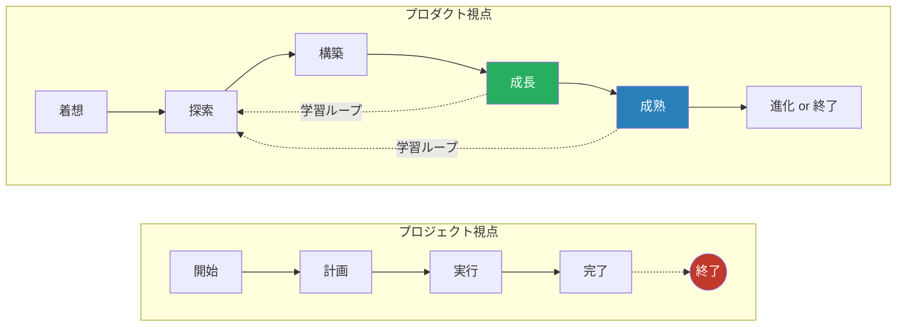

| 観点 | プロジェクト | プロダクト |
|------|-------------|-----------|
| ゴール | スコープ内の成果物を期限内に納品する | 継続的にユーザーへ価値を届け、ビジネス成果を出す |
| 時間軸 | 有期（開始→完了） | 無期限（プロダクトが生きている限り続く） |
| 成功指標 | QCD（品質・コスト・納期） | アウトカム（ユーザー価値・ビジネスKPI） |
| 変更への態度 | 管理し、最小化する | 歓迎し、学習の糧にする |
| 中心人物 | プロジェクトマネージャー | プロダクトマネージャー |

## プロダクトライフサイクル全体像

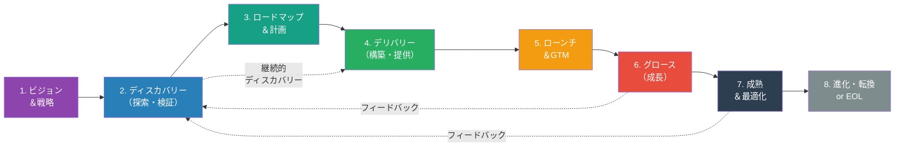

## ダブルダイヤモンドとプロダクト開発

プロダクト開発では「正しいものを作る（Discovery）」と「正しく作る（Delivery）」の両輪が不可欠です。

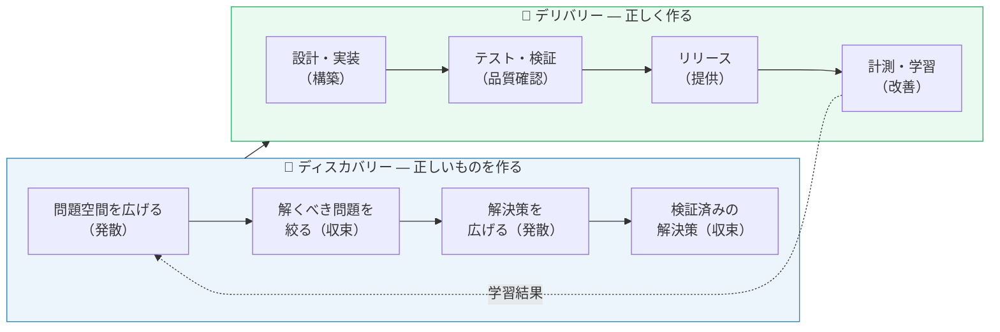

## 1. プロダクトビジョン＆戦略

### 目的

プロダクトの存在意義（Why）を定め、中長期的な方向性を示す。全員が同じ北極星を見て走れるようにする。

### タスク一覧

| # | タスク | 説明 |
|---|--------|------|
| 1 | プロダクトビジョンの策定 | 「誰の」「どんな課題を」「どう解決するか」を一文で表現 |
| 2 | 市場機会の評価 | TAM/SAM/SOM分析、市場トレンド、タイミングの妥当性 |
| 3 | 競合・代替手段の分析 | 競合マッピング、差別化ポイントの明確化 |
| 4 | ターゲットユーザーの定義 | ペルソナ作成、ジョブ理論（JTBD）による分析 |
| 5 | ビジネスモデル設計 | 収益モデル、価格戦略、ユニットエコノミクス試算 |
| 6 | プロダクト戦略の策定 | 勝ち筋（どこで戦い、どう勝つか）の明文化 |
| 7 | 成功指標（North Star Metric）の定義 | プロダクト全体の健全性を測る最重要指標 |
| 8 | ステークホルダーアライメント | 経営層・投資家・事業部門との合意形成 |

### リソース

| カテゴリ | リソース | 備考 |
|----------|----------|------|
| **人** | プロダクトマネージャー / CPO | ビジョン策定の中心 |
| **人** | 経営層 / ファウンダー | 事業判断・投資判断 |
| **人** | UXリサーチャー | ユーザー課題の深掘り |
| **人** | データアナリスト | 市場データ分析 |
| **人** | ビジネスデベロッパー | ビジネスモデル設計 |
| **物** | 市場調査データ | Statista, 業界レポート等 |
| **物** | 戦略フレームワーク | Lean Canvas, Business Model Canvas |
| **物** | コラボレーションツール | Miro, FigJam, Notion |
| **金** | 市場調査費 | 外部レポート・コンサルティング |
| **金** | ユーザーリサーチ費 | インタビュー謝礼・リクルーティング費 |

### 成果物

| 成果物 | 形式 | 必須/任意 |
|--------|------|-----------|
| プロダクトビジョンステートメント | 1ページドキュメント | 必須 |
| プロダクト戦略ドキュメント | ドキュメント | 必須 |
| Lean Canvas / Business Model Canvas | キャンバス | 必須 |
| ペルソナドキュメント | ドキュメント | 必須 |
| 競合分析マトリクス | スプレッドシート / 図表 | 必須 |
| TAM/SAM/SOM分析 | スプレッドシート | 任意 |
| North Star Metric定義書 | ドキュメント | 必須 |

## 2. プロダクトディスカバリー（探索・検証）

### 目的

「何を作るべきか」を、仮説と検証のサイクルで見極める。作る前にリスクを潰す。

### 4つのリスク

Marty Cagan のフレームワークに基づく、ディスカバリーで検証すべき4つのリスク：

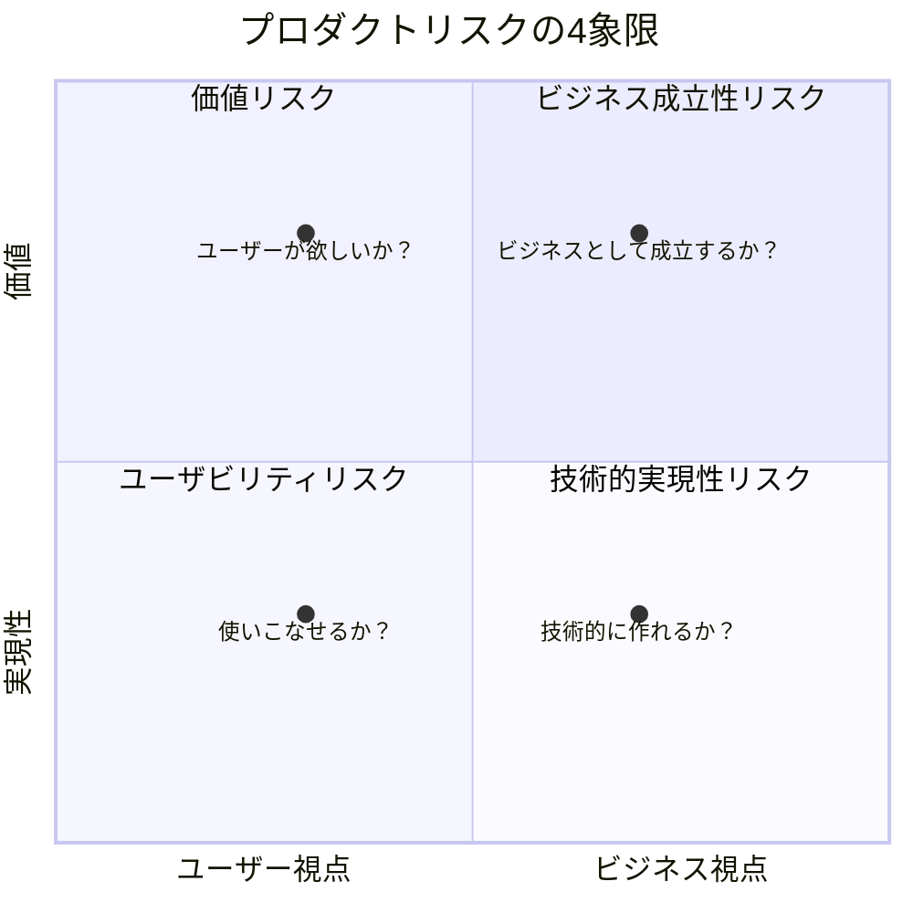

| リスク | 問い | 検証手法 |
|--------|------|----------|
| **価値リスク** | ユーザーが本当に欲しいか？ | ユーザーインタビュー、プロトタイプテスト |
| **ユーザビリティリスク** | ユーザーが使いこなせるか？ | ユーザビリティテスト、Wizrd of Oz テスト |
| **技術的実現性リスク** | 技術的に実現可能か？ | テックスパイク、PoC |
| **ビジネス成立性リスク** | ビジネスとして成立するか？ | ユニットエコノミクス試算、ステークホルダーレビュー |

### タスク一覧

| # | タスク | 説明 |
|---|--------|------|
| 1 | ユーザーインタビュー | 課題・ニーズ・行動の深掘り（定性調査） |
| 2 | 定量データ分析 | 既存データから行動パターン・トレンドを読む |
| 3 | 問題の構造化 | Opportunity Solution Tree、ジョブマップの作成 |
| 4 | 仮説の立案 | 「〜すれば、〜になるだろう」形式で明文化 |
| 5 | プロトタイプ作成 | ペーパー / ローファイ / ハイファイプロトタイプ |
| 6 | ユーザビリティテスト | プロトタイプを使った操作テスト |
| 7 | テックスパイク | 技術的不確実性の高い部分の検証 |
| 8 | 実験設計と実施 | A/Bテスト、Fake Door テスト、コンシェルジュMVP |
| 9 | 仮説の検証・学習 | 結果の分析、仮説の更新（ピボット or 継続） |
| 10 | ステークホルダーとの合意 | 検証結果に基づくGo/No-Go判断 |

### リソース

| カテゴリ | リソース | 備考 |
|----------|----------|------|
| **人** | プロダクトマネージャー | ディスカバリーのリード |
| **人** | プロダクトデザイナー | プロトタイプ・UXリサーチ |
| **人** | UXリサーチャー | ユーザーインタビュー・テスト設計 |
| **人** | テックリード / エンジニア | テックスパイク・実現性評価 |
| **人** | データアナリスト | 定量分析・実験分析 |
| **物** | プロトタイピングツール | Figma, Adobe XD, Framer |
| **物** | ユーザーリサーチツール | UserTesting, Maze, Hotjar |
| **物** | 分析ツール | Mixpanel, Amplitude, GA4 |
| **物** | 仮説管理ボード | Notion, Miro, スプレッドシート |
| **金** | リサーチ参加者謝礼 | 1回あたり数千〜数万円 × 人数 |
| **金** | プロトタイプ制作費 | デザイナー工数 |
| **金** | 実験用インフラ費 | MVP / PoC のインフラ費用 |

### 成果物

| 成果物 | 形式 | 必須/任意 |
|--------|------|-----------|
| ユーザーインタビューレポート | ドキュメント | 必須 |
| ペルソナ / ジョブマップ | 図表 | 必須 |
| Opportunity Solution Tree | 図表 | 任意 |
| 仮説一覧・検証結果ログ | スプレッドシート | 必須 |
| プロトタイプ | Figma等デザインファイル | 必須 |
| ユーザビリティテスト報告書 | ドキュメント | 必須 |
| テックスパイク結果 | ドキュメント / コード | 任意 |
| 実験結果レポート | ドキュメント | 任意 |
| ディスカバリーまとめ（Go/No-Go判断材料） | ドキュメント | 必須 |

## 3. プロダクトロードマップ＆計画

### 目的

ビジョンと戦略をもとに、「いつ頃」「何を」「なぜ」届けるかの見通しを示す。ただし詳細なガントチャートではなく、**アウトカムベース**で語る。

### ロードマップの階層

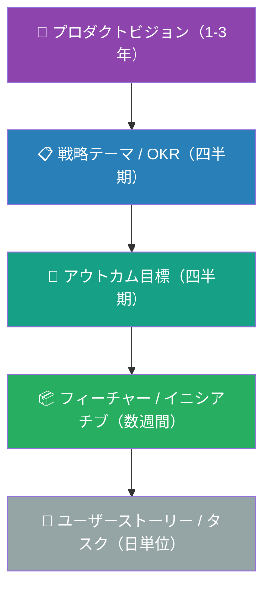

### タスク一覧

| # | タスク | 説明 |
|---|--------|------|
| 1 | OKR / 目標設定 | 四半期ごとのObjective（目標）とKey Results（成果指標）の設定 |
| 2 | テーマ / イニシアチブ整理 | 大きな取り組みの単位でグルーピング |
| 3 | 優先順位付け | RICE、ICE、Weighted Scoring 等のフレームワークで優先度決定 |
| 4 | ロードマップ作成 | Now / Next / Later または四半期ベースのロードマップ |
| 5 | キャパシティプランニング | チームのキャパシティに基づく実現可能性の調整 |
| 6 | ステークホルダーコミュニケーション | ロードマップの共有・期待値の調整 |
| 7 | バックログの整備 | ユーザーストーリー・タスクレベルへの分解とリファインメント |
| 8 | 依存関係の特定 | 他チーム・外部システムとの依存関係マッピング |
| 9 | リスク評価 | ロードマップ上のリスク・不確実性の評価 |
| 10 | ロードマップの定期見直し | 四半期 or 月次でのロードマップ更新 |

### リソース

| カテゴリ | リソース | 備考 |
|----------|----------|------|
| **人** | プロダクトマネージャー | ロードマップ策定の中心 |
| **人** | エンジニアリングマネージャー | キャパシティ・技術的制約の情報提供 |
| **人** | デザインリード | UX視点での優先度判断 |
| **人** | ステークホルダー | ビジネス視点でのインプット |
| **人** | データアナリスト | 優先順位判断のためのデータ提供 |
| **物** | ロードマップツール | Productboard, Aha!, Notion, Linear |
| **物** | OKR管理ツール | Weekdone, Ally.io, スプレッドシート |
| **物** | バックログ管理ツール | Jira, Linear, GitHub Projects |
| **物** | 優先順位付けフレームワーク | RICE, ICE スコアリングシート |
| **金** | ツールサブスクリプション | ロードマップ・管理ツール費 |

### 成果物

| 成果物 | 形式 | 必須/任意 |
|--------|------|-----------|
| プロダクトOKR | ドキュメント | 必須 |
| プロダクトロードマップ | ロードマップツール / ドキュメント | 必須 |
| 優先順位スコアリング | スプレッドシート | 必須 |
| リリース計画（概要レベル） | ドキュメント | 任意 |
| プロダクトバックログ（整備済み） | チケット管理ツール | 必須 |
| キャパシティプラン | スプレッドシート | 任意 |
| 依存関係マップ | 図表 | 任意 |

## 4. プロダクトデリバリー（構築・提供）

### 目的

ディスカバリーで検証された仮説を、動くソフトウェアとしてユーザーに届ける。

> ※ この工程の中身は[プロジェクト視点の工程マップ](./software-development-phases.md)の
> 「設計→実装→テスト」に相当します。ここではプロダクト視点ならではの補足に絞ります。

### プロダクト視点でのデリバリーの特徴

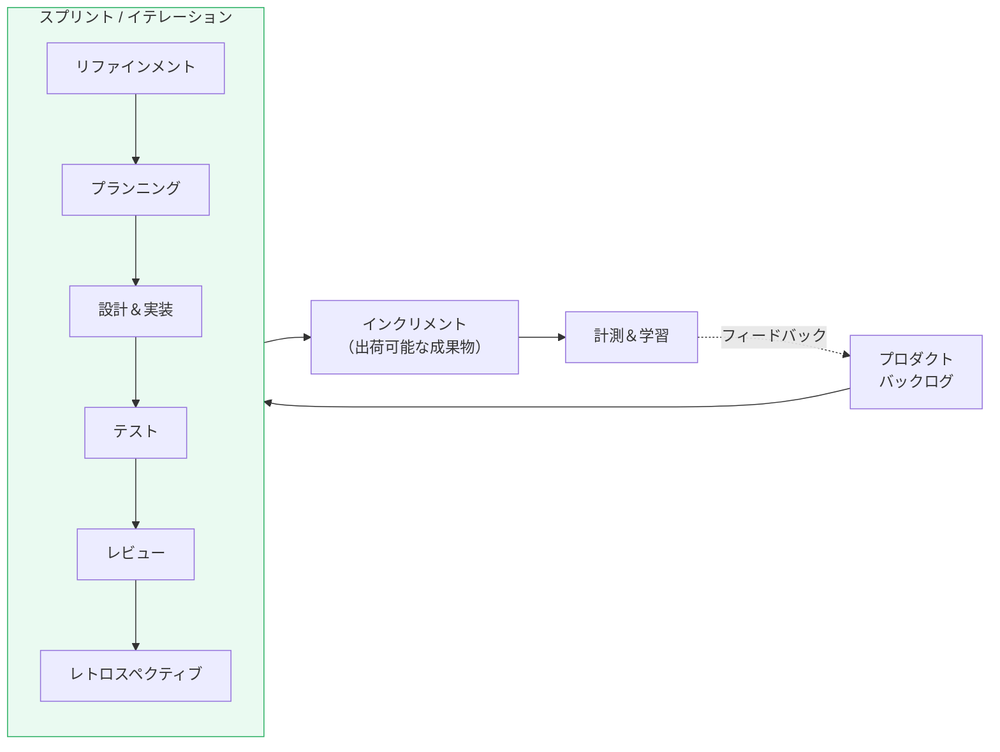

### タスク一覧（プロダクト視点の補足）

| # | タスク | 説明 |
|---|--------|------|
| 1 | バックログリファインメント | ユーザーストーリーの詳細化、受入基準の明確化 |
| 2 | スプリントプランニング | 次のスプリントで取り組むアイテムの合意 |
| 3 | デュアルトラック開発 | ディスカバリーとデリバリーを並行して回す |
| 4 | フィーチャーフラグ管理 | リリースとデプロイの分離、段階的ロールアウト |
| 5 | 継続的インテグレーション / デプロイ | 小さく頻繁にリリース（CI/CD） |
| 6 | スプリントレビュー | ステークホルダーへのデモ・フィードバック収集 |
| 7 | レトロスペクティブ | チームプロセスの振り返りと改善 |
| 8 | ドキュメント・ナレッジの更新 | APIドキュメント、ヘルプ記事の同期更新 |
| 9 | 技術的負債の計画的返済 | スプリントごとに一定割合を負債返済に充てる |
| 10 | プロダクト品質のモニタリング | バグ率、パフォーマンス、エラー率の継続監視 |

### リソース

| カテゴリ | リソース | 備考 |
|----------|----------|------|
| **人** | プロダクトマネージャー | 「何を作るか」の判断 |
| **人** | プロダクトデザイナー | UX/UIの設計・検証 |
| **人** | エンジニアチーム | ソフトウェアの構築 |
| **人** | QAエンジニア | 品質保証 |
| **人** | スクラムマスター / アジャイルコーチ | プロセスのファシリテーション |
| **人** | テクニカルライター | ユーザー向けドキュメント |
| **物** | 開発ツールチェーン | IDE, Git, CI/CD, Docker 等 |
| **物** | フィーチャーフラグツール | LaunchDarkly, Unleash, Flagsmith |
| **物** | プロダクト分析ツール | Mixpanel, Amplitude, PostHog |
| **物** | エラー監視ツール | Sentry, Bugsnag, Datadog |
| **金** | 開発チーム人件費 | 最大のコスト項目（継続的） |
| **金** | インフラ・ツール費 | クラウド＋SaaSのランニングコスト |

### 成果物

| 成果物 | 形式 | 必須/任意 |
|--------|------|-----------|
| 出荷可能なインクリメント | 動くソフトウェア | 必須 |
| リリースノート | ドキュメント | 必須 |
| 更新されたプロダクトバックログ | チケット管理ツール | 必須 |
| スプリントレビュー記録 | ドキュメント / 動画 | 任意 |
| レトロスペクティブのアクションアイテム | チケット | 必須 |
| ユーザー向けドキュメント / ヘルプ記事 | ドキュメント | 必須 |

## 5. プロダクトローンチ＆GTM（Go-To-Market）

### 目的

プロダクトを市場に投入し、ターゲットユーザーに知ってもらい、使い始めてもらう。

### ローンチの段階

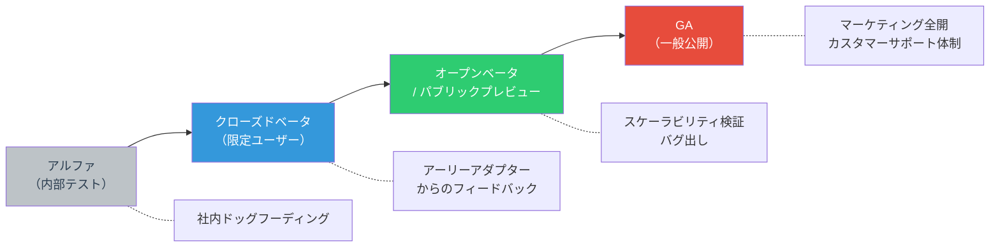

### タスク一覧

| # | タスク | 説明 |
|---|--------|------|
| 1 | GTM戦略策定 | ターゲットセグメント、チャネル、メッセージング戦略 |
| 2 | ポジショニング＆メッセージング | 価値提案の言語化、競合との差別化表現 |
| 3 | 価格設定 | 料金プラン設計、フリーミアム戦略等 |
| 4 | マーケティング施策の準備 | LP、ブログ、SNS、プレスリリース、広告 |
| 5 | セールスイネーブルメント | 営業資料、デモ環境、FAQ、競合比較表 |
| 6 | カスタマーサポート体制の構築 | サポートチャネル・FAQ・Runbookの準備 |
| 7 | オンボーディング設計 | ユーザー初回体験のフロー設計・実装 |
| 8 | ベータプログラム運営 | ベータユーザーの募集・管理・フィードバック収集 |
| 9 | ローンチイベント | ウェビナー、カンファレンス発表、プロダクトハント投稿等 |
| 10 | ローンチ後の初動モニタリング | サインアップ率、アクティベーション率、障害の即時対応 |

### リソース

| カテゴリ | リソース | 備考 |
|----------|----------|------|
| **人** | プロダクトマーケティングマネージャー (PMM) | GTM戦略のリード |
| **人** | コンテンツマーケター | LP、ブログ、ケーススタディ作成 |
| **人** | グロースマーケター | 広告運用、SEO、アクイジション |
| **人** | セールス / ビジネス開発 | 法人向け販売活動 |
| **人** | カスタマーサポート | 問い合わせ対応体制 |
| **人** | カスタマーサクセス | オンボーディング支援（B2B） |
| **人** | PRスペシャリスト | メディアリレーション、プレスリリース |
| **物** | マーケティングツール | HubSpot, Marketo, Mailchimp |
| **物** | 分析ツール | GA4, Mixpanel, Amplitude |
| **物** | CRM | Salesforce, HubSpot CRM |
| **物** | サポートツール | Zendesk, Intercom, Freshdesk |
| **物** | ランディングページビルダー | Webflow, WordPress, 自前 |
| **金** | 広告予算 | リスティング広告、SNS広告 |
| **金** | PR費用 | プレスリリース配信、メディア対応 |
| **金** | イベント費用 | ローンチイベント開催費 |
| **金** | コンテンツ制作費 | 動画、記事、デザイン制作費 |

### 成果物

| 成果物 | 形式 | 必須/任意 |
|--------|------|-----------|
| GTM戦略ドキュメント | ドキュメント | 必須 |
| ポジショニングステートメント | 1ページドキュメント | 必須 |
| 料金ページ / プラン表 | Web / ドキュメント | 必須 |
| ランディングページ | Webページ | 必須 |
| プレスリリース | ドキュメント | 任意 |
| セールスデッキ / デモ資料 | スライド | 任意（B2B必須） |
| オンボーディングフロー | 実装済み機能 | 必須 |
| サポートFAQ / ヘルプセンター | Webページ | 必須 |
| ローンチ振り返りレポート | ドキュメント | 任意 |

## 6. グロース（成長）

### 目的

ユーザー基盤を拡大し、プロダクトの価値を証明し、ビジネスとしてスケールさせる。

### グロースファネルとメトリクス（AARRR）

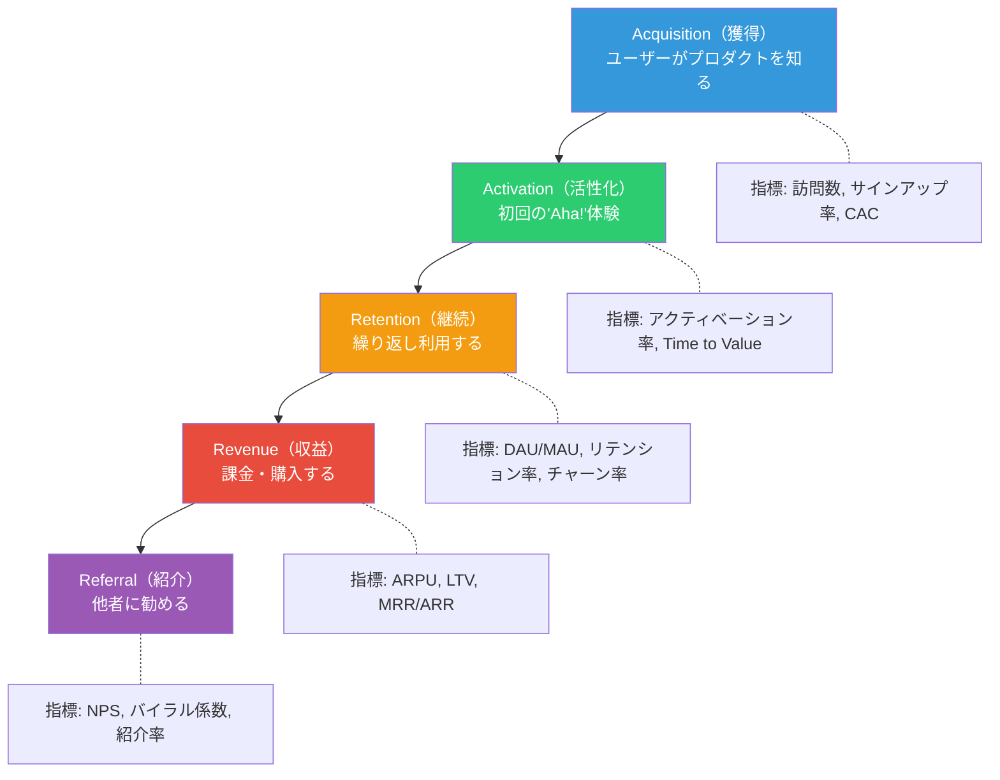

### タスク一覧

| # | タスク | 説明 |
|---|--------|------|
| 1 | ファネル分析 | 各ステップのコンバージョン率を計測・可視化 |
| 2 | アクイジション最適化 | チャネル別のCAC最適化、SEO、コンテンツマーケ |
| 3 | オンボーディング最適化 | Aha!モーメントまでの導線改善 |
| 4 | リテンション施策 | エンゲージメントループ設計、リテンション分析 |
| 5 | A/Bテスト | 仮説ベースの実験→計測→学習のサイクル |
| 6 | ユーザーフィードバック収集 | NPS、CSAT、アンケート、インタビュー |
| 7 | フィーチャー利用分析 | 各機能の利用率・満足度の分析 |
| 8 | プライシング最適化 | 価格弾力性テスト、プラン改定 |
| 9 | 拡張機能・インテグレーション開発 | エコシステム構築、API公開、プラグイン開発 |
| 10 | コミュニティ構築 | ユーザーコミュニティ、フォーラム、ユーザー会 |
| 11 | カスタマーサクセス活動 | チャーン予防、アップセル、ヘルススコア管理 |
| 12 | 国際化 / ローカライゼーション | 多言語対応、地域別の法規制対応 |

### リソース

| カテゴリ | リソース | 備考 |
|----------|----------|------|
| **人** | グロースマネージャー / PM | グロース施策のリード |
| **人** | データアナリスト / データサイエンティスト | ファネル分析、実験分析 |
| **人** | グロースエンジニア | 実験の高速実装 |
| **人** | マーケター | アクイジション施策 |
| **人** | カスタマーサクセスマネージャー | チャーン防止・アップセル |
| **人** | コミュニティマネージャー | コミュニティ運営 |
| **物** | プロダクト分析ツール | Mixpanel, Amplitude, PostHog |
| **物** | A/Bテストツール | Optimizely, VWO, 自前実装 |
| **物** | カスタマーサクセスツール | Gainsight, Totango, ChurnZero |
| **物** | コミュニティプラットフォーム | Discord, Discourse, Slack |
| **物** | BIツール | Looker, Metabase, Tableau |
| **金** | マーケティング予算 | 広告・コンテンツ・イベント |
| **金** | 実験用インフラ | A/Bテスト基盤の運用費 |
| **金** | カスタマーサクセスチーム人件費 | 特にB2Bで重要 |

### 成果物

| 成果物 | 形式 | 必須/任意 |
|--------|------|-----------|
| グロースダッシュボード | BIダッシュボード | 必須 |
| ファネル分析レポート | レポート（定期） | 必須 |
| 実験ログ・結果一覧 | スプレッドシート / ツール | 必須 |
| NPS / CSATレポート | レポート（定期） | 必須 |
| カスタマーヘルススコア | ダッシュボード | 任意（B2B推奨） |
| プライシング分析レポート | ドキュメント | 任意 |
| コミュニティ運営レポート | ドキュメント（定期） | 任意 |

## 7. プロダクト成熟＆最適化

### 目的

成長が鈍化した後も、収益性を維持・最大化しながら、プロダクトの価値を保つ。

### 成熟期の特徴

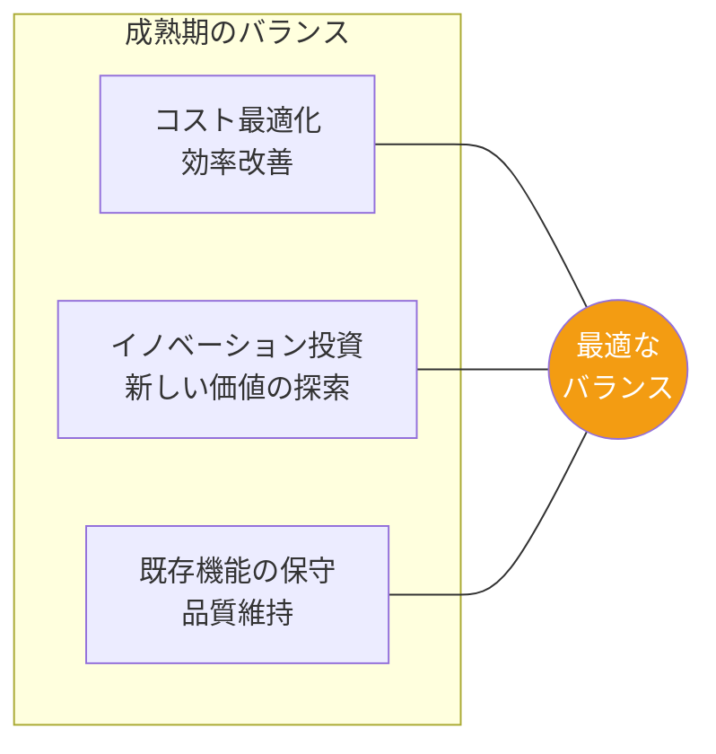

### タスク一覧

| # | タスク | 説明 |
|---|--------|------|
| 1 | プロダクトポートフォリオ評価 | 機能ごとの利用率・収益貢献度の分析 |
| 2 | 機能の統廃合 | 使われていない機能の廃止・統合 |
| 3 | 技術的負債の大規模返済 | アーキテクチャ刷新、フレームワーク移行 |
| 4 | パフォーマンス最適化 | レスポンスタイム改善、インフラコスト最適化 |
| 5 | セキュリティ強化 | コンプライアンス対応、セキュリティ監査 |
| 6 | スケーラビリティ対策 | 増大するトラフィック・データ量への対応 |
| 7 | プロセス効率化 | 自動化の推進、トイルの削減 |
| 8 | チャーン率の最小化 | 解約理由分析、リテンション施策の深化 |
| 9 | アップセル・クロスセル | 既存顧客へのプラン拡張・追加サービス提案 |
| 10 | 新しい成長機会の探索 | 隣接市場、新セグメント、新プロダクトラインの検討 |
| 11 | SLA/SLO の高度化 | エンタープライズ顧客向けの信頼性強化 |

### リソース

| カテゴリ | リソース | 備考 |
|----------|----------|------|
| **人** | シニアプロダクトマネージャー | プロダクトポートフォリオの判断 |
| **人** | SRE / プラットフォームエンジニア | 信頼性・スケーラビリティ |
| **人** | セキュリティエンジニア | コンプライアンス・監査対応 |
| **人** | データエンジニア | データ基盤の最適化 |
| **人** | FinOps担当 | クラウドコストの最適化 |
| **物** | APMツール | New Relic, Datadog APM |
| **物** | コスト管理ツール | AWS Cost Explorer, Kubecost |
| **物** | セキュリティ監査ツール | Qualys, Tenable |
| **金** | リファクタリング投資 | 技術刷新のためのエンジニア工数 |
| **金** | コンプライアンス費用 | 外部監査、認証取得費 |
| **金** | ライセンス更新費 | 既存ツール・サービスの継続費 |

### 成果物

| 成果物 | 形式 | 必須/任意 |
|--------|------|-----------|
| プロダクトヘルスレポート | ダッシュボード / レポート | 必須 |
| 機能利用率分析 | レポート | 必須 |
| 技術ロードマップ（負債返済計画） | ドキュメント | 必須 |
| コスト最適化レポート | レポート（定期） | 必須 |
| セキュリティ監査報告書 | ドキュメント | 必須 |
| 廃止機能のマイグレーションガイド | ドキュメント | 任意 |
| 新成長機会の評価レポート | ドキュメント | 任意 |

## 8. プロダクトの進化・転換 / EOL（End of Life）

### 目的

プロダクトの次のステージを判断する。大きな進化を遂げるか、役割を終えるかを見極め、適切に実行する。

### 判断フロー

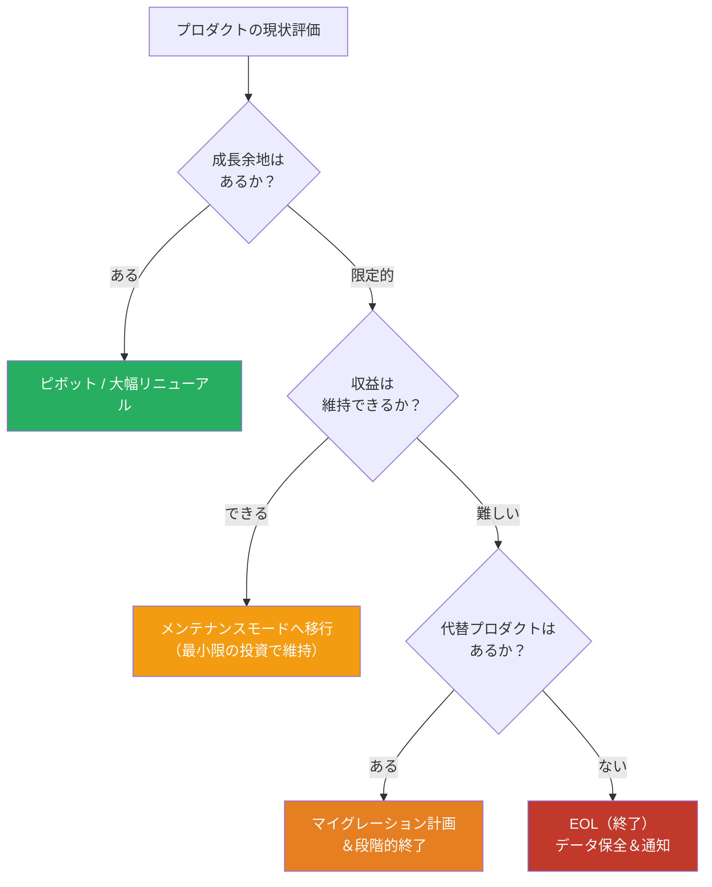

### タスク一覧

#### 進化・転換の場合

| # | タスク | 説明 |
|---|--------|------|
| 1 | 市場再分析 | 変化した市場環境の再評価 |
| 2 | ピボット戦略の策定 | 新しい方向性の定義・検証 |
| 3 | リアーキテクチャ | 技術スタックの大幅刷新 |
| 4 | リブランディング | 新しいポジショニング・メッセージング |
| 5 | 既存ユーザーのマイグレーション | 新バージョンへの移行支援 |

#### EOL（終了）の場合

| # | タスク | 説明 |
|---|--------|------|
| 1 | EOL決定・通知 | ユーザー・パートナーへの十分な事前告知 |
| 2 | データエクスポート機能提供 | ユーザーが自身のデータを取り出せる手段 |
| 3 | 代替プロダクトへの移行支援 | マイグレーションツール・ガイドの提供 |
| 4 | 契約・課金の終了処理 | 返金対応、契約終了手続き |
| 5 | インフラの段階的縮退 | サーバー・データの段階的な停止・削除 |
| 6 | 法的義務の遵守 | データ保持期間の遵守、GDPR対応等 |
| 7 | 振り返り（ポストモーテム） | プロダクト全体の学びの記録 |

### リソース

| カテゴリ | リソース | 備考 |
|----------|----------|------|
| **人** | プロダクトマネージャー / CPO | EOL or ピボットの判断 |
| **人** | 経営層 | 事業判断 |
| **人** | エンジニアチーム | マイグレーション・データ対応 |
| **人** | カスタマーサポート | ユーザー対応の増加 |
| **人** | 法務 | 契約終了・データ保持の法的対応 |
| **物** | データエクスポートツール | 自前開発が多い |
| **物** | コミュニケーションツール | メール配信、アプリ内通知 |
| **金** | 移行開発コスト | マイグレーションツール開発費 |
| **金** | サポートコスト | 移行期間中のサポート増員費 |
| **金** | 返金・違約金 | 契約条件による |

### 成果物

| 成果物 | 形式 | 必須/任意 |
|--------|------|-----------|
| EOL / ピボット判断ドキュメント | ドキュメント | 必須 |
| ユーザー通知（タイムライン入り） | メール / アプリ内通知 | 必須 |
| データエクスポートガイド | ドキュメント | 必須 |
| マイグレーションガイド | ドキュメント | 任意 |
| インフラ縮退計画 | ドキュメント | 必須 |
| プロダクト振り返りレポート | ドキュメント | 任意 |

## 横断的活動（プロダクト視点特有）

プロジェクト視点と共通する横断的活動（品質管理、セキュリティ等）に加え、プロダクト視点では以下が加わります。

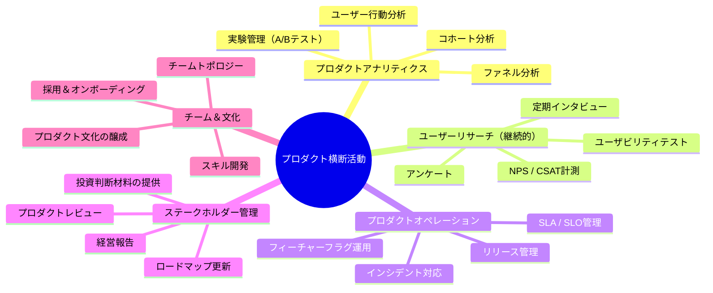

### プロダクト横断活動の詳細

| 活動 | 主要タスク | 頻度 | 主要な人 | ツール | コスト |
|------|-----------|------|---------|-------|--------|
| **プロダクトアナリティクス** | イベント設計、ダッシュボード構築、分析レポート | 常時 | データアナリスト、PM | Mixpanel, Amplitude | 分析ツール費 |
| **継続的ユーザーリサーチ** | 定期インタビュー、アンケート、NPS計測 | 月次〜四半期 | UXリサーチャー | UserTesting, Typeform | リサーチ費 |
| **プロダクトオペレーション** | リリース調整、フラグ管理、インシデント対応 | 常時 | PM, SRE | LaunchDarkly, PagerDuty | ツール費 |
| **ステークホルダー報告** | 経営レビュー、KPIレポート、ロードマップ更新 | 月次〜四半期 | PM, CPO | Notion, スライド | PM人件費 |
| **プロダクトマーケティング** | メッセージング更新、競合分析、コンテンツ制作 | 常時 | PMM | CMS, マーケツール | マーケ費 |
| **カスタマーフィードバック管理** | フィードバック収集・分類・優先順位付け | 常時 | PM, CS | Productboard, Canny | ツール費 |

## プロダクトKPIの全体マップ

各フェーズで追うべき主要指標の一覧です。

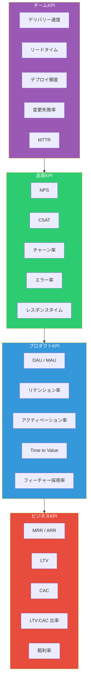

| カテゴリ | KPI | 説明 | 計測頻度 |
|----------|-----|------|----------|
| **ビジネス** | MRR / ARR | 月次/年次経常収益 | 月次 |
| **ビジネス** | LTV | 顧客生涯価値 | 月次 |
| **ビジネス** | CAC | 顧客獲得コスト | 月次 |
| **ビジネス** | LTV:CAC比率 | 3:1以上が健全の目安 | 月次 |
| **プロダクト** | DAU / MAU | 日次/月次アクティブユーザー | 日次 |
| **プロダクト** | リテンション率 | N日後/N週後の継続率 | 週次 |
| **プロダクト** | アクティベーション率 | 初回体験→Aha!モーメント到達率 | 週次 |
| **プロダクト** | Time to Value | サインアップから価値実感までの時間 | 週次 |
| **品質** | NPS | 推奨度（-100〜+100） | 四半期 |
| **品質** | チャーン率 | 月次解約率 | 月次 |
| **品質** | エラー率 | アプリケーションエラーの発生率 | 日次 |
| **チーム** | デプロイ頻度 | 本番デプロイの回数 | 週次 |
| **チーム** | リードタイム | コミットから本番到達までの時間 | 週次 |
| **チーム** | MTTR | 障害発生から復旧までの平均時間 | 月次 |

## フェーズ別の投資配分の変化

プロダクトの成長段階に応じて、リソース配分は大きく変わります。

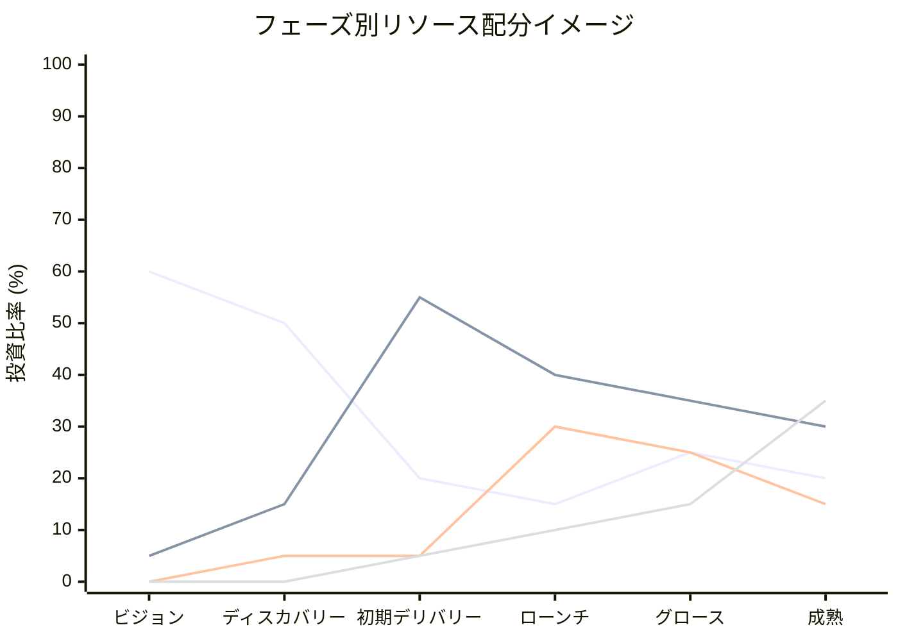

| フェーズ | ディスカバリー | エンジニアリング | マーケ/セールス | 運用/サポート |
|----------|---------------|-----------------|----------------|-------------|
| ビジョン＆戦略 | 60% | 5% | 0% | 0% |
| ディスカバリー | 50% | 15% | 5% | 0% |
| 初期デリバリー | 20% | 55% | 5% | 5% |
| ローンチ | 15% | 40% | 30% | 10% |
| グロース | 25% | 35% | 25% | 15% |
| 成熟 | 20% | 30% | 15% | 35% |

> ※ 残りはプロダクトマネジメント、管理間接費等。合計は概念的な配分であり、100%にならない場合があります。

## プロジェクト視点の資料との対応

先に作成した[プロジェクト視点の工程マップ](./software-development-phases.md)との対応関係です。

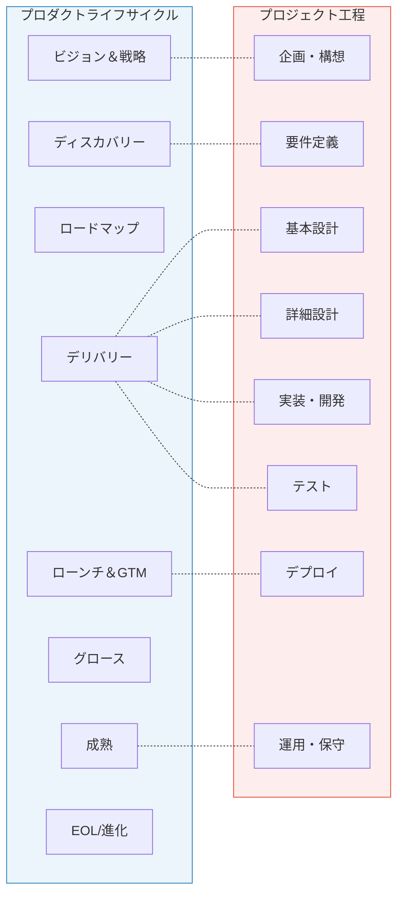

| プロダクト視点 | 対応するプロジェクト工程 | 違い |
|---------------|----------------------|------|
| ビジョン＆戦略 | 企画・構想 | プロダクトは「継続的に更新する」、プロジェクトは「一度決めたら固定」 |
| ディスカバリー | 要件定義 | プロダクトは「仮説検証ベース」、プロジェクトは「要件を網羅的に文書化」 |
| ロードマップ | ─ | プロジェクトには対応なし（WBSがやや近い） |
| デリバリー | 設計〜実装〜テスト | プロダクトは「反復的に小さく何度も」、プロジェクトは「一括で大きく」 |
| ローンチ＆GTM | デプロイ | プロダクトは「市場戦略まで含む」、プロジェクトは「技術的なデプロイ作業」 |
| グロース | ─ | プロジェクトには対応なし（プロダクト固有の工程） |
| 成熟＆最適化 | 運用・保守 | プロダクトは「最適化＆新機会探索」、プロジェクトは「維持＆障害対応」 |
| 進化/EOL | ─ | プロジェクトには対応なし（プロダクト固有の判断） |

## まとめ

プロダクト視点のライフサイクルは「作って終わり」ではなく「育て続ける」ことが前提です。

最も重要な違いは**学習ループの存在**です。ディスカバリーで仮説を立て、デリバリーで検証し、データとフィードバックから学び、次のディスカバリーに活かす。このサイクルをいかに高速に回し続けるかが、プロダクトの成功を左右します。

また、プロジェクト視点では「QCD（品質・コスト・納期）」が成功指標ですが、プロダクト視点では「ユーザーに届いた価値（アウトカム）」と「ビジネス成果（KPI）」が真の成功指標です。優れたプロダクトチームは、アウトプット（何を作ったか）ではなくアウトカム（何が変わったか）で自らを評価します。
