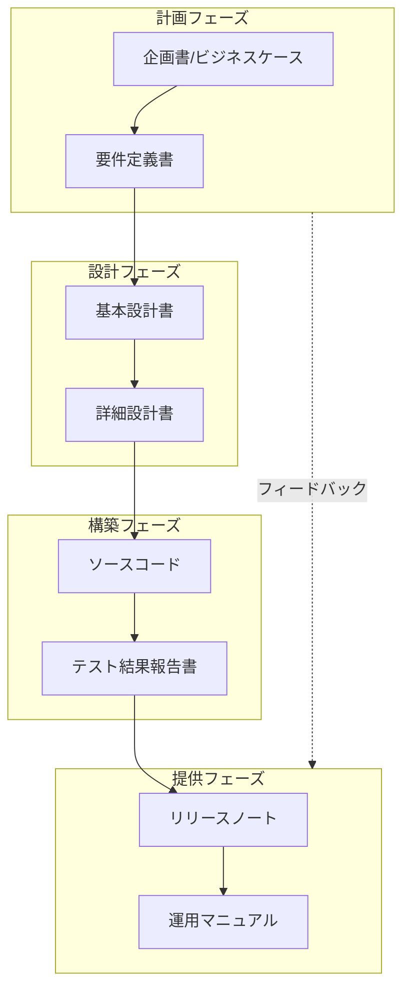
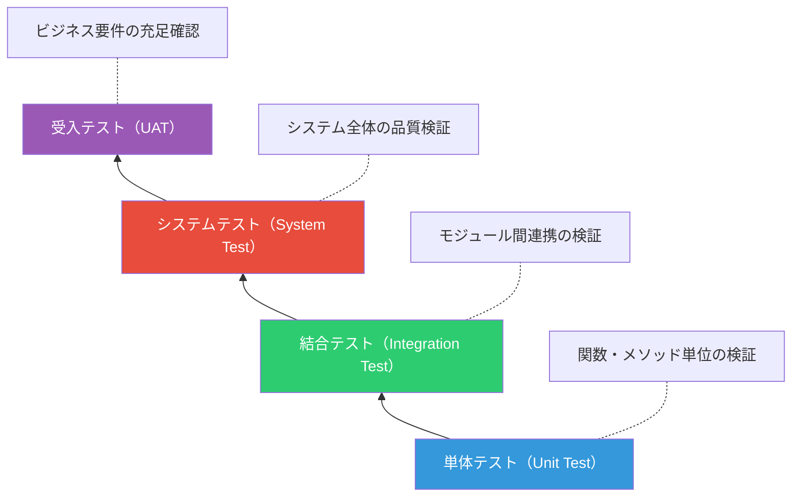
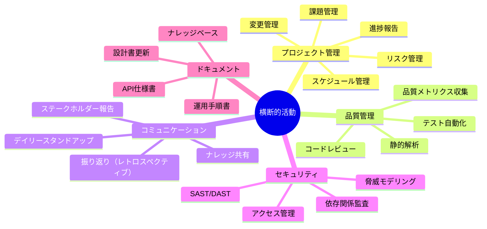
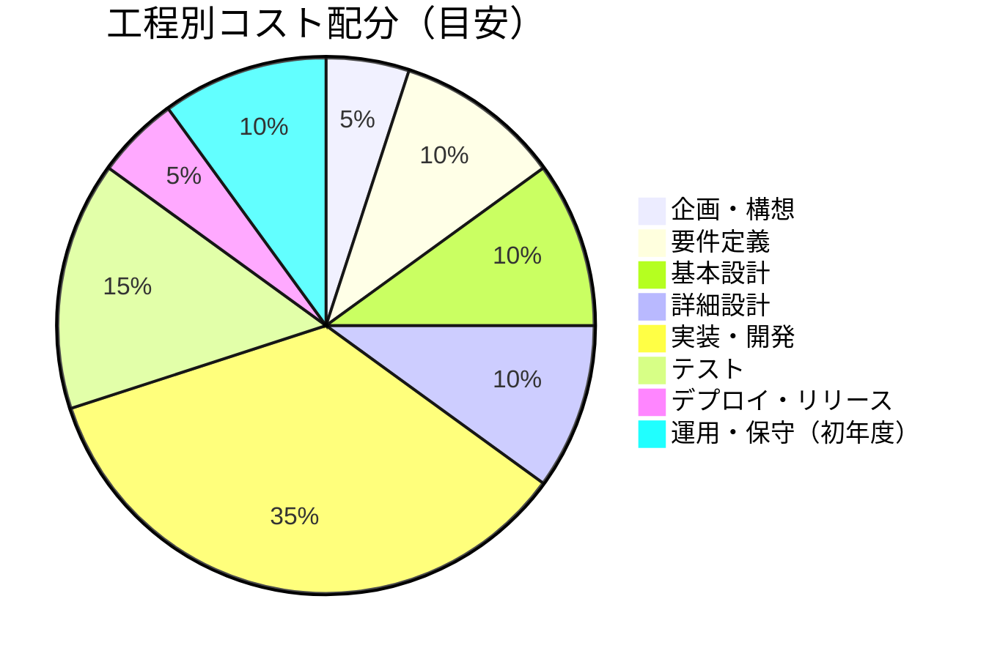
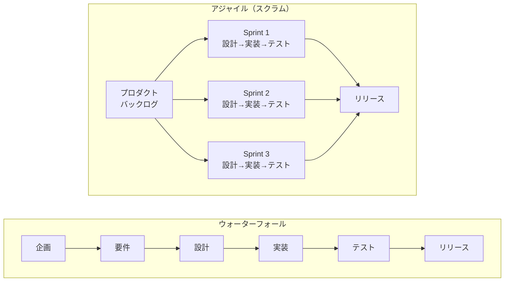

# プロジェクト工程マップ — 「どうやって作るか」

> アジャイル・ウォーターフォール問わず、ソフトウェア開発に共通して必要な工程・タスク・リソース・成果物の網羅的一覧

Project Process Map — "How to Build It"
Product Lifecycle Map — "What to Build and How to Develop It"

## 全体フロー概観

## 工程間の関係性と成果物フロー

## 1. 企画・構想

### 目的

ビジネス上の課題・機会を特定し、ソフトウェア開発プロジェクトとして立ち上げるかどうかを判断する。

### タスク一覧

| #   | タスク                   | 説明                                                   |
| --- | ------------------------ | ------------------------------------------------------ |
| 1   | ビジネス課題の特定       | 現状分析（As-Is）、あるべき姿（To-Be）のギャップ分析   |
| 2   | 市場・競合調査           | 類似サービス・プロダクトの調査、差別化ポイントの明確化 |
| 3   | フィージビリティスタディ | 技術的実現可能性、法的制約、ビジネス的妥当性の検証     |
| 4   | ステークホルダー分析     | 関係者の洗い出し、影響度・関心度マッピング             |
| 5   | プロジェクト企画書作成   | 目的・ゴール・スコープ・概算見積り・ROI試算            |
| 6   | Go/No-Go判断             | 経営層・意思決定者による承認                           |

### リソース

| カテゴリ | リソース                        | 備考                                         |
| -------- | ------------------------------- | -------------------------------------------- |
| **人**   | プロダクトオーナー / 事業責任者 | 意思決定権を持つ人                           |
| **人**   | ビジネスアナリスト              | 課題分析・要求整理                           |
| **人**   | テックリード / CTO              | 技術的実現可能性の評価                       |
| **人**   | UXリサーチャー                  | ユーザーニーズ調査（必要時）                 |
| **物**   | 市場調査ツール                  | SimilarWeb, Google Trends 等                 |
| **物**   | ホワイトボード / Miro / FigJam  | アイデアワークショップ用                     |
| **物**   | ドキュメントツール              | Confluence, Notion, Google Docs 等           |
| **金**   | 調査費用                        | 外部コンサルティング、市場調査レポート購入等 |
| **金**   | PoC費用                         | プロトタイプ開発にかかる工数・インフラ費     |

### 成果物

| 成果物                         | 形式                | 必須/任意 |
| ------------------------------ | ------------------- | --------- |
| プロジェクト企画書             | ドキュメント        | 必須      |
| ビジネスケース / ROI試算       | スプレッドシート    | 必須      |
| フィージビリティスタディ報告書 | ドキュメント        | 必須      |
| ステークホルダーマップ         | 図表                | 任意      |
| 競合分析レポート               | ドキュメント        | 任意      |
| PoC成果物                      | プロトタイプ / デモ | 任意      |

## 2. 要件定義

### 目的

「何を作るか」を明確にし、ステークホルダー間で合意する。

### タスク一覧

| #   | タスク                   | 説明                                                         |
| --- | ------------------------ | ------------------------------------------------------------ |
| 1   | 業務フロー分析           | 現行業務のフロー可視化（As-Is）、新業務フローの設計（To-Be） |
| 2   | 機能要件の定義           | ユースケース / ユーザーストーリーの作成                      |
| 3   | 非機能要件の定義         | 性能・可用性・セキュリティ・拡張性等の品質要件               |
| 4   | 画面遷移・UIイメージ作成 | ワイヤーフレーム・モックアップ                               |
| 5   | データ要件の定義         | 扱うデータの種類・量・ライフサイクル                         |
| 6   | 外部インターフェース定義 | 外部システム連携、API仕様の概要                              |
| 7   | 制約・前提条件の整理     | 技術制約・法規制・既存システムとの整合性                     |
| 8   | 受入基準の定義           | 完了条件（Definition of Done）の合意                         |
| 9   | 優先順位付け             | MoSCoW法等による要件の優先度決定                             |
| 10  | 見積り                   | 概算工数・コスト・スケジュールの算出                         |

### リソース

| カテゴリ | リソース                   | 備考                           |
| -------- | -------------------------- | ------------------------------ |
| **人**   | プロダクトオーナー         | 要件の最終決定権               |
| **人**   | ビジネスアナリスト / BA    | 要件の引き出し・文書化         |
| **人**   | UX/UIデザイナー            | ワイヤーフレーム・プロトタイプ |
| **人**   | アーキテクト               | 非機能要件の妥当性評価         |
| **人**   | エンドユーザー代表         | 要件の妥当性検証               |
| **人**   | 法務・コンプライアンス担当 | 法的要件の確認                 |
| **物**   | 要件管理ツール             | Jira, Azure DevOps, Backlog 等 |
| **物**   | プロトタイピングツール     | Figma, Adobe XD, Sketch        |
| **物**   | モデリングツール           | PlantUML, draw.io, Mermaid     |
| **金**   | ユーザー調査費用           | インタビュー、アンケート実施費 |
| **金**   | プロトタイプ制作費用       | デザイナー工数                 |

### 成果物

| 成果物                              | 形式             | 必須/任意 |
| ----------------------------------- | ---------------- | --------- |
| 要件定義書                          | ドキュメント     | 必須      |
| ユースケース図 / ユーザーストーリー | 図表 / チケット  | 必須      |
| 業務フロー図（As-Is / To-Be）       | フローチャート   | 必須      |
| 画面遷移図                          | 図表             | 必須      |
| ワイヤーフレーム / モックアップ     | デザインファイル | 必須      |
| 非機能要件定義書                    | ドキュメント     | 必須      |
| 用語集 / データディクショナリ       | ドキュメント     | 任意      |
| 概算見積書                          | スプレッドシート | 必須      |

## 3. 基本設計（外部設計）

### 目的

システムの全体構造を決定し、「どう作るか」の大枠を設計する。

### タスク一覧

| #   | タスク                     | 説明                                                       |
| --- | -------------------------- | ---------------------------------------------------------- |
| 1   | システムアーキテクチャ設計 | モノリス / マイクロサービス、層構造、通信方式の決定        |
| 2   | 技術スタック選定           | 言語・フレームワーク・ミドルウェア・クラウドサービスの選定 |
| 3   | UI/UX設計                  | デザインシステム、画面レイアウト、インタラクション設計     |
| 4   | データベース概念設計       | ER図、データモデル（概念レベル）                           |
| 5   | API設計（概要レベル）      | RESTful / GraphQL / gRPC、エンドポイント一覧               |
| 6   | セキュリティ設計           | 認証・認可方式、暗号化、脆弱性対策の方針                   |
| 7   | インフラ設計               | ネットワーク構成、サーバー構成、クラウド設計               |
| 8   | 外部システム連携設計       | 連携先との IF 仕様、プロトコル、データフォーマット         |
| 9   | 性能設計                   | 目標レスポンスタイム、同時接続数、スループット             |
| 10  | 移行設計                   | データ移行方針、並行運用計画                               |

### リソース

| カテゴリ | リソース                                         | 備考                             |
| -------- | ------------------------------------------------ | -------------------------------- |
| **人**   | システムアーキテクト                             | 全体設計の責任者                 |
| **人**   | フロントエンドリード                             | UI/UX・フロント技術選定          |
| **人**   | バックエンドリード                               | API・サーバーサイド設計          |
| **人**   | インフラエンジニア / SRE                         | インフラ・クラウド設計           |
| **人**   | DBエンジニア / DBA                               | データベース設計                 |
| **人**   | セキュリティエンジニア                           | セキュリティ設計レビュー         |
| **人**   | UI/UXデザイナー                                  | デザインシステム構築             |
| **物**   | 設計ツール                                       | Figma, draw.io, Lucidchart       |
| **物**   | ADR (Architecture Decision Records) テンプレート | 設計判断の記録用                 |
| **物**   | クラウド検証環境                                 | アーキテクチャ検証用             |
| **金**   | クラウド検証費用                                 | PoC環境のランニングコスト        |
| **金**   | ライセンス費用                                   | 有償ツール・ミドルウェアの評価版 |

### 成果物

| 成果物                        | 形式                   | 必須/任意 |
| ----------------------------- | ---------------------- | --------- |
| システムアーキテクチャ図      | 図表（C4モデル等）     | 必須      |
| 技術スタック選定書 / ADR      | ドキュメント           | 必須      |
| 画面設計書 / デザインシステム | デザインファイル       | 必須      |
| ER図（概念モデル）            | 図表                   | 必須      |
| API設計書（概要）             | ドキュメント / OpenAPI | 必須      |
| インフラ構成図                | 図表                   | 必須      |
| セキュリティ設計書            | ドキュメント           | 必須      |
| 性能要件・設計書              | ドキュメント           | 任意      |
| 移行設計書                    | ドキュメント           | 任意      |

## 4. 詳細設計（内部設計）

### 目的

実装に直結するレベルまで設計を詳細化する。

### タスク一覧

| #   | タスク                      | 説明                                                          |
| --- | --------------------------- | ------------------------------------------------------------- |
| 1   | クラス設計 / モジュール設計 | クラス図、コンポーネント分割、責務の割当て                    |
| 2   | データベース論理・物理設計  | テーブル定義、インデックス設計、パーティション                |
| 3   | API詳細設計                 | リクエスト/レスポンス定義、エラーハンドリング、バリデーション |
| 4   | 画面詳細設計                | コンポーネント設計、状態管理、イベントハンドリング            |
| 5   | バッチ処理設計              | ジョブフロー、スケジュール、リトライ方式                      |
| 6   | シーケンス図作成            | 主要な処理フローの詳細化                                      |
| 7   | エラー設計                  | エラーコード体系、ログ出力方針、例外処理方針                  |
| 8   | テスト設計                  | テスト戦略、テストケース設計の方針                            |
| 9   | コーディング規約策定        | 命名規則、フォーマット、レビュー基準                          |
| 10  | 開発環境構築手順整備        | ローカル開発環境のセットアップ手順                            |

### リソース

| カテゴリ | リソース               | 備考                         |
| -------- | ---------------------- | ---------------------------- |
| **人**   | テックリード           | 設計品質のレビュー・判断     |
| **人**   | シニアエンジニア       | 詳細設計の実施               |
| **人**   | DBエンジニア           | DB物理設計                   |
| **人**   | QAエンジニア           | テスト設計の監修             |
| **物**   | IDE / エディタ         | VS Code, IntelliJ 等         |
| **物**   | 設計ドキュメントツール | Markdown, Confluence, Notion |
| **物**   | UMLツール              | PlantUML, Mermaid, draw.io   |
| **物**   | API設計ツール          | Swagger Editor, Stoplight    |
| **金**   | ツールライセンス費     | 有償IDE・設計ツール          |

### 成果物

| 成果物                      | 形式                   | 必須/任意 |
| --------------------------- | ---------------------- | --------- |
| 詳細設計書                  | ドキュメント           | 必須      |
| クラス図 / コンポーネント図 | UML図                  | 必須      |
| シーケンス図                | UML図                  | 必須      |
| テーブル定義書              | スプレッドシート / DDL | 必須      |
| API仕様書（詳細）           | OpenAPI / Swagger      | 必須      |
| 画面コンポーネント設計書    | ドキュメント           | 必須      |
| エラーコード一覧            | スプレッドシート       | 任意      |
| コーディング規約            | ドキュメント           | 必須      |
| 開発環境構築手順書          | ドキュメント           | 必須      |

## 5. 実装・開発

### 目的

設計に基づいてソフトウェアを構築する。

### タスク一覧

| #   | タスク               | 説明                                                     |
| --- | -------------------- | -------------------------------------------------------- |
| 1   | 開発環境セットアップ | リポジトリ作成、CI/CD構築、ローカル環境整備              |
| 2   | プロジェクト初期構築 | スキャフォールディング、ボイラープレート、共通基盤の構築 |
| 3   | フロントエンド実装   | UIコンポーネント開発、画面実装、状態管理                 |
| 4   | バックエンド実装     | API実装、ビジネスロジック、データアクセス層              |
| 5   | データベース構築     | DDL実行、初期データ投入、マイグレーション                |
| 6   | 外部システム連携実装 | API連携、メッセージング、ファイル連携                    |
| 7   | 単体テスト実装       | ユニットテストコードの作成・実行                         |
| 8   | コードレビュー       | プルリクエスト・マージリクエストによるレビュー           |
| 9   | リファクタリング     | コード品質の改善、技術的負債の解消                       |
| 10  | ドキュメント更新     | 実装に合わせた設計書の更新、APIドキュメント自動生成      |

### リソース

| カテゴリ | リソース                 | 備考                                         |
| -------- | ------------------------ | -------------------------------------------- |
| **人**   | フロントエンドエンジニア | UI/コンポーネント実装                        |
| **人**   | バックエンドエンジニア   | API/ビジネスロジック実装                     |
| **人**   | フルスタックエンジニア   | 横断的な実装                                 |
| **人**   | テックリード             | コードレビュー、技術的意思決定               |
| **人**   | DevOpsエンジニア         | CI/CD・開発環境整備                          |
| **物**   | IDE / エディタ           | VS Code, IntelliJ, WebStorm 等               |
| **物**   | バージョン管理           | Git（GitHub / GitLab / Bitbucket）           |
| **物**   | CI/CDツール              | GitHub Actions, GitLab CI, Jenkins, CircleCI |
| **物**   | パッケージマネージャ     | npm / yarn / pnpm, NuGet, pip 等             |
| **物**   | コンテナ環境             | Docker, Docker Compose                       |
| **物**   | コード品質ツール         | ESLint, Prettier, SonarQube, Stylelint       |
| **物**   | テストフレームワーク     | Jasmine, Jest, xUnit, Cypress 等             |
| **物**   | コミュニケーションツール | Slack, Teams, Discord                        |
| **金**   | 開発者人件費             | プロジェクト最大のコスト項目                 |
| **金**   | クラウド開発環境費       | Dev/Staging環境のランニングコスト            |
| **金**   | SaaSツール費             | GitHub, Jira, Figma 等のサブスクリプション   |

### 成果物

| 成果物                       | 形式                 | 必須/任意 |
| ---------------------------- | -------------------- | --------- |
| ソースコード                 | Git リポジトリ       | 必須      |
| 単体テストコード             | テストファイル       | 必須      |
| テストカバレッジレポート     | HTML / レポート      | 任意      |
| CI/CDパイプライン設定        | YAML / 設定ファイル  | 必須      |
| DB マイグレーションファイル  | SQL / スクリプト     | 必須      |
| API ドキュメント（自動生成） | OpenAPI / Swagger UI | 必須      |
| コードレビュー記録           | PR / MRのコメント    | 必須      |

## 6. テスト

### 目的

ソフトウェアが要件を満たし、品質基準をクリアしていることを検証する。

### テストレベルの全体像

### タスク一覧

| #   | タスク             | テストレベル | 説明                                             |
| --- | ------------------ | ------------ | ------------------------------------------------ |
| 1   | テスト計画策定     | 全体         | テスト方針・スケジュール・体制・環境の計画       |
| 2   | テストケース設計   | 全体         | テスト条件・手順・期待結果の文書化               |
| 3   | テストデータ準備   | 全体         | テスト用データの作成・匿名化・投入               |
| 4   | テスト環境構築     | 全体         | Staging/QA環境のセットアップ                     |
| 5   | 単体テスト実行     | Unit         | 関数・メソッド単位の自動テスト                   |
| 6   | 結合テスト実行     | Integration  | API連携・モジュール間の結合検証                  |
| 7   | システムテスト実行 | System       | 機能テスト・非機能テスト（性能・セキュリティ等） |
| 8   | 回帰テスト         | System       | 既存機能への影響がないことの確認                 |
| 9   | 受入テスト実行     | UAT          | ビジネス要件に対するユーザー視点の検証           |
| 10  | バグ管理・修正     | 全体         | 不具合の起票・優先度付け・修正・再テスト         |
| 11  | テスト結果報告     | 全体         | テスト結果・品質メトリクスの集計・報告           |

### リソース

| カテゴリ | リソース                    | 備考                               |
| -------- | --------------------------- | ---------------------------------- |
| **人**   | QAエンジニア / テストリード | テスト計画・設計の責任者           |
| **人**   | テストエンジニア            | テスト実行・バグ報告               |
| **人**   | 開発エンジニア              | バグ修正・単体テスト               |
| **人**   | エンドユーザー代表          | UAT実施                            |
| **人**   | セキュリティテスター        | 脆弱性診断（必要時）               |
| **人**   | 性能テストエンジニア        | 負荷テスト（必要時）               |
| **物**   | テスト管理ツール            | TestRail, Zephyr, スプレッドシート |
| **物**   | バグ管理ツール              | Jira, Backlog, GitHub Issues       |
| **物**   | 自動テストツール            | Cypress, Playwright, Selenium      |
| **物**   | 性能テストツール            | JMeter, k6, Locust                 |
| **物**   | セキュリティ診断ツール      | OWASP ZAP, Burp Suite              |
| **物**   | テスト環境                  | Staging / QA 環境                  |
| **金**   | QA人件費                    | テスター工数                       |
| **金**   | テスト環境費用              | クラウドインフラ費                 |
| **金**   | 外部診断費用                | 第三者によるセキュリティ診断等     |

### 成果物

| 成果物                 | 形式                        | 必須/任意 |
| ---------------------- | --------------------------- | --------- |
| テスト計画書           | ドキュメント                | 必須      |
| テストケース一覧       | スプレッドシート / ツール   | 必須      |
| テスト結果報告書       | ドキュメント                | 必須      |
| バグ一覧・管理表       | チケット / スプレッドシート | 必須      |
| 品質メトリクスレポート | レポート                    | 任意      |
| 性能テスト結果報告書   | ドキュメント                | 任意      |
| セキュリティ診断報告書 | ドキュメント                | 任意      |

## 7. デプロイ・リリース

### 目的

開発した成果物を本番環境に安全に展開し、ユーザーが利用可能にする。

### タスク一覧

| #   | タスク                   | 説明                                             |
| --- | ------------------------ | ------------------------------------------------ |
| 1   | リリース計画策定         | リリース日時・手順・ロールバック計画の策定       |
| 2   | 本番環境構築・確認       | インフラのプロビジョニング・設定確認             |
| 3   | デプロイ手順書作成       | デプロイ手順・チェックリストの文書化             |
| 4   | DBマイグレーション実行   | 本番DBへのスキーマ変更・データ移行               |
| 5   | アプリケーションデプロイ | ビルド・デプロイの実行（Blue-Green / Canary 等） |
| 6   | スモークテスト           | 本番環境での基本動作確認                         |
| 7   | 監視設定                 | アラート・ダッシュボード・ログ収集の設定         |
| 8   | リリースノート作成       | 変更内容・既知の問題の文書化                     |
| 9   | ステークホルダー通知     | 関係者への完了通知・変更案内                     |
| 10  | ユーザートレーニング     | エンドユーザー向け研修・マニュアル配布           |

### リソース

| カテゴリ | リソース                     | 備考                                    |
| -------- | ---------------------------- | --------------------------------------- |
| **人**   | リリースマネージャー         | リリース全体の調整・判断                |
| **人**   | DevOps / SREエンジニア       | デプロイ実行、インフラ管理              |
| **人**   | 開発エンジニア               | デプロイ時の問題対応                    |
| **人**   | QAエンジニア                 | スモークテスト実行                      |
| **人**   | サポート担当                 | ユーザー問い合わせ対応準備              |
| **物**   | CI/CDパイプライン            | 自動デプロイ環境                        |
| **物**   | IaCツール                    | Terraform, CloudFormation, Pulumi       |
| **物**   | コンテナオーケストレーション | Kubernetes, ECS, Cloud Run              |
| **物**   | 監視ツール                   | Datadog, New Relic, Grafana, CloudWatch |
| **物**   | ログ管理                     | ELK Stack, Loki, CloudWatch Logs        |
| **金**   | 本番インフラ費用             | クラウドサービス利用料                  |
| **金**   | ドメイン・SSL証明書          | 年間費用                                |
| **金**   | CDN費用                      | CloudFront, Cloudflare 等               |

### 成果物

| 成果物             | 形式            | 必須/任意 |
| ------------------ | --------------- | --------- |
| リリース計画書     | ドキュメント    | 必須      |
| デプロイ手順書     | ドキュメント    | 必須      |
| リリースノート     | ドキュメント    | 必須      |
| ロールバック手順書 | ドキュメント    | 必須      |
| スモークテスト結果 | チェックリスト  | 必須      |
| 監視ダッシュボード | ツール設定      | 必須      |
| ユーザーマニュアル | ドキュメント    | 任意      |
| トレーニング資料   | スライド / 動画 | 任意      |

## 8. 運用・保守

### 目的

リリース後のシステムを安定的に稼働させ、継続的に価値を提供し続ける。

### タスク一覧

| #   | タスク                       | 説明                                               |
| --- | ---------------------------- | -------------------------------------------------- |
| 1   | 障害対応（インシデント管理） | 障害検知→対応→復旧→原因分析→再発防止               |
| 2   | 監視・アラート対応           | 死活監視、性能監視、異常検知への対応               |
| 3   | バグ修正（パッチ）           | ユーザー報告・内部発見のバグ修正                   |
| 4   | セキュリティパッチ適用       | 脆弱性情報の収集・パッチ適用                       |
| 5   | 定期メンテナンス             | OS/ミドルウェアのアップデート、証明書更新等        |
| 6   | バックアップ・DR             | バックアップの取得・検証、災害復旧訓練             |
| 7   | 性能チューニング             | ボトルネック分析・最適化                           |
| 8   | ユーザーサポート             | 問い合わせ対応、FAQ更新                            |
| 9   | 機能改善・エンハンスメント   | ユーザーフィードバックに基づく改善開発             |
| 10  | 技術的負債の返済             | ライブラリ更新、リファクタリング、EOL対応          |
| 11  | SLA/SLOモニタリング          | 稼働率・応答時間等のサービスレベルの監視           |
| 12  | コスト最適化                 | 不要リソースの削除、リザーブドインスタンスの活用等 |

### リソース

| カテゴリ | リソース               | 備考                            |
| -------- | ---------------------- | ------------------------------- |
| **人**   | SREエンジニア          | システム信頼性の維持            |
| **人**   | 運用エンジニア         | 日常運用・監視対応              |
| **人**   | 開発エンジニア         | バグ修正・機能改善              |
| **人**   | カスタマーサポート     | ユーザー問い合わせ対応          |
| **人**   | セキュリティ担当       | 脆弱性管理・インシデント対応    |
| **物**   | 監視ツール             | Datadog, PagerDuty, Grafana     |
| **物**   | インシデント管理ツール | PagerDuty, OpsGenie, Statuspage |
| **物**   | ログ分析ツール         | ELK, Splunk, Loki               |
| **物**   | バックアップツール     | AWS Backup, Velero 等           |
| **物**   | チケット管理ツール     | Jira Service Desk, Zendesk      |
| **金**   | インフラ運用費         | 月額クラウド費用（継続的）      |
| **金**   | 保守人件費             | エンジニア工数（継続的）        |
| **金**   | サポートツール費       | SaaSツールのサブスクリプション  |
| **金**   | 障害対応予備費         | 緊急対応用の予算枠              |

### 成果物

| 成果物                    | 形式                 | 必須/任意 |
| ------------------------- | -------------------- | --------- |
| 運用マニュアル            | ドキュメント         | 必須      |
| 障害対応手順書（Runbook） | ドキュメント         | 必須      |
| インシデントレポート      | ドキュメント（随時） | 必須      |
| SLA/SLOレポート           | レポート（定期）     | 必須      |
| 変更管理記録              | チケット / ログ      | 必須      |
| 月次運用レポート          | ドキュメント         | 任意      |
| 改善提案書                | ドキュメント         | 任意      |

## 横断的な活動（全工程共通）

以下のプラクティスは特定の工程に限定されず、プロジェクト全体を通じて継続的に行うものです。

### 横断的活動の詳細

| 活動                       | 主要タスク                                            | 必要なリソース（人）  | 必要なツール（物）          | コスト（金） |
| -------------------------- | ----------------------------------------------------- | --------------------- | --------------------------- | ------------ |
| **プロジェクト管理**       | WBS作成、進捗管理、リスク管理、ステアリングコミッティ | PM / スクラムマスター | Jira, Backlog, MS Project   | PM人件費     |
| **品質管理**               | レビュー、メトリクス収集、品質基準策定                | QAリード              | SonarQube, CodeClimate      | ツール費     |
| **構成管理**               | バージョン管理、ブランチ戦略、リリース管理            | DevOps                | Git, GitHub/GitLab          | SaaS費       |
| **セキュリティ管理**       | 脅威分析、脆弱性管理、アクセス制御                    | セキュリティ担当      | Snyk, Dependabot, OWASP ZAP | 診断費       |
| **コミュニケーション管理** | 会議運営、報告、ドキュメント共有                      | PM / 全メンバー       | Slack, Teams, Confluence    | SaaS費       |
| **リスク管理**             | リスク識別・評価・対策・監視                          | PM / リード           | リスク管理台帳              | 対策費       |
| **変更管理**               | 変更要求の受付・影響評価・承認・実行                  | PM / CCB              | チケット管理ツール          | 追加開発費   |
| **ナレッジ管理**           | 知見の記録・共有・活用                                | 全メンバー            | Confluence, Notion, Wiki    | SaaS費       |

## 工程別コスト配分の目安

> ※ 上記はあくまで一般的な目安です。プロジェクトの規模・性質・契約形態により大きく変動します。

## 工程別リスクマップ

| 工程       | 代表的リスク             | 影響度 | 対策                               |
| ---------- | ------------------------ | ------ | ---------------------------------- |
| 企画・構想 | ビジネスケースの見誤り   | 高     | PoC実施、市場調査の徹底            |
| 要件定義   | 要件の漏れ・曖昧さ       | 高     | プロトタイピング、ユーザーレビュー |
| 基本設計   | アーキテクチャの選定ミス | 高     | ADR、技術検証、レビュー            |
| 詳細設計   | 過度な設計 / 設計不足    | 中     | YAGNI原則、設計レビュー            |
| 実装・開発 | 技術的負債の蓄積         | 中     | コードレビュー、リファクタリング   |
| テスト     | テスト不足による品質問題 | 高     | テスト自動化、カバレッジ監視       |
| デプロイ   | デプロイ失敗・本番障害   | 高     | ロールバック手順、段階的リリース   |
| 運用・保守 | 属人化・知識の散逸       | 中     | ドキュメント整備、ナレッジ共有     |

## アジャイル vs ウォーターフォールでの工程の扱い方の違い

上記の工程はどちらの方法論でも存在しますが、**進め方が異なります**。

| 観点         | ウォーターフォール             | アジャイル                                  |
| ------------ | ------------------------------ | ------------------------------------------- |
| 工程の進め方 | 逐次的・前工程完了後に次へ     | 反復的・各スプリント内で全工程を小さく回す  |
| 要件定義     | プロジェクト初期に網羅的に実施 | バックログとして段階的に詳細化              |
| 設計         | 事前に全体を詳細設計           | 必要十分な設計を都度実施（YAGNI）           |
| テスト       | 開発後にまとめて実施           | 開発と同時に継続的に実施（TDD/BDD）         |
| リリース     | プロジェクト終盤に一括         | スプリントごとにインクリメンタルに          |
| 成果物の粒度 | 大量の公式ドキュメント         | 動くソフトウェア + 必要最小限のドキュメント |
| 変更への対応 | 変更管理プロセスを経て対応     | バックログの再優先順位付けで柔軟に対応      |

## まとめ

ソフトウェア開発は、方法論によらず「企画 → 要件定義 → 設計 → 実装 → テスト → リリース → 運用」の基本的な流れを辿ります。それぞれの工程には固有のタスク・リソース・成果物があり、横断的な管理活動がそれらを支えます。

重要なのは、これらの工程を自分たちのプロジェクトの文脈に合わせてテーラリング（最適化）することです。すべてを完璧にやろうとするのではなく、プロジェクトの規模・リスク・制約に応じて、適切な深さと形式で実施することが成功の鍵です。
