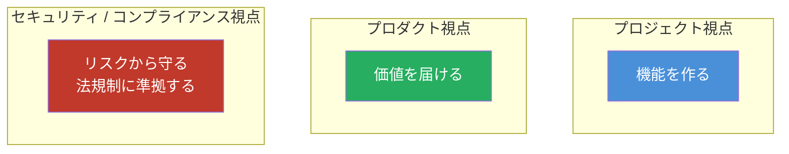
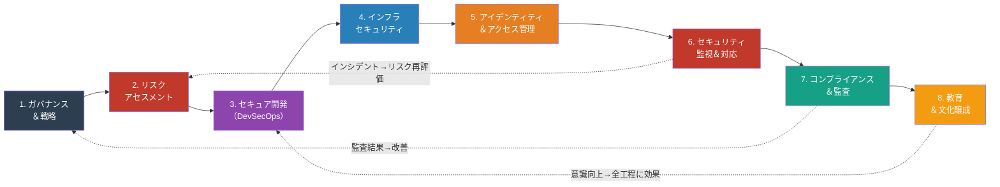
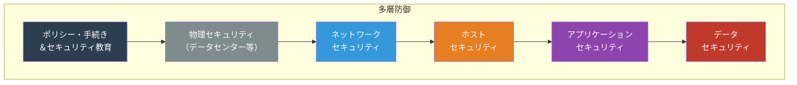
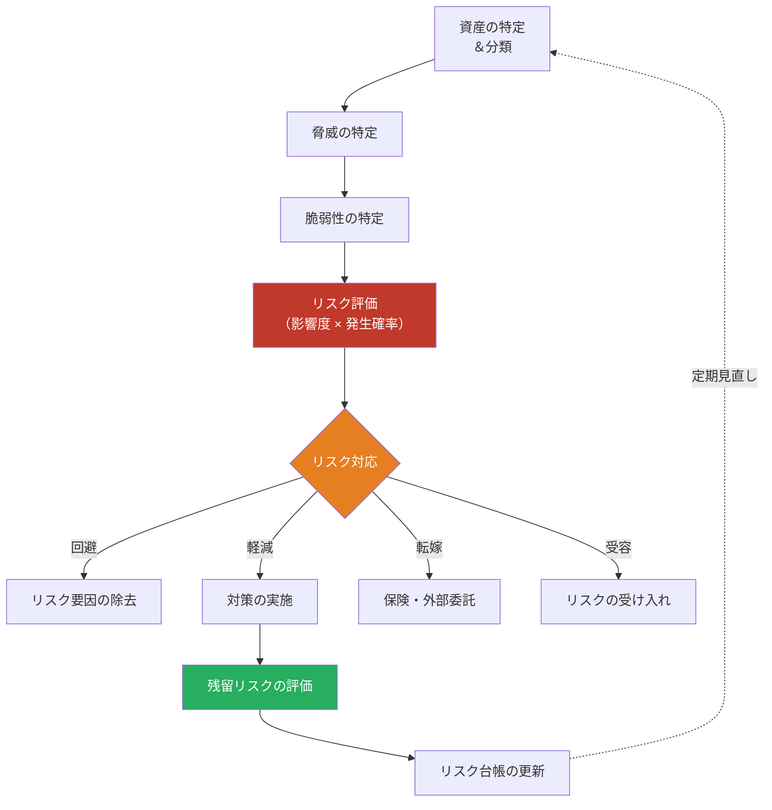
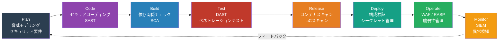
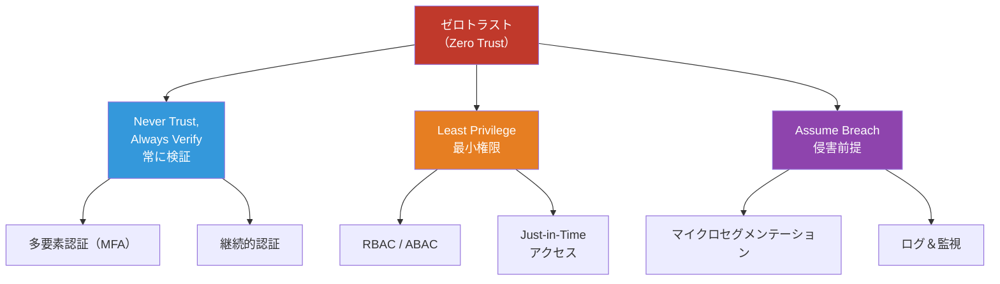
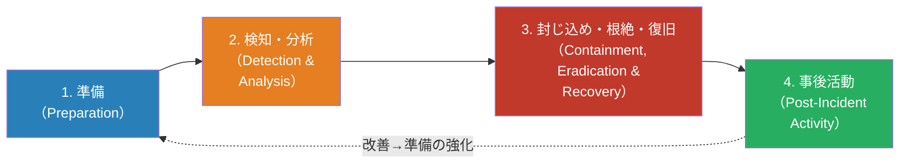
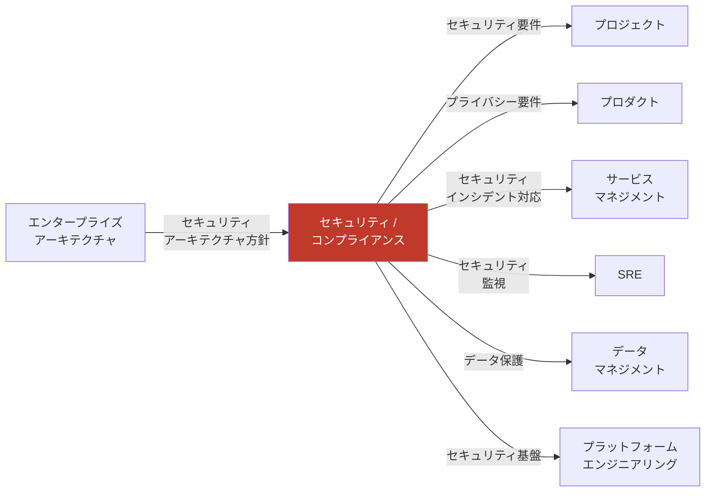

# セキュリティ / コンプライアンスマップ — 「どう安全を守り、法規制に準拠するか」

> ソフトウェア・システム・サービスを**脅威から守り**、**法的・規制的要求に準拠し続ける**ための
> プロセス・体制・タスク・リソースを網羅的に整理したもの

## 他の視点との根本的な違い

| 観点     | プロジェクト | プロダクト       | セキュリティ/コンプライアンス        |
| -------- | ------------ | ---------------- | ------------------------------------ |
| ゴール   | 成果物を納品 | 価値を届け続ける | リスクを許容水準以下に保つ           |
| 時間軸   | 有期         | 無期限           | 永続的（脅威は常に進化）             |
| 成功指標 | QCD          | アウトカム       | リスク低減率・準拠率・インシデント数 |
| 中心人物 | PM           | PdM              | CISO / セキュリティエンジニア        |
| 特徴     | 計画駆動     | 価値駆動         | リスク駆動                           |

## セキュリティ / コンプライアンス 全体像

## Defense in Depth（多層防御）の考え方

## 1. セキュリティガバナンス＆戦略

### 目的

組織全体のセキュリティ方針を策定し、トップダウンでセキュリティを推進する統治体制を確立する。

### タスク一覧

| #   | タスク                           | 説明                                               |
| --- | -------------------------------- | -------------------------------------------------- |
| 1   | セキュリティポリシー策定         | 情報セキュリティ基本方針、個別方針の文書化         |
| 2   | セキュリティ組織体制構築         | CISO任命、セキュリティチーム編成                   |
| 3   | セキュリティ戦略立案             | 3〜5年のロードマップ、投資計画                     |
| 4   | セキュリティフレームワーク選定   | ISMS(ISO27001)、NIST CSF、CIS Controls等の採用判断 |
| 5   | リスクアペタイト定義             | 組織として許容するリスク水準の決定                 |
| 6   | セキュリティ予算策定             | リスクに見合った投資の計画                         |
| 7   | サプライチェーンセキュリティ方針 | 委託先・パートナーへのセキュリティ要求             |

### リソース

| カテゴリ | リソース                                          | 備考                         |
| -------- | ------------------------------------------------- | ---------------------------- |
| **人**   | CISO（最高情報セキュリティ責任者）                | セキュリティ全体の最終責任者 |
| **人**   | セキュリティマネージャー                          | 日常のセキュリティ管理       |
| **人**   | コンプライアンスオフィサー                        | 法規制対応の責任者           |
| **物**   | GRC（ガバナンス・リスク・コンプライアンス）ツール | ServiceNow GRC, OneTrust 等  |
| **物**   | ポリシー管理ツール                                | Confluence, SharePoint 等    |
| **金**   | コンサルティング費用                              | セキュリティ顧問、外部監査   |
| **金**   | 認証取得費用                                      | ISO27001, SOC2等の審査費用   |

### 成果物

| 成果物                         | 形式                | 必須/任意 |
| ------------------------------ | ------------------- | --------- |
| 情報セキュリティ基本方針       | ドキュメント        | 必須      |
| セキュリティ組織図・責任分担表 | 図表 / ドキュメント | 必須      |
| セキュリティ戦略・ロードマップ | ドキュメント        | 必須      |
| リスクアペタイトステートメント | ドキュメント        | 必須      |
| セキュリティ予算計画           | スプレッドシート    | 必須      |

## 2. リスクアセスメント

### 目的

情報資産に対する脅威と脆弱性を特定し、リスクを評価して対処方針を決定する。

### リスク管理プロセス

### タスク一覧

| #   | タスク                   | 説明                                              |
| --- | ------------------------ | ------------------------------------------------- |
| 1   | 情報資産の棚卸し         | システム・データ・人・物理的資産の洗い出し        |
| 2   | 資産の分類               | 機密度（Confidential/Internal/Public等）の分類    |
| 3   | 脅威分析                 | STRIDEモデル等を使った脅威の体系的特定            |
| 4   | 脆弱性評価               | 技術的脆弱性スキャン + プロセス面の脆弱性評価     |
| 5   | リスク算定               | 影響度 × 発生可能性のマトリクスによるスコアリング |
| 6   | リスク対応計画策定       | 各リスクの対処方針（回避/軽減/転嫁/受容）決定     |
| 7   | リスク台帳管理           | リスクの記録・追跡・定期レビュー                  |
| 8   | 脅威インテリジェンス収集 | 業界特有の脅威情報の継続的収集                    |

### STRIDEモデルによる脅威分類

| 脅威カテゴリ                           | 説明                     | 対策の方向性         |
| -------------------------------------- | ------------------------ | -------------------- |
| **S**poofing（なりすまし）             | 他者のIDを詐称           | 認証の強化           |
| **T**ampering（改ざん）                | データ・コードの不正変更 | 整合性チェック       |
| **R**epudiation（否認）                | 行為の否認               | 監査ログ             |
| **I**nformation Disclosure（情報漏洩） | 機密情報の露出           | 暗号化・アクセス制御 |
| **D**enial of Service（サービス拒否）  | サービスの利用妨害       | 可用性対策           |
| **E**levation of Privilege（権限昇格） | 不正な権限取得           | 最小権限原則         |

### リソース

| カテゴリ | リソース                 | 備考                           |
| -------- | ------------------------ | ------------------------------ |
| **人**   | セキュリティアナリスト   | リスク評価実施                 |
| **人**   | 各システム担当者         | 資産情報・脅威情報の提供       |
| **物**   | 脆弱性スキャナー         | Nessus, Qualys, OpenVAS 等     |
| **物**   | リスク管理ツール         | GRCプラットフォーム            |
| **金**   | ペネトレーションテスト費 | 外部専門チームによる侵入テスト |

### 成果物

| 成果物           | 形式                         | 必須/任意 |
| ---------------- | ---------------------------- | --------- |
| 情報資産台帳     | スプレッドシート / DB        | 必須      |
| リスク台帳       | スプレッドシート / GRCツール | 必須      |
| リスクマトリクス | 図表                         | 必須      |
| リスク対応計画書 | ドキュメント                 | 必須      |
| 脅威モデル       | 図表 / ドキュメント          | 必須      |

## 3. セキュア開発（DevSecOps）

### 目的

セキュリティを開発ライフサイクルの**最初から組み込む**（Shift Left）。後付けではなく、設計・コーディング段階からセキュリティを確保する。

### DevSecOps パイプライン

### タスク一覧

| #   | タスク                               | 説明                                                     |
| --- | ------------------------------------ | -------------------------------------------------------- |
| 1   | 脅威モデリング                       | STRIDE等を使い、設計段階でセキュリティリスクを洗い出す   |
| 2   | セキュリティ要件定義                 | 機能要件・非機能要件としてのセキュリティ要求             |
| 3   | セキュアコーディングガイドライン策定 | OWASP Top 10、CWE Top 25等に基づくガイドライン           |
| 4   | SAST（静的解析）導入                 | ソースコードの脆弱性自動検出（SonarQube, Semgrep等）     |
| 5   | SCA（ソフトウェア構成分析）導入      | 依存ライブラリの脆弱性チェック（Snyk, Dependabot等）     |
| 6   | DAST（動的解析）導入                 | 実行中アプリへの攻撃テスト（OWASP ZAP, Burp Suite等）    |
| 7   | コンテナセキュリティ                 | イメージスキャン（Trivy, Aqua等）                        |
| 8   | IaCセキュリティスキャン              | Terraform/CloudFormation等の設定不備検出                 |
| 9   | シークレット管理                     | Vault, AWS Secrets Manager等によるシークレットの安全管理 |
| 10  | ペネトレーションテスト               | 定期的な外部/内部侵入テスト                              |
| 11  | SBOM（ソフトウェア部品表）管理       | ソフトウェア構成の可視化・追跡                           |

### リソース

| カテゴリ | リソース                 | 備考                                     |
| -------- | ------------------------ | ---------------------------------------- |
| **人**   | セキュリティエンジニア   | DevSecOpsパイプラインの構築・運用        |
| **人**   | セキュリティチャンピオン | 開発チーム内のセキュリティ推進者         |
| **人**   | ペネトレーションテスター | 外部または内部の専門チーム               |
| **物**   | SAST ツール              | SonarQube, Semgrep, CodeQL               |
| **物**   | SCA ツール               | Snyk, Dependabot, OWASP Dependency Check |
| **物**   | DAST ツール              | OWASP ZAP, Burp Suite                    |
| **物**   | シークレット管理         | HashiCorp Vault, AWS Secrets Manager     |
| **物**   | コンテナスキャン         | Trivy, Aqua Security                     |
| **金**   | ツールライセンス費       | 商用セキュリティツール                   |
| **金**   | ペネトレーションテスト費 | 外部委託時の費用                         |

### 成果物

| 成果物                           | 形式                             | 必須/任意        |
| -------------------------------- | -------------------------------- | ---------------- |
| 脅威モデル                       | 図表 / ドキュメント              | 必須             |
| セキュアコーディングガイドライン | Wiki / ドキュメント              | 必須             |
| セキュリティテスト結果           | レポート                         | 必須             |
| SBOM                             | 構造化データ（CycloneDX / SPDX） | 必須             |
| ペネトレーションテストレポート   | レポート                         | 必須（年次以上） |
| 脆弱性対応状況レポート           | ダッシュボード / レポート        | 必須             |

## 4. インフラセキュリティ

### 目的

ネットワーク・サーバー・クラウド環境を安全に構成し、インフラレイヤーでの脅威を防御する。

### タスク一覧

| #   | タスク                                   | 説明                                                    |
| --- | ---------------------------------------- | ------------------------------------------------------- |
| 1   | ネットワークセグメンテーション           | VPC/サブネット分離、マイクロセグメンテーション          |
| 2   | ファイアウォール管理                     | ルールの設計・定期レビュー                              |
| 3   | WAF導入・運用                            | Webアプリケーションファイアウォールの設定               |
| 4   | DDoS対策                                 | CDN/WAFによる防御（CloudFlare, AWS Shield等）           |
| 5   | エンドポイントセキュリティ               | EDR/XDR導入、マルウェア対策                             |
| 6   | パッチ管理                               | OS・ミドルウェアのセキュリティパッチ適用                |
| 7   | 暗号化                                   | TLS通信暗号化、ストレージ暗号化（at-rest / in-transit） |
| 8   | セキュリティベースライン                 | CIS Benchmarks等に基づく構成標準の策定・適用            |
| 9   | クラウドセキュリティポスチャ管理（CSPM） | クラウド設定の継続的監視                                |

### リソース

| カテゴリ | リソース                       | 備考                                            |
| -------- | ------------------------------ | ----------------------------------------------- |
| **人**   | インフラセキュリティエンジニア | インフラ防御の設計・運用                        |
| **人**   | クラウドセキュリティエンジニア | クラウド固有のセキュリティ                      |
| **物**   | WAF                            | AWS WAF, Cloudflare, Imperva 等                 |
| **物**   | EDR/XDR                        | CrowdStrike, SentinelOne, Microsoft Defender 等 |
| **物**   | CSPM                           | Prisma Cloud, AWS Security Hub 等               |
| **金**   | セキュリティ製品ライセンス     | EDR, WAF, CSPM等                                |

### 成果物

| 成果物                   | 形式                | 必須/任意              |
| ------------------------ | ------------------- | ---------------------- |
| ネットワーク設計図       | 図表                | 必須                   |
| セキュリティベースライン | ドキュメント / 設定 | 必須                   |
| パッチ管理計画           | スプレッドシート    | 必須                   |
| CSPM設定レポート         | レポート            | 必須（クラウド利用時） |

## 5. アイデンティティ＆アクセス管理（IAM）

### 目的

適切な人が、適切なリソースに、適切なタイミングで、適切な理由でアクセスできるようにする。

### ゼロトラストの原則

### タスク一覧

| #   | タスク                                    | 説明                                        |
| --- | ----------------------------------------- | ------------------------------------------- |
| 1   | IdP（認証基盤）構築                       | SSO、SAML/OIDC連携の設計・導入              |
| 2   | MFA導入                                   | 多要素認証の全ユーザー適用                  |
| 3   | RBAC / ABAC設計                           | ロールベース/属性ベースのアクセス制御モデル |
| 4   | 特権アクセス管理（PAM）                   | 管理者権限の厳格な管理・監視                |
| 5   | アクセスレビュー                          | 定期的な権限の棚卸し・不要権限の剥奪        |
| 6   | プロビジョニング/デプロビジョニング自動化 | 入退社に伴うアカウント管理の自動化          |
| 7   | サービスアカウント管理                    | 非人間アカウントの管理・ローテーション      |

### リソース

| カテゴリ | リソース                   | 備考                         |
| -------- | -------------------------- | ---------------------------- |
| **人**   | IAMエンジニア              | 認証・認可基盤の構築         |
| **人**   | IT管理者                   | アカウント管理               |
| **物**   | IdP                        | Okta, Azure AD, Auth0 等     |
| **物**   | PAMツール                  | CyberArk, HashiCorp Vault 等 |
| **物**   | IGA（Identity Governance） | SailPoint, Saviynt 等        |
| **金**   | IdP/PAMライセンス費        | ユーザー数に比例             |

### 成果物

| 成果物               | 形式                            | 必須/任意 |
| -------------------- | ------------------------------- | --------- |
| IAMポリシー          | ドキュメント                    | 必須      |
| ロール定義書         | スプレッドシート / ドキュメント | 必須      |
| アクセスマトリクス   | スプレッドシート                | 必須      |
| アクセスレビュー記録 | レポート（四半期）              | 必須      |
| 特権アクセスログ     | ログ                            | 必須      |

## 6. セキュリティ監視＆インシデント対応

### 目的

セキュリティ脅威を**早期に検知**し、セキュリティインシデントに**迅速・体系的に対応**する。

### セキュリティインシデント対応フロー（NIST SP 800-61ベース）

### タスク一覧

| #   | タスク                                        | 説明                                           |
| --- | --------------------------------------------- | ---------------------------------------------- |
| 1   | SIEM導入・運用                                | セキュリティログの統合収集・相関分析           |
| 2   | SOC（セキュリティオペレーションセンター）構築 | 24/365のセキュリティ監視体制                   |
| 3   | 検知ルール策定                                | MITRE ATT&CKフレームワークに基づく検知シナリオ |
| 4   | インシデント対応計画（IRP）策定               | セキュリティインシデント発生時の対応手順       |
| 5   | CSIRT体制構築                                 | インシデント対応チームの編成・訓練             |
| 6   | フォレンジック能力構築                        | デジタルフォレンジック調査の体制・ツール整備   |
| 7   | インシデント対応訓練                          | Red Team / Blue Team 演習、テーブルトップ演習  |
| 8   | 脅威ハンティング                              | 能動的な脅威の探索                             |

### リソース

| カテゴリ | リソース                  | 備考                                          |
| -------- | ------------------------- | --------------------------------------------- |
| **人**   | SOCアナリスト（L1/L2/L3） | セキュリティ監視・対応                        |
| **人**   | CSIRT メンバー            | インシデント対応チーム                        |
| **人**   | フォレンジック調査員      | 証拠保全・分析                                |
| **物**   | SIEM                      | Splunk, Microsoft Sentinel, Elastic SIEM 等   |
| **物**   | SOAR                      | Palo Alto XSOAR, Splunk SOAR 等               |
| **物**   | EDR/XDR                   | CrowdStrike, SentinelOne 等                   |
| **金**   | SOC運用費                 | 人件費（24/365の場合は高額）/ マネージドSOC費 |
| **金**   | SIEMライセンス費          | ログ量に比例                                  |

### 成果物

| 成果物                      | 形式           | 必須/任意                |
| --------------------------- | -------------- | ------------------------ |
| インシデント対応計画（IRP） | ドキュメント   | 必須                     |
| 検知ルール / ユースケース   | SIEM設定       | 必須                     |
| インシデントレポート        | ドキュメント   | 必須（発生時）           |
| フォレンジック報告書        | レポート       | 必須（重大インシデント） |
| セキュリティダッシュボード  | ダッシュボード | 必須                     |
| 対応訓練記録                | レポート       | 必須（年次以上）         |

## 7. コンプライアンス＆監査

### 目的

法律・規制・業界標準・契約上の義務を遵守し、その状態を**証明・維持**する。

### 主要なフレームワーク・規制

| フレームワーク / 規制 | 対象            | 説明                                                           |
| --------------------- | --------------- | -------------------------------------------------------------- |
| **ISO/IEC 27001**     | 全般            | 情報セキュリティマネジメントシステム（ISMS）国際規格           |
| **SOC 2**             | SaaS / クラウド | セキュリティ・可用性・処理整合性・機密性・プライバシーの監査   |
| **NIST CSF**          | 全般（米国発）  | サイバーセキュリティフレームワーク（識別→防御→検知→対応→復旧） |
| **GDPR**              | EU個人データ    | EU一般データ保護規則                                           |
| **個人情報保護法**    | 日本            | 日本の個人情報保護に関する法律                                 |
| **PCI DSS**           | 決済            | クレジットカード情報のセキュリティ基準                         |
| **HIPAA**             | 医療（米国）    | 医療情報のプライバシー・セキュリティ                           |

### タスク一覧

| #   | タスク                           | 説明                                       |
| --- | -------------------------------- | ------------------------------------------ |
| 1   | 適用法規制の特定                 | ビジネス・地域に基づく適用法規制の洗い出し |
| 2   | コンプライアンスギャップ分析     | 現状と要求事項の差異を特定                 |
| 3   | 統制（コントロール）の設計・実装 | 要求を満たすための技術的・組織的対策       |
| 4   | 証跡の収集・管理                 | コンプライアンスの証拠となる記録の管理     |
| 5   | 内部監査                         | 定期的な自己評価・内部監査の実施           |
| 6   | 外部監査対応                     | 認証機関・監査法人による外部監査への対応   |
| 7   | 是正措置の実施                   | 監査指摘事項への対応・改善                 |
| 8   | コンプライアンス継続モニタリング | 自動化による継続的なコンプライアンス確認   |

### リソース

| カテゴリ | リソース                     | 備考                        |
| -------- | ---------------------------- | --------------------------- |
| **人**   | コンプライアンスマネージャー | 法規制対応の推進            |
| **人**   | 内部監査人                   | 内部監査の実施              |
| **人**   | 法務 / DPO                   | 法的助言、データ保護責任者  |
| **物**   | GRCプラットフォーム          | Vanta, Drata, OneTrust 等   |
| **物**   | 証跡管理ツール               | GRCツール、ドキュメント管理 |
| **金**   | 監査費用                     | 外部監査・認証審査費用      |
| **金**   | ツールライセンス費           | GRC自動化ツール             |

### 成果物

| 成果物                                 | 形式                            | 必須/任意              |
| -------------------------------------- | ------------------------------- | ---------------------- |
| コンプライアンスマトリクス             | スプレッドシート                | 必須                   |
| 統制一覧（Statement of Applicability） | スプレッドシート / ドキュメント | 必須（ISO27001）       |
| 内部監査レポート                       | レポート                        | 必須                   |
| 外部監査レポート                       | レポート                        | 必須（認証取得時）     |
| 是正措置計画                           | ドキュメント                    | 必須（指摘事項発生時） |
| 認証書                                 | 証明書                          | 必須（認証取得後）     |

## 8. セキュリティ教育＆文化醸成

### 目的

全社員のセキュリティ意識を高め、人的リスクを低減する。**セキュリティは全員の責任**という文化を醸成する。

### タスク一覧

| #   | タスク                       | 説明                                         |
| --- | ---------------------------- | -------------------------------------------- |
| 1   | セキュリティ意識向上研修     | 全社員向けの定期研修（年次以上）             |
| 2   | フィッシング訓練             | 模擬フィッシングメールによる訓練・測定       |
| 3   | 開発者向けセキュリティ研修   | セキュアコーディング、OWASP Top 10の理解     |
| 4   | セキュリティチャンピオン制度 | 各チームにセキュリティ推進者を配置           |
| 5   | インシデント報告文化の醸成   | 報告を奨励する文化（罰則ではなく学びの姿勢） |
| 6   | セキュリティニュースレター   | 最新脅威・対策情報の社内共有                 |

### リソース

| カテゴリ | リソース                    | 備考                                      |
| -------- | --------------------------- | ----------------------------------------- |
| **人**   | セキュリティ教育担当        | 研修の企画・実施                          |
| **物**   | eラーニングプラットフォーム | KnowBe4, Proofpoint Security Awareness 等 |
| **物**   | フィッシング訓練ツール      | KnowBe4, GoPhish 等                       |
| **金**   | 研修費用                    | 外部研修・プラットフォーム費用            |

### 成果物

| 成果物                       | 形式                             | 必須/任意 |
| ---------------------------- | -------------------------------- | --------- |
| セキュリティ研修資料         | プレゼンテーション / eラーニング | 必須      |
| 研修受講記録                 | レポート                         | 必須      |
| フィッシング訓練結果         | レポート（クリック率等）         | 必須      |
| セキュリティチャンピオン一覧 | 組織図                           | 任意      |

## 横断的な視点 — 他視点との関係

### 重要な連携ポイント

| 連携先               | セキュリティ / コンプライアンスとの関係                              |
| -------------------- | -------------------------------------------------------------------- |
| プロジェクト         | セキュリティ要件のプロジェクト計画への組み込み。脅威モデリングの実施 |
| プロダクト           | プライバシーバイデザイン。個人情報保護法/GDPR対応                    |
| サービスマネジメント | セキュリティインシデントの対応連携。パッチ管理の協働                 |
| SRE                  | セキュリティ監視・アラート。インフラセキュリティの自動化             |
| データマネジメント   | データ暗号化・アクセス制御・データ分類の連携                         |
| プラットフォーム     | セキュリティツールの基盤提供。ポリシーのコード化（Policy as Code）   |
| EA                   | セキュリティアーキテクチャの全体方針。ゼロトラスト戦略               |
| ポートフォリオ       | セキュリティ投資の最適配分。リスクのポートフォリオ管理               |
