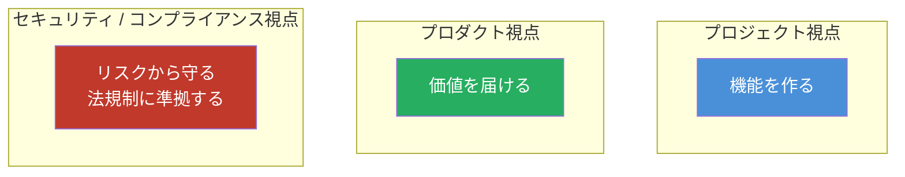
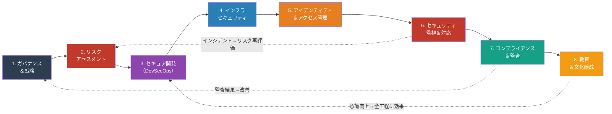
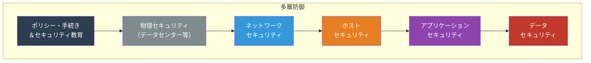
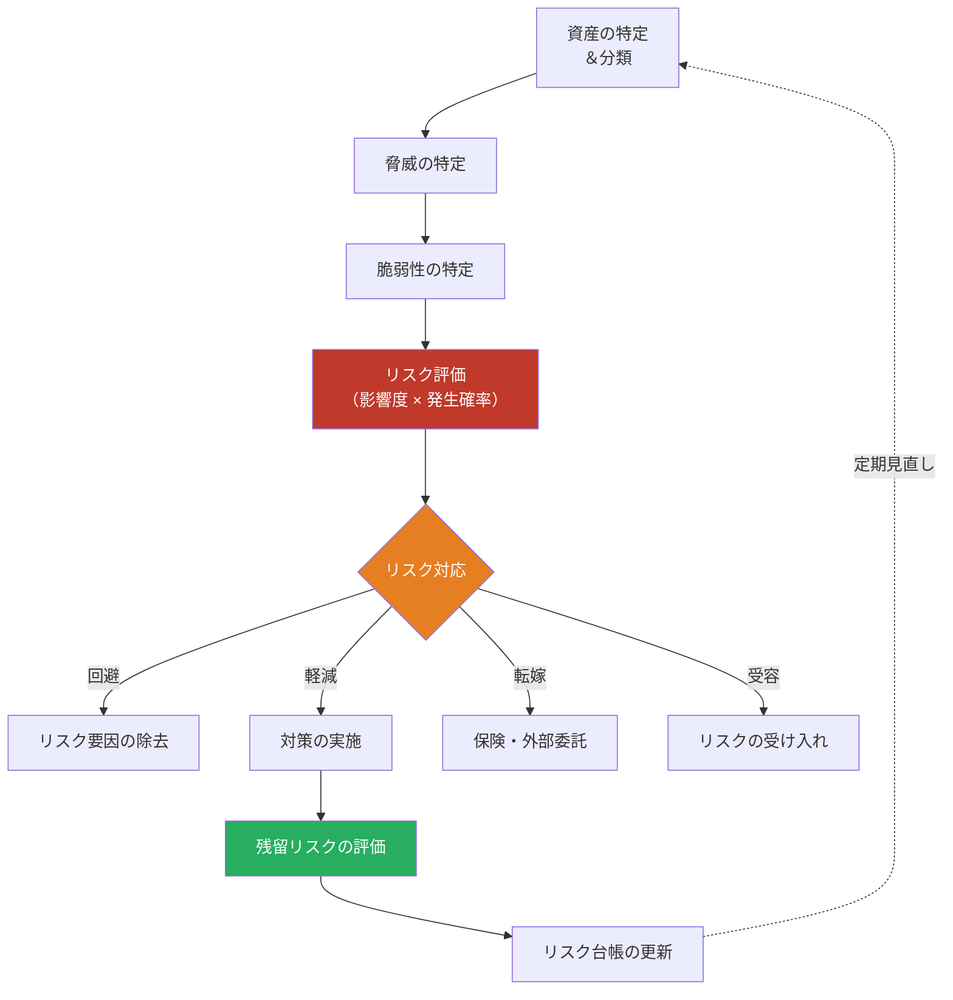
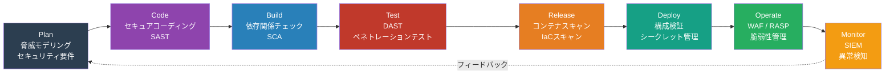
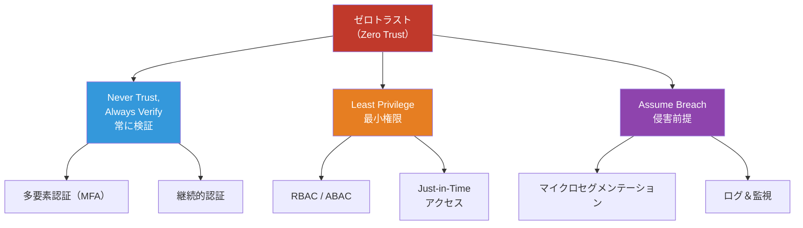
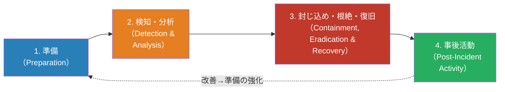
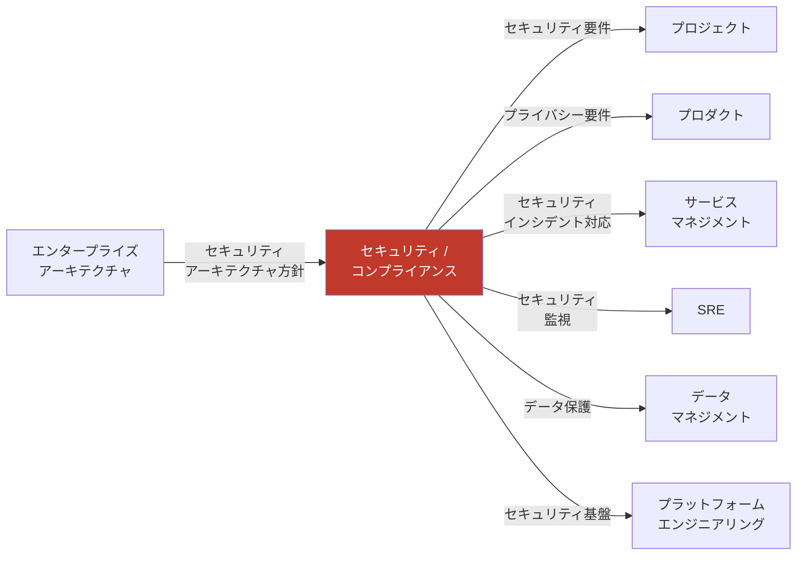

# セキュリティ / コンプライアンスマップ — 「どう安全を守り、法規制に準拠するか」

> ソフトウェア・システム・サービスを**脅威から守り**、**法的・規制的要求に準拠し続ける**ための
> プロセス・体制・タスク・リソースを網羅的に整理したもの

本ドキュメントは、セキュリティとコンプライアンスを体系的に整備・運用するためのロードマップです。プロジェクト視点では機能納品を、プロダクト視点では価値提供を目指しますが、セキュリティ/コンプライアンスは「リスクの許容水準以下への維持」と「法規制への永続的適合」が最優先です。本マップは、組織がこの責任を果たすために必要な8つの重要領域を、下記の読み方で提示します：各セクションの冒頭に目的と意義を、中盤に実装の手順やフレームワークを、最後に必要なリソースと成果物をまとめています。全社的な推進を通じて、強固なセキュリティ基盤と継続的なコンプライアンス体制の構築を目指してください。

## 他の視点との根本的な違い

下図は、プロジェクト・プロダクト・セキュリティ/コンプライアンスの3つの視点における**ゴール・時間軸・成功指標の違い**を可視化しています。各視点は相互に補完的ですが、セキュリティ/コンプライアンスはリスク駆動であり、脅威の進化に対応して永続的に取り組む必要があります。以下の表と合わせ、組織内の役割分担と責任の所在を明確にする際の参考としてください。

| 観点     | プロジェクト | プロダクト       | セキュリティ/コンプライアンス        |
| -------- | ------------ | ---------------- | ------------------------------------ |
| ゴール   | 成果物を納品 | 価値を届け続ける | リスクを許容水準以下に保つ           |
| 時間軸   | 有期         | 無期限           | 永続的（脅威は常に進化）             |
| 成功指標 | QCD          | アウトカム       | リスク低減率・準拠率・インシデント数 |
| 中心人物 | PM           | PdM              | CISO / セキュリティエンジニア        |
| 特徴     | 計画駆動     | 価値駆動         | リスク駆動                           |

## セキュリティ / コンプライアンス 全体像

セキュリティ/コンプライアンスは、以下の8つの領域が連鎖的・循環的に機能することで実現されます。下図は、各領域の進行順序と相互のフィードバックループを示します。ガバナンス&戦略に始まり、リスク評価→セキュア開発→運用段階の防御→アイデンティティ管理→監視・対応→コンプライアンス監査→教育という、段階的かつ統合的なプロセスが、脅威環境の変化に応じて継続的に改善されることが重要です。

## Defense in Depth（多層防御）の考え方

単一の防御策に依存せず、複数の層（ポリシー・物理・ネットワーク・ホスト・アプリケーション・データ）で段階的に脅威を検出・遮断するアプローチです。どの層かが突破されても、他の層で防御でき、攻撃者の侵入コストを高めることができます。以下の図は防御の各層を示すとともに、下記の各セクション（ガバナンス→インフラセキュリティ→IAM→監視・対応→教育）がこの多層防御の実装に対応していることを理解する助けになります。

## 1. セキュリティガバナンス＆戦略

### 目的

組織全体のセキュリティ方針を策定し、トップダウンでセキュリティを推進する統治体制を確立する。

セキュリティガバナンスは、全体像セクションの第1段階であり、経営層の明確なコミットメントがなければ、後続の技術的投資やプロセス改善は継続されません。本セクションでは、セキュリティの「why」と「how」を定義し、組織全体が共通の方向性を持つための基盤を作ります。これにより、リスク評価からセキュア開発、インシデント対応に至るまで、すべてのアクティビティが戦略的に連携されることになります。

### タスク一覧

このフェーズは、経営層のコミットメント確保が他のセクションと異なる最大の特徴です。ガバナンスの根幹である戦略立案・方針策定・体制構築には、経営戦略との連動、複数フレームワーク（ISMS/NIST CSF/CIS Controls）への理解、および組織全体へのトップダウン推進が求められます。以下のタスクを通じて、セキュリティ方針の体系化、組織体制の構築、および長期的な投資計画を定め、経営層と現場の意思疎通を図ります。

| #   | タスク                           | 説明                                               |
| --- | -------------------------------- | -------------------------------------------------- |
| 1   | セキュリティポリシー策定         | 情報セキュリティ基本方針、個別方針の文書化         |
| 2   | セキュリティ組織体制構築         | CISO任命、セキュリティチーム編成                   |
| 3   | セキュリティ戦略立案             | 3〜5年のロードマップ、投資計画                     |
| 4   | セキュリティフレームワーク選定   | ISMS(ISO27001)、NIST CSF、CIS Controls等の採用判断 |
| 5   | リスクアペタイト定義             | 組織として許容するリスク水準の決定                 |
| 6   | セキュリティ予算策定             | リスクに見合った投資の計画                         |
| 7   | サプライチェーンセキュリティ方針 | 委託先・パートナーへのセキュリティ要求             |

### リソース

このフェーズでは経営層・法務・コンプライアンス専門家が中心となり、人材比率は経営側寄りになります。GRCツールやポリシー管理システムは、後続のセクション（リスク評価・監査・教育）でも継続的に活用される基盤投資であり、初期段階での充実が全体効率に大きく影響します。| カテゴリ | リソース                                          | 備考                         |
| -------- | ------------------------------------------------- | ---------------------------- |
| **人**   | CISO（最高情報セキュリティ責任者）                | セキュリティ全体の最終責任者 |
| **人**   | セキュリティマネージャー                          | 日常のセキュリティ管理       |
| **人**   | コンプライアンスオフィサー                        | 法規制対応の責任者           |
| **物**   | GRC（ガバナンス・リスク・コンプライアンス）ツール | ServiceNow GRC, OneTrust 等  |
| **物**   | ポリシー管理ツール                                | Confluence, SharePoint 等    |
| **金**   | コンサルティング費用                              | セキュリティ顧問、外部監査   |
| **金**   | 認証取得費用                                      | ISO27001, SOC2等の審査費用   |

### 成果物

このフェーズの成果物は、全社のセキュリティ投資・人員配置・優先度判断の根拠となるため、後続の7つのセクション全体に対して「指針」として機能します。特にセキュリティ戦略・ロードマップは、各セクションの実装計画の優先順位付けや予算配分の正当性を示す証拠となり、経営層との継続的なコミュニケーションに使用されます。| 成果物                         | 形式                | 必須/任意 |
| ------------------------------ | ------------------- | --------- |
| 情報セキュリティ基本方針       | ドキュメント        | 必須      |
| セキュリティ組織図・責任分担表 | 図表 / ドキュメント | 必須      |
| セキュリティ戦略・ロードマップ | ドキュメント        | 必須      |
| リスクアペタイトステートメント | ドキュメント        | 必須      |
| セキュリティ予算計画           | スプレッドシート    | 必須      |

## 2. リスクアセスメント

### 目的

情報資産に対する脅威と脆弱性を特定し、リスクを評価して対処方針を決定する。

リスクアセスメントは、セキュリティガバナンスで定めた戦略を具体的なアクション（対策の実施・優先順位付け）に変換する重要な橋渡し役です。本セクションで特定・評価されたリスクは、セキュア開発の脅威モデリング、インフラセキュリティの対策選定、コンプライアンス監査の重点領域を決定する入力情報となります。定期的な見直しにより、新興脅威への対応と既存対策の有効性確認を継続する必要があります。

### リスク管理プロセス

下図は、資産特定から脅威・脆弱性の特定、リスク評価、対応策の決定、そして継続的な見直しまでの一連のプロセスを示します。各段階で標準化された手法（STRIDE、リスクマトリクス等）を用いることで、恣意的でない透明性の高いリスク評価が実現されます。

### タスク一覧

このフェーズは、ガバナンスで定めた戦略を「実行可能な対策」に変換する最初のステップです。STRIDEモデル等の脅威分類フレームワークや、リスクマトリクスによる定量評価が、セクション3以降の脅威モデリング・セキュア開発・コンプライアンス監査の入力データとなります。定期的な見直し（通常は年1回以上）により、新興脅威への対応と既存対策の有効性を継続的に検証する必要があります。| #   | タスク                   | 説明                                              |
| --- | ------------------------ | ------------------------------------------------- |
| 1   | 情報資産の棚卸し         | システム・データ・人・物理的資産の洗い出し        |
| 2   | 資産の分類               | 機密度（Confidential/Internal/Public等）の分類    |
| 3   | 脅威分析                 | STRIDEモデル等を使った脅威の体系的特定            |
| 4   | 脆弱性評価               | 技術的脆弱性スキャン + プロセス面の脆弱性評価     |
| 5   | リスク算定               | 影響度 × 発生可能性のマトリクスによるスコアリング |
| 6   | リスク対応計画策定       | 各リスクの対処方針（回避/軽減/転嫁/受容）決定     |
| 7   | リスク台帳管理           | リスクの記録・追跡・定期レビュー                  |
| 8   | 脅威インテリジェンス収集 | 業界特有の脅威情報の継続的収集                    |

### STRIDEモデルによる脅威分類

STRIDEは、Microsoft が提唱した脅威分類フレームワークであり、「なりすまし」から「権限昇格」までの6つのカテゴリに脅威を体系化します。このモデルを用いることで、脅威分析を網羅的・構造的に行い、対策漏れを減らすことができます。下表は各脅威カテゴリと対策の方向性を示すものであり、設計・開発段階での脅威モデリングと、運用段階でのセキュリティテストの両方で参照されます。

| 脅威カテゴリ                           | 説明                     | 対策の方向性         |
| -------------------------------------- | ------------------------ | -------------------- |
| **S**poofing（なりすまし）             | 他者のIDを詐称           | 認証の強化           |
| **T**ampering（改ざん）                | データ・コードの不正変更 | 整合性チェック       |
| **R**epudiation（否認）                | 行為の否認               | 監査ログ             |
| **I**nformation Disclosure（情報漏洩） | 機密情報の露出           | 暗号化・アクセス制御 |
| **D**enial of Service（サービス拒否）  | サービスの利用妨害       | 可用性対策           |
| **E**levation of Privilege（権限昇格） | 不正な権限取得           | 最小権限原則         |

### リソース

セクション1の経営層中心体制から、このフェーズでは技術者（セキュリティアナリスト・システム担当者）の比率が大幅に増加します。脆弱性スキャナーやGRCツールへの初期投資も本フェーズが最大となり、後続フェーズでは監視・分析がメインになるため、段階的にツール運用負担が減少することが期待されます。| カテゴリ | リソース                 | 備考                           |
| -------- | ------------------------ | ------------------------------ |
| **人**   | セキュリティアナリスト   | リスク評価実施                 |
| **人**   | 各システム担当者         | 資産情報・脅威情報の提供       |
| **物**   | 脆弱性スキャナー         | Nessus, Qualys, OpenVAS 等     |
| **物**   | リスク管理ツール         | GRCプラットフォーム            |
| **金**   | ペネトレーションテスト費 | 外部専門チームによる侵入テスト |

### 成果物

この段階の成果物（特にリスク台帳・脅威モデル）は、セクション3のセキュア開発による脅威モデリング、セクション7のコンプライアンス監査による重点領域決定、および全セクションのセキュリティテストプランの根拠となります。リスク台帳は「生きたドキュメント」として継続更新され、インシデント発生時の根本原因分析やセキュリティフレームワーク（NIST CSF等）への対応状況追跡に活用されます。| 成果物           | 形式                         | 必須/任意 |
| ---------------- | ---------------------------- | --------- |
| 情報資産台帳     | スプレッドシート / DB        | 必須      |
| リスク台帳       | スプレッドシート / GRCツール | 必須      |
| リスクマトリクス | 図表                         | 必須      |
| リスク対応計画書 | ドキュメント                 | 必須      |
| 脅威モデル       | 図表 / ドキュメント          | 必須      |

## 3. セキュア開発（DevSecOps）

### 目的

セキュリティを開発ライフサイクルの**最初から組み込む**（Shift Left）。後付けではなく、設計・コーディング段階からセキュリティを確保する。

リリース後のセキュリティ問題の修正は、コスト・時間・評判面で極めて高くつくため、開発プロセスの初期段階（計画・設計）からセキュリティ検証を組み込むことが不可欠です。本セクションで示すDevSecOpsパイプラインは、リスクアセスメント結果を脅威モデリングに反映させ、SAST/SCA/DAST等の自動化ツールと、ペネトレーションテスト等の人的検証を組み合わせることで、品質を損なわずにセキュリティレベルを高める手法です。

### DevSecOps パイプライン

下図は、開発のプラン段階からモニタリング段階までの全体を7つのステップに分割し、各ステップでセキュリティ検証を組み込む手法を示しています。特に自動化可能な検証（SAST/SCA）を早期に実施することで、脆弱性の検出・修正サイクルを高速化し、開発チームの負担を軽減します。

### タスク一覧

このフェーズは、セクション2のリスク評価を「開発プロセス」に組み込む唯一のセクションです。SAST/SCA/DASTなどの自動化ツールと、ペネトレーションテスト等の人的検証を組み合わせることで、「品質とセキュリティの両立」を実現します。開発者が脅威モデリング・セキュアコーディングを理解し、DevSecOpsパイプラインを内在化させることが、後続のセクション4〜6での防御効果を高めるための前提条件です。以下のタスクは、脅威モデリングによる要件定義から、自動化ツール導入、人的検証、そして成果物の管理まで、開発フロー全体にセキュリティを統合するための実装項目です。

| #   | タスク                               | 説明                                                     |
| --- | ------------------------------------ | -------------------------------------------------------- |
| 1   | 脅威モデリング                       | STRIDE等を使い、設計段階でセキュリティリスクを洗い出す   |
| 2   | セキュリティ要件定義                 | 機能要件・非機能要件としてのセキュリティ要求             |
| 3   | セキュアコーディングガイドライン策定 | OWASP Top 10、CWE Top 25等に基づくガイドライン           |
| 4   | SAST（静的解析）導入                 | ソースコードの脆弱性自動検出（SonarQube, Semgrep等）     |
| 5   | SCA（ソフトウェア構成分析）導入      | 依存ライブラリの脆弱性チェック（Snyk, Dependabot等）     |
| 6   | DAST（動的解析）導入                 | 実行中アプリへの攻撃テスト（OWASP ZAP, Burp Suite等）    |
| 7   | コンテナセキュリティ                 | イメージスキャン（Trivy, Aqua等）                        |
| 8   | IaCセキュリティスキャン              | Terraform/CloudFormation等の設定不備検出                 |
| 9   | シークレット管理                     | Vault, AWS Secrets Manager等によるシークレットの安全管理 |
| 10  | ペネトレーションテスト               | 定期的な外部/内部侵入テスト                              |
| 11  | SBOM（ソフトウェア部品表）管理       | ソフトウェア構成の可視化・追跡                           |

### リソース

セクション2から人材構成がシフトして、開発チーム内のセキュリティエンジニア・チャンピオンの比率が大幅に増加します。SAST/SCA/DAST等の自動化ツールへの投資は高額ですが、脆弱性検出を早期（Shift Left）に実現することで、後続のセクション4〜6での対応コストを大幅に削減できます。また、セキュリティチャンピオンの育成は、セクション8の教育プログラムと連携し、組織全体のセキュリティ文化醸成に貢献します。| カテゴリ | リソース                 | 備考                                     |
| -------- | ------------------------ | ---------------------------------------- |
| **人**   | セキュリティエンジニア   | DevSecOpsパイプラインの構築・運用        |
| **人**   | セキュリティチャンピオン | 開発チーム内のセキュリティ推進者         |
| **人**   | ペネトレーションテスター | 外部または内部の専門チーム               |
| **物**   | SAST ツール              | SonarQube, Semgrep, CodeQL               |
| **物**   | SCA ツール               | Snyk, Dependabot, OWASP Dependency Check |
| **物**   | DAST ツール              | OWASP ZAP, Burp Suite                    |
| **物**   | シークレット管理         | HashiCorp Vault, AWS Secrets Manager     |
| **物**   | コンテナスキャン         | Trivy, Aqua Security                     |
| **金**   | ツールライセンス費       | 商用セキュリティツール                   |
| **金**   | ペネトレーションテスト費 | 外部委託時の費用                         |

### 成果物

このフェーズの成果物（特にセキュアコーディングガイドライン・SBOM）は、後続セクション4（インフラセキュリティ）で「何を守るのか」を明確にし、セクション6（監視・対応）でのインシデント追跡を可能にします。SBOM（ソフトウェア部品表）は、サプライチェーン脅威への可視性確保およびセクション7コンプライアンス監査での「脆弱性管理プロセスの証拠」として機能します。| 成果物                           | 形式                             | 必須/任意        |
| -------------------------------- | -------------------------------- | ---------------- |
| 脅威モデル                       | 図表 / ドキュメント              | 必須             |
| セキュアコーディングガイドライン | Wiki / ドキュメント              | 必須             |
| セキュリティテスト結果           | レポート                         | 必須             |
| SBOM                             | 構造化データ（CycloneDX / SPDX） | 必須             |
| ペネトレーションテストレポート   | レポート                         | 必須（年次以上） |
| 脆弱性対応状況レポート           | ダッシュボード / レポート        | 必須             |

## 4. インフラセキュリティ

### 目的

ネットワーク・サーバー・クラウド環境を安全に構成し、インフラレイヤーでの脅威を防御する。

セキュア開発により脆弱性を最小化しても、インフラが不十分に設定されていれば、攻撃者は別の経路から侵入できます。本セクションは、Defense in Depth の「物理・ネットワーク・ホスト」レイヤーを担当し、セグメンテーション・ファイアウォール・暗号化等の技術的コントロールにより、多層防御の中盤を形成します。特にクラウド環境では、CSPM（クラウドセキュリティポスチャー管理）による継続的な設定監視が、コンプライアンス維持に不可欠です。

### タスク一覧

このフェーズは、多層防御の「物理・ネットワーク・ホスト」レイヤーを担当し、セクション3で検出されなかった脆弱性への対応と、ネットワーク侵入・マルウェア・DDoS等の基盤レベルの脅威防御に特化します。特にクラウド環境では、CSPMによる継続的なポスチャー管理がセクション7の自動コンプライアンス監視と連携し、GDPR等の規制要件への適合性維持に不可欠です。以下のタスクを通じて、ネットワーク・クラウド・エンドポイント全体に対する防御態勢を構築し、インフラレイヤーでの脅威を継続的に監視・対応します。

| #   | タスク                                   | 説明                                                    |
| --- | ---------------------------------------- | ------------------------------------------------------- |
| 1   | ネットワークセグメンテーション           | VPC/サブネット分離、マイクロセグメンテーション          |
| 2   | ファイアウォール管理                     | ルールの設計・定期レビュー                              |
| 3   | WAF導入・運用                            | Webアプリケーションファイアウォールの設定               |
| 4   | DDoS対策                                 | CDN/WAFによる防御（CloudFlare, AWS Shield等）           |
| 5   | エンドポイントセキュリティ               | EDR/XDR導入、マルウェア対策                             |
| 6   | パッチ管理                               | OS・ミドルウェアのセキュリティパッチ適用                |
| 7   | 暗号化                                   | TLS通信暗号化、ストレージ暗号化（at-rest / in-transit） |
| 8   | セキュリティベースライン                 | CIS Benchmarks等に基づく構成標準の策定・適用            |
| 9   | クラウドセキュリティポスチャ管理（CSPM） | クラウド設定の継続的監視                                |

### リソース

セクション3の開発チーム中心体制から、このフェーズではインフラエンジニア（ネットワーク・クラウド専門）の配置が最大化します。WAF・EDR/XDR・CSPMなどの継続的監視ツールへの投資は、後続のセクション6（監視・対応）と直結し、セクション5（IAM）との連携でゼロトラスト実装の基盤となります。特にクラウド利用環境では、CSPM投資がコンプライアンス監査コスト削減に直接的に寄与します。| カテゴリ | リソース                       | 備考                                            |
| -------- | ------------------------------ | ----------------------------------------------- |
| **人**   | インフラセキュリティエンジニア | インフラ防御の設計・運用                        |
| **人**   | クラウドセキュリティエンジニア | クラウド固有のセキュリティ                      |
| **物**   | WAF                            | AWS WAF, Cloudflare, Imperva 等                 |
| **物**   | EDR/XDR                        | CrowdStrike, SentinelOne, Microsoft Defender 等 |
| **物**   | CSPM                           | Prisma Cloud, AWS Security Hub 等               |
| **金**   | セキュリティ製品ライセンス     | EDR, WAF, CSPM等                                |

### 成果物

このフェーズの成果物（特にセキュリティベースライン・CSPM設定レポート）は、セクション5（IAM）のゼロトラスト実装における検証対象となり、セクション6（監視・対応）の異常検知ルール定義の基準になります。パッチ管理計画はセクション2リスク台帳と連携し、CIS Benchmarksなどのベースラインはセクション7監査の「統制一覧」として直接参照されます。| 成果物                   | 形式                | 必須/任意              |
| ------------------------ | ------------------- | ---------------------- |
| ネットワーク設計図       | 図表                | 必須                   |
| セキュリティベースライン | ドキュメント / 設定 | 必須                   |
| パッチ管理計画           | スプレッドシート    | 必須                   |
| CSPM設定レポート         | レポート            | 必須（クラウド利用時） |

## 5. アイデンティティ＆アクセス管理（IAM）

### 目的

適切な人が、適切なリソースに、適切なタイミングで、適切な理由でアクセスできるようにする。

アイデンティティ＆アクセス管理は、多層防御の「認証・認可」層として機能し、外部からの不正アクセスと内部の権限悪用の両方を防止します。従来の「信頼されたネットワーク内なら安全」という境界線型の防御から、「常に検証する」ゼロトラストモデルへの移行が、現代の脅威環境では必須です。本セクションで示すゼロトラストの3原則（常に検証、最小権限、侵害前提）を実装することで、たとえ内部ネットワークが侵害されても、被害の拡大を最小限に抑えられます。

### ゼロトラストの原則

下図は、ゼロトラストモデルの中核となる3つの原則と、その実装方法を示しています。これらの原則に基づき、認証基盤の構築（IdP）、多要素認証（MFA）、特権アクセス管理（PAM）、継続的なアクセスレビューが体系的に進められます。

### タスク一覧

このフェーズは、多層防御の「認証・認可」層として機能し、セクション4（インフラセキュリティ）による境界防御が突破された場合の「内部横展開」を防止する重要な役割を持ちます。ゼロトラスト（常に検証・最小権限・侵害前提）の3原則実装により、GDPR等の「アクセス制御」要件や、セクション7監査における「特権管理」の根拠が整備されます。以下のタスクは、ゼロトラストの3原則を実装し、人・管理者・非人間（サービスアカウント）のアクセス権を段階的・継続的に管理するための実装項目です。

| #   | タスク                                    | 説明                                        |
| --- | ----------------------------------------- | ------------------------------------------- |
| 1   | IdP（認証基盤）構築                       | SSO、SAML/OIDC連携の設計・導入              |
| 2   | MFA導入                                   | 多要素認証の全ユーザー適用                  |
| 3   | RBAC / ABAC設計                           | ロールベース/属性ベースのアクセス制御モデル |
| 4   | 特権アクセス管理（PAM）                   | 管理者権限の厳格な管理・監視                |
| 5   | アクセスレビュー                          | 定期的な権限の棚卸し・不要権限の剥奪        |
| 6   | プロビジョニング/デプロビジョニング自動化 | 入退社に伴うアカウント管理の自動化          |
| 7   | サービスアカウント管理                    | 非人間アカウントの管理・ローテーション      |

### リソース

このフェーズではIAMエンジニア（IdP・PAM・IGA）の専門性が特に重要であり、セクション8の教育プログラムとも連携してユーザー認証意識を向上させます。IdP・PAM・IGA等のツール投資は継続的であり、後続のセクション6（監視・対応）での「特権アクセスログ監視」との統合により、インシデント検知精度が大幅に向上します。| カテゴリ | リソース                   | 備考                         |
| -------- | -------------------------- | ---------------------------- |
| **人**   | IAMエンジニア              | 認証・認可基盤の構築         |
| **人**   | IT管理者                   | アカウント管理               |
| **物**   | IdP                        | Okta, Azure AD, Auth0 等     |
| **物**   | PAMツール                  | CyberArk, HashiCorp Vault 等 |
| **物**   | IGA（Identity Governance） | SailPoint, Saviynt 等        |
| **金**   | IdP/PAMライセンス費        | ユーザー数に比例             |

### 成果物

このフェーズの成果物（特にアクセスマトリクス・特権アクセスログ）は、セクション6（監視・対応）の「異常なアクセス」検知に直結し、セクション7監査での「アクセス制御の有効性」を証明する根拠となります。四半期ごとのアクセスレビューはセクション1の継続的改善サイクルの一部であり、SOD（職務分離）違反検出やGDPR「最小権限」要件への適合状況を示します。| 成果物               | 形式                            | 必須/任意 |
| -------------------- | ------------------------------- | --------- |
| IAMポリシー          | ドキュメント                    | 必須      |
| ロール定義書         | スプレッドシート / ドキュメント | 必須      |
| アクセスマトリクス   | スプレッドシート                | 必須      |
| アクセスレビュー記録 | レポート（四半期）              | 必須      |
| 特権アクセスログ     | ログ                            | 必須      |

## 6. セキュリティ監視＆インシデント対応

### 目的

セキュリティ脅威を**早期に検知**し、セキュリティインシデントに**迅速・体系的に対応**する。

どれほど予防策（ガバナンス・リスク評価・セキュア開発・インフラ対策・IAM）を施しても、100%の脅威を防ぐことはできません。本セクションは、多層防御を突破した脅威・インシデントを検知し、被害最小化と迅速な復旧を実現するための体制・プロセス・ツールを整備します。SOC（セキュリティオペレーションセンター）による24/365監視、SIEM（統合ログ管理）による相関分析、CSIRT（インシデント対応チーム）による迅速対応が、リスク対応時間を短縮する鍵となります。

### セキュリティインシデント対応フロー（NIST SP 800-61ベース）

下図は、インシデント対応の4つの段階（準備→検知・分析→対応→事後活動）を示し、特に事後活動で得られた教訓を次の「準備」段階へフィードバックさせることで、継続的改善を実現するサイクルを表現しています。このサイクルを通じて、インシデントレスポンスの成熟度が向上します。

### タスク一覧

このフェーズは、セクション2〜5で構築した予防策を「突破された場合」の対応を専門とし、「侵害前提」のマインドセットが最大の特徴です。MITRE ATT&CKフレームワークに基づく検知ルール、NIST SP 800-61に準拠したIRP（インシデント対応計画）、および24/365のSOC体制により、インシデント検知から対応・復旧・改善までの「MTTx（Mean Time to...）」指標を最小化します。セクション2リスク台帳とのフィードバックループにより、新興脅威への適応的な対応が実現されます。以下のタスクは、検知から対応・復旧・改善まで、インシデント対応の全ライフサイクルを支える体制・ツール・プロセスの構築項目です。

| #   | タスク                                        | 説明                                           |
| --- | --------------------------------------------- | ---------------------------------------------- |
| 1   | SIEM導入・運用                                | セキュリティログの統合収集・相関分析           |
| 2   | SOC（セキュリティオペレーションセンター）構築 | 24/365のセキュリティ監視体制                   |
| 3   | 検知ルール策定                                | MITRE ATT&CKフレームワークに基づく検知シナリオ |
| 4   | インシデント対応計画（IRP）策定               | セキュリティインシデント発生時の対応手順       |
| 5   | CSIRT体制構築                                 | インシデント対応チームの編成・訓練             |
| 6   | フォレンジック能力構築                        | デジタルフォレンジック調査の体制・ツール整備   |
| 7   | インシデント対応訓練                          | Red Team / Blue Team 演習、テーブルトップ演習  |
| 8   | 脅威ハンティング                              | 能動的な脅威の探索                             |

### リソース

このフェーズは、24/365監視体制が必須であり、人件費（または外部のマネージドSOC活用）が継続的・高額になることが他セクションと大きく異なります。SIEM・SOAR・EDR/XDRなどのツール群は、セクション4のインフラセキュリティ、セクション5のIAM、セクション2のリスク台帳と統合されることで、「相関分析」による検知精度が飛躍的に向上します。セクション8の教育プログラムと連携してインシデント報告文化を醸成することで、検知時間（MTTD）が大幅に短縮される見込みです。| カテゴリ | リソース                  | 備考                                          |
| -------- | ------------------------- | --------------------------------------------- |
| **人**   | SOCアナリスト（L1/L2/L3） | セキュリティ監視・対応                        |
| **人**   | CSIRT メンバー            | インシデント対応チーム                        |
| **人**   | フォレンジック調査員      | 証拠保全・分析                                |
| **物**   | SIEM                      | Splunk, Microsoft Sentinel, Elastic SIEM 等   |
| **物**   | SOAR                      | Palo Alto XSOAR, Splunk SOAR 等               |
| **物**   | EDR/XDR                   | CrowdStrike, SentinelOne 等                   |
| **金**   | SOC運用費                 | 人件費（24/365の場合は高額）/ マネージドSOC費 |
| **金**   | SIEMライセンス費          | ログ量に比例                                  |

### 成果物

このフェーズの成果物（特にインシデント対応計画・検知ルール）は、セクション7監査での「インシデント対応能力の評価」および「MTTR（平均復旧時間）改善の根拠」となります。インシデントレポートとフォレンジック報告書はセクション2のリスク台帳更新に直結し、新興脅威への組織的学習を推進します。年次以上の対応訓練（Red Team/Blue Team演習）により、セクション8で醸成されたインシデント報告文化の実践的効果測定が可能になります。| 成果物                      | 形式           | 必須/任意                |
| --------------------------- | -------------- | ------------------------ |
| インシデント対応計画（IRP） | ドキュメント   | 必須                     |
| 検知ルール / ユースケース   | SIEM設定       | 必須                     |
| インシデントレポート        | ドキュメント   | 必須（発生時）           |
| フォレンジック報告書        | レポート       | 必須（重大インシデント） |
| セキュリティダッシュボード  | ダッシュボード | 必須                     |
| 対応訓練記録                | レポート       | 必須（年次以上）         |

## 7. コンプライアンス＆監査

### 目的

法律・規制・業界標準・契約上の義務を遵守し、その状態を**証明・維持**する。

セキュリティ対策の継続性を保証するには、経営層のコミットメント（セクション1）と対策の実装（セクション2〜6）に加え、それらが法規制要件を満たしていることを定期的に**監査・検証・報告**する必要があります。本セクションは、ISO 27001やGDPR等の規制フレームワークに対する適合性を評価し、監査指摘への是正措置を通じて、コンプライアンス体制の継続的改善を実現します。また、GRCプラットフォーム等の自動化ツールにより、監査負担を軽減しながら継続的監視を実現できます。

### 主要なフレームワーク・規制

下表は、適用される可能性のある主要なコンプライアンスフレームワーク・規制をまとめたものです。組織のビジネス内容・拠点地域・顧客属性に応じて、複数のフレームワークが同時に適用される場合が多くあります。各適用要件と現在の実装状況をマッピングすることで、ギャップ分析と優先順位付けが可能になります。

| フレームワーク / 規制 | 対象            | 説明                                                           |
| --------------------- | --------------- | -------------------------------------------------------------- |
| **ISO/IEC 27001**     | 全般            | 情報セキュリティマネジメントシステム（ISMS）国際規格           |
| **SOC 2**             | SaaS / クラウド | セキュリティ・可用性・処理整合性・機密性・プライバシーの監査   |
| **NIST CSF**          | 全般（米国発）  | サイバーセキュリティフレームワーク（識別→防御→検知→対応→復旧） |
| **GDPR**              | EU個人データ    | EU一般データ保護規則                                           |
| **個人情報保護法**    | 日本            | 日本の個人情報保護に関する法律                                 |
| **PCI DSS**           | 決済            | クレジットカード情報のセキュリティ基準                         |
| **HIPAA**             | 医療（米国）    | 医療情報のプライバシー・セキュリティ                           |

### タスク一覧

このフェーズは、セクション1〜6で実装したセキュリティ対策が「法規制要件を満たしているか」を定期的に検証し、その状態を「監査証拠」として記録・報告する唯一のセクションです。ISO 27001やGDPR、PCI DSSなど複数フレームワークの同時適用が一般的であり、ギャップ分析→統制設計→証跡収集→監査→是正のサイクルを継続的に回すことで、コンプライアンス体制の継続的改善が実現されます。以下のタスクは、適用規制の把握からギャップ分析、統制設計、証跡管理、監査対応、是正措置まで、コンプライアンス体制を段階的に構築・運用するための項目です。

| #   | タスク                           | 説明                                       |
| --- | -------------------------------- | ------------------------------------------ |
| 1   | 適用法規制の特定                 | ビジネス・地域に基づく適用法規制の洗い出し |
| 2   | コンプライアンスギャップ分析     | 現状と要求事項の差異を特定                 |
| 3   | 統制（コントロール）の設計・実装 | 要求を満たすための技術的・組織的対策       |
| 4   | 証跡の収集・管理                 | コンプライアンスの証拠となる記録の管理     |
| 5   | 内部監査                         | 定期的な自己評価・内部監査の実施           |
| 6   | 外部監査対応                     | 認証機関・監査法人による外部監査への対応   |
| 7   | 是正措置の実施                   | 監査指摘事項への対応・改善                 |
| 8   | コンプライアンス継続モニタリング | 自動化による継続的なコンプライアンス確認   |

### リソース

このフェーズでは、法務・DPOなどのコンプライアンス専門家と内部監査人の役割が重要化し、セクション1のガバナンス体制と密接に連携します。GRCプラットフォーム（Vanta、Drata等）による継続的自動監視が、監査負担を劇的に軽減し、セクション2〜6の対策実施と証跡収集を自動的に追跡します。外部監査・認証審査費用は、組織の信用・ブランド価値維持のための投資として、経営層の予算確保が必須です。| カテゴリ | リソース                     | 備考                        |
| -------- | ---------------------------- | --------------------------- |
| **人**   | コンプライアンスマネージャー | 法規制対応の推進            |
| **人**   | 内部監査人                   | 内部監査の実施              |
| **人**   | 法務 / DPO                   | 法的助言、データ保護責任者  |
| **物**   | GRCプラットフォーム          | Vanta, Drata, OneTrust 等   |
| **物**   | 証跡管理ツール               | GRCツール、ドキュメント管理 |
| **金**   | 監査費用                     | 外部監査・認証審査費用      |
| **金**   | ツールライセンス費           | GRC自動化ツール             |

### 成果物

このフェーズの成果物は、組織が「法規制に適合している」ことを内外に証明する最終的な根拠であり、特に認証書（ISO 27001、SOC 2等）はブランド価値・顧客信頼・契約競争力に直結します。コンプライアンスマトリクスと統制一覧（Statement of Applicability）は、セクション1の戦略と実装（セクション2〜6）をつなぐ「トレーサビリティ」を提供し、是正措置計画は次サイクルの継続的改善に直結します。内部監査レポートはセクション1へフィードバックされ、ガバナンスの改善を促進します。| 成果物                                 | 形式                            | 必須/任意              |
| -------------------------------------- | ------------------------------- | ---------------------- |
| コンプライアンスマトリクス             | スプレッドシート                | 必須                   |
| 統制一覧（Statement of Applicability） | スプレッドシート / ドキュメント | 必須（ISO27001）       |
| 内部監査レポート                       | レポート                        | 必須                   |
| 外部監査レポート                       | レポート                        | 必須（認証取得時）     |
| 是正措置計画                           | ドキュメント                    | 必須（指摘事項発生時） |
| 認証書                                 | 証明書                          | 必須（認証取得後）     |

## 8. セキュリティ教育＆文化醸成

### 目的

全社員のセキュリティ意識を高め、人的リスクを低減する。**セキュリティは全員の責任**という文化を醸成する。

セキュリティ教育&文化醸成は、前述の7つの領域（ガバナンス〜コンプライアンス）すべてに横断的に作用し、その有効性を大幅に向上させます。人的ミスはセキュリティの最大の脆弱性であり、特にフィッシング・ソーシャルエンジニアリング等の社会工学的攻撃への耐性を高めるには、継続的な意識向上と教育が不可欠です。また、セキュリティインシデント発生時に「報告を恐れず報告する」という心理的安全性の確保も、迅速な対応と根本原因分析に極めて重要です。

### タスク一覧

このフェーズは、セクション1〜7の技術的・組織的対策すべてに「横断的に作用」し、人的リスク低減に特化した唯一のセクションです。フィッシング訓練・セキュリティチャンピオン制度・インシデント報告文化の醸成により、セクション6の監視・対応における「検知速度（MTTD）」の飛躍的向上が期待されます。特に「報告を恐れず報告する」という心理的安全性の確保は、インシデント対応の迅速化と根本原因分析の深化に極めて重要です。以下のタスクを通じて、全社的なセキュリティ意識の向上と、セキュリティを最優先とする組織文化の醸成を段階的に実現します。

| #   | タスク                       | 説明                                         |
| --- | ---------------------------- | -------------------------------------------- |
| 1   | セキュリティ意識向上研修     | 全社員向けの定期研修（年次以上）             |
| 2   | フィッシング訓練             | 模擬フィッシングメールによる訓練・測定       |
| 3   | 開発者向けセキュリティ研修   | セキュアコーディング、OWASP Top 10の理解     |
| 4   | セキュリティチャンピオン制度 | 各チームにセキュリティ推進者を配置           |
| 5   | インシデント報告文化の醸成   | 報告を奨励する文化（罰則ではなく学びの姿勢） |
| 6   | セキュリティニュースレター   | 最新脅威・対策情報の社内共有                 |

### リソース

このフェーズの人材配置は、各セクション（開発・インフラ・IAM・セキュリティ監視）にまたがる「セキュリティチャンピオン」の育成・配置が特徴です。eラーニングプラットフォーム・フィッシング訓練ツール等の投資は、セクション3以降で構築した自動化ツールと異なり「人的行動変容」を目指すため、定期的な測定・改善（フィッシングクリック率、研修完了率等）が継続的に必要です。セクション1の戦略実行には、全社的な意識向上がボトムアップでの支持を生み出す上で不可欠です。| カテゴリ | リソース                    | 備考                                      |
| -------- | --------------------------- | ----------------------------------------- |
| **人**   | セキュリティ教育担当        | 研修の企画・実施                          |
| **物**   | eラーニングプラットフォーム | KnowBe4, Proofpoint Security Awareness 等 |
| **物**   | フィッシング訓練ツール      | KnowBe4, GoPhish 等                       |
| **金**   | 研修費用                    | 外部研修・プラットフォーム費用            |

### 成果物

このフェーズの成果物は、セクション7監査での「セキュリティ教育の実施記録」として直接参照され、多くのコンプライアンスフレームワーク（ISO 27001、PCI DSS等）で「必須」と定義されています。セキュリティチャンピオン一覧は、セクション3（DevSecOps）のセキュリティ推進者、セクション6（インシデント対応）での「内部相談者」、セクション1のボトムアップ情報収集源として機能します。フィッシング訓練結果のメトリクス（クリック率低下トレンド）は、セクション6のインシデント検知率向上と相関され、組織全体のセキュリティ成熟度を示す重要な指標となります。| 成果物                       | 形式                             | 必須/任意 |
| ---------------------------- | -------------------------------- | --------- |
| セキュリティ研修資料         | プレゼンテーション / eラーニング | 必須      |
| 研修受講記録                 | レポート                         | 必須      |
| フィッシング訓練結果         | レポート（クリック率等）         | 必須      |
| セキュリティチャンピオン一覧 | 組織図                           | 任意      |

## 横断的な視点 — 他視点との関係

セキュリティ/コンプライアンスは、プロジェクト・プロダクト・サービスマネジメント・SRE等と不可分の関係にあります。下図は、本セキュリティ/コンプライアンスマップが、組織内の他の重要な管理視点とどのように連携するかを示しています。各視点は独立した目標を持ちながらも、セキュリティ/コンプライアンスの要件を組織的に受け入れることで、総体として堅牢で価値あるシステム・サービスが実現されます。

### 重要な連携ポイント

以下の表は、セキュリティ/コンプライアンスと各業務領域が具体的にどのような形で協働・統合されるべきかを示すものです。各領域との連携を戦略的に強化することで、セキュリティ要件がプロジェクト・プロダクト開発に無理なく組み込まれ、組織全体のリスク管理が一体化されます。

| 連携先               | セキュリティ / コンプライアンスとの関係                              |
| -------------------- | -------------------------------------------------------------------- |
| プロジェクト         | セキュリティ要件のプロジェクト計画への組み込み。脅威モデリングの実施 |
| プロダクト           | プライバシーバイデザイン。個人情報保護法/GDPR対応                    |
| サービスマネジメント | セキュリティインシデントの対応連携。パッチ管理の協働                 |
| SRE                  | セキュリティ監視・アラート。インフラセキュリティの自動化             |
| データマネジメント   | データ暗号化・アクセス制御・データ分類の連携                         |
| プラットフォーム     | セキュリティツールの基盤提供。ポリシーのコード化（Policy as Code）   |
| EA                   | セキュリティアーキテクチャの全体方針。ゼロトラスト戦略               |
| ポートフォリオ       | セキュリティ投資の最適配分。リスクのポートフォリオ管理               |
