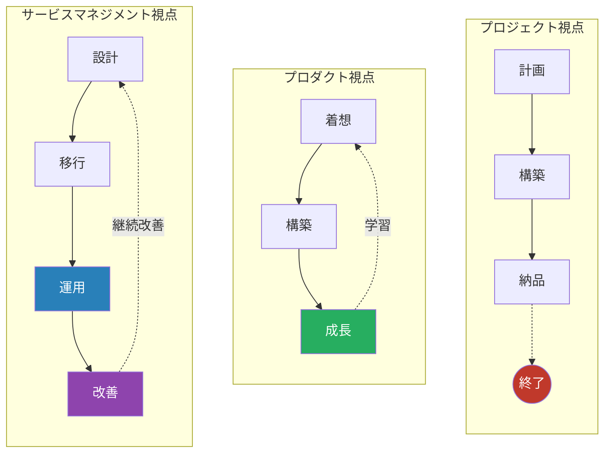
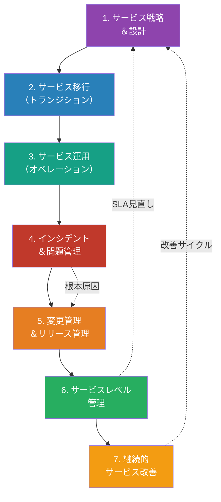
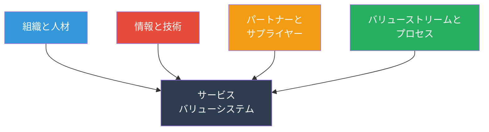
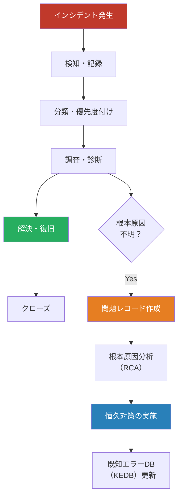
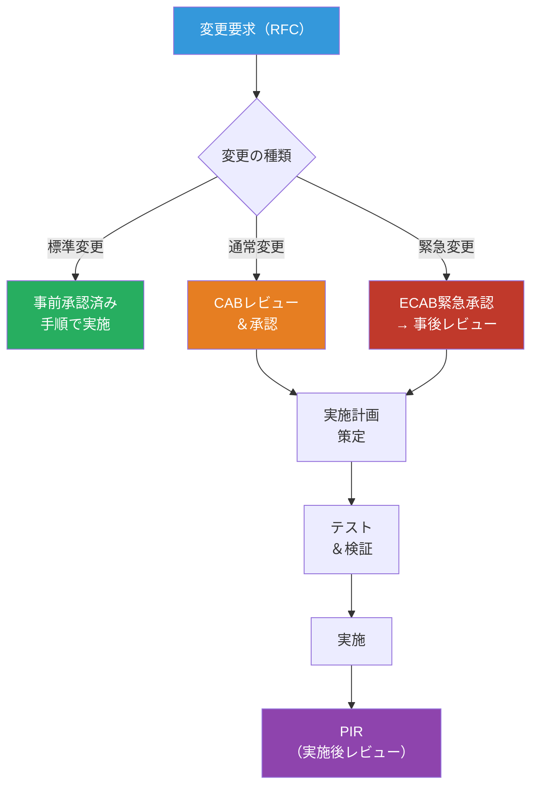
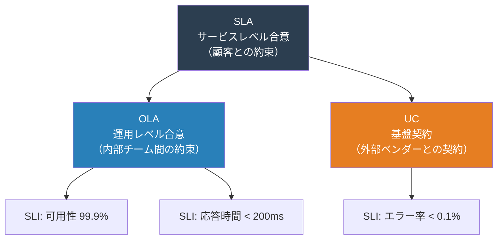
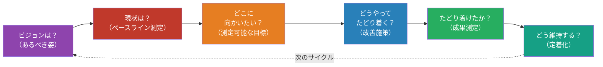
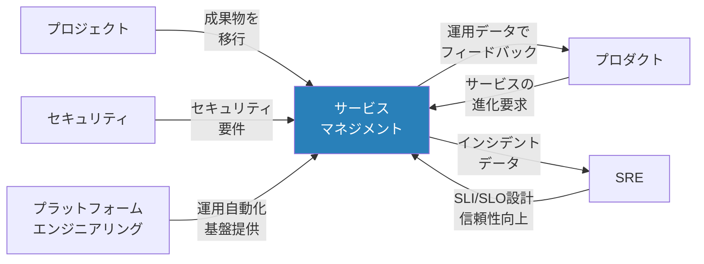

# サービスマネジメントマップ — 「どう安定的にサービスを届け続けるか」

> 開発が終わった後がスタート。**ユーザーにサービスを安定的・継続的に届け続ける**ための
> プロセス・体制・タスク・リソースを、ITIL 4 / ITSM の知見をベースに網羅的に整理したもの

本ドキュメントは、サービス運用に携わる全ステークホルダー（運用チーム、プロジェクトマネージャー、ビジネスリーダー）向けの、サービスマネジメント全体像を示す参考資料です。各セクションは ITIL 4 のサービスバリューチェーンに沿って体系化されており、「何をすべきか（プロセス）」「誰が必要か（リソース）」「何を成果物にするか（アウトプット）」の3点から各工程を解説しています。自組織の成熟度に応じて、すべてを実装するのではなく、優先順位をつけながら段階的に整備することを想定しています。

## プロジェクト/プロダクト視点との根本的な違い

サービスマネジメントを理解するうえで重要なのは、プロジェクト視点やプロダクト視点とは根本的に異なる考え方をしていることです。以下の図表は、それぞれの視点における時間軸・目標・成功指標の違いを示しています。プロジェクトは「期限内の納品」、プロダクトは「継続的な価値提供」を目指しますが、サービスマネジメントは「継続的かつ安定的なサービス提供」に責任を持ちます。

| 観点         | プロジェクト         | プロダクト                   | サービスマネジメント                     |
| ------------ | -------------------- | ---------------------------- | ---------------------------------------- |
| ゴール       | 成果物を期限内に納品 | 継続的にユーザー価値を届ける | サービスを合意品質で安定提供し続ける     |
| 時間軸       | 有期                 | 無期限（プロダクト寿命）     | 無期限（サービス存続中）                 |
| 成功指標     | QCD                  | アウトカム（KPI）            | SLA達成率・可用性・顧客満足度            |
| 中心人物     | PM                   | PdM                          | サービスマネージャー                     |
| 変更への態度 | 最小化               | 歓迎                         | リスクを評価し、制御された形で受け入れる |

上記の違いを踏まえたうえで、本ドキュメントではサービスマネジメント視点に焦点を当てます。プロジェクト完了後、サービスは設計・移行・運用・改善のサイクルを繰り返しながら、継続的にユーザー価値を届け続ける必要があるからです。

## ITIL 4 サービスバリューチェーン（SVS）全体像

ITIL 4 では、サービスマネジメント活動を 7 つの主要プロセス（サービスバリューチェーン）として整理しています。以下の図は、これらのプロセスが線形に進むだけでなく、運用中の課題（インシデント、問題、変更）が戦略に影響を与え、継続改善によって全体が進化することを示しています。

## ITIL 4 の4つの側面

サービスマネジメントは常に4つの側面から考える必要がある。

## 1. サービス戦略＆設計

### 目的

サービスの目的・対象顧客・提供価値を明確にし、安定的に提供できるサービスの仕組みを設計する。

このフェーズは全サービスマネジメント活動の基盤です。ここで「サービスは何か」「どのレベルで提供するか」「どう守るか」を決めることで、以降の移行・運用・改善がスムーズに進みます。不十分な設計は、運用フェーズで多くの混乱や追加対応を招くため、最初の工程を確実に実施することが重要です。

### タスク一覧

このフェーズのタスク群は、後続のすべての運用活動の基盤となるため、戦略策定・キャパシティ計画・リスク管理といった経営レベルの意思決定を含む点で、他フェーズとは一線を画しています。サービスマネージャーには、技術スキルに加えて、ビジネス理解と顧客交渉能力が求められます。

以下のタスクを通じて、サービス提供の基本的な約束事（SLA）、内部体制（OLA）、外部パートナー契約（UC）を整備します。

| #   | タスク                        | 説明                                                  |
| --- | ----------------------------- | ----------------------------------------------------- |
| 1   | サービスカタログ定義          | 提供するサービスの一覧・内容・対象者を明文化          |
| 2   | SLA（サービスレベル合意）設計 | 可用性・応答時間・復旧時間等の目標値を顧客と合意      |
| 3   | OLA / UC 設計                 | 内部チーム間合意（OLA）、外部ベンダー契約（UC）の定義 |
| 4   | キャパシティ計画              | 需要予測に基づくリソースキャパシティの計画            |
| 5   | 可用性設計                    | 冗長構成・フェイルオーバー・DR計画の設計              |
| 6   | サービス継続性計画            | 災害・大規模障害時のBCP/DRPの策定                     |
| 7   | 情報セキュリティ方針策定      | サービスに関わるセキュリティ要件の定義                |
| 8   | 財務管理                      | サービス運用コストの見積り・予算策定                  |

### リソース

設計フェーズではビジネス・顧客接点・技術の3つの視点が必要なため、人材構成が多職種になります。このフェーズへの投資が後続の運用効率を大きく左右するため、リソースの質が特に重要です。以降の運用フェーズとは異なり、運用チームの規模よりも、設計品質に関わる専門家の確保が優先されます。

| カテゴリ | リソース                               | 備考                                   |
| -------- | -------------------------------------- | -------------------------------------- |
| **人**   | サービスマネージャー                   | サービス全体の責任者                   |
| **人**   | サービスデザイナー                     | サービス設計の専門家                   |
| **人**   | ビジネスリレーションシップマネージャー | 顧客との関係構築                       |
| **人**   | キャパシティプランナー                 | リソース計画担当                       |
| **物**   | ITSMツール                             | ServiceNow, Jira Service Management 等 |
| **物**   | 監視ツール                             | Datadog, Grafana, Zabbix 等            |
| **物**   | ドキュメント管理                       | Confluence, SharePoint 等              |
| **金**   | インフラ費用                           | クラウド/オンプレミスの基盤費用        |
| **金**   | ツールライセンス費                     | ITSM・監視ツール等                     |

### 成果物

このフェーズの成果物は、移行・運用・改善の各段階のすべてのステークホルダー（プロジェクトチーム、運用チーム、経営層、顧客）の指針となり、次フェーズでの合意検証の基準文書として機能します。成果物の品質と完全性が、以降の問題多発や変更品質に直結するため、曖昧さを排除した明確な記載が求められます。

| 成果物             | 形式                  | 必須/任意 |
| ------------------ | --------------------- | --------- |
| サービスカタログ   | ドキュメント / Wiki   | 必須      |
| SLA文書            | 契約書 / ドキュメント | 必須      |
| OLA / UC文書       | ドキュメント          | 必須      |
| キャパシティ計画書 | スプレッドシート      | 必須      |
| 可用性設計書       | ドキュメント / 図表   | 必須      |
| BCP / DRP          | ドキュメント          | 必須      |
| セキュリティ方針書 | ドキュメント          | 必須      |

## 2. サービス移行（トランジション）

### 目的

新規サービスや変更を、本番環境へ安全・確実に移行する。開発から運用へのバトンタッチを確実にする。

設計フェーズで決めた約束（SLA）を本番環境で果たすために、プロジェクトチームから運用チームへの責任移譲が行われます。このフェーズでは、構成管理（CMDB）に基づくトレーサビリティの確保、十分なテスト、運用チームのトレーニングが重要です。不完全な移行は、運用開始直後の問題多発につながります。

### タスク一覧

移行フェーズは、開発（プロジェクト）と運用の境界線であり、トレーサビリティ確保・リスク最小化・知識移転が独特の要求です。他フェーズと異なり、「運用開始直後のトラブル防止」に特化した専門スキル（テスト、構成管理、トレーニング、リスク評価）が集中的に必要になります。

以下のタスクを実施して、運用チームが自信をもってサービスを引き継げる状態を作ります。

| #   | タスク                    | 説明                                           |
| --- | ------------------------- | ---------------------------------------------- |
| 1   | 移行計画策定              | スケジュール・手順・ロールバック計画の作成     |
| 2   | リリース管理              | リリースパッケージの構成管理とデプロイ手順整備 |
| 3   | 構成管理（CMDB）          | CI（構成アイテム）の登録・関連付け・維持       |
| 4   | サービス検証テスト        | 本番同等環境での受け入れテスト                 |
| 5   | ナレッジ移転              | 運用チームへの引き継ぎ、ランブック作成         |
| 6   | Go-Live判定               | 移行可否の最終判断（CAB承認含む）              |
| 7   | 早期ライフサポート（ELS） | リリース直後の集中監視・サポート体制           |

### リソース

移行フェーズは期間は短いが、人員密度が高い段階です。設計フェーズのビジネス主導から、このフェーズでは技術者主導に変わり、テスト・構成管理・自動化基盤（CI/CD）への投資が急増します。Go-Live 後は運用チーム中心に移行するため、リソースプロファイルが大きく変わります。

| カテゴリ | リソース              | 備考                                  |
| -------- | --------------------- | ------------------------------------- |
| **人**   | リリースマネージャー  | リリースプロセス全体の管理            |
| **人**   | 変更諮問委員会（CAB） | 変更リスク評価・承認                  |
| **人**   | 構成管理者            | CMDB管理担当                          |
| **人**   | テストエンジニア      | サービス検証テスト実施                |
| **物**   | CI/CDパイプライン     | Jenkins, GitHub Actions, GitLab CI 等 |
| **物**   | ステージング環境      | 本番同等のテスト環境                  |
| **物**   | CMDBツール            | ServiceNow CMDB, i-doit 等            |
| **金**   | 環境構築費            | ステージング環境の維持費用            |

### 成果物

このフェーズの成果物は、運用チームが本番環境でサービスを引き継ぐための具体的な手順書、構成データベース（CMDB）、ナレッジベースとして機能します。特にランブック（運用手順書）と CMDB は、その後の長期的な運用品質を左右する重要な資産になり、継続的にメンテナンスされます。

| 成果物                   | 形式                | 必須/任意 |
| ------------------------ | ------------------- | --------- |
| 移行計画書               | ドキュメント        | 必須      |
| リリースノート           | ドキュメント        | 必須      |
| CMDB（構成情報）         | データベース        | 必須      |
| ランブック（運用手順書） | Wiki / ドキュメント | 必須      |
| サービス検証テスト結果   | レポート            | 必須      |
| Go-Live判定書            | ドキュメント        | 必須      |
| ロールバック計画         | ドキュメント        | 必須      |

## 3. サービス運用（オペレーション）

### 目的

SLAに基づきサービスを安定的に提供し続ける。日常的な運用タスクを確実に遂行する。

このフェーズは最も長い期間続き、組織の運用スキル・プロセス成熟度がサービス品質に直結する部分です。監視・アラート管理、定期的なバックアップ、セキュリティパッチ適用などの地道な業務が、SLA達成の鍵となります。運用の質は顧客の信頼度に大きく影響するため、人材育成とプロセス整備が重要です。

### タスク一覧

運用フェーズのタスクの特徴は「予防的・継続的・定型的」であり、インシデント管理や変更管理といった「反応的・一時的」なタスクとは対比されます。24時間365日の監視、定期的なバックアップ、パッチ適用などの反復業務が、SLA 達成の地味ながら最も重要な土台となります。高い専門性よりも、規律性・プロセス遵守の徹底が求められます。

日常的な運用業務を以下のように体系化し、漏れなく実施します。

| #   | タスク             | 説明                                                         |
| --- | ------------------ | ------------------------------------------------------------ |
| 1   | 監視・アラート管理 | インフラ・アプリケーション・ネットワークの常時監視           |
| 2   | イベント管理       | 監視イベントの分類・フィルタリング・エスカレーション         |
| 3   | リクエスト管理     | ユーザーからのサービスリクエスト（パスワードリセット等）対応 |
| 4   | アクセス管理       | ユーザー権限の付与・変更・取消                               |
| 5   | バックアップ管理   | 定期的なバックアップとリストアテスト                         |
| 6   | パッチ管理         | OS・ミドルウェア・アプリのセキュリティパッチ適用             |
| 7   | ジョブ管理         | バッチ処理・定期タスクの実行管理                             |
| 8   | サービスデスク運営 | ユーザーからの問い合わせ窓口の運営                           |

### リソース

運用フェーズは最も長く続く段階であり、リソース配分が最も安定します。設計・移行フェーズの「イベント駆動」から、運用は「24/365定常体制」へシフトし、オンコール体制・ローテーション管理・継続的なスキル育成が必須になります。他フェーズと比べて、人員規模は大きくなりますが、単一専門職（エンジニア層）の比重が高まります。

| カテゴリ | リソース                   | 備考                            |
| -------- | -------------------------- | ------------------------------- |
| **人**   | オペレーションマネージャー | 運用チーム責任者                |
| **人**   | サービスデスクアナリスト   | 一次対応・トリアージ            |
| **人**   | インフラエンジニア         | サーバー・ネットワーク運用      |
| **人**   | アプリケーションサポート   | アプリ固有の問題対応            |
| **物**   | 監視ダッシュボード         | Grafana, Datadog, CloudWatch 等 |
| **物**   | チケットシステム           | Jira, ServiceNow, Zendesk 等    |
| **物**   | バックアップツール         | Veeam, AWS Backup 等            |
| **物**   | オンコールツール           | PagerDuty, OpsGenie 等          |
| **金**   | 運用チーム人件費           | 24/365体制の場合は大きくなる    |
| **金**   | ツールライセンス費         | 監視・チケット・オンコール等    |

### 成果物

運用フェーズの成果物は、①運用チーム自身の意思決定（ダッシュボード、SOP）、②経営層への報告（運用レポート）、③次フェーズ（インシデント管理、改善）への基礎データという3つの機能を果たします。これらは設計時点の SLA 達成状況を実測し、改善サイクルへのインプットになるため、正確性と継続性が極めて重要です。

| 成果物                     | 形式                  | 必須/任意 |
| -------------------------- | --------------------- | --------- |
| 運用ダッシュボード         | ダッシュボード        | 必須      |
| 運用手順書（SOP）          | Wiki / ドキュメント   | 必須      |
| 定期運用レポート           | レポート（週次/月次） | 必須      |
| オンコールローテーション表 | スケジュール          | 必須      |
| バックアップ計画書         | ドキュメント          | 必須      |

## 4. インシデント＆問題管理

### 目的

サービスの中断や品質低下を**迅速に復旧**し（インシデント管理）、**根本原因を排除**して再発を防ぐ（問題管理）。

インシデント管理は「今すぐ対応すべき問題」への素早い対応に注力し、問題管理は「構造的に解決すべき課題」の根本原因除去を目指します。この2つの活動のバランスが、サービスの継続性と品質向上を実現します。問題管理の成果は変更管理につながり、最終的に同じ障害の再発防止につながります。

### インシデント管理と問題管理の関係

上の図で示すように、インシデントが発生すると、まずは迅速な復旧を目指します。その際に根本原因が判明しなければ、問題レコードとして登録し、専門チームによる根本原因分析（RCA）へ引き渡します。RCA で判明した原因は、変更管理プロセスを通じて恒久対策として実装されます。

### タスク一覧

このフェーズの特徴は「インシデント管理」と「問題管理」という 2 つの異なる時間軸・思考様式を持つことです。インシデント管理は「今この瞬間に復旧する」という緊急性を、問題管理は「なぜそれが起きたのか根本原因を除去する」という構造的理解を求めます。この両面を運用体制に組み込むことで、短期的なサービス継続性と長期的な品質向上の両立が可能になります。

以下のタスクを通じて、インシデント（一時対応）と問題（根本対策）の両面から、サービスの安定性向上を図ります。

| #   | タスク                       | 区分         | 説明                                             |
| --- | ---------------------------- | ------------ | ------------------------------------------------ |
| 1   | インシデント検知             | インシデント | 監視アラート・ユーザー報告による発見             |
| 2   | インシデント記録             | インシデント | チケットシステムへの記録（5W1H）                 |
| 3   | インシデント分類・優先度付け | インシデント | 影響範囲・緊急度に基づくP1〜P4分類               |
| 4   | エスカレーション             | インシデント | L1→L2→L3の段階的エスカレーション                 |
| 5   | 暫定対応（ワークアラウンド） | インシデント | サービス復旧のための一時的対処                   |
| 6   | 復旧確認・クローズ           | インシデント | ユーザー確認後にインシデントをクローズ           |
| 7   | 問題の特定                   | 問題         | 繰り返しインシデントやトレンド分析から問題を特定 |
| 8   | 根本原因分析（RCA）          | 問題         | 5Why分析、フィッシュボーン図等による原因究明     |
| 9   | 恒久対策の策定・実施         | 問題         | 根本原因を除去する変更の実施                     |
| 10  | KEDB更新                     | 問題         | 既知エラーと回避策のナレッジベース化             |
| 11  | 重大インシデントレビュー     | 共通         | P1/P2インシデントのポストモーテム実施            |

### リソース

インシデント管理では「ホットライン的な即応体制」が、問題管理では「ゆっくり考える分析体制」が求められ、リソースの配置・スキル・ツールが大きく異なります。運用フェーズからは独立した問題マネージャーが必要になり、ログ分析・根本原因分析といった高度な技術スキルが新たに加わります。重大インシデント時には全社横断的なエスカレーション体制も不可欠です。

| カテゴリ | リソース                 | 備考                                   |
| -------- | ------------------------ | -------------------------------------- |
| **人**   | インシデントマネージャー | 重大インシデント時の指揮官             |
| **人**   | L1/L2/L3サポート         | 段階的対応体制                         |
| **人**   | 問題マネージャー         | 問題管理プロセスの責任者               |
| **物**   | インシデント管理ツール   | PagerDuty, ServiceNow, Jira 等         |
| **物**   | ログ分析ツール           | Splunk, ELK Stack, Datadog Logs 等     |
| **物**   | コミュニケーションツール | Slack / Teams のインシデントチャンネル |
| **金**   | オンコール手当           | 夜間・休日対応の人件費                 |

### 成果物

インシデント管理の成果物（チケット・レポート）は、その場かぎりのレスポンス記録ですが、問題管理の成果物（RCA 報告書・既知エラーDB）は組織の資産になり、次フェーズ（変更管理）でのアクションや、将来の同種インシデント検知時のリファレンスになります。ポストモーテムは単なる「何が起きたか」の記録ではなく、「どう予防するか」への改善文化を醸成するために活用されます。

| 成果物                 | 形式                  | 必須/任意                |
| ---------------------- | --------------------- | ------------------------ |
| インシデントチケット   | チケットシステム      | 必須                     |
| インシデントレポート   | ドキュメント          | 必須（P1/P2）            |
| ポストモーテムレポート | ドキュメント          | 必須（重大インシデント） |
| 問題レコード           | チケットシステム      | 必須                     |
| 既知エラーDB（KEDB）   | Wiki / ナレッジベース | 必須                     |
| RCA報告書              | ドキュメント          | 必須（重大問題）         |

## 5. 変更管理＆リリース管理

### 目的

サービスへの変更を**リスクを最小化**しながら確実に実施する。変更が原因の障害を防ぐ。

サービスが「完成品」ではなく「生きたシステム」である以上、セキュリティパッチ、新機能追加、性能改善などの変更が避けられません。このフェーズは、それらの変更を組織立てて管理し、予期しない障害を防ぐための仕組みです。変更によるリスクを評価し、段階的に展開することで、問題が生じた際の影響最小化を実現します。

### 変更の分類と承認フロー

上の図に示すように、変更は「標準変更」「通常変更」「緊急変更」の 3 つに分類され、それぞれ異なる承認ルートをたどります。標準変更は事前に承認された手順で即座に実施でき、通常変更は CAB（変更諮問委員会）でリスク評価を行い、緊急変更は事後レビューを前提に速やかに実施します。

### タスク一覧

変更管理は、インシデント管理や問題管理からのインプット（「何を直すか」）を、制御された形で本番環境に反映させるゲートキーパーの役割を果たします。セキュリティパッチ、新機能、性能改善といった多様な変更タイプを、標準変更・通常変更・緊急変更に分類して異なるフロー（事前承認・CAB 審議・事後レビュー）を適用することで、リスクと効率のバランスを取ります。

以下のタスクを実施して、変更を体系的に管理し、トレーサビリティを確保します。

| #   | タスク                | 説明                                                     |
| --- | --------------------- | -------------------------------------------------------- |
| 1   | 変更要求（RFC）作成   | 変更内容・理由・影響範囲・リスク・ロールバック計画を記述 |
| 2   | 変更分類              | 標準/通常/緊急の分類                                     |
| 3   | 影響評価              | CI間の依存関係に基づく影響分析                           |
| 4   | CAB/ECABレビュー      | 変更諮問委員会での審議・承認                             |
| 5   | 実施計画策定          | 手順書・タイムライン・チェックリスト作成                 |
| 6   | 変更実施              | 承認済み計画に基づく変更の実行                           |
| 7   | 変更検証              | 変更後の動作確認・影響確認                               |
| 8   | PIR（実施後レビュー） | 変更が期待通りの結果を得たか評価                         |
| 9   | 変更スケジュール管理  | 変更カレンダーの維持・凍結期間の管理                     |

### リソース

変更管理は、運用フェーズの「安定性重視」と改善フェーズの「進化要求」の緊張関係を調整する機能です。CAB メンバー（技術リーダー、ビジネスリーダー）による横断的な審議体制、CI/CD 自動化基盤、变更カレンダーなど、他フェーズとは異なるガバナンス機構を要求します。DevOps 推進に伴い、標準変更の自動デプロイ比率が高まる傾向にありますが、リスク評価と承認権限の分散は継続的に必要です。

| カテゴリ | リソース              | 備考                         |
| -------- | --------------------- | ---------------------------- |
| **人**   | 変更マネージャー      | 変更管理プロセスの責任者     |
| **人**   | CAB（変更諮問委員会） | 技術・ビジネス代表による審議 |
| **人**   | リリースマネージャー  | リリースパッケージの管理     |
| **物**   | 変更管理ツール        | ServiceNow, Jira 等          |
| **物**   | CI/CDパイプライン     | 自動デプロイ基盤             |
| **物**   | 変更カレンダー        | 全変更のスケジュール可視化   |
| **金**   | 検証環境維持費        | テスト環境のインフラ費用     |

### 成果物

変更管理の成果物（RFC、変更実施計画、PIR）は、本番環境での変更履歴を構成管理（CMDB）と連動させ、トレーサビリティを確保します。特に PIR（実施後レビュー）は単なる「成功/失敗」の記録ではなく、予想した効果が得られたか、予期しない影響が生じなかったかを継続的に検証し、次の類似変更の成功確度を高めるための学習資産になります。

| 成果物                | 形式             | 必須/任意             |
| --------------------- | ---------------- | --------------------- |
| RFC（変更要求記録）   | チケット         | 必須                  |
| 変更実施計画書        | ドキュメント     | 必須                  |
| ロールバック計画      | ドキュメント     | 必須                  |
| 変更スケジュール      | カレンダー       | 必須                  |
| PIR（実施後レビュー） | レポート         | 必須（通常/緊急変更） |
| リリースパッケージ    | アーティファクト | 必須                  |

## 6. サービスレベル管理

### 目的

合意されたサービスレベル（SLA）を**測定・監視・報告**し、目標を達成し続ける。

サービス戦略フェーズで設計した SLA（顧客との約束）は、運用中も継続的に測定・報告される必要があります。単に「月 99.9% の可用性」と謳うだけでなく、実際にそのレベルが達成されているか、それとも改善の余地があるかを定量的に把握することが、ビジネス信頼度を保つ上で不可欠です。

### サービスレベルの階層構造

上の図が示すように、SLA（顧客との合意）は背後に OLA（内部チーム間の合意）と UC（外部ベンダーとの契約）を持ちます。SLA を達成するには、内部チームが OLA を達成し、さらに外部ベンダーが UC を達成する必要があります。これら 3 つのレベルの指標（SLI）を適切に定義し、計測・報告することが重要です。

### タスク一覧

サービスレベル管理は、設計時に決めた SLA（顧客との約束）が実際に達成されているかを定量的に検証し、未達の場合は改善計画へ連携するプロセスです。他フェーズと異なり「測定・報告・改善」の 3 つが強く連動し、単なる事後報告ではなく、経営判断（リソース投資）に直結するビジネス指向のマネジメント活動です。SLI（指標）の正確性は、経営信頼度に影響するため、測定ロジックの透明性が求められます。

以下のタスクを通じて、SLA 達成状況を継続的に監視し、未達時には改善計画を策定します。

| #   | タスク                  | 説明                                           |
| --- | ----------------------- | ---------------------------------------------- |
| 1   | SLA定義・合意           | 顧客と測定指標・目標値・ペナルティを合意       |
| 2   | SLI（指標）の選定       | 可用性・レイテンシ・エラー率等の計測指標を定義 |
| 3   | 監視・計測基盤構築      | SLI計測のためのモニタリング環境整備            |
| 4   | 定期レポーティング      | SLA達成状況の定期報告（月次/四半期）           |
| 5   | SLAレビュー             | 目標値の妥当性を定期的に見直し                 |
| 6   | サービス改善計画（SIP） | SLA未達時の改善アクション策定                  |
| 7   | 顧客満足度調査          | 定量的指標と合わせた定性的評価                 |

### リソース

サービスレベル管理は、運用チームからのデータ（パフォーマンス、インシデント件数）と経営層のビジネス目標を橋渡しする機能です。技術的な測定能力（SLI 計測）に加えて、ビジネス交渉力（顧客との合意）と分析力（ギャップ原因の特定）が必要です。他フェーズと比べて、人員規模は小さいですが、組織内での影響力が大きく、ステークホルダー管理（顧客、運用チーム、経営層）の複雑さが特徴です。

| カテゴリ | リソース                               | 備考                                     |
| -------- | -------------------------------------- | ---------------------------------------- |
| **人**   | サービスレベルマネージャー             | SLA管理の責任者                          |
| **人**   | ビジネスリレーションシップマネージャー | 顧客との折衝                             |
| **物**   | SLAダッシュボード                      | Grafana, Datadog, カスタムダッシュボード |
| **物**   | レポーティングツール                   | スプレッドシート、BI ツール              |
| **金**   | 監視基盤費用                           | メトリクス収集・保存・可視化             |

### 成果物

サービスレベル管理の成果物は、①顧客向け報告（SLA レポート、顧客満足度レポート）、②内部向け意思決定（SLI ダッシュボード、改善計画）という 2 つの異なるオーディエンスに分かれます。これらは SLA 達成の「見える化」を通じて、顧客信頼を醸成し、一方で運用チームや経営層に改善の優先順位付けを提供します。SLA 未達は改善フェーズへのインプットとして活用され、継続改善サイクルを駆動します。

| 成果物                     | 形式                  | 必須/任意         |
| -------------------------- | --------------------- | ----------------- |
| SLA合意書                  | 契約書 / ドキュメント | 必須              |
| SLIダッシュボード          | ダッシュボード        | 必須              |
| SLAレポート（月次/四半期） | レポート              | 必須              |
| サービス改善計画（SIP）    | ドキュメント          | 必須（SLA未達時） |
| 顧客満足度レポート         | レポート              | 任意              |

## 7. 継続的サービス改善（CSI）

### 目的

サービスの品質・効率・顧客満足度を**継続的に改善**する。「良い」を「より良い」にし続ける。

これまでの 6 つのフェーズは、サービス提供の「基本」を実現するものですが、CSI フェーズは、その基本を土台にして組織を「進化」させるものです。インシデント分析、顧客フィードバック、業界のベストプラクティスなどのデータを活用し、段階的に改善施策を実行していきます。ITIL 4 では「継続改善」が全活動の中心に位置づけられており、これを習慣化できるかどうかが組織の競争力につながります。

### CSI（継続的サービス改善）サイクル

上の図に示す CSI サイクルは、PDCA（Plan-Do-Check-Act）に基づいています。「あるべき姿」を定義し（ビジョン）、現状を計測し（ベースライン）、改善目標を設定し（目標設定）、具体的な施策を実行し（改善実施）、成果を測定し（成果測定）、組織に定着させ（定着化）、次のサイクルへ進みます。

### タスク一覧

継続改善（CSI）は ITIL 4 の「心臓」であり、他の全フェーズの基礎となります。インシデント分析、顧客フィードバック、SLA ギャップ、パフォーマンスデータなど、あらゆるプロセスから改善機会を抽出し、優先順位をつけ、段階的に実装していく活動です。他フェーズとは異なり「戦略と実行の両輪」が必要であり、組織文化（改善意識）の醸成が最終目標になります。

以下のタスクを通じて、改善活動を体系的に推進し、改善の成果を可視化します。

| #   | タスク                 | 説明                                           |
| --- | ---------------------- | ---------------------------------------------- |
| 1   | サービスレビュー       | 現状のサービス品質・パフォーマンスの評価       |
| 2   | ギャップ分析           | 現状と目標の差異を特定                         |
| 3   | 改善機会の特定         | データ分析・トレンド分析による改善ポイント抽出 |
| 4   | 改善施策の優先順位付け | コスト対効果・緊急度に基づく優先度決定         |
| 5   | 改善施策の実施         | 承認された改善施策の実行                       |
| 6   | 成果測定               | 改善前後の比較、KPI達成確認                    |
| 7   | CSIレジスター管理      | 全改善活動の記録・追跡                         |
| 8   | 改善文化の醸成         | チーム全体での改善意識の定着                   |

### リソース

CSI フェーズは、すべてのフェーズから改善要件を吸い上げる「ハブ」であり、実行リソースは限定的ですが、組織全体への影響力が大きいのが特徴です。運用データの分析（データアナリスト）と改善施策の実装（プロセスオーナー）が緊密に連携し、「言われたから改善する」ではなく「自分たちで改善を発案する」という主体的な改善文化を育てることが求められます。

| カテゴリ | リソース         | 備考                         |
| -------- | ---------------- | ---------------------------- |
| **人**   | CSIマネージャー  | 継続改善プロセスの推進者     |
| **人**   | プロセスオーナー | 各プロセスの改善責任者       |
| **人**   | データアナリスト | メトリクス分析・レポート作成 |
| **物**   | CSIレジスター    | 改善施策の管理台帳           |
| **物**   | 分析ツール       | BI ツール、スプレッドシート  |
| **金**   | 改善施策実施費   | 必要に応じた予算             |

### 成果物

CSI の成果物は、①改善活動の推進記録（CSI レジスター、改善提案書）、②改善の実績（改善成果レポート）、③組織の成熟度の進展（プロセス成熟度評価）の 3 つの層に分かれます。これらは単なる事後的な「何をやったか」の報告ではなく、「次のサイクルで何をやるべきか」への継続的フィードバックとなり、サービスマネジメント全体のスパイラルアップを駆動する触媒になります。

| 成果物               | 形式                                | 必須/任意 |
| -------------------- | ----------------------------------- | --------- |
| CSIレジスター        | スプレッドシート / チケットシステム | 必須      |
| 改善提案書           | ドキュメント                        | 必須      |
| 改善成果レポート     | レポート                            | 必須      |
| プロセス成熟度評価   | レポート                            | 任意      |
| ベンチマークレポート | レポート                            | 任意      |

## 横断的な視点 — 他視点との関係

サービスマネジメントは単独で存在するのではなく、プロジェクト、プロダクト、SRE、セキュリティ、プラットフォームエンジニアリングなど、他の重要な機能との協働により成立ちます。以下の図は、サービスマネジメント（中央）が他の機能とどのように連携し、相互にデータ・成果物・要件を受け渡すかを示しています。

### 重要な連携ポイント

| 連携先             | サービスマネジメントとの関係                                    |
| ------------------ | --------------------------------------------------------------- |
| プロジェクト       | プロジェクト完了→サービス移行。移行計画はプロジェクト計画と連動 |
| プロダクト         | プロダクトの進化に伴う変更管理。運用データによるプロダクト改善  |
| SRE                | SLI/SLO/SLAの設計・運用で密接に連携。インシデント対応の協働     |
| セキュリティ       | セキュリティインシデント対応。パッチ管理。アクセス管理          |
| データマネジメント | データのバックアップ・復旧。データ品質の運用面での担保          |
| プラットフォーム   | 運用の自動化基盤提供。セルフサービス化の推進                    |
| EA                 | サービスがEAの標準・方針に準拠しているかの確認                  |

**重要な補足：** これら各セクションの連携を円滑にするには、以下の原則が有効です。
- **透明性：** 運用データ（インシデント、パフォーマンス指標）を関係者に積極的に共有する
- **フィードバックループ：** 運用で判明した課題を、プロダクト開発やプロジェクト計画へ速やかに反映する
- **定期レビュー：** 四半期ごと（または半年ごと）に各機能のリーダーが集まり、全体最適化の観点から改善を議論する
- **責任明確化：** 各プロセスのオーナーを明確にし、単なる情報共有ではなく、実装責任を伴う連携を実現する
