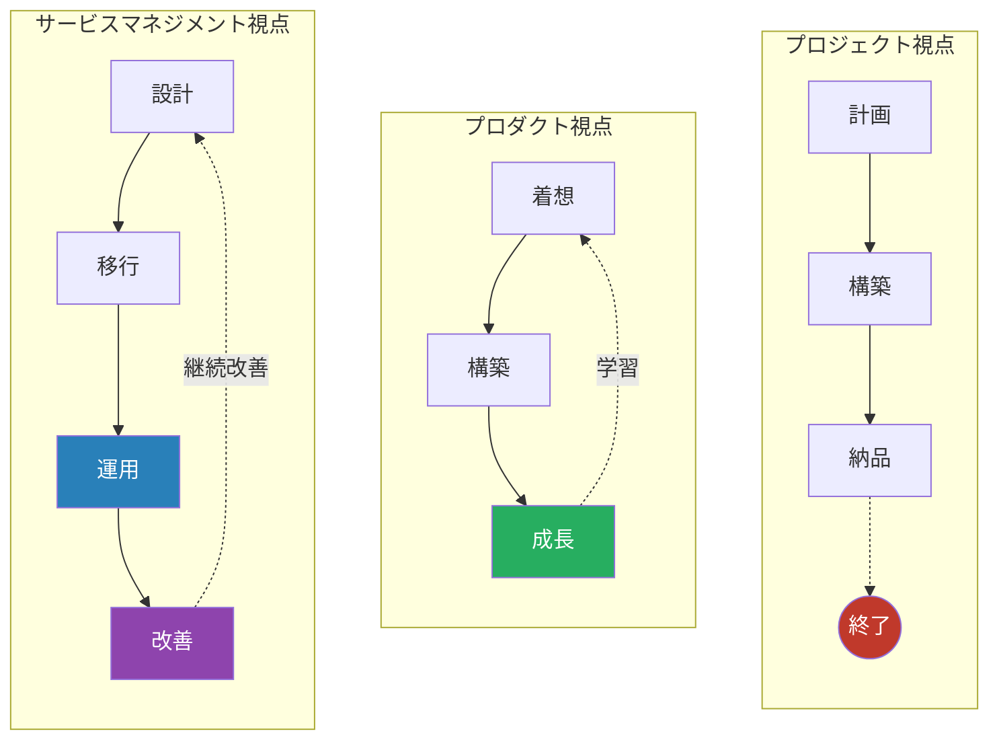
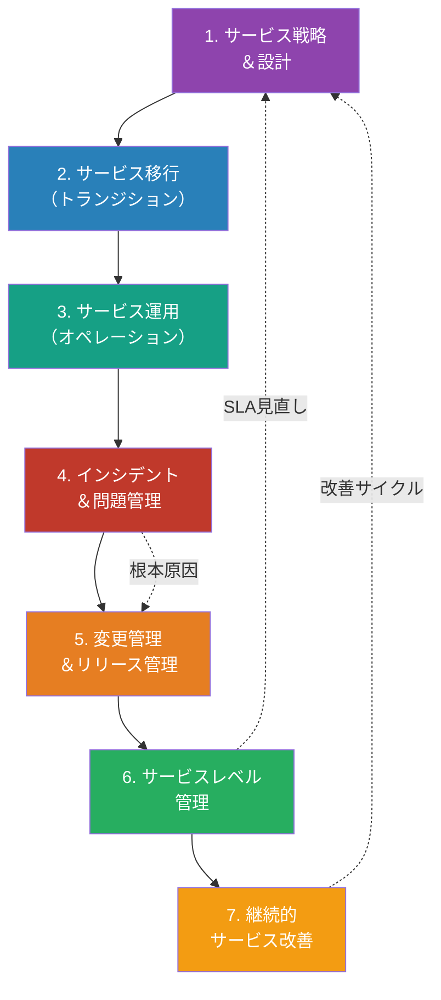
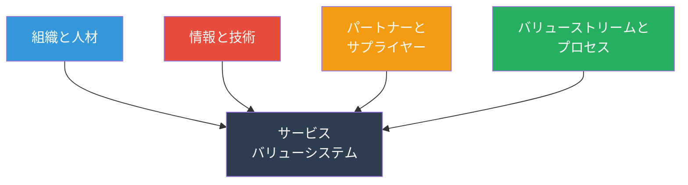
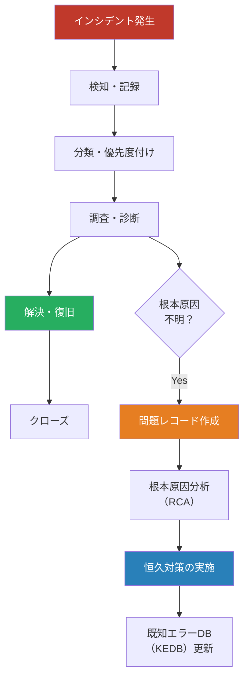
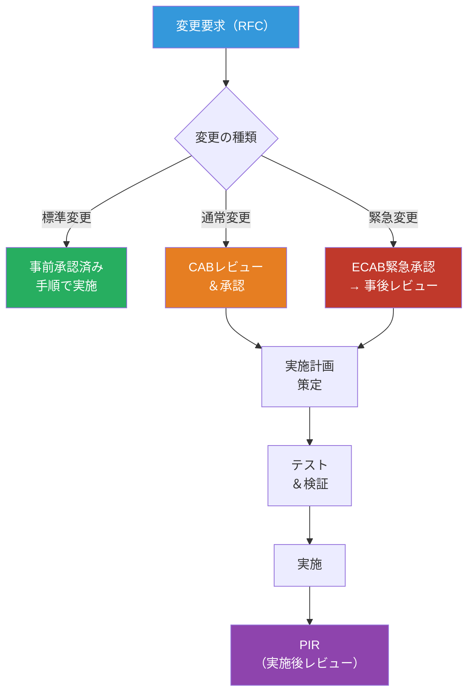
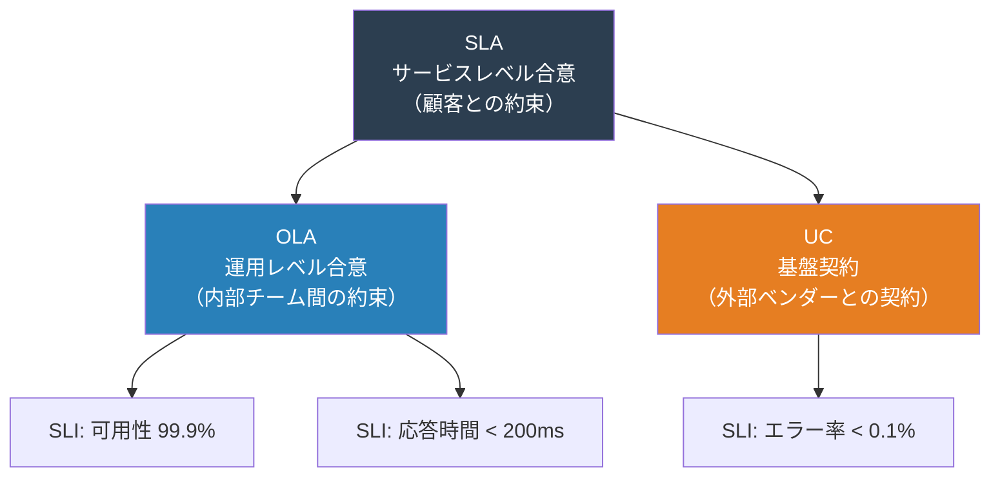
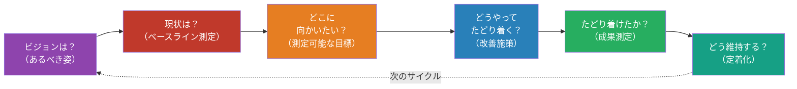
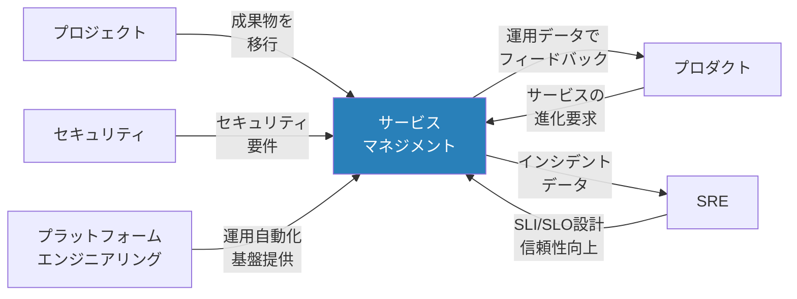

# サービスマネジメントマップ — 「どう安定的にサービスを届け続けるか」

> 開発が終わった後がスタート。**ユーザーにサービスを安定的・継続的に届け続ける**ための
> プロセス・体制・タスク・リソースを、ITIL 4 / ITSM の知見をベースに網羅的に整理したもの

## プロジェクト/プロダクト視点との根本的な違い

| 観点         | プロジェクト         | プロダクト                   | サービスマネジメント                     |
| ------------ | -------------------- | ---------------------------- | ---------------------------------------- |
| ゴール       | 成果物を期限内に納品 | 継続的にユーザー価値を届ける | サービスを合意品質で安定提供し続ける     |
| 時間軸       | 有期                 | 無期限（プロダクト寿命）     | 無期限（サービス存続中）                 |
| 成功指標     | QCD                  | アウトカム（KPI）            | SLA達成率・可用性・顧客満足度            |
| 中心人物     | PM                   | PdM                          | サービスマネージャー                     |
| 変更への態度 | 最小化               | 歓迎                         | リスクを評価し、制御された形で受け入れる |

## ITIL 4 サービスバリューチェーン（SVS）全体像

## ITIL 4 の4つの側面

サービスマネジメントは常に4つの側面から考える必要がある。

## 1. サービス戦略＆設計

### 目的

サービスの目的・対象顧客・提供価値を明確にし、安定的に提供できるサービスの仕組みを設計する。

### タスク一覧

| #   | タスク                        | 説明                                                  |
| --- | ----------------------------- | ----------------------------------------------------- |
| 1   | サービスカタログ定義          | 提供するサービスの一覧・内容・対象者を明文化          |
| 2   | SLA（サービスレベル合意）設計 | 可用性・応答時間・復旧時間等の目標値を顧客と合意      |
| 3   | OLA / UC 設計                 | 内部チーム間合意（OLA）、外部ベンダー契約（UC）の定義 |
| 4   | キャパシティ計画              | 需要予測に基づくリソースキャパシティの計画            |
| 5   | 可用性設計                    | 冗長構成・フェイルオーバー・DR計画の設計              |
| 6   | サービス継続性計画            | 災害・大規模障害時のBCP/DRPの策定                     |
| 7   | 情報セキュリティ方針策定      | サービスに関わるセキュリティ要件の定義                |
| 8   | 財務管理                      | サービス運用コストの見積り・予算策定                  |

### リソース

| カテゴリ | リソース                               | 備考                                   |
| -------- | -------------------------------------- | -------------------------------------- |
| **人**   | サービスマネージャー                   | サービス全体の責任者                   |
| **人**   | サービスデザイナー                     | サービス設計の専門家                   |
| **人**   | ビジネスリレーションシップマネージャー | 顧客との関係構築                       |
| **人**   | キャパシティプランナー                 | リソース計画担当                       |
| **物**   | ITSMツール                             | ServiceNow, Jira Service Management 等 |
| **物**   | 監視ツール                             | Datadog, Grafana, Zabbix 等            |
| **物**   | ドキュメント管理                       | Confluence, SharePoint 等              |
| **金**   | インフラ費用                           | クラウド/オンプレミスの基盤費用        |
| **金**   | ツールライセンス費                     | ITSM・監視ツール等                     |

### 成果物

| 成果物             | 形式                  | 必須/任意 |
| ------------------ | --------------------- | --------- |
| サービスカタログ   | ドキュメント / Wiki   | 必須      |
| SLA文書            | 契約書 / ドキュメント | 必須      |
| OLA / UC文書       | ドキュメント          | 必須      |
| キャパシティ計画書 | スプレッドシート      | 必須      |
| 可用性設計書       | ドキュメント / 図表   | 必須      |
| BCP / DRP          | ドキュメント          | 必須      |
| セキュリティ方針書 | ドキュメント          | 必須      |

## 2. サービス移行（トランジション）

### 目的

新規サービスや変更を、本番環境へ安全・確実に移行する。開発から運用へのバトンタッチを確実にする。

### タスク一覧

| #   | タスク                    | 説明                                           |
| --- | ------------------------- | ---------------------------------------------- |
| 1   | 移行計画策定              | スケジュール・手順・ロールバック計画の作成     |
| 2   | リリース管理              | リリースパッケージの構成管理とデプロイ手順整備 |
| 3   | 構成管理（CMDB）          | CI（構成アイテム）の登録・関連付け・維持       |
| 4   | サービス検証テスト        | 本番同等環境での受け入れテスト                 |
| 5   | ナレッジ移転              | 運用チームへの引き継ぎ、ランブック作成         |
| 6   | Go-Live判定               | 移行可否の最終判断（CAB承認含む）              |
| 7   | 早期ライフサポート（ELS） | リリース直後の集中監視・サポート体制           |

### リソース

| カテゴリ | リソース              | 備考                                  |
| -------- | --------------------- | ------------------------------------- |
| **人**   | リリースマネージャー  | リリースプロセス全体の管理            |
| **人**   | 変更諮問委員会（CAB） | 変更リスク評価・承認                  |
| **人**   | 構成管理者            | CMDB管理担当                          |
| **人**   | テストエンジニア      | サービス検証テスト実施                |
| **物**   | CI/CDパイプライン     | Jenkins, GitHub Actions, GitLab CI 等 |
| **物**   | ステージング環境      | 本番同等のテスト環境                  |
| **物**   | CMDBツール            | ServiceNow CMDB, i-doit 等            |
| **金**   | 環境構築費            | ステージング環境の維持費用            |

### 成果物

| 成果物                   | 形式                | 必須/任意 |
| ------------------------ | ------------------- | --------- |
| 移行計画書               | ドキュメント        | 必須      |
| リリースノート           | ドキュメント        | 必須      |
| CMDB（構成情報）         | データベース        | 必須      |
| ランブック（運用手順書） | Wiki / ドキュメント | 必須      |
| サービス検証テスト結果   | レポート            | 必須      |
| Go-Live判定書            | ドキュメント        | 必須      |
| ロールバック計画         | ドキュメント        | 必須      |

## 3. サービス運用（オペレーション）

### 目的

SLAに基づきサービスを安定的に提供し続ける。日常的な運用タスクを確実に遂行する。

### タスク一覧

| #   | タスク             | 説明                                                         |
| --- | ------------------ | ------------------------------------------------------------ |
| 1   | 監視・アラート管理 | インフラ・アプリケーション・ネットワークの常時監視           |
| 2   | イベント管理       | 監視イベントの分類・フィルタリング・エスカレーション         |
| 3   | リクエスト管理     | ユーザーからのサービスリクエスト（パスワードリセット等）対応 |
| 4   | アクセス管理       | ユーザー権限の付与・変更・取消                               |
| 5   | バックアップ管理   | 定期的なバックアップとリストアテスト                         |
| 6   | パッチ管理         | OS・ミドルウェア・アプリのセキュリティパッチ適用             |
| 7   | ジョブ管理         | バッチ処理・定期タスクの実行管理                             |
| 8   | サービスデスク運営 | ユーザーからの問い合わせ窓口の運営                           |

### リソース

| カテゴリ | リソース                   | 備考                            |
| -------- | -------------------------- | ------------------------------- |
| **人**   | オペレーションマネージャー | 運用チーム責任者                |
| **人**   | サービスデスクアナリスト   | 一次対応・トリアージ            |
| **人**   | インフラエンジニア         | サーバー・ネットワーク運用      |
| **人**   | アプリケーションサポート   | アプリ固有の問題対応            |
| **物**   | 監視ダッシュボード         | Grafana, Datadog, CloudWatch 等 |
| **物**   | チケットシステム           | Jira, ServiceNow, Zendesk 等    |
| **物**   | バックアップツール         | Veeam, AWS Backup 等            |
| **物**   | オンコールツール           | PagerDuty, OpsGenie 等          |
| **金**   | 運用チーム人件費           | 24/365体制の場合は大きくなる    |
| **金**   | ツールライセンス費         | 監視・チケット・オンコール等    |

### 成果物

| 成果物                     | 形式                  | 必須/任意 |
| -------------------------- | --------------------- | --------- |
| 運用ダッシュボード         | ダッシュボード        | 必須      |
| 運用手順書（SOP）          | Wiki / ドキュメント   | 必須      |
| 定期運用レポート           | レポート（週次/月次） | 必須      |
| オンコールローテーション表 | スケジュール          | 必須      |
| バックアップ計画書         | ドキュメント          | 必須      |

## 4. インシデント＆問題管理

### 目的

サービスの中断や品質低下を**迅速に復旧**し（インシデント管理）、**根本原因を排除**して再発を防ぐ（問題管理）。

### インシデント管理と問題管理の関係

### タスク一覧

| #   | タスク                       | 区分         | 説明                                             |
| --- | ---------------------------- | ------------ | ------------------------------------------------ |
| 1   | インシデント検知             | インシデント | 監視アラート・ユーザー報告による発見             |
| 2   | インシデント記録             | インシデント | チケットシステムへの記録（5W1H）                 |
| 3   | インシデント分類・優先度付け | インシデント | 影響範囲・緊急度に基づくP1〜P4分類               |
| 4   | エスカレーション             | インシデント | L1→L2→L3の段階的エスカレーション                 |
| 5   | 暫定対応（ワークアラウンド） | インシデント | サービス復旧のための一時的対処                   |
| 6   | 復旧確認・クローズ           | インシデント | ユーザー確認後にインシデントをクローズ           |
| 7   | 問題の特定                   | 問題         | 繰り返しインシデントやトレンド分析から問題を特定 |
| 8   | 根本原因分析（RCA）          | 問題         | 5Why分析、フィッシュボーン図等による原因究明     |
| 9   | 恒久対策の策定・実施         | 問題         | 根本原因を除去する変更の実施                     |
| 10  | KEDB更新                     | 問題         | 既知エラーと回避策のナレッジベース化             |
| 11  | 重大インシデントレビュー     | 共通         | P1/P2インシデントのポストモーテム実施            |

### リソース

| カテゴリ | リソース                 | 備考                                   |
| -------- | ------------------------ | -------------------------------------- |
| **人**   | インシデントマネージャー | 重大インシデント時の指揮官             |
| **人**   | L1/L2/L3サポート         | 段階的対応体制                         |
| **人**   | 問題マネージャー         | 問題管理プロセスの責任者               |
| **物**   | インシデント管理ツール   | PagerDuty, ServiceNow, Jira 等         |
| **物**   | ログ分析ツール           | Splunk, ELK Stack, Datadog Logs 等     |
| **物**   | コミュニケーションツール | Slack / Teams のインシデントチャンネル |
| **金**   | オンコール手当           | 夜間・休日対応の人件費                 |

### 成果物

| 成果物                 | 形式                  | 必須/任意                |
| ---------------------- | --------------------- | ------------------------ |
| インシデントチケット   | チケットシステム      | 必須                     |
| インシデントレポート   | ドキュメント          | 必須（P1/P2）            |
| ポストモーテムレポート | ドキュメント          | 必須（重大インシデント） |
| 問題レコード           | チケットシステム      | 必須                     |
| 既知エラーDB（KEDB）   | Wiki / ナレッジベース | 必須                     |
| RCA報告書              | ドキュメント          | 必須（重大問題）         |

## 5. 変更管理＆リリース管理

### 目的

サービスへの変更を**リスクを最小化**しながら確実に実施する。変更が原因の障害を防ぐ。

### 変更の分類と承認フロー

### タスク一覧

| #   | タスク                | 説明                                                     |
| --- | --------------------- | -------------------------------------------------------- |
| 1   | 変更要求（RFC）作成   | 変更内容・理由・影響範囲・リスク・ロールバック計画を記述 |
| 2   | 変更分類              | 標準/通常/緊急の分類                                     |
| 3   | 影響評価              | CI間の依存関係に基づく影響分析                           |
| 4   | CAB/ECABレビュー      | 変更諮問委員会での審議・承認                             |
| 5   | 実施計画策定          | 手順書・タイムライン・チェックリスト作成                 |
| 6   | 変更実施              | 承認済み計画に基づく変更の実行                           |
| 7   | 変更検証              | 変更後の動作確認・影響確認                               |
| 8   | PIR（実施後レビュー） | 変更が期待通りの結果を得たか評価                         |
| 9   | 変更スケジュール管理  | 変更カレンダーの維持・凍結期間の管理                     |

### リソース

| カテゴリ | リソース              | 備考                         |
| -------- | --------------------- | ---------------------------- |
| **人**   | 変更マネージャー      | 変更管理プロセスの責任者     |
| **人**   | CAB（変更諮問委員会） | 技術・ビジネス代表による審議 |
| **人**   | リリースマネージャー  | リリースパッケージの管理     |
| **物**   | 変更管理ツール        | ServiceNow, Jira 等          |
| **物**   | CI/CDパイプライン     | 自動デプロイ基盤             |
| **物**   | 変更カレンダー        | 全変更のスケジュール可視化   |
| **金**   | 検証環境維持費        | テスト環境のインフラ費用     |

### 成果物

| 成果物                | 形式             | 必須/任意             |
| --------------------- | ---------------- | --------------------- |
| RFC（変更要求記録）   | チケット         | 必須                  |
| 変更実施計画書        | ドキュメント     | 必須                  |
| ロールバック計画      | ドキュメント     | 必須                  |
| 変更スケジュール      | カレンダー       | 必須                  |
| PIR（実施後レビュー） | レポート         | 必須（通常/緊急変更） |
| リリースパッケージ    | アーティファクト | 必須                  |

## 6. サービスレベル管理

### 目的

合意されたサービスレベル（SLA）を**測定・監視・報告**し、目標を達成し続ける。

### サービスレベルの階層構造

### タスク一覧

| #   | タスク                  | 説明                                           |
| --- | ----------------------- | ---------------------------------------------- |
| 1   | SLA定義・合意           | 顧客と測定指標・目標値・ペナルティを合意       |
| 2   | SLI（指標）の選定       | 可用性・レイテンシ・エラー率等の計測指標を定義 |
| 3   | 監視・計測基盤構築      | SLI計測のためのモニタリング環境整備            |
| 4   | 定期レポーティング      | SLA達成状況の定期報告（月次/四半期）           |
| 5   | SLAレビュー             | 目標値の妥当性を定期的に見直し                 |
| 6   | サービス改善計画（SIP） | SLA未達時の改善アクション策定                  |
| 7   | 顧客満足度調査          | 定量的指標と合わせた定性的評価                 |

### リソース

| カテゴリ | リソース                               | 備考                                     |
| -------- | -------------------------------------- | ---------------------------------------- |
| **人**   | サービスレベルマネージャー             | SLA管理の責任者                          |
| **人**   | ビジネスリレーションシップマネージャー | 顧客との折衝                             |
| **物**   | SLAダッシュボード                      | Grafana, Datadog, カスタムダッシュボード |
| **物**   | レポーティングツール                   | スプレッドシート、BI ツール              |
| **金**   | 監視基盤費用                           | メトリクス収集・保存・可視化             |

### 成果物

| 成果物                     | 形式                  | 必須/任意         |
| -------------------------- | --------------------- | ----------------- |
| SLA合意書                  | 契約書 / ドキュメント | 必須              |
| SLIダッシュボード          | ダッシュボード        | 必須              |
| SLAレポート（月次/四半期） | レポート              | 必須              |
| サービス改善計画（SIP）    | ドキュメント          | 必須（SLA未達時） |
| 顧客満足度レポート         | レポート              | 任意              |

## 7. 継続的サービス改善（CSI）

### 目的

サービスの品質・効率・顧客満足度を**継続的に改善**する。「良い」を「より良い」にし続ける。

### CSI（継続的サービス改善）サイクル

### タスク一覧

| #   | タスク                 | 説明                                           |
| --- | ---------------------- | ---------------------------------------------- |
| 1   | サービスレビュー       | 現状のサービス品質・パフォーマンスの評価       |
| 2   | ギャップ分析           | 現状と目標の差異を特定                         |
| 3   | 改善機会の特定         | データ分析・トレンド分析による改善ポイント抽出 |
| 4   | 改善施策の優先順位付け | コスト対効果・緊急度に基づく優先度決定         |
| 5   | 改善施策の実施         | 承認された改善施策の実行                       |
| 6   | 成果測定               | 改善前後の比較、KPI達成確認                    |
| 7   | CSIレジスター管理      | 全改善活動の記録・追跡                         |
| 8   | 改善文化の醸成         | チーム全体での改善意識の定着                   |

### リソース

| カテゴリ | リソース         | 備考                         |
| -------- | ---------------- | ---------------------------- |
| **人**   | CSIマネージャー  | 継続改善プロセスの推進者     |
| **人**   | プロセスオーナー | 各プロセスの改善責任者       |
| **人**   | データアナリスト | メトリクス分析・レポート作成 |
| **物**   | CSIレジスター    | 改善施策の管理台帳           |
| **物**   | 分析ツール       | BI ツール、スプレッドシート  |
| **金**   | 改善施策実施費   | 必要に応じた予算             |

### 成果物

| 成果物               | 形式                                | 必須/任意 |
| -------------------- | ----------------------------------- | --------- |
| CSIレジスター        | スプレッドシート / チケットシステム | 必須      |
| 改善提案書           | ドキュメント                        | 必須      |
| 改善成果レポート     | レポート                            | 必須      |
| プロセス成熟度評価   | レポート                            | 任意      |
| ベンチマークレポート | レポート                            | 任意      |

## 横断的な視点 — 他視点との関係

### 重要な連携ポイント

| 連携先             | サービスマネジメントとの関係                                    |
| ------------------ | --------------------------------------------------------------- |
| プロジェクト       | プロジェクト完了→サービス移行。移行計画はプロジェクト計画と連動 |
| プロダクト         | プロダクトの進化に伴う変更管理。運用データによるプロダクト改善  |
| SRE                | SLI/SLO/SLAの設計・運用で密接に連携。インシデント対応の協働     |
| セキュリティ       | セキュリティインシデント対応。パッチ管理。アクセス管理          |
| データマネジメント | データのバックアップ・復旧。データ品質の運用面での担保          |
| プラットフォーム   | 運用の自動化基盤提供。セルフサービス化の推進                    |
| EA                 | サービスがEAの標準・方針に準拠しているかの確認                  |
