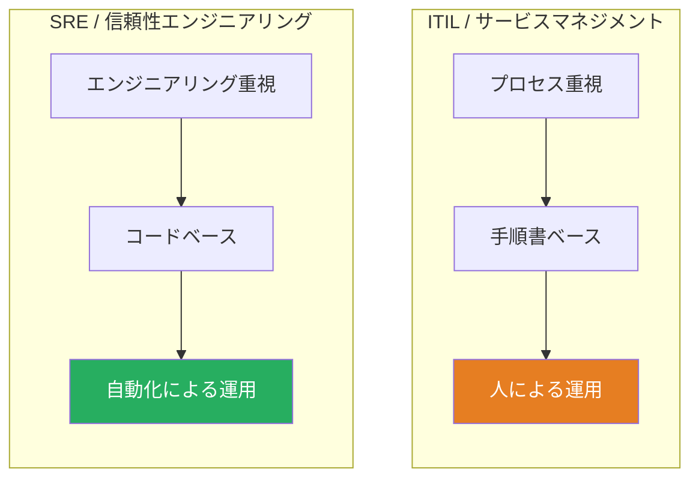
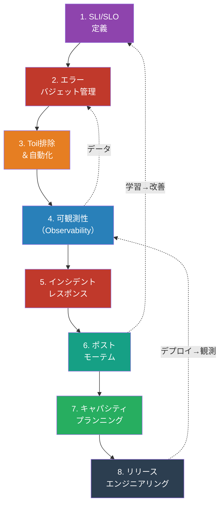
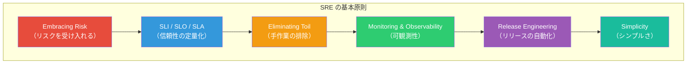
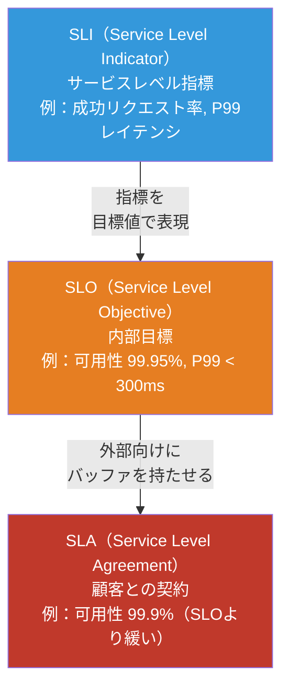
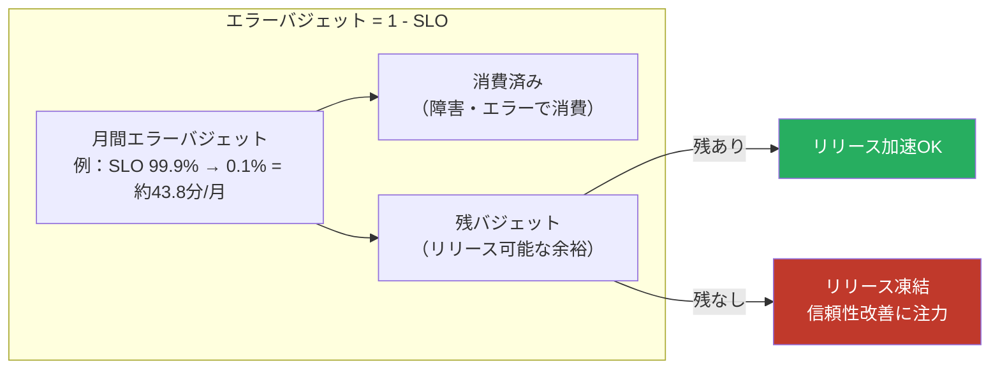
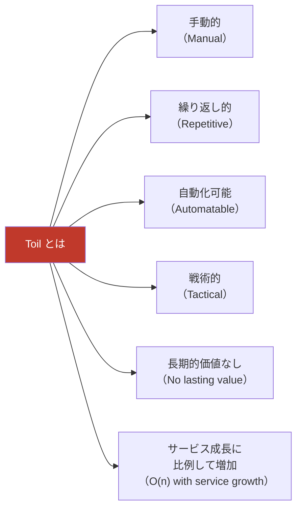
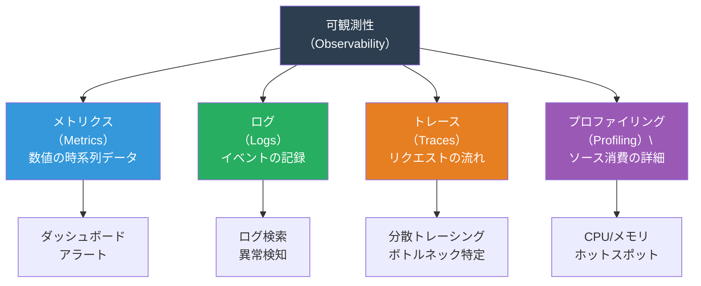
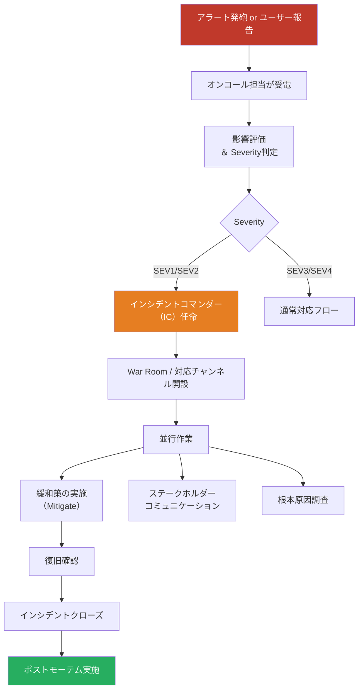
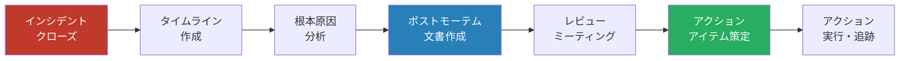
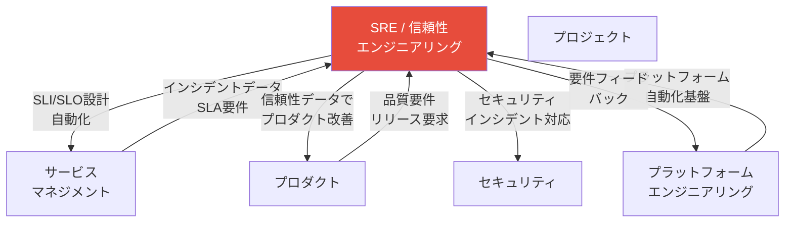

# SRE / 信頼性エンジニアリングマップ — 「どうシステムの信頼性を担保するか」

> ソフトウェアエンジニアリングの手法で運用の問題を解決する。
> **「100%の信頼性は目指さない。適切な信頼性を、エンジニアリングで実現する」** という思想のもと、
> 必要な工程・タスク・リソース・成果物を網羅的に整理したもの

## サービスマネジメント（ITIL）との比較

| 観点             | ITIL / ITSM                        | SRE                                            |
| ---------------- | ---------------------------------- | ---------------------------------------------- |
| 哲学             | ベストプラクティスのフレームワーク | ソフトウェアで運用問題を解決                   |
| 信頼性目標       | SLA（契約）                        | SLO（内部目標、SLAより厳しい）                 |
| 変更への態度     | CABによる承認制御                  | エラーバジェットによる自律的判断               |
| 自動化           | 推奨                               | 必須（Toil排除）                               |
| インシデント対応 | プロセスベース                     | ポストモーテム文化・ブレームレス               |
| 中心人物         | サービスマネージャー               | SRE（ソフトウェアエンジニア + オペレーション） |

## SRE 全体像

## SRE の原則

## 1. SLI / SLO / SLA 定義

### 目的

サービスの信頼性を**定量的に測定可能な指標**として定義し、「どの程度の信頼性が必要か」をステークホルダーと合意する。

### SLI → SLO → SLA の階層

### タスク一覧

| #   | タスク                             | 説明                                                                   |
| --- | ---------------------------------- | ---------------------------------------------------------------------- |
| 1   | クリティカルユーザージャーニー特定 | ユーザーにとって最も重要な操作フローを特定                             |
| 2   | SLI選定                            | 各ジャーニーに対する計測指標の選定（可用性・レイテンシ・正確性・鮮度） |
| 3   | SLI計測方法の実装                  | メトリクス収集パイプラインの構築                                       |
| 4   | SLO目標値の設定                    | 過去データとビジネス要件に基づく目標値の決定                           |
| 5   | SLOドキュメント作成                | SLO定義書の作成・関係者合意                                            |
| 6   | SLOダッシュボード構築              | リアルタイムSLO達成状況の可視化                                        |
| 7   | SLA策定（外部向け）                | SLOにバッファを持たせたSLAの設計・契約                                 |

### リソース

| カテゴリ | リソース               | 備考                               |
| -------- | ---------------------- | ---------------------------------- |
| **人**   | SRE                    | SLI/SLO設計の主担当                |
| **人**   | プロダクトマネージャー | ビジネス目標との整合性確認         |
| **人**   | 開発チーム             | SLI計測の実装                      |
| **物**   | メトリクス基盤         | Prometheus, Datadog, CloudWatch 等 |
| **物**   | ダッシュボード         | Grafana, Datadog Dashboards 等     |
| **金**   | メトリクスストレージ費 | 時系列データの保存コスト           |

### 成果物

| 成果物            | 形式           | 必須/任意                  |
| ----------------- | -------------- | -------------------------- |
| SLI定義書         | ドキュメント   | 必須                       |
| SLOドキュメント   | ドキュメント   | 必須                       |
| SLOダッシュボード | ダッシュボード | 必須                       |
| SLA契約書         | 契約書         | 必須（外部サービスの場合） |

## 2. エラーバジェット管理

### 目的

「どれだけの障害を許容できるか」を定量化し、**リリース速度と信頼性のバランス**を自律的に制御する。

### エラーバジェットの概念

### タスク一覧

| #   | タスク                       | 説明                                               |
| --- | ---------------------------- | -------------------------------------------------- |
| 1   | エラーバジェット計算         | SLOに基づくバジェットの算出                        |
| 2   | バジェット消費の追跡         | 障害・エラーによるバジェット消費のリアルタイム監視 |
| 3   | エラーバジェットポリシー策定 | バジェット枯渇時のアクション定義（リリース凍結等） |
| 4   | バジェットレポーティング     | 週次/月次のバジェット消費レポート                  |
| 5   | リリース判断への活用         | バジェット残量に基づくリリース可否判断             |
| 6   | バジェット枯渇時の対応       | 信頼性改善へのリソースシフト                       |

### リソース

| カテゴリ | リソース                       | 備考                           |
| -------- | ------------------------------ | ------------------------------ |
| **人**   | SRE                            | バジェット管理・ポリシー運用   |
| **人**   | プロダクトチーム               | バジェットに基づくリリース判断 |
| **物**   | エラーバジェットダッシュボード | Grafana等で構築                |
| **物**   | アラートシステム               | バジェット閾値でのアラート     |

### 成果物

| 成果物                         | 形式           | 必須/任意 |
| ------------------------------ | -------------- | --------- |
| エラーバジェットポリシー       | ドキュメント   | 必須      |
| エラーバジェットダッシュボード | ダッシュボード | 必須      |
| バジェット消費レポート（月次） | レポート       | 必須      |

## 3. Toil排除＆自動化

### 目的

手作業的・反復的・自動化可能な運用作業（Toil）を特定し、エンジニアリングで排除する。**SREの時間の50%以上をエンジニアリング作業に充てる**。

### Toil の定義

### タスク一覧

| #   | タスク                      | 説明                                                           |
| --- | --------------------------- | -------------------------------------------------------------- |
| 1   | Toil計測                    | 運用作業の棚卸し、Toil率（全作業時間に占めるToilの割合）の算出 |
| 2   | Toil分類・優先順位付け      | 自動化の効果・難易度によるROI分析                              |
| 3   | 自動化ツール/スクリプト開発 | Toilを排除するための自動化実装                                 |
| 4   | セルフサービス化            | 他チームが自律的にできるようにするUI/API/ツール提供            |
| 5   | 自動化テスト                | 自動化ツールの正常動作・フェイルセーフの検証                   |
| 6   | Toil率の継続的モニタリング  | 50%ルール（SRE時間の50%以上はエンジニアリング）の遵守確認      |

### リソース

| カテゴリ | リソース                   | 備考                                 |
| -------- | -------------------------- | ------------------------------------ |
| **人**   | SRE                        | 自動化の設計・実装                   |
| **人**   | プラットフォームエンジニア | 共通基盤の自動化                     |
| **物**   | IaC ツール                 | Terraform, Pulumi, Ansible 等        |
| **物**   | ワークフロー自動化         | Argo Workflows, Temporal, Rundeck 等 |
| **物**   | スクリプト実行環境         | Python, Go, Bash 等                  |
| **金**   | 自動化開発工数             | 短期的には投資、長期でROI回収        |

### 成果物

| 成果物                  | 形式             | 必須/任意 |
| ----------------------- | ---------------- | --------- |
| Toil計測レポート        | スプレッドシート | 必須      |
| 自動化ロードマップ      | ドキュメント     | 必須      |
| 自動化ツール/スクリプト | コード           | 必須      |
| Toil率ダッシュボード    | ダッシュボード   | 任意      |

## 4. 可観測性（Observability）

### 目的

システムの内部状態を外部出力から**理解できるようにする**。「何が起きているか」だけでなく「なぜ起きているか」を把握する。

### 可観測性の3本柱 + α

### タスク一覧

| #   | タスク                     | 説明                                                                             |
| --- | -------------------------- | -------------------------------------------------------------------------------- |
| 1   | メトリクス設計・収集       | RED（Rate/Error/Duration）、USE（Utilization/Saturation/Errors）メソッドに基づく |
| 2   | 構造化ログ設計             | JSON形式のログ、相関ID、ログレベル設計                                           |
| 3   | 分散トレーシング導入       | OpenTelemetry等によるリクエストトレーシング                                      |
| 4   | ダッシュボード構築         | SLI/SLOダッシュボード、サービスダッシュボード                                    |
| 5   | アラート設計               | SLO-based alerting、多段階アラート（Warning/Critical）                           |
| 6   | オンコールルーティング設定 | アラート→チーム→担当者のルーティング                                             |
| 7   | Runbook整備                | アラートごとの対応手順書                                                         |
| 8   | アラートチューニング       | ノイズ削減、アラート疲れの防止                                                   |

### リソース

| カテゴリ | リソース         | 備考                                     |
| -------- | ---------------- | ---------------------------------------- |
| **人**   | SRE              | 可観測性戦略・アラート設計               |
| **人**   | 開発チーム       | 計装（Instrumentation）の実装            |
| **物**   | メトリクス基盤   | Prometheus + Grafana / Datadog           |
| **物**   | ログ基盤         | ELK Stack / Loki / Splunk / Datadog Logs |
| **物**   | トレーシング基盤 | Jaeger / Zipkin / Datadog APM / Tempo    |
| **物**   | OpenTelemetry    | 計装の統一規格                           |
| **物**   | オンコールツール | PagerDuty, OpsGenie                      |
| **金**   | 可観測性基盤費用 | データ量に比例（最大のコスト要因の一つ） |

### 成果物

| 成果物                     | 形式                        | 必須/任意 |
| -------------------------- | --------------------------- | --------- |
| 可観測性戦略ドキュメント   | ドキュメント                | 必須      |
| メトリクスカタログ         | Wiki                        | 必須      |
| ダッシュボード一式         | ダッシュボード              | 必須      |
| アラートポリシー           | 設定ファイル / ドキュメント | 必須      |
| Runbook                    | Wiki / ドキュメント         | 必須      |
| アラートルーティングルール | 設定                        | 必須      |

## 5. インシデントレスポンス

### 目的

サービスの品質低下・障害を**迅速かつ体系的に対応**し、影響を最小化する。

### インシデントレスポンスのフロー

### タスク一覧

| #   | タスク                     | 説明                                         |
| --- | -------------------------- | -------------------------------------------- |
| 1   | オンコール体制構築         | ローテーション設計、エスカレーションパス定義 |
| 2   | Severity定義               | SEV1〜SEV4の基準と対応SLAの設定              |
| 3   | インシデントコマンダー制度 | IC/Communication Lead/Ops Leadの役割定義     |
| 4   | コミュニケーション計画     | ステータスページ更新、社内通知フロー         |
| 5   | インシデント対応訓練       | Wheel of Misfortune、Game Day等の実施        |
| 6   | 自動化された初動対応       | Auto-remediation、自動スケーリング等         |

### リソース

| カテゴリ | リソース                 | 備考                                   |
| -------- | ------------------------ | -------------------------------------- |
| **人**   | インシデントコマンダー   | 重大インシデントの指揮                 |
| **人**   | オンコールエンジニア     | ローテーションで対応                   |
| **人**   | コミュニケーションリード | 外部・社内への状況報告                 |
| **物**   | オンコール管理           | PagerDuty, OpsGenie                    |
| **物**   | ステータスページ         | Statuspage.io, Cachet                  |
| **物**   | War Roomツール           | Slack / Teams のインシデントチャンネル |
| **金**   | オンコール手当           | 夜間・休日対応費用                     |

### 成果物

| 成果物                       | 形式                    | 必須/任意         |
| ---------------------------- | ----------------------- | ----------------- |
| オンコールローテーション     | スケジュール            | 必須              |
| インシデント対応プレイブック | Wiki / ドキュメント     | 必須              |
| Severity定義書               | ドキュメント            | 必須              |
| インシデントタイムライン     | チケット / ドキュメント | 必須（SEV1/SEV2） |
| ステータスページ更新履歴     | ログ                    | 必須              |

## 6. ポストモーテム

### 目的

インシデントから**ブレームレス（責任追及なし）** で学び、再発防止策を実行して同じ失敗を繰り返さない。

### ポストモーテムのプロセス

### ポストモーテムの原則

| 原則               | 説明                                                         |
| ------------------ | ------------------------------------------------------------ |
| **ブレームレス**   | 個人を責めない。システムやプロセスの問題にフォーカス         |
| **タイムリー**     | インシデントクローズ後48時間以内（記憶が新鮮なうちに）       |
| **アクション指向** | 「気をつける」ではなく、具体的・測定可能なアクションアイテム |
| **広く共有**       | 組織全体で学びを共有（ポストモーテム読書会等）               |
| **フォローアップ** | アクションアイテムの完了を追跡、放置しない                   |

### タスク一覧

| #   | タスク                 | 説明                                                |
| --- | ---------------------- | --------------------------------------------------- |
| 1   | タイムライン作成       | インシデントの時系列整理（検知→対応→復旧→クローズ） |
| 2   | 根本原因分析           | 5Whys、Fault Tree Analysis等                        |
| 3   | 影響分析               | ユーザー影響、ビジネス影響の定量化                  |
| 4   | ポストモーテム文書作成 | テンプレートに基づく文書化                          |
| 5   | レビューミーティング   | 関係者全員でのブレームレスレビュー                  |
| 6   | アクションアイテム策定 | 再発防止策の具体的タスク化                          |
| 7   | アクションアイテム追跡 | 完了までのフォローアップ                            |
| 8   | ポストモーテム共有     | 組織全体への学びの展開                              |

### 成果物

| 成果物                   | 形式                         | 必須/任意 |
| ------------------------ | ---------------------------- | --------- |
| ポストモーテム文書       | ドキュメント（テンプレート） | 必須      |
| インシデントタイムライン | 図表 / ドキュメント          | 必須      |
| アクションアイテム一覧   | チケット                     | 必須      |
| ポストモーテム共有記録   | Wiki / メール                | 任意      |

## 7. キャパシティプランニング

### 目的

サービスの成長・需要変動に対して**十分なリソースを事前に確保**し、性能劣化やコスト超過を防ぐ。

### タスク一覧

| #   | タスク               | 説明                                                         |
| --- | -------------------- | ------------------------------------------------------------ |
| 1   | 需要予測             | 過去トレンド・ビジネス計画に基づく将来需要の推定             |
| 2   | 負荷テスト           | 現在のキャパシティ上限の測定                                 |
| 3   | ボトルネック分析     | CPU/メモリ/ディスク/ネットワーク/DB等のボトルネック特定      |
| 4   | スケーリング戦略策定 | 水平/垂直スケーリング、オートスケーリングの設計              |
| 5   | コスト最適化         | リソースの適正化（Right-sizing）、リザーブドインスタンス活用 |
| 6   | N+1冗長性確保        | 障害時にも性能を維持できる冗長構成                           |

### リソース

| カテゴリ | リソース           | 備考                                |
| -------- | ------------------ | ----------------------------------- |
| **人**   | SRE                | キャパシティ設計                    |
| **人**   | インフラエンジニア | リソース管理                        |
| **物**   | 負荷テストツール   | k6, Locust, JMeter, Gatling 等      |
| **物**   | クラウドコスト分析 | AWS Cost Explorer, GCP Billing 等   |
| **物**   | オートスケーラー   | Kubernetes HPA, AWS Auto Scaling 等 |
| **金**   | インフラ費用       | クラウドリソース / データセンター   |

### 成果物

| 成果物               | 形式                | 必須/任意 |
| -------------------- | ------------------- | --------- |
| キャパシティ計画書   | ドキュメント        | 必須      |
| 負荷テストレポート   | レポート            | 必須      |
| コスト最適化レポート | スプレッドシート    | 必須      |
| スケーリングポリシー | 設定 / ドキュメント | 必須      |

## 8. リリースエンジニアリング

### 目的

ソフトウェアのビルド・テスト・デプロイを**安全・高速・再現可能**に行う仕組みを構築する。

### タスク一覧

| #   | タスク                | 説明                                        |
| --- | --------------------- | ------------------------------------------- |
| 1   | CI/CDパイプライン構築 | ビルド→テスト→デプロイの自動化              |
| 2   | デプロイ戦略設計      | Blue-Green / Canary / Rolling Update の選定 |
| 3   | Feature Flags導入     | 機能のトグル制御によるリスク低減            |
| 4   | ロールバック自動化    | 異常検知時の自動ロールバック                |
| 5   | アーティファクト管理  | ビルド成果物のバージョニング・保管          |
| 6   | デプロイ頻度の向上    | リードタイムの短縮、バッチサイズの削減      |

### リソース

| カテゴリ | リソース                 | 備考                                          |
| -------- | ------------------------ | --------------------------------------------- |
| **人**   | SRE / リリースエンジニア | パイプライン構築・運用                        |
| **人**   | 開発チーム               | パイプラインの利用                            |
| **物**   | CI/CD                    | GitHub Actions, GitLab CI, Jenkins, ArgoCD 等 |
| **物**   | コンテナレジストリ       | Docker Hub, ECR, GCR 等                       |
| **物**   | Feature Flagsツール      | LaunchDarkly, Unleash, Flagsmith 等           |
| **金**   | CI/CD実行費              | ビルドランナーのコスト                        |

### 成果物

| 成果物                        | 形式           | 必須/任意 |
| ----------------------------- | -------------- | --------- |
| CI/CDパイプライン             | コード（IaC）  | 必須      |
| デプロイ戦略ドキュメント      | ドキュメント   | 必須      |
| リリースプロセスガイド        | Wiki           | 必須      |
| DORA メトリクスダッシュボード | ダッシュボード | 任意      |

## 横断的な視点 — 他視点との関係

### DORA メトリクスによるパフォーマンス計測

SREの活動成果は **DORA 4 Key Metrics** で測定する。

| メトリクス       | 説明                 | Elite の基準              |
| ---------------- | -------------------- | ------------------------- |
| デプロイ頻度     | 本番デプロイの頻度   | オンデマンド（1日複数回） |
| リードタイム     | コミット→本番の時間  | 1時間未満                 |
| 変更失敗率       | デプロイ起因の障害率 | 0-15%                     |
| 復旧時間（MTTR） | 障害からの復旧時間   | 1時間未満                 |
